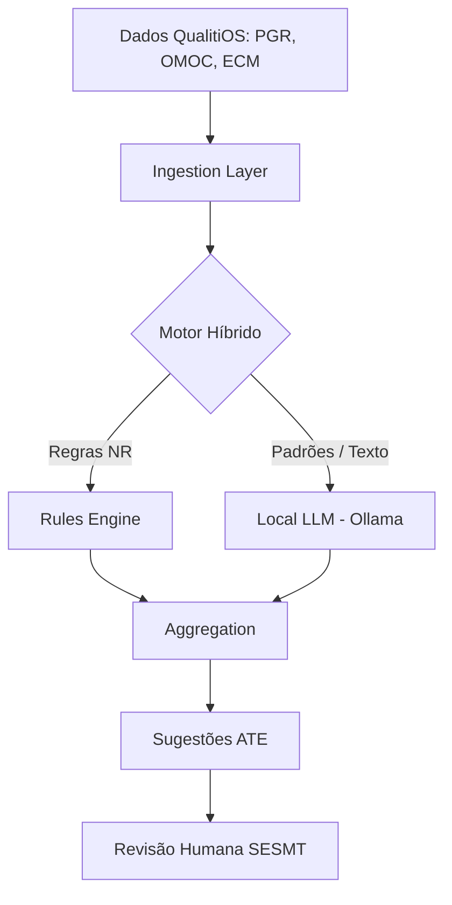

# AI Assessment Model — NR-01 Intelligence Platform

A plataforma integra Inteligência Artificial como um "Assessment Técnico Especializado" (ATE), operando como um co-piloto para os profissionais de Saúde e Segurança do Trabalho. A IA não substitui a responsabilidade técnica do SESMT, mas atua identificando padrões, sugerindo correções e acelerando o compliance.

## Arquitetura de IA (Conceitual)

O pipeline de IA opera de forma assíncrona sobre os dados da plataforma:

1.  **Ingestão:** Consome dados estruturados e não estruturados (Inventário de Riscos, descrições de cargo do OMOC, laudos em PDF no ECM, histórico de acidentes).
2.  **Modelos de Análise:**
    *   **LLM (Large Language Model - via Ollama Local):** Processa texto livre para encontrar gaps regulatórios na NR-01.
    *   **ML Classificador:** Sugere o nível de risco (Probabilidade x Severidade) com base em dados históricos similares.
3.  **Motor de Sugestões:** Combina regras determinísticas (ex: "Trabalho em altura > 2m exige NR-35") com saídas probabilísticas do modelo.
4.  **XAI (Explicabilidade):** Para toda sugestão gerada, o sistema anexa o "porquê" (ex: "Sugerido controle de ruído pois laudo XYZ de setor similar detectou 88 dB(A)").

## Capacidades Analíticas

### 1. Identificação de Gaps de Conformidade
*   **Ação:** Analisa o PGR atual versus as exigências da portaria 1.419/2024.
*   **Exemplo:** Identifica que o PGR do "Setor de Manutenção" cita uso de produtos químicos, mas não menciona a FDS (Ficha com Dados de Segurança) exigida pela NR-26.
*   **Score:** Gera uma nota de completude do PGR (0 a 100%).

### 2. Sugestão de Riscos (Risk Discovery)
*   **Ação:** Correlaciona o "Cargo" e "Processo" descritos com uma base de conhecimento global.
*   **Exemplo:** Se o usuário insere "Cozinheiro Hospitalar", a IA sugere automaticamente riscos como: Choque térmico, Corte, Queimadura, Exposição a agentes biológicos (lixo).

### 3. Sugestão de Controles (Hierarquia NR-01)
*   **Ação:** Ao avaliar um risco identificado, sugere controles baseados na hierarquia legal.
*   **Exemplo:** Risco de queda.
    *   *A IA prioriza:* 1. Eliminação (fazer o trabalho no chão), 2. Engenharia (Guarda-corpo), e só por último sugere 5. EPI (Cinto de segurança).

### 4. Sugestão de Treinamentos Mapeados
*   **Ação:** Faz o roteamento automático Risco $\rightarrow$ Norma $\rightarrow$ Capacitação.
*   **Exemplo:** Risco elétrico mapeado para NR-10; Trabalho em espaço confinado para NR-33. Sugere a carga horária mínima legal exigida pela norma.

### 5. Criação de Planos de Ação (SMART)
*   **Ação:** Transforma deficiências identificadas em itens acionáveis.
*   **Exemplo:** "O Setor RX não possui laudo radiométrico atualizado." $\rightarrow$ Sugere Plano de Ação: "Contratar empresa para renovação do laudo radiométrico até [Data+30], responsável: [Gestor]".

## Prompt Engineering (Modelo de Instrução)

A IA atua sob "System Prompts" rígidos para evitar alucinações de compliance.

*Exemplo de Prompt (Sugestão de Controle):*
> "Você é um Engenheiro de Segurança do Trabalho especialista na legislação brasileira (NR-01). Dado o perigo [Ruído Contínuo 90dB] no processo [Uso de Serra Circular], liste recomendações de controle estritamente seguindo a hierarquia de medidas de prevenção da NR-01: 1. Eliminação/Substituição, 2. Medidas de Engenharia, 3. Medidas Administrativas, 4. EPI. Justifique cada medida brevemente."

## Governança e "Human-in-the-loop"

Nenhuma sugestão da IA é aplicada diretamente ao PGR ou altera avaliações. Todas as recomendações aparecem como um painel "Insights ATE" na interface, exigindo que o usuário (Perfil SESMT) clique em **"Aprovar"** ou **"Descartar"**. Isso garante que a responsabilidade legal pela avaliação de risco permaneça com o profissional habilitado (ART/RRT). Toda interação (aprovação/rejeição de sugestão) treina o modelo local via reforço.
