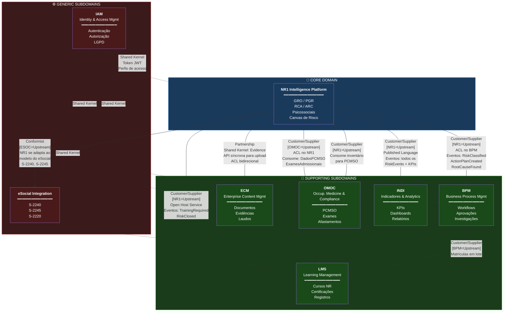
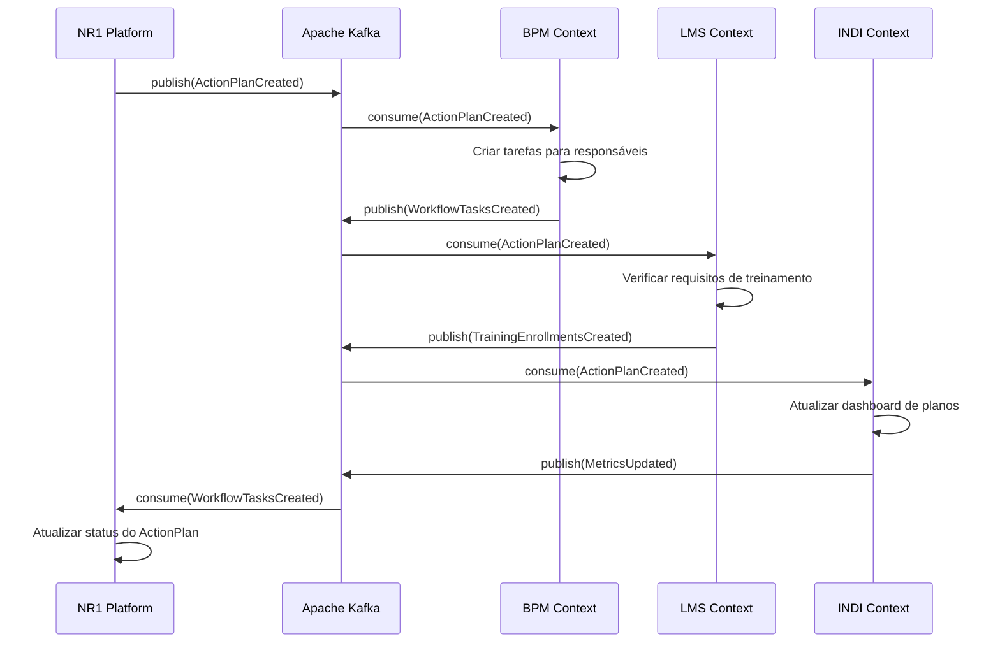

# NR-01 Intelligence Platform — Context Map (DDD)

> **Projeto:** QualitiOS  
> **Módulo:** NR-01 Intelligence Platform  
> **Fase:** 02 — Arquitetura  
> **Versão:** 1.0.0  
> **Data:** Junho/2026  
> **Padrão:** Domain-Driven Design (DDD) — Context Map  

---

## Sumário

1. [Visão Geral do Sistema de Contextos](#1-visão-geral-do-sistema-de-contextos)
2. [Bounded Context: NR1 Intelligence Platform](#2-bounded-context-nr1-intelligence-platform)
3. [Catálogo Completo de Entidades](#3-catálogo-completo-de-entidades)
4. [Catálogo de Domain Events](#4-catálogo-de-domain-events)
5. [Context Map — Diagrama de Relações](#5-context-map--diagrama-de-relações)
6. [Padrões de Integração por Relação](#6-padrões-de-integração-por-relação)
7. [Tabela de Responsabilidades por Bounded Context](#7-tabela-de-responsabilidades-por-bounded-context)
8. [Contratos de Integração (APIs Anti-Corruption Layer)](#8-contratos-de-integração-apis-anti-corruption-layer)
9. [Considerações de Consistência Eventual](#9-considerações-de-consistência-eventual)

---

## 1. Visão Geral do Sistema de Contextos

O QualitiOS é uma plataforma de gestão integrada de Segurança e Saúde no Trabalho (SST) orientada pela Norma Regulamentadora NR-01 (atualizada pela Portaria MTE nº 1.419/2024). A plataforma é decomposta em **Bounded Contexts** independentes que se comunicam por meio de eventos de domínio e contratos explícitos.

### 1.1 Bounded Contexts do QualitiOS

| ID | Bounded Context | Sigla | Responsabilidade Principal |
|----|----------------|-------|---------------------------|
| BC-01 | NR-01 Intelligence Platform | **NR1** | GRO, PGR, Avaliação de Riscos, ARC, RCA |
| BC-02 | Business Process Management | **BPM** | Workflows, processos, aprovações, investigações |
| BC-03 | Learning Management System | **LMS** | Capacitações, treinamentos, certificações NR |
| BC-04 | Enterprise Content Management | **ECM** | Documentos, evidências, laudos, armazenamento |
| BC-05 | Occupational Medicine & Occupational Compliance | **OMOC** | PCMSO, exames, afastamentos, PPRA legado |
| BC-06 | Indicadores & Analytics | **INDI** | KPIs, dashboards, relatórios gerenciais |
| BC-07 | Identity & Access Management | **IAM** | Autenticação, autorização, perfis, LGPD |
| BC-08 | eSocial Integration | **ESOC** | Transmissão S-2240, S-2245, S-2220 ao governo |

### 1.2 Núcleo de Domínio (Core Domain)

O **NR1 Intelligence Platform** é o **Core Domain** do QualitiOS — é onde reside a diferenciação competitiva e o valor de negócio primário da plataforma. Todos os demais bounded contexts são **Supporting Subdomains** ou **Generic Subdomains** que habilitam o core.

```
┌─────────────────────────────────────────────────────────┐
│                    CORE DOMAIN                          │
│              NR1 Intelligence Platform                  │
│   GRO · PGR · RCA · ARC · Psicossociais · Canvas       │
└─────────────────────────────────────────────────────────┘
         ↑ suportado por Supporting Subdomains ↑
┌─────────┐ ┌─────────┐ ┌─────────┐ ┌─────────┐ ┌────────┐
│  BPM    │ │  LMS    │ │  ECM    │ │  OMOC   │ │  INDI  │
└─────────┘ └─────────┘ └─────────┘ └─────────┘ └────────┘
         ↑ habilitados por Generic Subdomains ↑
              ┌─────────┐ ┌──────────┐
              │   IAM   │ │  eSocial │
              └─────────┘ └──────────┘
```

---

## 2. Bounded Context: NR1 Intelligence Platform

### 2.1 Definição e Responsabilidades

O **NR1 Intelligence Platform** é responsável por toda a lógica de domínio relacionada ao **Gerenciamento de Riscos Ocupacionais (GRO)** conforme exigido pela NR-01 atualizada. Suas responsabilidades incluem:

- **Inventário de Perigos**: identificação e catalogação de todos os perigos ocupacionais presentes no ambiente de trabalho
- **Avaliação de Riscos**: análise qualitativa e quantitativa por matriz probabilidade × severidade
- **Classificação de Riscos**: categorização em níveis de risco (trivial, tolerável, moderado, substancial, intolerável)
- **Análise de Causa Raiz (RCA)**: aplicação dos métodos 5 Porquês, Ishikawa e Árvore de Causas
- **Plano de Ação Corretiva e Preventiva (ARC/CAPA)**: criação, acompanhamento e encerramento de planos
- **Gerenciamento de Riscos Psicossociais**: identificação, avaliação e controle de fatores psicossociais
- **Programa de Gerenciamento de Riscos (PGR)**: elaboração e gestão do documento obrigatório pela NR-01
- **Monitoramento e Revisão**: acompanhamento contínuo da eficácia dos controles

### 2.2 Linguagem Ubíqua (Ubiquitous Language)

| Termo (PT-BR) | Definição no Contexto |
|---------------|----------------------|
| **Perigo** | Fonte, situação ou ato com potencial para causar dano humano (Hazard) |
| **Risco** | Combinação da probabilidade de ocorrência de um evento perigoso e a severidade do dano |
| **Inventário de Riscos** | Registro estruturado de todos os perigos identificados em um escopo definido |
| **Avaliação de Risco** | Processo de estimativa do nível de risco por meio de critérios qualitativos/quantitativos |
| **PGR** | Programa de Gerenciamento de Riscos — documento técnico obrigatório pela NR-01 |
| **GRO** | Gerenciamento de Riscos Ocupacionais — processo contínuo de gestão |
| **RCA** | Root Cause Analysis — Análise de Causa Raiz |
| **Causa Raiz** | Causa fundamental que, se eliminada, previne a recorrência do problema |
| **Plano de Ação** | Conjunto de medidas planejadas para eliminação ou controle de riscos |
| **Hierarquia de Controles** | Ordem de prioridade para aplicação de controles: eliminar → substituir → engenharia → administrativo → EPI |
| **Fator Psicossocial** | Condição organizacional ou interpessoal capaz de gerar adoecimento mental |
| **Evidência** | Registro objetivo que comprova a implementação de um controle ou ação |
| **Canvas de Risco** | Modelo visual estruturado com 15 blocos para gestão completa de um risco |

### 2.3 Aggregate Roots

O bounded context NR1 possui os seguintes **Aggregate Roots**:

| Aggregate Root | Entidades Subordinadas | Invariantes Principais |
|---------------|----------------------|------------------------|
| `RiskInventory` | `Hazard[]`, `Evidence[]` | Deve ter ao menos um Hazard válido para ser publicado |
| `RiskAssessment` | `RiskMatrix`, `AssessmentCriteria` | Probabilidade e Severidade devem ser definidos antes de classificar |
| `RootCauseAnalysis` | `WhyNode[]`, `IshikawaBranch[]`, `CauseTreeNode[]` | Método deve ser definido antes de iniciar análise |
| `ActionPlan` | `Action[]`, `Deadline`, `Responsibility` | Toda ação deve ter responsável, prazo e controle vinculado |
| `PsychosocialAssessment` | `PsychosocialFactor[]`, `DenunciationRecord` | Avaliação requer questionário validado aplicado |
| `RiskCanvas` | Todos os 15 blocos do canvas | Canvas só pode ser finalizado com todos blocos obrigatórios preenchidos |

---

## 3. Catálogo Completo de Entidades

### 3.1 RiskInventory (Inventário de Riscos)

```typescript
/**
 * Aggregate Root: RiskInventory
 * Representa o inventário completo de perigos de uma unidade/setor/cargo
 * Obrigatório pelo Art. 9º da NR-01 (Portaria MTE 1.419/2024)
 */
interface RiskInventory {
  // Identidade
  id: string;                          // UUID v7 (ordenável por tempo)
  code: string;                        // Código único, ex: "INV-2026-001"
  version: number;                     // Versão do inventário (auditoria)
  
  // Escopo de aplicação
  organizationId: string;              // ID da empresa
  unitId: string;                      // ID da unidade/estabelecimento
  sectorId: string;                    // ID do setor/área
  jobRoleIds: string[];                // IDs dos cargos/funções cobertos
  
  // Período de vigência
  validFrom: Date;                     // Data de início da vigência
  validUntil: Date;                    // Data de fim da vigência
  reviewDueDate: Date;                 // Data da próxima revisão obrigatória
  
  // Status do inventário
  status: InventoryStatus;             // DRAFT | UNDER_REVIEW | ACTIVE | SUPERSEDED | ARCHIVED
  
  // Responsáveis técnicos
  elaboratedBy: Responsible[];         // SESMT/responsáveis que elaboraram
  approvedBy: Responsible | null;      // Responsável pela aprovação
  approvedAt: Date | null;             // Data de aprovação
  
  // Conteúdo
  hazards: Hazard[];                   // Lista de perigos identificados
  evidences: Evidence[];               // Evidências do inventário
  
  // Metadados de auditoria
  createdAt: Date;
  updatedAt: Date;
  createdBy: string;                   // userId
  
  // Integração eSocial
  eSocialStatus: ESocialStatus;        // PENDING | SENT | ACCEPTED | REJECTED
  eSocialTransmissionId: string | null; // ID de transmissão no eSocial
}

type InventoryStatus = 
  | 'DRAFT' 
  | 'UNDER_REVIEW' 
  | 'ACTIVE' 
  | 'SUPERSEDED' 
  | 'ARCHIVED';

type ESocialStatus = 
  | 'NOT_APPLICABLE' 
  | 'PENDING' 
  | 'SENT' 
  | 'ACCEPTED' 
  | 'REJECTED';

interface Responsible {
  userId: string;
  name: string;
  role: string;               // Ex: "Engenheiro de Segurança", "Técnico de SST"
  registrationNumber: string; // CREAs, CRFQs, etc.
  signature: string | null;   // Hash da assinatura digital
}
```

### 3.2 Hazard (Perigo)

```typescript
/**
 * Entity: Hazard
 * Representa um perigo individual identificado no inventário
 * Classificado conforme Anexo I da NR-01
 */
interface Hazard {
  // Identidade
  id: string;                         // UUID v7
  inventoryId: string;                // FK → RiskInventory
  
  // Identificação do perigo
  code: string;                       // Código único no inventário, ex: "H-001"
  name: string;                       // Nome descritivo do perigo
  description: string;                // Descrição detalhada
  
  // Classificação do agente (Anexo I NR-01)
  agentType: HazardAgentType;         // PHYSICAL | CHEMICAL | BIOLOGICAL | ERGONOMIC | ACCIDENT
  agentSubtype: string;               // Ex: para PHYSICAL: "NOISE" | "VIBRATION" | "HEAT" | etc.
  
  // Fonte e localização
  source: HazardSource;               // Origem do perigo
  exposureGroups: ExposureGroup[];    // GHE - Grupos Homogêneos de Exposição
  
  // Avaliação quantitativa (quando aplicável)
  quantitativeData: QuantitativeData | null;
  
  // Status
  status: HazardStatus;              // IDENTIFIED | ASSESSED | CONTROLLED | CLOSED
  
  // Vínculos
  assessmentId: string | null;       // FK → RiskAssessment (quando avaliado)
  actionPlanIds: string[];           // FKs → ActionPlan
  
  // Auditoria
  identifiedAt: Date;
  identifiedBy: string;              // userId
  lastReviewedAt: Date | null;
}

type HazardAgentType = 
  | 'PHYSICAL'       // Físico: ruído, vibração, calor, frio, radiação, pressão
  | 'CHEMICAL'       // Químico: poeiras, fumos, névoas, vapores, gases, substâncias
  | 'BIOLOGICAL'     // Biológico: vírus, bactérias, fungos, parasitas, insetos
  | 'ERGONOMIC'      // Ergonômico: postura, esforço, repetitividade, ritmo
  | 'ACCIDENT';      // Acidente: mecânico, elétrico, queda, incêndio, explosão

interface HazardSource {
  type: 'EQUIPMENT' | 'PROCESS' | 'SUBSTANCE' | 'ENVIRONMENT' | 'HUMAN_BEHAVIOR';
  description: string;
  location: string;              // Localização física
  cnaeCode: string | null;       // CNAE da atividade relacionada
}

interface ExposureGroup {
  id: string;
  name: string;                  // Nome do GHE
  workerCount: number;           // Número de trabalhadores expostos
  exposureFrequency: ExposureFrequency;
  exposureDurationHours: number; // Horas de exposição por jornada
}

type ExposureFrequency = 
  | 'SPORADIC'    // Esporádico: < 20% da jornada
  | 'OCCASIONAL'  // Eventual: 20-50% da jornada
  | 'FREQUENT'    // Habitual: 50-80% da jornada
  | 'CONTINUOUS'; // Contínuo: > 80% da jornada

interface QuantitativeData {
  measuredValue: number;
  measurementUnit: string;       // Ex: "dB(A)", "mg/m³", "°C"
  limitValue: number;            // Limite de tolerância (NHO/NR-15)
  measurementMethod: string;     // Metodologia de medição
  measuredAt: Date;
  measuredBy: string;            // Responsável pela medição
  calibrationCertificate: string | null; // ID do certificado de calibração
}

type HazardStatus = 
  | 'IDENTIFIED'   // Perigo identificado, aguarda avaliação
  | 'ASSESSED'     // Avaliação de risco concluída
  | 'CONTROLLED'   // Controles implementados
  | 'CLOSED';      // Perigo eliminado ou controlado a níveis aceitáveis
```

### 3.3 RiskAssessment (Avaliação de Risco)

```typescript
/**
 * Aggregate Root: RiskAssessment
 * Avaliação formal de risco para um perigo específico
 * Metodologia: Matriz de Risco (Probabilidade × Severidade)
 */
interface RiskAssessment {
  // Identidade
  id: string;
  hazardId: string;              // FK → Hazard
  inventoryId: string;           // FK → RiskInventory
  
  // Metodologia utilizada
  methodology: AssessmentMethodology;
  
  // Critérios de avaliação
  probability: ProbabilityLevel; // 1-5: Improvável → Quase Certo
  severity: SeverityLevel;       // 1-5: Insignificante → Catastrófico
  
  // Resultado calculado
  riskScore: number;             // probability × severity (1-25)
  riskLevel: RiskLevel;          // Classificação qualitativa do risco
  
  // Avaliação com controles existentes
  existingControls: ExistingControl[];
  residualRiskScore: number;     // Score após aplicação dos controles
  residualRiskLevel: RiskLevel;  // Nível residual após controles
  
  // Justificativa e observações
  justification: string;         // Fundamentação técnica da avaliação
  observations: string;
  
  // Critério de aceitabilidade
  isAcceptable: boolean;         // Se o risco residual é aceitável
  acceptanceCriteria: string;    // Critérios usados para definir aceitabilidade
  
  // Responsáveis
  assessedBy: Responsible;       // Quem realizou a avaliação
  reviewedBy: Responsible | null; // Revisor técnico
  
  // Vigência
  assessedAt: Date;
  validUntil: Date;              // Validade da avaliação
  
  // Status
  status: AssessmentStatus;     // DRAFT | FINALIZED | SUPERSEDED
}

type AssessmentMethodology = 
  | 'QUALITATIVE_MATRIX'         // Matriz qualitativa 5x5
  | 'SEMI_QUANTITATIVE'          // Fine-Kinney ou similar
  | 'QUANTITATIVE'               // Cálculo por exposição medida
  | 'WHAT_IF'                    // Análise "E se?"
  | 'FMEA';                      // FMEA - Análise de Modo e Efeito de Falha

type ProbabilityLevel = 1 | 2 | 3 | 4 | 5;
// 1 = Improvável (< 1 vez/ano)
// 2 = Pouco Provável (1-4 vezes/ano)
// 3 = Provável (1-4 vezes/mês)
// 4 = Muito Provável (1-4 vezes/semana)
// 5 = Quase Certo (diariamente)

type SeverityLevel = 1 | 2 | 3 | 4 | 5;
// 1 = Insignificante (primeiros socorros, sem afastamento)
// 2 = Menor (tratamento médico, sem afastamento)
// 3 = Moderada (afastamento temporário)
// 4 = Grave (incapacidade permanente parcial)
// 5 = Catastrófico (morte ou incapacidade permanente total)

type RiskLevel = 
  | 'TRIVIAL'        // Score 1-2
  | 'TOLERABLE'      // Score 3-5
  | 'MODERATE'       // Score 6-12
  | 'SUBSTANTIAL'    // Score 13-17
  | 'INTOLERABLE';   // Score 18-25

interface ExistingControl {
  id: string;
  type: ControlHierarchyType;
  description: string;
  effectiveness: EffectivenessLevel; // LOW | MEDIUM | HIGH
  validationStatus: 'VALIDATED' | 'PENDING_VALIDATION' | 'INEFFECTIVE';
  lastValidatedAt: Date | null;
}

type ControlHierarchyType = 
  | 'ELIMINATION'        // Eliminação do perigo
  | 'SUBSTITUTION'       // Substituição por algo menos perigoso
  | 'ENGINEERING'        // Controles de engenharia (proteção coletiva)
  | 'ADMINISTRATIVE'     // Controles administrativos (procedimentos, treinamento)
  | 'PPE';               // Equipamento de Proteção Individual

type EffectivenessLevel = 'LOW' | 'MEDIUM' | 'HIGH';
type AssessmentStatus = 'DRAFT' | 'FINALIZED' | 'SUPERSEDED';
```

### 3.4 RootCauseAnalysis (Análise de Causa Raiz)

```typescript
/**
 * Aggregate Root: RootCauseAnalysis
 * Análise de causa raiz para um evento indesejado (acidente, não conformidade, risco)
 * Suporta os métodos: 5 Porquês, Ishikawa (6M), Árvore de Causas
 */
interface RootCauseAnalysis {
  // Identidade
  id: string;
  code: string;                  // Ex: "RCA-2026-042"
  
  // Vínculo com o evento
  triggerType: RCATriggerType;   // O que originou esta análise
  triggerId: string;             // ID do evento gatilho
  
  // Problema central
  problemStatement: string;      // Declaração clara e objetiva do problema
  problemOccurredAt: Date;       // Quando o evento ocorreu
  problemLocation: string;       // Onde ocorreu
  
  // Método selecionado
  method: RCAMethod;             // FIVE_WHYS | ISHIKAWA | CAUSE_TREE
  
  // Conteúdo do método (apenas um estará preenchido)
  fiveWhysData: FiveWhysData | null;
  ishikawaData: IshikawaData | null;
  causeTreeData: CauseTreeData | null;
  
  // Resultado da análise
  rootCauses: RootCause[];       // Causas raiz identificadas
  contributingFactors: string[]; // Fatores contribuintes secundários
  
  // Planos de ação vinculados
  actionPlanIds: string[];       // FKs → ActionPlan
  
  // Status e validação
  status: RCAStatus;
  validatedBy: Responsible | null;
  validatedAt: Date | null;
  
  // Equipe de análise
  team: Responsible[];
  
  // Auditoria
  startedAt: Date;
  completedAt: Date | null;
  createdBy: string;
}

type RCATriggerType = 
  | 'ACCIDENT'              // Acidente de trabalho
  | 'NEAR_MISS'             // Quase-acidente
  | 'NON_CONFORMITY'        // Não conformidade de SST
  | 'RISK_IDENTIFIED'       // Risco de nível substancial ou intolerável
  | 'RECURRING_INCIDENT'    // Incidente recorrente
  | 'AUDIT_FINDING';        // Achado de auditoria

type RCAMethod = 'FIVE_WHYS' | 'ISHIKAWA' | 'CAUSE_TREE';

interface RootCause {
  id: string;
  description: string;
  category: string;          // Categoria da causa (ex: "Falha de Processo", "Fator Humano")
  confidence: 'LOW' | 'MEDIUM' | 'HIGH'; // Confiança na identificação
  evidence: string[];        // Evidências que sustentam a causa raiz
}

type RCAStatus = 
  | 'IN_PROGRESS' 
  | 'PENDING_VALIDATION' 
  | 'VALIDATED' 
  | 'CLOSED';
```

### 3.5 ActionPlan (Plano de Ação)

```typescript
/**
 * Aggregate Root: ActionPlan
 * Plano de ação para eliminação ou controle de riscos identificados
 * Aplica a hierarquia de controles do NIOSH/NR-01
 */
interface ActionPlan {
  // Identidade
  id: string;
  code: string;              // Ex: "AP-2026-078"
  
  // Vínculos de origem
  sourceType: ActionPlanSourceType;
  sourceId: string;          // ID do risco, RCA, auditoria, etc.
  hazardId: string | null;   // Perigo endereçado (quando aplicável)
  rcaId: string | null;      // RCA que gerou este plano
  
  // Objetivo e escopo
  objective: string;         // Objetivo claro do plano
  scope: string;             // Escopo de abrangência
  
  // Ações planejadas
  actions: PlannedAction[];
  
  // Responsável geral
  owner: Responsible;        // Responsável pelo plano como um todo
  
  // Prazos
  plannedStartDate: Date;
  plannedEndDate: Date;
  actualEndDate: Date | null;
  
  // Status e progresso
  status: ActionPlanStatus;
  completionPercentage: number; // 0-100
  
  // Eficácia
  effectivenessVerification: EffectivenessVerification | null;
  
  // Auditoria
  createdAt: Date;
  updatedAt: Date;
  createdBy: string;
}

type ActionPlanSourceType = 
  | 'RISK_ASSESSMENT'     // Avaliação de risco
  | 'ROOT_CAUSE_ANALYSIS' // Análise de causa raiz
  | 'AUDIT'               // Auditoria interna/externa
  | 'INSPECTION'          // Inspeção de segurança
  | 'COMPLAINT'           // Denúncia de trabalhador
  | 'LEGAL_REQUIREMENT';  // Requisito legal (NR, legislação)

interface PlannedAction {
  id: string;
  actionPlanId: string;
  
  // Descrição
  title: string;
  description: string;
  
  // Hierarquia de controle (NIOSH)
  controlHierarchyLevel: ControlHierarchyType;
  
  // Responsabilidade
  responsible: Responsible;
  supportResponsibles: Responsible[];
  
  // Prazos
  dueDate: Date;
  startedAt: Date | null;
  completedAt: Date | null;
  
  // Status
  status: ActionStatus;
  
  // Recursos
  estimatedCost: number | null;    // Em R$
  resourcesNeeded: string[];
  
  // Evidências de conclusão
  completionEvidenceIds: string[]; // FKs → Evidence
  
  // Verificação
  verifiedBy: string | null;       // userId
  verifiedAt: Date | null;
  
  // Prioridade
  priority: 'CRITICAL' | 'HIGH' | 'MEDIUM' | 'LOW';
}

type ActionPlanStatus = 
  | 'DRAFT' 
  | 'APPROVED' 
  | 'IN_PROGRESS' 
  | 'DELAYED' 
  | 'COMPLETED' 
  | 'VERIFIED' 
  | 'CANCELLED';

type ActionStatus = 
  | 'PENDING' 
  | 'IN_PROGRESS' 
  | 'COMPLETED' 
  | 'VERIFIED' 
  | 'CANCELLED' 
  | 'OVERDUE';

interface EffectivenessVerification {
  verifiedBy: Responsible;
  verifiedAt: Date;
  isEffective: boolean;
  evidence: string;
  followUpRequired: boolean;
  followUpDueDate: Date | null;
}
```

### 3.6 PsychosocialFactor (Fator Psicossocial)

```typescript
/**
 * Entity: PsychosocialFactor
 * Representa um fator de risco psicossocial identificado no ambiente de trabalho
 * Regulamentado pela NR-01 atualizada (Portaria MTE 1.419/2024)
 */
interface PsychosocialFactor {
  // Identidade
  id: string;
  inventoryId: string;         // FK → RiskInventory (psicossocial é um tipo de risco)
  
  // Classificação
  factorType: PsychosocialFactorType;
  subtype: string;             // Subtipo específico dentro da categoria
  
  // Descrição
  name: string;
  description: string;
  
  // Indicadores observados
  indicators: PsychosocialIndicator[];
  
  // Avaliação
  assessmentMethod: PsychosocialAssessmentMethod;
  assessmentScore: number | null;        // Score normalizado 0-100
  severity: PsychosocialSeverity;        // LOW | MEDIUM | HIGH | CRITICAL
  prevalence: number | null;             // % de trabalhadores afetados
  
  // Exposição
  affectedGroups: ExposureGroup[];
  
  // Controles
  existingControls: PsychosocialControl[];
  
  // Denúncias associadas (anonimizadas)
  denunciationCount: number;             // Quantidade (sem identificação)
  
  // Status
  status: 'IDENTIFIED' | 'UNDER_ASSESSMENT' | 'CONTROLLED' | 'MONITORING';
  
  // Auditoria
  identifiedAt: Date;
  lastReviewedAt: Date | null;
}

type PsychosocialFactorType = 
  | 'MORAL_HARASSMENT'         // Assédio Moral
  | 'SEXUAL_HARASSMENT'        // Assédio Sexual
  | 'WORKPLACE_VIOLENCE'       // Violência no Trabalho
  | 'WORK_OVERLOAD'            // Sobrecarga de Trabalho
  | 'EXCESSIVE_WORKING_HOURS'  // Jornada Excessiva
  | 'INTERPERSONAL_CONFLICTS'  // Conflitos Interpessoais
  | 'LACK_OF_AUTONOMY'         // Falta de Autonomia
  | 'POOR_LEADERSHIP'          // Liderança Deficiente
  | 'ORGANIZATIONAL_CHANGES'   // Mudanças Organizacionais
  | 'JOB_INSECURITY'           // Insegurança no Emprego
  | 'WORK_LIFE_IMBALANCE';     // Desequilíbrio Trabalho-Vida

type PsychosocialAssessmentMethod = 
  | 'COPSOQ_III'    // Copenhagen Psychosocial Questionnaire
  | 'JCQ'           // Job Content Questionnaire (Karasek)
  | 'ERI'           // Effort-Reward Imbalance (Siegrist)
  | 'MASLACH_MBI'   // Maslach Burnout Inventory
  | 'WAI'           // Work Ability Index
  | 'QUALITATIVE'   // Grupos focais e entrevistas
  | 'MIXED';        // Combinação de métodos

type PsychosocialSeverity = 'LOW' | 'MEDIUM' | 'HIGH' | 'CRITICAL';

interface PsychosocialIndicator {
  id: string;
  name: string;
  value: number | string;
  threshold: number | string | null;  // Limite de alerta
  isAlert: boolean;                   // Se está acima do limite
  measuredAt: Date;
}

interface PsychosocialControl {
  type: 'ORGANIZATIONAL' | 'INTERPERSONAL' | 'INDIVIDUAL' | 'STRUCTURAL';
  description: string;
  implementedAt: Date | null;
  isImplemented: boolean;
}
```

### 3.7 Evidence (Evidência)

```typescript
/**
 * Entity: Evidence
 * Registro objetivo que comprova uma ação, controle ou avaliação
 * Gerenciado em parceria com o bounded context ECM
 */
interface Evidence {
  // Identidade
  id: string;
  code: string;              // Código único da evidência
  
  // Tipo e conteúdo
  type: EvidenceType;
  title: string;
  description: string;
  
  // Referência ao ECM (bounded context externo)
  ecmDocumentId: string;     // ID no Enterprise Content Management
  ecmUrl: string;            // URL de acesso ao documento
  fileName: string;
  fileSize: number;          // Em bytes
  mimeType: string;
  checksum: string;          // SHA-256 para integridade
  
  // Vínculos no domínio NR1
  linkedEntityType: EvidenceLinkedEntityType;
  linkedEntityId: string;
  
  // Validade (para laudos, certificados, etc.)
  issuedAt: Date;
  expiresAt: Date | null;
  isExpired: boolean;        // Calculado em runtime
  
  // Responsável
  uploadedBy: string;        // userId
  uploadedAt: Date;
  
  // Validação
  isValidated: boolean;
  validatedBy: string | null; // userId
  validatedAt: Date | null;
}

type EvidenceType = 
  | 'PHOTO'                  // Foto do ambiente/situação
  | 'VIDEO'                  // Vídeo de inspeção
  | 'TECHNICAL_REPORT'       // Laudo técnico (ruído, gases, etc.)
  | 'CERTIFICATE'            // Certificado (calibração, treinamento)
  | 'MEASUREMENT_RECORD'     // Registro de medição
  | 'INSPECTION_CHECKLIST'   // Checklist de inspeção
  | 'TRAINING_RECORD'        // Registro de treinamento
  | 'PROCEDURE'              // Procedimento operacional
  | 'RISK_ASSESSMENT_DOC'    // Documento de avaliação de risco
  | 'SIGNED_DOCUMENT'        // Documento assinado digitalmente
  | 'THIRD_PARTY_REPORT';    // Laudo de terceiro (empresa especializada)

type EvidenceLinkedEntityType = 
  | 'HAZARD' 
  | 'RISK_ASSESSMENT' 
  | 'ACTION_PLAN' 
  | 'PLANNED_ACTION' 
  | 'TRAINING_REQUIREMENT' 
  | 'RISK_INVENTORY' 
  | 'PSYCHOSOCIAL_FACTOR';
```

### 3.8 TrainingRequirement (Requisito de Capacitação)

```typescript
/**
 * Entity: TrainingRequirement
 * Requisito de treinamento identificado a partir de riscos e controles
 * Integra com o bounded context LMS para execução dos treinamentos
 */
interface TrainingRequirement {
  // Identidade
  id: string;
  
  // Vínculo com o risco/controle
  hazardId: string | null;           // Risco que originou o requisito
  actionId: string | null;           // Ação que gerou o requisito de treinamento
  
  // Detalhamento do treinamento
  title: string;                     // Título do treinamento
  description: string;
  nrReference: string;               // Ex: "NR-01, Item 1.4.1"
  
  // Público-alvo
  targetGroups: string[];            // IDs dos grupos/cargos
  targetWorkerCount: number;         // Número de trabalhadores a treinar
  
  // Parâmetros do treinamento
  workloadHours: number;             // Carga horária mínima exigida
  format: TrainingFormat;            // Modalidade
  renewalPeriodMonths: number;       // Período de renovação (ex: 12 meses)
  
  // Prioridade e prazo
  priority: 'CRITICAL' | 'HIGH' | 'MEDIUM' | 'LOW';
  dueDate: Date;
  
  // Integração com LMS
  lmsCourseId: string | null;        // ID do curso no LMS (após criação)
  lmsStatus: LMSIntegrationStatus;
  
  // Status
  status: TrainingRequirementStatus;
  completionPercentage: number;      // % de trabalhadores que concluíram
  
  // Auditoria
  createdAt: Date;
  createdBy: string;
}

type TrainingFormat = 
  | 'IN_PERSON'          // Presencial
  | 'ONLINE'             // EAD
  | 'BLENDED'            // Híbrido
  | 'ON_THE_JOB';        // No posto de trabalho (OJT)

type TrainingRequirementStatus = 
  | 'PENDING_LMS_SETUP'    // Aguardando criação no LMS
  | 'SCHEDULED'            // Agendado
  | 'IN_PROGRESS'          // Em andamento
  | 'COMPLETED'            // Concluído (todos os trabalhadores)
  | 'PARTIALLY_COMPLETED'  // Parcialmente concluído
  | 'OVERDUE';             // Vencido

type LMSIntegrationStatus = 
  | 'NOT_SENT' 
  | 'SENT' 
  | 'COURSE_CREATED' 
  | 'ENROLLMENTS_ACTIVE' 
  | 'COMPLETED';
```

### 3.9 ComplianceIndicator (Indicador de Conformidade)

```typescript
/**
 * Entity: ComplianceIndicator
 * Indicador de desempenho e conformidade do GRO/PGR
 * Integra com o bounded context INDI para dashboards
 */
interface ComplianceIndicator {
  // Identidade
  id: string;
  code: string;              // Ex: "KPI-NR1-001"
  
  // Classificação
  category: IndicatorCategory;
  type: IndicatorType;
  
  // Definição
  name: string;
  description: string;
  formula: string;           // Fórmula de cálculo em texto
  formulaExpression: string; // Expressão computável
  unit: string;              // Unidade de medida (%, dias, quantidade)
  
  // Metas e limites
  target: number;            // Meta definida
  alertThreshold: number;    // Limite de alerta (amarelo)
  criticalThreshold: number; // Limite crítico (vermelho)
  
  // Valores apurados
  currentValue: number | null;
  previousValue: number | null;
  trend: 'IMPROVING' | 'STABLE' | 'WORSENING' | null;
  
  // Período de apuração
  measurementPeriod: 'DAILY' | 'WEEKLY' | 'MONTHLY' | 'QUARTERLY' | 'ANNUAL';
  lastCalculatedAt: Date | null;
  
  // Responsabilidade
  owner: string;             // userId ou papel responsável
  
  // Integração com INDI
  indiMetricId: string | null;  // ID da métrica no bounded context INDI
}

type IndicatorCategory = 
  | 'SAFETY'          // Segurança do trabalho
  | 'HEALTH'          // Saúde ocupacional
  | 'PSYCHOSOCIAL'    // Riscos psicossociais
  | 'COMPLIANCE'      // Conformidade legal
  | 'TRAINING'        // Capacitação
  | 'PROCESS';        // Processo GRO/PGR

type IndicatorType = 
  | 'LEADING'         // Indicador de tendência (proativo)
  | 'LAGGING';        // Indicador de resultado (reativo)
```

---

## 4. Catálogo de Domain Events

Os Domain Events são a espinha dorsal da comunicação entre agregados e bounded contexts. Todos os eventos seguem a convenção de nomenclatura `[Substantivo][VerboPastParticiple]` e são imutáveis após publicados.

### 4.1 RiskIdentified

```typescript
/**
 * Domain Event: RiskIdentified
 * Publicado quando um novo perigo é identificado e registrado no inventário
 * Produzido por: NR1 Intelligence Platform
 * Consumido por: BPM (criar workflow de avaliação), INDI (atualizar métricas)
 */
interface RiskIdentifiedEvent {
  // Metadados do evento
  eventId: string;                  // UUID v7
  eventType: 'RiskIdentified';
  eventVersion: '1.0';
  occurredAt: Date;
  correlationId: string;            // Para rastreamento de fluxo
  causationId: string | null;       // ID do evento que causou este
  
  // Produtor
  producedBy: {
    boundedContext: 'NR1_INTELLIGENCE_PLATFORM';
    aggregateType: 'RiskInventory';
    aggregateId: string;            // inventoryId
  };
  
  // Payload
  payload: {
    hazardId: string;
    hazardCode: string;
    hazardName: string;
    agentType: HazardAgentType;
    agentSubtype: string;
    organizationId: string;
    unitId: string;
    sectorId: string;
    jobRoleIds: string[];
    exposedWorkerCount: number;
    identifiedBy: string;           // userId
    identifiedAt: Date;
    requiresImmediateAction: boolean; // Se requer ação imediata (risco intolerável)
  };
}
```

### 4.2 RiskClassified

```typescript
/**
 * Domain Event: RiskClassified
 * Publicado quando a avaliação de risco é finalizada e o nível de risco é definido
 * Produzido por: NR1 Intelligence Platform
 * Consumido por: BPM (disparar workflow de plano de ação), INDI (métricas de risco)
 *               ESOC (validar necessidade de notificação S-2240)
 */
interface RiskClassifiedEvent {
  eventId: string;
  eventType: 'RiskClassified';
  eventVersion: '1.0';
  occurredAt: Date;
  correlationId: string;
  causationId: string | null;
  
  producedBy: {
    boundedContext: 'NR1_INTELLIGENCE_PLATFORM';
    aggregateType: 'RiskAssessment';
    aggregateId: string;
  };
  
  payload: {
    assessmentId: string;
    hazardId: string;
    inventoryId: string;
    organizationId: string;
    
    // Resultado da classificação
    probability: ProbabilityLevel;
    severity: SeverityLevel;
    riskScore: number;
    riskLevel: RiskLevel;
    residualRiskScore: number;
    residualRiskLevel: RiskLevel;
    isAcceptable: boolean;
    
    // Contexto
    agentType: HazardAgentType;
    assessedBy: string;             // userId
    assessedAt: Date;
    
    // Ações requeridas
    requiresActionPlan: boolean;
    requiresRCA: boolean;           // Se nível substancial ou intolerável
    requiresESocialNotification: boolean; // S-2240
  };
}
```

### 4.3 RootCauseFound

```typescript
/**
 * Domain Event: RootCauseFound
 * Publicado quando a análise de causa raiz é validada e as causas são identificadas
 * Produzido por: NR1 Intelligence Platform
 * Consumido por: BPM (encerrar workflow de investigação), NR1 (criar ActionPlan)
 */
interface RootCauseFoundEvent {
  eventId: string;
  eventType: 'RootCauseFound';
  eventVersion: '1.0';
  occurredAt: Date;
  correlationId: string;
  causationId: string | null;
  
  producedBy: {
    boundedContext: 'NR1_INTELLIGENCE_PLATFORM';
    aggregateType: 'RootCauseAnalysis';
    aggregateId: string;
  };
  
  payload: {
    rcaId: string;
    rcaCode: string;
    triggerType: RCATriggerType;
    triggerId: string;
    method: RCAMethod;
    organizationId: string;
    
    rootCauses: Array<{
      id: string;
      description: string;
      category: string;
      confidence: 'LOW' | 'MEDIUM' | 'HIGH';
    }>;
    
    contributingFactorsCount: number;
    validatedBy: string;            // userId
    validatedAt: Date;
    
    // Recomendações
    recommendedControlTypes: ControlHierarchyType[];
    requiresSystemicChange: boolean; // Se requer mudança sistêmica
  };
}
```

### 4.4 ActionPlanCreated

```typescript
/**
 * Domain Event: ActionPlanCreated
 * Publicado quando um plano de ação é criado e aprovado
 * Produzido por: NR1 Intelligence Platform
 * Consumido por: BPM (criar tarefas/notificações), LMS (verificar treinamentos),
 *               INDI (incluir no dashboard de planos)
 */
interface ActionPlanCreatedEvent {
  eventId: string;
  eventType: 'ActionPlanCreated';
  eventVersion: '1.0';
  occurredAt: Date;
  correlationId: string;
  causationId: string | null;
  
  producedBy: {
    boundedContext: 'NR1_INTELLIGENCE_PLATFORM';
    aggregateType: 'ActionPlan';
    aggregateId: string;
  };
  
  payload: {
    actionPlanId: string;
    actionPlanCode: string;
    sourceType: ActionPlanSourceType;
    sourceId: string;
    organizationId: string;
    
    actionsCount: number;
    criticalActionsCount: number;
    
    owner: {
      userId: string;
      name: string;
    };
    
    plannedStartDate: Date;
    plannedEndDate: Date;
    
    // Resumo por hierarquia de controle
    controlsByHierarchy: Record<ControlHierarchyType, number>;
    
    estimatedTotalCost: number | null;
    
    // Treinamentos necessários identificados
    trainingRequirementsCount: number;
  };
}
```

### 4.5 TrainingRequired

```typescript
/**
 * Domain Event: TrainingRequired
 * Publicado quando um requisito de treinamento é identificado a partir de riscos
 * Produzido por: NR1 Intelligence Platform
 * Consumido por: LMS (criar/atualizar curso), BPM (notificar gestores)
 */
interface TrainingRequiredEvent {
  eventId: string;
  eventType: 'TrainingRequired';
  eventVersion: '1.0';
  occurredAt: Date;
  correlationId: string;
  causationId: string | null;
  
  producedBy: {
    boundedContext: 'NR1_INTELLIGENCE_PLATFORM';
    aggregateType: 'ActionPlan';
    aggregateId: string;
  };
  
  payload: {
    trainingRequirementId: string;
    title: string;
    description: string;
    nrReference: string;
    organizationId: string;
    
    targetGroups: string[];
    targetWorkerCount: number;
    workloadHours: number;
    format: TrainingFormat;
    renewalPeriodMonths: number;
    
    priority: 'CRITICAL' | 'HIGH' | 'MEDIUM' | 'LOW';
    dueDate: Date;
    
    hazardId: string | null;
    actionId: string | null;
  };
}
```

### 4.6 EvidenceAttached

```typescript
/**
 * Domain Event: EvidenceAttached
 * Publicado quando uma evidência é anexada a uma entidade do domínio NR1
 * Produzido por: NR1 Intelligence Platform (após confirmação do ECM)
 * Consumido por: INDI (rastrear completude de evidências)
 */
interface EvidenceAttachedEvent {
  eventId: string;
  eventType: 'EvidenceAttached';
  eventVersion: '1.0';
  occurredAt: Date;
  correlationId: string;
  causationId: string | null;
  
  producedBy: {
    boundedContext: 'NR1_INTELLIGENCE_PLATFORM';
    aggregateType: 'Evidence';
    aggregateId: string;
  };
  
  payload: {
    evidenceId: string;
    evidenceCode: string;
    evidenceType: EvidenceType;
    title: string;
    
    linkedEntityType: EvidenceLinkedEntityType;
    linkedEntityId: string;
    
    organizationId: string;
    
    ecmDocumentId: string;
    ecmUrl: string;
    fileName: string;
    fileSize: number;
    
    uploadedBy: string;             // userId
    uploadedAt: Date;
    
    issuedAt: Date;
    expiresAt: Date | null;
  };
}
```

### 4.7 RiskClosed

```typescript
/**
 * Domain Event: RiskClosed
 * Publicado quando um risco é encerrado (eliminado ou controlado a nível aceitável)
 * Produzido por: NR1 Intelligence Platform
 * Consumido por: INDI (atualizar métricas), ESOC (atualizar S-2240), BPM (encerrar workflows)
 */
interface RiskClosedEvent {
  eventId: string;
  eventType: 'RiskClosed';
  eventVersion: '1.0';
  occurredAt: Date;
  correlationId: string;
  causationId: string | null;
  
  producedBy: {
    boundedContext: 'NR1_INTELLIGENCE_PLATFORM';
    aggregateType: 'Hazard';
    aggregateId: string;
  };
  
  payload: {
    hazardId: string;
    hazardCode: string;
    inventoryId: string;
    organizationId: string;
    
    closureReason: HazardClosureReason;
    closureDescription: string;
    
    finalRiskLevel: RiskLevel;
    controlsApplied: ControlHierarchyType[];
    
    actionPlanId: string | null;       // Plano que resultou no fechamento
    
    totalTimeOpenDays: number;         // Dias em aberto
    totalActionsCompleted: number;     // Ações concluídas
    
    closedBy: string;                  // userId
    closedAt: Date;
    
    // Impacto no eSocial
    requiresESocialUpdate: boolean;    // S-2240 precisa ser atualizado
  };
}

type HazardClosureReason = 
  | 'ELIMINATED'          // Perigo fisicamente eliminado
  | 'SUBSTITUTED'         // Substituído por processo/substância menos perigosa
  | 'ENGINEERING_CONTROL' // Controlado por medida de engenharia eficaz
  | 'RISK_ACCEPTABLE'     // Risco reduzido a nível aceitável
  | 'PROCESS_CHANGED'     // Processo de trabalho alterado
  | 'ACTIVITY_CEASED';    // Atividade foi encerrada
```

---

## 5. Context Map — Diagrama de Relações



---

## 6. Padrões de Integração por Relação

### 6.1 NR1 → BPM: Customer/Supplier com ACL

**Padrão:** Customer/Supplier (NR1 = Upstream Supplier, BPM = Downstream Customer)  
**Mecanismo:** Event-Driven via Message Broker (Apache Kafka)  
**Anti-Corruption Layer:** No lado do BPM

| Evento NR1 | Ação Disparada no BPM | Processo Criado |
|-----------|----------------------|-----------------|
| `RiskIdentified` (INTOLERABLE) | Criação imediata de workflow de emergência | `PROC-RISCO-EMERGENCIA` |
| `RiskClassified` (SUBSTANTIAL/INTOLERABLE) | Criação de workflow de plano de ação | `PROC-PLANO-ACAO` |
| `RootCauseFound` | Encerramento de workflow de investigação | `PROC-INVESTIGACAO` |
| `ActionPlanCreated` | Criação de tarefas para responsáveis | `TASK-ACAO-CORRETIVA` |
| `PsychosocialDenunciationReceived` | Criação de workflow de investigação psicossocial | `PROC-INVESTIGACAO-PSICO` |

```typescript
// ACL no BPM — Tradução do evento NR1 para modelo do BPM
class NR1RiskClassifiedToBPMWorkflowTranslator {
  translate(event: RiskClassifiedEvent): BPMWorkflowCreationCommand {
    return {
      processDefinitionKey: this.mapRiskLevelToProcess(event.payload.riskLevel),
      businessKey: event.payload.assessmentId,
      variables: {
        riskScore: event.payload.riskScore,
        riskLevel: event.payload.riskLevel,
        hazardId: event.payload.hazardId,
        assignee: event.payload.assessedBy,
        dueDate: this.calculateDueDate(event.payload.riskLevel),
        requiresRCA: event.payload.requiresRCA,
      }
    };
  }
  
  private mapRiskLevelToProcess(level: RiskLevel): string {
    const mapping: Record<RiskLevel, string> = {
      TRIVIAL:      'proc-risk-monitoring',
      TOLERABLE:    'proc-risk-monitoring',
      MODERATE:     'proc-action-plan-standard',
      SUBSTANTIAL:  'proc-action-plan-priority',
      INTOLERABLE:  'proc-emergency-risk-response',
    };
    return mapping[level];
  }
}
```

### 6.2 NR1 → LMS: Customer/Supplier com Open Host Service

**Padrão:** Customer/Supplier (NR1 = Upstream, LMS = Downstream) + Open Host Service  
**Mecanismo:** Event-Driven (Kafka) + REST API para consultas síncronas  
**Published Language:** Schema OpenAPI 3.1 versionado

| Integração | Direção | Protocolo | Descrição |
|-----------|---------|-----------|-----------|
| Criar requisito de treinamento | NR1 → LMS | Evento Kafka | `TrainingRequired` evento dispara criação de curso |
| Consultar status de treinamentos | NR1 ← LMS | REST GET | NR1 consulta % de conclusão |
| Atualizar completude | LMS → NR1 | Evento Kafka | `TrainingCompleted` atualiza `TrainingRequirement` |

### 6.3 NR1 ↔ ECM: Partnership com Shared Kernel

**Padrão:** Partnership (desenvolvimento coordenado) + Shared Kernel (modelo de Evidence)  
**Mecanismo:** REST API síncrona para upload/download + Eventos para notificações  
**Shared Kernel:** Entidade `Evidence` e seus tipos são definidos conjuntamente

```typescript
// Shared Kernel: contrato de Evidence compartilhado entre NR1 e ECM
// Este modelo é definido em um pacote npm compartilhado: @qualitios/shared-kernel
namespace SharedKernel {
  interface EvidenceSharedModel {
    id: string;
    code: string;
    type: EvidenceType;
    ecmDocumentId: string;
    ecmUrl: string;
    checksum: string;        // Integridade garantida por ambos os BCs
    issuedAt: Date;
    expiresAt: Date | null;
  }
}
```

### 6.4 NR1 ← OMOC: Customer/Supplier com ACL no NR1

**Padrão:** Customer/Supplier (OMOC = Upstream, NR1 = Downstream)  
**Mecanismo:** REST API + Eventos Kafka  
**Anti-Corruption Layer:** No lado do NR1, que consome dados do OMOC

| Dado Consumido do OMOC | Uso no NR1 | Tradução ACL |
|------------------------|-----------|--------------|
| Grupos homogêneos de exposição (GHE) | Vincular trabalhadores aos perigos | `OmocGHE → NR1.ExposureGroup` |
| Dados de afastamentos | Indicadores de acidentabilidade | `OmocAbsenceRecord → NR1.ComplianceIndicator` |
| Resultados de exames (agregados) | Subsídio para avaliação de riscos | `OmocExamAggregate → NR1.HazardContext` |
| PPRA legado | Migração de dados históricos | `OmocPPRARecord → NR1.RiskInventory` |

### 6.5 NR1 → INDI: Published Language

**Padrão:** Customer/Supplier (NR1 = Upstream) com Published Language bem definida  
**Mecanismo:** Event-Driven (todos os Domain Events) + API de métricas sob demanda  
**Published Language:** Schema Avro versionado para todos os eventos

```typescript
// Published Language: Contrato de Métricas exposto pelo NR1
interface NR1MetricsPublishedLanguage {
  // Métricas em tempo real (via eventos)
  activeRisksCount: number;
  risksByLevel: Record<RiskLevel, number>;
  overdueActionsCount: number;
  actionPlansCompletionRate: number;  // %
  
  // Métricas periódicas (via API)
  taxaFrequenciaAcidentes: number;    // TF = (Acidentes / HHT) × 1.000.000
  taxaGravidadeAcidentes: number;     // TG = (Dias perdidos / HHT) × 1.000.000
  pgr_completenessScore: number;      // % de completude do PGR
  trainingComplianceRate: number;     // % de treinamentos em dia
}
```

### 6.6 NR1 → eSocial: Conformist

**Padrão:** Conformist (eSocial = Upstream, NR1 = Downstream/Conformista)  
**Justificativa:** O modelo do eSocial é imposto pelo governo federal e o NR1 deve se adaptar  
**Mecanismo:** REST API do eSocial Integration BC (gateway)

| Evento eSocial | Evento NR1 Gatilho | Dados Mapeados |
|---------------|---------------------|----------------|
| S-2240 | `RiskClassified`, `RiskClosed` | Ambiente de trabalho, agentes nocivos, GHE |
| S-2245 | `ActionPlanCreated`, `TrainingRequired` | Programas de prevenção (PPP) |

---

## 7. Tabela de Responsabilidades por Bounded Context

| Responsabilidade | NR1 | BPM | LMS | ECM | OMOC | INDI | IAM | eSocial |
|-----------------|-----|-----|-----|-----|------|------|-----|---------|
| **Identificação de Perigos** | ✅ Dono | 📢 Notificado | — | — | 📤 Informa GHE | 📊 Monitora | 🔐 Autoriza | — |
| **Avaliação de Risco** | ✅ Dono | 📢 Workflow | — | 📁 Armazena laudos | 📤 Dados PCMSO | 📊 KPIs | 🔐 Autoriza | — |
| **Plano de Ação** | ✅ Cria e controla | ✅ Executa workflow | 📢 Recebe requisitos | 📁 Evidências | — | 📊 Acompanha | 🔐 Autoriza | — |
| **Análise de Causa Raiz** | ✅ Dono | ✅ Workflow investigação | — | 📁 Evidências | — | 📊 Métricas | 🔐 Autoriza | — |
| **Riscos Psicossociais** | ✅ Dono | ✅ Workflow denúncia | — | 📁 Documentos | — | 📊 KPIs psico | 🔐 Autoriza | — |
| **Treinamentos NR** | ✅ Define requisito | 📢 Notifica | ✅ Executa | 📁 Certificados | — | 📊 Conformidade | 🔐 Autoriza | — |
| **Documentos e Laudos** | 📤 Envia referências | — | — | ✅ Dono | 📤 Laudos médicos | — | 🔐 Autoriza | — |
| **PGR (documento)** | ✅ Gera conteúdo | 📢 Workflow aprovação | — | ✅ Armazena PDF | — | — | 🔐 Assina | — |
| **Transmissão eSocial** | 📤 Gera dados | — | — | — | 📤 S-2220 | — | — | ✅ Transmite |
| **Dashboards SST** | 📤 Métricas | — | 📤 % conclusão | — | 📤 Saúde | ✅ Consolida | — | — |
| **Identidade/Perfis** | — | — | — | — | — | — | ✅ Dono | — |
| **PCMSO** | 📤 Informa riscos | — | — | 📁 Documentos | ✅ Dono | 📊 Indicadores | 🔐 Autoriza | 📤 S-2220 |

**Legenda:**  
✅ Dono (owner) da responsabilidade | 📢 Consumidor/Notificado | 📤 Fornecedor de dados | 📁 Armazenamento | 📊 Análise/Monitoramento | 🔐 Controle de acesso

---

## 8. Contratos de Integração (APIs Anti-Corruption Layer)

### 8.1 ACL: NR1 consome OMOC

```typescript
// Interface ACL no lado do NR1 para consumir dados do OMOC
// Namespace: NR1.Infrastructure.AntiCorruptionLayer.OMOC

interface OmocACLAdapter {
  // Busca grupos homogêneos de exposição do OMOC
  getExposureGroups(organizationId: string, sectorId: string): Promise<ExposureGroup[]>;
  
  // Busca dados agregados de afastamentos (anonimizados)
  getAbsenceMetrics(organizationId: string, period: DateRange): Promise<AbsenceMetrics>;
  
  // Busca dados de resultados de exames (somente estatísticas)
  getExamAggregates(organizationId: string, riskType: HazardAgentType): Promise<ExamAggregate>;
}

// Tradução: OmocGHE → NR1.ExposureGroup
class OmocToNR1Translator {
  translateGHE(omocGHE: OmocGHEModel): ExposureGroup {
    return {
      id: omocGHE.gheCode,
      name: omocGHE.gheName,
      workerCount: omocGHE.workerCount,
      exposureFrequency: this.mapFrequency(omocGHE.exposurePercentage),
      exposureDurationHours: omocGHE.dailyExposureHours,
    };
  }
  
  private mapFrequency(percentage: number): ExposureFrequency {
    if (percentage < 20) return 'SPORADIC';
    if (percentage < 50) return 'OCCASIONAL';
    if (percentage < 80) return 'FREQUENT';
    return 'CONTINUOUS';
  }
}
```

### 8.2 Tópicos Kafka — Estrutura de Mensageria

```typescript
// Convenção de nomenclatura dos tópicos Kafka
// Padrão: qualitios.{bounded-context}.{aggregate}.{event}

const KAFKA_TOPICS = {
  // NR1 → Downstream consumers
  NR1_RISK_IDENTIFIED:       'qualitios.nr1.risk-inventory.risk-identified',
  NR1_RISK_CLASSIFIED:       'qualitios.nr1.risk-assessment.risk-classified',
  NR1_ROOT_CAUSE_FOUND:      'qualitios.nr1.rca.root-cause-found',
  NR1_ACTION_PLAN_CREATED:   'qualitios.nr1.action-plan.action-plan-created',
  NR1_TRAINING_REQUIRED:     'qualitios.nr1.action-plan.training-required',
  NR1_EVIDENCE_ATTACHED:     'qualitios.nr1.evidence.evidence-attached',
  NR1_RISK_CLOSED:           'qualitios.nr1.hazard.risk-closed',
  
  // Upstream → NR1 consumers
  LMS_TRAINING_COMPLETED:    'qualitios.lms.enrollment.training-completed',
  BPM_WORKFLOW_COMPLETED:    'qualitios.bpm.workflow.workflow-completed',
  ECM_DOCUMENT_STORED:       'qualitios.ecm.document.document-stored',
  OMOC_GHE_UPDATED:          'qualitios.omoc.ghe.ghe-updated',
  ESOC_TRANSMISSION_RESULT:  'qualitios.esocial.transmission.result-received',
} as const;

// Configuração dos tópicos (retenção e particionamento)
const TOPIC_CONFIG = {
  [KAFKA_TOPICS.NR1_RISK_CLASSIFIED]: {
    partitions: 12,                    // Alto volume esperado
    retentionMs: 30 * 24 * 60 * 60 * 1000, // 30 dias
    replicationFactor: 3,
  },
  [KAFKA_TOPICS.NR1_EVIDENCE_ATTACHED]: {
    partitions: 6,
    retentionMs: 7 * 24 * 60 * 60 * 1000,  // 7 dias
    replicationFactor: 3,
  },
};
```

---

## 9. Considerações de Consistência Eventual

### 9.1 Saga Pattern para Fluxo de Criação de ActionPlan

O processo de criação de um plano de ação envolve múltiplos bounded contexts e deve ser tratado com o **Saga Pattern (Choreography-based)**:



### 9.2 Tratamento de Falhas (Compensating Transactions)

| Falha | Compensação |
|-------|-------------|
| BPM não cria workflow | Retry automático (3x) → Dead Letter Queue → Alerta para operações |
| LMS não cria curso | Registra como pendente → Retry manual pelo administrador LMS |
| eSocial rejeita S-2240 | Notifica responsável SST → Revisão dos dados → Retransmissão |
| ECM indisponível para upload | Armazena localmente (cache) → Sincroniza quando ECM disponível |

### 9.3 Eventual Consistency Windows

| Integração | Janela de Consistência | Impacto se Atrasado |
|-----------|----------------------|---------------------|
| NR1 → INDI | < 30 segundos | Dashboard desatualizado (baixo impacto) |
| NR1 → BPM | < 5 segundos | Workflow de ação atrasado (médio impacto) |
| NR1 → LMS | < 2 minutos | Criação de curso atrasada (baixo impacto) |
| NR1 → eSocial | < 24 horas | Obrigação fiscal atrasada (alto impacto) |
| NR1 ↔ ECM | Síncrono (< 3s) | Upload falha visível ao usuário (crítico) |

---

## Referências Normativas

| Norma/Documento | Relevância |
|----------------|-----------|
| NR-01 (Portaria MTE nº 1.419/2024) | Regulamentação base do GRO/PGR |
| Manual eSocial — Leiaute 2.5 | S-2240 (Ambiente de Trabalho), S-2245 (Treinamento) |
| ABNT NBR ISO 31000:2018 | Gestão de Riscos — Diretrizes |
| ABNT NBR ISO 45001:2018 | Sistema de Gestão de SSO |
| Guia de Riscos Psicossociais MTE 2024 | Taxonomia e metodologia psicossocial |
| Eric Evans — Domain-Driven Design (2003) | Padrões DDD aplicados |
| Vaughn Vernon — Implementing DDD (2013) | Context Maps e Bounded Contexts |

---

*Documento gerado para o QualitiOS — Fase 02: Arquitetura*  
*Classificação: Interno — Equipe de Arquitetura*
