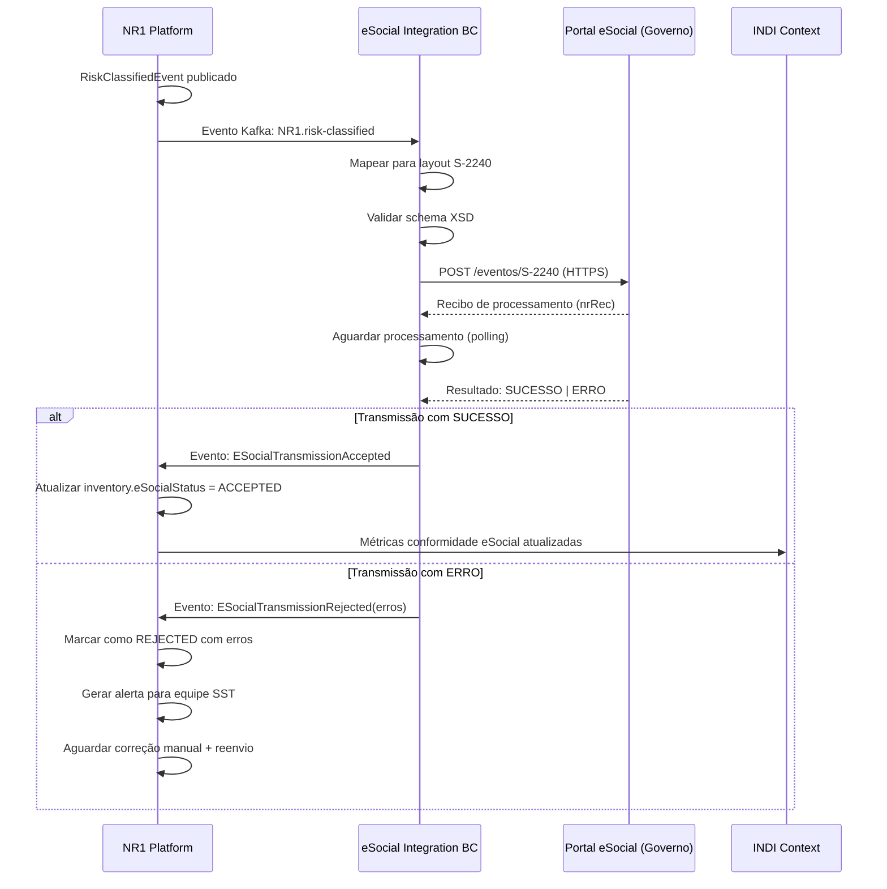
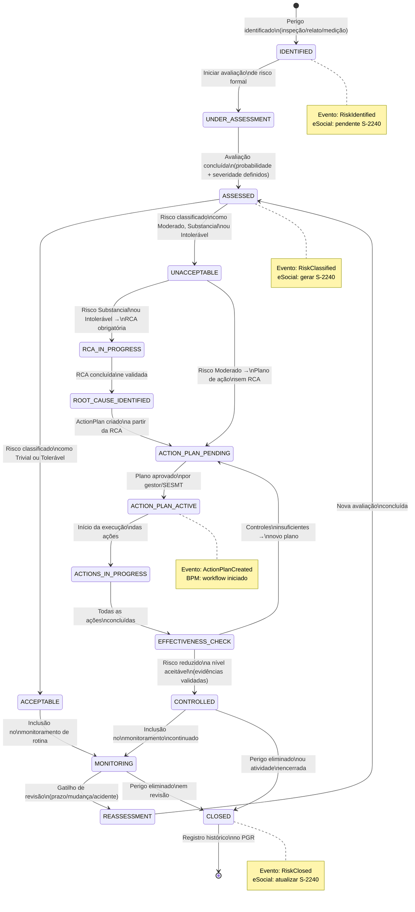

# GRO/PGR Architecture — NR-01 Intelligence Platform

> **Projeto:** QualitiOS  
> **Módulo:** NR-01 Intelligence Platform  
> **Fase:** 02 — Arquitetura  
> **Versão:** 1.0.0  
> **Data:** Junho/2026  
> **Base Legal:** NR-01 (Portaria MTE nº 1.419/2024) | Lei nº 6.514/1977 | CLT Art. 157  

---

## Sumário

1. [Introdução ao GRO/PGR](#1-introdução-ao-gropgr)
2. [Pipeline GRO/PGR — Visão Geral](#2-pipeline-gropgr--visão-geral)
3. [Etapa 1 — Inventário de Perigos](#3-etapa-1--inventário-de-perigos)
4. [Etapa 2 — Avaliação de Risco](#4-etapa-2--avaliação-de-risco)
5. [Etapa 3 — Classificação de Risco](#5-etapa-3--classificação-de-risco)
6. [Etapa 4 — Plano de Ação](#6-etapa-4--plano-de-ação)
7. [Etapa 5 — Monitoramento e Revisão](#7-etapa-5--monitoramento-e-revisão)
8. [Modelo de Dados do PGR](#8-modelo-de-dados-do-pgr)
9. [Integração com eSocial](#9-integração-com-esocial)
10. [Diagrama de Estados do Ciclo de Vida de um Risco](#10-diagrama-de-estados-do-ciclo-de-vida-de-um-risco)
11. [Regras de Negócio Críticas](#11-regras-de-negócio-críticas)

---

## 1. Introdução ao GRO/PGR

### 1.1 O que é o Gerenciamento de Riscos Ocupacionais (GRO)?

O **Gerenciamento de Riscos Ocupacionais (GRO)** é o processo sistemático e contínuo de identificação de perigos, avaliação de riscos, definição e implementação de medidas de prevenção e controle, e monitoramento da eficácia dessas medidas no ambiente de trabalho.

O GRO é **obrigatório** para todos os empregadores cujos empregados sejam regidos pela CLT, conforme Art. 9º da NR-01 (Portaria MTE nº 1.419/2024). Sua documentação formal é o **Programa de Gerenciamento de Riscos (PGR)**.

### 1.2 Fundamento Legal

| Dispositivo Legal | Conteúdo Relevante |
|------------------|---------------------|
| NR-01, Item 1.4 | Obrigações do empregador em SST |
| NR-01, Item 1.5 | Obrigações do trabalhador |
| NR-01, Capítulo III (Art. 6º a 9º) | Gerenciamento de Riscos Ocupacionais |
| NR-01, Anexo I | Classificação dos agentes de risco |
| NR-01, Anexo II | Conteúdo mínimo do PGR |
| NR-01, Item 1.6 | Participação dos trabalhadores |
| Portaria MTE 1.419/2024 | Atualização da NR-01 com inclusão dos riscos psicossociais |

### 1.3 Princípios Arquiteturais do GRO no QualitiOS

| Princípio | Descrição |
|-----------|-----------|
| **Continuidade** | O GRO é um processo contínuo, não um evento único |
| **Participação** | Trabalhadores participam ativamente da identificação de perigos |
| **Hierarquia de Controles** | Eliminação sempre preferida a EPI |
| **Evidência Objetiva** | Toda avaliação deve ser documentada e evidenciada |
| **Proporcionalidade** | Esforço de gestão proporcional ao nível de risco |
| **Rastreabilidade** | Auditoria completa de todas as decisões e mudanças |

---

## 2. Pipeline GRO/PGR — Visão Geral

```mermaid
flowchart TD
    START([🏭 Início do Ciclo GRO]) --> SCOPE

    subgraph PHASE1 ["📋 FASE 1 — INVENTÁRIO DE PERIGOS"]
        SCOPE[Definição de Escopo\nUnidade · Setor · Cargo · GHE]
        SCOPE --> SOURCES[Fontes de Dados\nInspeção · Medição · Histórico · Trabalhadores]
        SOURCES --> IDENTIFY[Identificação de Perigos\nFísico · Químico · Biológico\nErgonômico · Acidente · Psicossocial]
        IDENTIFY --> REGISTER[Registro no Inventário\nvalidação automática de campos]
        REGISTER --> EVIDENCE_INV[Coleta de Evidências\nfotos · laudos · medições]
    end

    subgraph PHASE2 ["⚖️ FASE 2 — AVALIAÇÃO DE RISCO"]
        ASSESS_METHOD[Seleção de Metodologia\nQualitativa · Semi-quant · Quantitativa]
        ASSESS_P[Definir Probabilidade\n1=Improvável → 5=Quase Certo]
        ASSESS_S[Definir Severidade\n1=Insignificante → 5=Catastrófico]
        MATRIX[Calcular Score\nProbabilidade × Severidade]
        CONTROLS_CHECK[Avaliar Controles Existentes\ntipo · efetividade · validação]
        RESIDUAL[Calcular Risco Residual\napós controles existentes]
    end

    subgraph PHASE3 ["🏷️ FASE 3 — CLASSIFICAÇÃO"]
        CLASSIFY[Classificar Nível de Risco\nTrivial · Tolerável · Moderado\nSubstancial · Intolerável]
        ACCEPTABLE{Risco\nAceitável?}
        RCA_TRIGGER{Nível\nSubstancial ou\nIntolerável?}
    end

    subgraph PHASE4 ["🛠️ FASE 4 — PLANO DE AÇÃO"]
        HIERARCHY[Aplicar Hierarquia de Controles\nEliminar → Substituir → Engenharia\nAdministrativo → EPI]
        ACTION_PLAN[Criar Plano de Ação\nações · responsáveis · prazos]
        RCA_PROCESS[Iniciar RCA\n5 Porquês · Ishikawa\nÁrvore de Causas]
        TRAINING[Definir Treinamentos\nnecessários]
        APPROVE[Aprovação do Plano\ngestor · SESMT · DDS]
        EXECUTE[Execução das Ações\nworkflows BPM]
        VERIFY[Verificação de Eficácia\nevidências · nova avaliação]
    end

    subgraph PHASE5 ["📊 FASE 5 — MONITORAMENTO"]
        KPIS[Monitorar KPIs\nTF · TG · conformidade]
        ALERTS[Gestão de Alertas\nprazos vencidos · desvios]
        PERIODIC[Revisão Periódica\nanual · após mudanças]
        ESOCIAL[Transmissão eSocial\nS-2240 · S-2245]
        PGR_UPDATE[Atualização do PGR\ndocumento oficial]
    end

    EVIDENCE_INV --> ASSESS_METHOD
    ASSESS_METHOD --> ASSESS_P
    ASSESS_P --> ASSESS_S
    ASSESS_S --> MATRIX
    MATRIX --> CONTROLS_CHECK
    CONTROLS_CHECK --> RESIDUAL
    RESIDUAL --> CLASSIFY
    CLASSIFY --> ACCEPTABLE
    ACCEPTABLE -->|Sim| KPIS
    ACCEPTABLE -->|Não| RCA_TRIGGER
    RCA_TRIGGER -->|Sim| RCA_PROCESS
    RCA_TRIGGER -->|Não - Moderado| HIERARCHY
    RCA_PROCESS --> HIERARCHY
    HIERARCHY --> ACTION_PLAN
    ACTION_PLAN --> TRAINING
    TRAINING --> APPROVE
    APPROVE --> EXECUTE
    EXECUTE --> VERIFY
    VERIFY --> KPIS
    KPIS --> ALERTS
    ALERTS --> PERIODIC
    PERIODIC --> ESOCIAL
    ESOCIAL --> PGR_UPDATE
    PGR_UPDATE -->|Nova inspeção ou mudança| SCOPE

    style PHASE1 fill:#1a3a5c,color:#fff
    style PHASE2 fill:#1a4a1a,color:#fff
    style PHASE3 fill:#4a3a00,color:#fff
    style PHASE4 fill:#4a1a00,color:#fff
    style PHASE5 fill:#3a0a4a,color:#fff
```



---

## 3. Etapa 1 — Inventário de Perigos

### 3.1 Entidades e Atributos

#### Escopo do Inventário

```typescript
interface InventoryScope {
  organizationId: string;        // CNPJ da empresa
  cnpjEstabelecimento: string;   // CNPJ do estabelecimento (eSocial)
  unitId: string;                // Unidade/estabelecimento
  unitName: string;
  unitAddress: string;
  
  sectors: SectorScope[];        // Setores incluídos
  jobRoles: JobRoleScope[];      // Cargos/funções incluídos
  
  totalWorkersInScope: number;   // Total de trabalhadores no escopo
  
  cnaeCode: string;              // CNAE principal (para regras NR)
  riskGrade: 1 | 2 | 3 | 4;     // Grau de Risco conforme NR-04
}

interface SectorScope {
  id: string;
  name: string;
  costCenter: string;
  workersCount: number;
  workActivities: string[];      // Lista de atividades realizadas
}

interface JobRoleScope {
  id: string;
  cboCode: string;               // Código CBO (eSocial)
  title: string;
  workersCount: number;
  isNightShift: boolean;         // Trabalho noturno
  isExternalWork: boolean;       // Trabalho externo
  isHazardousWork: boolean;      // Atividade insalubre/periculosa (NR-15/16)
}
```

### 3.2 Fontes de Dados para Identificação de Perigos

| Fonte | Tipo | Responsável | Frequência | Integração |
|-------|------|-------------|------------|-----------|
| **Inspeção de Segurança** | Primária | SESMT / Técnico SST | Semestral mínimo | Formulário digital QualitiOS |
| **Medições de Agentes** | Primária | Laboratorista / Higienista | Por demanda / NR-15 | Importação de laudos via ECM |
| **Histórico de Acidentes** | Secundária | SESMT | Contínuo | Módulo OMOC / eSocial CAT |
| **Relatos dos Trabalhadores** | Primária | CIPA / Trabalhadores | Contínuo | App mobile QualitiOS |
| **Fichas de Segurança (FISPQ)** | Secundária | Área de Compras | Por aquisição | ECM |
| **Revisão de Processos** | Primária | Engenharia | Por mudança | BPM |
| **Auditorias NR** | Secundária | Auditores | Anual mínimo | Módulo de Auditoria |
| **Dados OMOC (PCMSO)** | Secundária | Médico do Trabalho | Contínuo | Integração OMOC |
| **eSocial CAT** | Secundária | RH / DP | Por evento | Integração eSocial |
| **Mapas de Riscos** | Secundária | CIPA | Anual | Digitalização e OCR |

### 3.3 Validações Automáticas do Inventário

```typescript
// Domain Service: InventoryValidationService
class InventoryValidationService {
  
  validate(inventory: RiskInventory): ValidationResult {
    const errors: ValidationError[] = [];
    const warnings: ValidationWarning[] = [];
    
    // Regra V-001: Todo inventário deve ter ao menos um perigo identificado
    if (inventory.hazards.length === 0) {
      errors.push({ code: 'V-001', message: 'Inventário deve conter ao menos um perigo identificado' });
    }
    
    // Regra V-002: Perigos físicos com agente "NOISE" devem ter medição quantitativa
    // se o nível de risco estimado for moderado ou superior
    const noiseHazards = inventory.hazards.filter(h => h.agentSubtype === 'NOISE');
    noiseHazards.forEach(h => {
      if (!h.quantitativeData) {
        warnings.push({ 
          code: 'V-002', 
          message: `Perigo de ruído ${h.code} sem medição quantitativa — exigida pela NR-15 quando nível de risco ≥ Moderado`,
          hazardId: h.id
        });
      }
    });
    
    // Regra V-003: Todo GHE deve ter o número de trabalhadores informado
    inventory.hazards.forEach(h => {
      h.exposureGroups.forEach(eg => {
        if (eg.workerCount === 0) {
          errors.push({ 
            code: 'V-003', 
            message: `GHE "${eg.name}" do perigo ${h.code} não tem trabalhadores informados` 
          });
        }
      });
    });
    
    // Regra V-004: Inventários com agentes biológicos requerem responsável médico
    const hasbiologicalHazards = inventory.hazards.some(h => h.agentType === 'BIOLOGICAL');
    if (hasbiologicalHazards) {
      const hasMedical = inventory.elaboratedBy.some(r => r.role.includes('Médico'));
      if (!hasMedical) {
        errors.push({ code: 'V-004', message: 'Inventário com agentes biológicos requer participação de médico do trabalho' });
      }
    }
    
    // Regra V-005: Período de vigência deve ser de no máximo 2 anos
    const vigenciaDias = differenceInDays(inventory.validUntil, inventory.validFrom);
    if (vigenciaDias > 730) {
      errors.push({ code: 'V-005', message: 'Vigência do inventário não pode ultrapassar 2 anos (NR-01, Item 1.4.1.3)' });
    }
    
    // Regra V-006: Riscos psicossociais devem ser incluídos (NR-01/2024)
    const hasPsychosocial = inventory.hazards.some(h => h.agentType === 'ERGONOMIC' && h.agentSubtype.startsWith('PSYCHOSOCIAL'));
    if (!hasPsychosocial) {
      warnings.push({ 
        code: 'V-006', 
        message: 'Inventário sem avaliação de fatores psicossociais — obrigatório pela Portaria MTE 1.419/2024' 
      });
    }
    
    return { isValid: errors.length === 0, errors, warnings };
  }
}
```

### 3.4 Classificação dos Agentes de Risco (Anexo I NR-01)

| Grupo | Tipo | Exemplos de Agentes | Normas Aplicáveis |
|-------|------|--------------------|--------------------|
| **Físicos** | Energia | Ruído, Vibração, Calor, Frio, Radiação ionizante/não-ionizante, Pressão anormal, Iluminação | NR-15, NR-17, NR-36 |
| **Químicos** | Substâncias | Poeiras (mineral, orgânica, mista), Fumos metálicos, Névoas, Vapores orgânicos, Gases, Substâncias carcinogênicas | NR-15, NR-9 (legado) |
| **Biológicos** | Agentes vivos | Vírus, Bactérias, Fungos, Parasitas, Algas, Príons, Vetores | NR-15 Anexo 14, NR-32 |
| **Ergonômicos** | Organização/Postura | Esforço físico, Postura inadequada, Repetitividade, Monotonia, Ritmo excessivo, Jornada, **Psicossociais** | NR-17, NR-01/2024 |
| **Acidente** | Mecânico/Elétrico | Máquinas sem proteção, Queda de altura, Incêndio, Explosão, Eletricidade, Trabalho em espaço confinado | NR-10, NR-12, NR-33, NR-35 |

---

## 4. Etapa 2 — Avaliação de Risco

### 4.1 Matriz de Risco — Probabilidade × Severidade

A matriz de risco do QualitiOS segue a metodologia da **ABNT NBR ISO 31000:2018** adaptada às exigências da NR-01.

#### Critérios de Probabilidade

| Nível | Denominação | Descrição | Frequência Estimada |
|-------|-------------|-----------|---------------------|
| **1** | Improvável | O evento pode ocorrer somente em circunstâncias excepcionais | < 1 vez ao ano |
| **2** | Pouco Provável | O evento pode ocorrer em algum momento, mas raramente | 1 a 4 vezes ao ano |
| **3** | Provável | O evento deve ocorrer em algum momento | 1 a 4 vezes ao mês |
| **4** | Muito Provável | O evento deve ocorrer na maioria das circunstâncias | 1 a 4 vezes por semana |
| **5** | Quase Certo | O evento deve ocorrer na maioria das circunstâncias | Diariamente ou mais |

#### Critérios de Severidade

| Nível | Denominação | Consequência para Saúde/Vida | Consequência Organizacional |
|-------|-------------|------------------------------|----------------------------|
| **1** | Insignificante | Primeiros socorros, sem afastamento, sem sequelas | Impacto negligenciável |
| **2** | Menor | Tratamento médico, sem afastamento ou afastamento < 15 dias | Pequeno impacto operacional |
| **3** | Moderada | Afastamento temporário > 15 dias, sem sequelas permanentes | Paralisação de setor |
| **4** | Grave | Incapacidade permanente parcial, sequelas irreversíveis | Paralisação de unidade |
| **5** | Catastrófico | Morte ou incapacidade permanente total; múltiplas vítimas | Dano reputacional grave |

#### Matriz de Risco 5×5

```
                   S E V E R I D A D E
           │ 1-Insig │ 2-Menor │ 3-Moder │ 4-Grave │ 5-Catast│
           ├─────────┼─────────┼─────────┼─────────┼─────────┤
1-Improv   │    1    │    2    │    3    │    4    │    5    │
           │ TRIVIAL │ TRIVIAL │TOLERÁVEL│TOLERÁVEL│MODERADO │
           ├─────────┼─────────┼─────────┼─────────┼─────────┤
2-Pouc.Pr  │    2    │    4    │    6    │    8    │   10    │
           │ TRIVIAL │TOLERÁVEL│MODERADO │MODERADO │SUBSTANC │
           ├─────────┼─────────┼─────────┼─────────┼─────────┤
P 3-Prov   │    3    │    6    │    9    │   12    │   15    │
R          │TOLERÁVEL│MODERADO │MODERADO │SUBSTANC │SUBSTANC │
O          ├─────────┼─────────┼─────────┼─────────┼─────────┤
B 4-Mt.Pr  │    4    │    8    │   12    │   16    │   20    │
A          │TOLERÁVEL│MODERADO │SUBSTANC │INTOLERÁV│INTOLERÁV│
B          ├─────────┼─────────┼─────────┼─────────┼─────────┤
5-Qs.Cert  │    5    │   10    │   15    │   20    │   25    │
           │MODERADO │SUBSTANC │SUBSTANC │INTOLERÁV│INTOLERÁV│
           └─────────┴─────────┴─────────┴─────────┴─────────┘
```

### 4.2 Fórmulas e Cálculos

```typescript
// Domain Service: RiskCalculationService
class RiskCalculationService {
  
  /**
   * Calcula o score de risco bruto
   * Score = Probabilidade × Severidade
   */
  calculateRiskScore(probability: ProbabilityLevel, severity: SeverityLevel): number {
    return probability * severity; // Range: 1-25
  }
  
  /**
   * Determina o nível de risco conforme score calculado
   * Baseado na matriz 5×5 do QualitiOS / ABNT ISO 31000
   */
  classifyRiskLevel(score: number): RiskLevel {
    if (score <= 2)  return 'TRIVIAL';
    if (score <= 5)  return 'TOLERABLE';
    if (score <= 12) return 'MODERATE';
    if (score <= 17) return 'SUBSTANTIAL';
    return 'INTOLERABLE'; // 18-25
  }
  
  /**
   * Calcula o score de risco residual após aplicação dos controles existentes
   * Aplica fator de redução conforme efetividade dos controles
   */
  calculateResidualRisk(
    grossScore: number,
    controls: ExistingControl[]
  ): number {
    if (controls.length === 0) return grossScore;
    
    // Fatores de redução por efetividade
    const reductionFactors: Record<EffectivenessLevel, number> = {
      LOW:    0.85,  // Reduz 15%
      MEDIUM: 0.65,  // Reduz 35%
      HIGH:   0.40,  // Reduz 60%
    };
    
    // Usa o controle mais efetivo da hierarquia mais alta
    const bestControl = this.getBestControl(controls);
    const factor = reductionFactors[bestControl.effectiveness];
    
    return Math.ceil(grossScore * factor);
  }
  
  /**
   * Identifica o melhor controle considerando hierarquia + efetividade
   * Controles de eliminação/substituição têm peso maior
   */
  private getBestControl(controls: ExistingControl[]): ExistingControl {
    const hierarchyWeight: Record<ControlHierarchyType, number> = {
      ELIMINATION:    5,
      SUBSTITUTION:   4,
      ENGINEERING:    3,
      ADMINISTRATIVE: 2,
      PPE:            1,
    };
    
    return controls.reduce((best, current) => {
      const bestScore = hierarchyWeight[best.type] * this.effectivenessScore(best.effectiveness);
      const currScore = hierarchyWeight[current.type] * this.effectivenessScore(current.effectiveness);
      return currScore > bestScore ? current : best;
    });
  }
  
  private effectivenessScore(eff: EffectivenessLevel): number {
    return { LOW: 1, MEDIUM: 2, HIGH: 3 }[eff];
  }
  
  /**
   * Calcula a Taxa de Frequência de Acidentes (ABNT NBR 14280)
   * TF = (Número de acidentes / Homens-Hora Trabalhadas) × 1.000.000
   */
  calcularTaxaFrequencia(acidentes: number, hht: number): number {
    if (hht === 0) return 0;
    return (acidentes / hht) * 1_000_000;
  }
  
  /**
   * Calcula a Taxa de Gravidade (ABNT NBR 14280)
   * TG = (Dias computados / HHT) × 1.000.000
   */
  calcularTaxaGravidade(diasComputados: number, hht: number): number {
    if (hht === 0) return 0;
    return (diasComputados / hht) * 1_000_000;
  }
}
```

### 4.3 Metodologias de Avaliação

| Metodologia | Quando Usar | Vantagem | Limitação |
|-------------|-------------|----------|-----------|
| **Matriz Qualitativa 5×5** | Maioria dos riscos | Simples, rápida, visual | Subjetiva |
| **Fine-Kinney** | Riscos complexos com múltiplos cenários | Considera exposição | Mais demorada |
| **Quantitativa (medição)** | Agentes físicos e químicos regulamentados (NR-15) | Objetiva, comparável a LEP | Requer medição técnica |
| **FMEA** | Equipamentos e processos industriais | Sistemática, identifica modos de falha | Muito detalhada |
| **What If?** | Mudanças de processo, projetos novos | Criativa, preventiva | Depende de experiência |

---

## 5. Etapa 3 — Classificação de Risco

### 5.1 Tabela de Classificação por Nível com Critérios e Ações

| Nível de Risco | Score | Cor | Critério de Aceitabilidade | Ação Requerida | Prazo para Ação |
|---------------|-------|-----|---------------------------|----------------|-----------------|
| **Trivial** | 1–2 | 🟢 Verde | Aceitável sem restrições | Nenhuma ação imediata; monitoramento de rotina | Revisão anual |
| **Tolerável** | 3–5 | 🟡 Amarelo | Aceitável com controles existentes | Melhorias incrementais; verificar se controles são mantidos | 12 meses |
| **Moderado** | 6–12 | 🟠 Laranja | Não aceitável sem plano de ação | Plano de ação obrigatório; melhorias planejadas | 6 meses |
| **Substancial** | 13–17 | 🔴 Vermelho | Não aceitável — ação prioritária | Plano de ação prioritário + RCA obrigatória | 3 meses |
| **Intolerável** | 18–25 | ⛔ Roxo | Inaceitável — suspensão imediata possível | Ação imediata; suspender atividade se necessário; RCA obrigatória | Imediato (24–72h) |

### 5.2 Regras de Classificação Automática

```typescript
// Domain Service: RiskClassificationService
class RiskClassificationService {
  
  classify(assessment: RiskAssessment): RiskClassificationResult {
    const riskLevel = this.calculateLevel(assessment.residualRiskScore);
    const urgency = this.determineUrgency(riskLevel, assessment);
    const requirements = this.determineRequirements(riskLevel, assessment);
    
    return {
      riskLevel,
      urgency,
      requirements,
      recommendedActions: this.getRecommendedActions(riskLevel),
      legalObligations: this.getLegalObligations(riskLevel, assessment.hazardId),
    };
  }
  
  private determineRequirements(level: RiskLevel, assessment: RiskAssessment): ClassificationRequirements {
    return {
      requiresActionPlan:    ['MODERATE', 'SUBSTANTIAL', 'INTOLERABLE'].includes(level),
      requiresRCA:           ['SUBSTANTIAL', 'INTOLERABLE'].includes(level),
      requiresImmediateSuspension: level === 'INTOLERABLE' && assessment.severity === 5,
      requiresESocialUpdate: true, // Todo risco deve ser reportado via S-2240
      requiresWorkerNotification: ['SUBSTANTIAL', 'INTOLERABLE'].includes(level),
      requiresCIPAInvolvement: ['MODERATE', 'SUBSTANTIAL', 'INTOLERABLE'].includes(level),
      actionDeadlineDays: this.getDeadlineDays(level),
    };
  }
  
  private getDeadlineDays(level: RiskLevel): number {
    const deadlines: Record<RiskLevel, number> = {
      TRIVIAL:      365,
      TOLERABLE:    365,
      MODERATE:     180,
      SUBSTANTIAL:   90,
      INTOLERABLE:    3,
    };
    return deadlines[level];
  }
}
```

### 5.3 Casos Especiais de Classificação

| Caso Especial | Regra | Fundamento |
|--------------|-------|-----------|
| **Agente carcinogênico** | Score mínimo = SUBSTANCIAL, independente do cálculo | NR-01 Anexo I / IARC Group 1 |
| **Risco de morte imediata** | Classificação automática como INTOLERÁVEL | NR-01, Item 1.4.1 |
| **Trabalhador gestante/lactante** | Reduzir 1 nível de tolerância (mais restritivo) | CLT Art. 394-A |
| **Adolescente aprendiz** | Reduzir 1 nível de tolerância | CLT Art. 403 |
| **Acidente grave anterior** | Elevar probabilidade em 1 nível | Histórico de sinistros |
| **Risco psicossocial grave** | Protocolo especial de investigação obrigatório | Portaria MTE 1.419/2024 |

---

## 6. Etapa 4 — Plano de Ação

### 6.1 Hierarquia de Controles (NIOSH/NR-01)

A NR-01 segue a **hierarquia de controles do NIOSH (National Institute for Occupational Safety and Health)**, que estabelece a ordem de preferência para implementação de medidas preventivas:

```
┌──────────────────────────────────────────────────┐
│          HIERARQUIA DE CONTROLES (NIOSH)         │
│                                                  │
│  1. ELIMINAÇÃO ──────────────────── MAIS EFETIVO │
│     Remover fisicamente o perigo                 │
│                                                  │
│  2. SUBSTITUIÇÃO                                 │
│     Substituir por algo menos perigoso           │
│                                                  │
│  3. CONTROLES DE ENGENHARIA                      │
│     Isolar pessoas do perigo                     │
│     (proteção coletiva)                          │
│                                                  │
│  4. CONTROLES ADMINISTRATIVOS                    │
│     Mudar a forma como as pessoas trabalham      │
│     (procedimentos, treinamentos, rodízio)       │
│                                                  │
│  5. EPI ─────────────────────────── MENOS EFETIVO│
│     Proteger o trabalhador com equipamento       │
└──────────────────────────────────────────────────┘
```

### 6.2 Arquitetura do Plano de Ação

```typescript
// Application Service: ActionPlanCreationService
class ActionPlanCreationService {
  
  async createFromRiskAssessment(
    assessment: RiskAssessment,
    rcaResult: RootCauseAnalysis | null,
    creator: string
  ): Promise<ActionPlan> {
    
    // 1. Gerar ações recomendadas baseadas na hierarquia de controles
    const recommendedActions = this.generateRecommendedActions(
      assessment, 
      rcaResult
    );
    
    // 2. Calcular prazos conforme nível de risco
    const deadline = this.calculateDeadline(assessment.riskLevel);
    
    // 3. Identificar responsáveis conforme organograma SST
    const owner = await this.identifyOwner(assessment.hazardId);
    
    // 4. Criar o plano
    const actionPlan = ActionPlan.create({
      sourceType: 'RISK_ASSESSMENT',
      sourceId: assessment.id,
      hazardId: assessment.hazardId,
      rcaId: rcaResult?.id ?? null,
      objective: `Eliminar/controlar ${assessment.hazard.name} até nível tolerável`,
      scope: assessment.scope,
      actions: recommendedActions,
      owner,
      plannedStartDate: new Date(),
      plannedEndDate: deadline,
      createdBy: creator,
    });
    
    // 5. Publicar evento de domínio
    actionPlan.addDomainEvent(new ActionPlanCreatedEvent(actionPlan));
    
    return this.actionPlanRepository.save(actionPlan);
  }
  
  private generateRecommendedActions(
    assessment: RiskAssessment,
    rca: RootCauseAnalysis | null
  ): PlannedAction[] {
    const actions: PlannedAction[] = [];
    
    // Ação 1: Controle de maior hierarquia possível
    actions.push(this.createPrimaryControlAction(assessment));
    
    // Ação 2: EPI como medida complementar/temporária
    if (assessment.riskLevel !== 'TRIVIAL') {
      actions.push(this.createPPEAction(assessment));
    }
    
    // Ação 3: Treinamento (sempre que houver risco identificado)
    actions.push(this.createTrainingAction(assessment));
    
    // Ações adicionais baseadas na causa raiz (se RCA realizada)
    if (rca) {
      rca.rootCauses.forEach(rc => {
        actions.push(this.createRCABasedAction(rc, assessment));
      });
    }
    
    return actions;
  }
}
```

### 6.3 KPIs do Plano de Ação

| KPI | Fórmula | Meta | Alerta | Crítico |
|-----|---------|------|--------|---------|
| Taxa de conclusão de ações | (Ações concluídas / Total de ações) × 100 | ≥ 95% | < 80% | < 60% |
| Ações vencidas | Count(status = OVERDUE) | 0 | > 2 | > 5 |
| Tempo médio de conclusão | Média(completedAt - startedAt) em dias | ≤ prazo definido | 10% acima | 30% acima |
| Taxa de ações eficazes | (Ações verificadas eficazes / Total verificadas) × 100 | ≥ 85% | < 70% | < 50% |
| Custo realizado vs. planejado | (Custo real / Custo estimado) × 100 | ≤ 110% | > 130% | > 150% |

---

## 7. Etapa 5 — Monitoramento e Revisão

### 7.1 KPIs de Monitoramento do GRO

| Indicador | Código | Fórmula | Periodicidade | Responsável |
|-----------|--------|---------|---------------|-------------|
| Taxa de Frequência de Acidentes | TF | (Acidentes × 10⁶) / HHT | Mensal | SESMT |
| Taxa de Gravidade | TG | (Dias perdidos × 10⁶) / HHT | Mensal | SESMT |
| Taxa de Incidência de Doenças | TID | (Doenças × 10⁶) / HHT | Mensal | Médico Trab. |
| % Riscos Inaceitáveis com Plano de Ação | RIPA | (Riscos c/ plano / Riscos inaceitáveis) × 100 | Semanal | SESMT |
| % Ações Concluídas no Prazo | ACP | (Ações no prazo / Total) × 100 | Mensal | Gestor SST |
| % Treinamentos em Dia | TRD | (Trabalhadores treinados / Total necessário) × 100 | Mensal | RH/SST |
| Score de Maturidade GRO | SMG | Média ponderada de 15 critérios do Canvas | Trimestral | SESMT |
| Índice de Conformidade PGR | ICP | (Itens conformes / Total itens NR-01) × 100 | Trimestral | SESMT |

### 7.2 Sistema de Alertas

```typescript
// Domain Service: AlertManagementService
class AlertManagementService {
  
  checkAndGenerateAlerts(organization: Organization): Alert[] {
    const alerts: Alert[] = [];
    
    // Alerta A-001: Ação crítica vencida
    const overdueActions = this.getOverdueActions(organization.id, 'CRITICAL');
    overdueActions.forEach(action => {
      alerts.push({
        code: 'A-001',
        severity: 'CRITICAL',
        title: `Ação crítica vencida: ${action.title}`,
        description: `A ação estava prevista para ${formatDate(action.dueDate)} e não foi concluída`,
        actionPlanId: action.actionPlanId,
        responsibleId: action.responsible.userId,
        escalateTo: [organization.safetyManagerId, organization.hrDirectorId],
        createdAt: new Date(),
      });
    });
    
    // Alerta A-002: Risco intolerável sem plano de ação após 24h
    const intolerableWithoutPlan = this.getIntolerableRisksWithoutPlan(organization.id);
    intolerableWithoutPlan.forEach(hazard => {
      const hoursOpen = differenceInHours(new Date(), hazard.identifiedAt);
      if (hoursOpen > 24) {
        alerts.push({
          code: 'A-002',
          severity: 'CRITICAL',
          title: `Risco intolerável sem plano de ação há ${hoursOpen}h`,
          description: `O perigo "${hazard.name}" (${hazard.code}) está classificado como INTOLERÁVEL sem plano de ação`,
          hazardId: hazard.id,
          escalateTo: [organization.safetyManagerId, organization.ceoId],
          createdAt: new Date(),
        });
      }
    });
    
    // Alerta A-003: PGR vencendo em 30 dias
    const expiringInventories = this.getExpiringInventories(organization.id, 30);
    expiringInventories.forEach(inv => {
      alerts.push({
        code: 'A-003',
        severity: 'WARNING',
        title: `PGR/Inventário ${inv.code} vence em ${differenceInDays(inv.validUntil, new Date())} dias`,
        inventoryId: inv.id,
        responsibleId: organization.safetyManagerId,
        createdAt: new Date(),
      });
    });
    
    // Alerta A-004: Treinamento obrigatório vencido
    const expiredTrainings = this.getExpiredTrainings(organization.id);
    if (expiredTrainings.workerCount > 0) {
      alerts.push({
        code: 'A-004',
        severity: 'HIGH',
        title: `${expiredTrainings.workerCount} trabalhadores com treinamento NR vencido`,
        description: `Treinamentos vencidos: ${expiredTrainings.trainingTitles.join(', ')}`,
        responsibleId: organization.hrManagerId,
        createdAt: new Date(),
      });
    }
    
    return alerts;
  }
}
```

### 7.3 Revisão Periódica Obrigatória

| Gatilho de Revisão | Prazo | Base Legal | Escopo da Revisão |
|-------------------|-------|-----------|-------------------|
| Prazo normal (manutenção) | Anual | NR-01, Item 1.4.1.3 | Revisão completa do PGR |
| Mudança de processo produtivo | Antes da mudança | NR-01, Item 1.4.1.4 | Perigos afetados pela mudança |
| Mudança de instalações | Antes da ocupação | NR-01 | Novos perigos introduzidos |
| Introdução de novos produtos químicos | Antes do uso | NR-01 | Agentes químicos |
| Acidente grave ou fatal | Imediatamente após | NR-01, Art. 8º CLT | GHE afetado |
| Resultado de auditoria | Conforme prazo auditoria | ISO 45001 | Achados identificados |
| Solicitação da CIPA | A critério | NR-05 | Itens solicitados |
| Denúncia de trabalhador | 30 dias | NR-01 | Perigo denunciado |

---

## 8. Modelo de Dados do PGR

### 8.1 Seções Obrigatórias pela NR-01 (Anexo II)

O PGR é um documento técnico que deve conter, no mínimo, as seções definidas pelo Anexo II da NR-01 atualizada:

```typescript
interface PGRDocument {
  // Metadados do documento
  id: string;
  code: string;              // Ex: "PGR-2026-001"
  version: string;           // Ex: "3.0"
  revision: number;          // Número da revisão
  
  // Dados da empresa
  companyData: PGRCompanyData;
  
  // Seção 1: Identificação e escopo
  section1_Identification: PGRSection1;
  
  // Seção 2: Inventário de riscos
  section2_RiskInventory: PGRSection2;
  
  // Seção 3: Plano de ação
  section3_ActionPlan: PGRSection3;
  
  // Seção 4: Programa de treinamento
  section4_Training: PGRSection4;
  
  // Seção 5: Avaliação psicossocial (novo - NR-01/2024)
  section5_Psychosocial: PGRSection5;
  
  // Seção 6: Monitoramento e indicadores
  section6_Monitoring: PGRSection6;
  
  // Seção 7: Responsabilidades
  section7_Responsibilities: PGRSection7;
  
  // Seção 8: Integração com outros programas
  section8_Integration: PGRSection8;
  
  // Aprovação e vigência
  elaborationDate: Date;
  approvalDate: Date | null;
  validFrom: Date;
  validUntil: Date;
  nextRevisionDate: Date;
  
  // Signatários
  signatories: PGRSignatory[];
  
  // Geração do documento
  generatedDocumentId: string | null;  // ID no ECM (PDF gerado)
  generatedAt: Date | null;
}

interface PGRSection1 {
  // 1.1 Identificação do empregador
  employer: {
    corporateName: string;
    cnpj: string;
    cnae: string;
    riskGrade: 1 | 2 | 3 | 4;
    address: string;
    technicalResponsible: string;
    workerCount: number;
  };
  
  // 1.2 Escopo e abrangência
  scope: {
    establishments: string[];    // Estabelecimentos cobertos
    sectors: string[];
    totalWorkersCount: number;
    exclusions: string[];        // O que não está coberto e por quê
  };
  
  // 1.3 Metodologia adotada
  methodology: {
    riskAssessmentMethod: string;
    qualitativeCriteria: string;
    matrixDescription: string;
    psychosocialMethod: string;
  };
}

interface PGRSection2 {
  // 2.1 Identificação de perigos por GHE
  hazardsByGHE: Array<{
    gheId: string;
    gheName: string;
    workerCount: number;
    activities: string[];
    hazards: Array<{
      hazardId: string;
      agentType: HazardAgentType;
      description: string;
      probability: ProbabilityLevel;
      severity: SeverityLevel;
      riskLevel: RiskLevel;
      existingControls: string[];
      residualRiskLevel: RiskLevel;
    }>;
  }>;
  
  // 2.2 Resumo consolidado
  summary: {
    totalHazards: number;
    byRiskLevel: Record<RiskLevel, number>;
    byAgentType: Record<HazardAgentType, number>;
    intolerable: number;
    substantial: number;
  };
}

interface PGRSection3 {
  // 3.1 Planos de ação ativos
  activePlans: Array<{
    actionPlanId: string;
    code: string;
    hazardRef: string;
    riskLevel: RiskLevel;
    actions: Array<{
      description: string;
      controlLevel: ControlHierarchyType;
      responsible: string;
      dueDate: Date;
      status: ActionStatus;
      resourcesNeeded: string;
    }>;
  }>;
  
  // 3.2 Histórico de planos concluídos
  completedPlansHistory: Array<{
    planId: string;
    completedAt: Date;
    effectivenessResult: string;
  }>;
}

interface PGRSection5 {
  // Seção obrigatória a partir da Portaria MTE 1.419/2024
  
  // 5.1 Metodologia de avaliação psicossocial
  methodology: {
    instrumentsUsed: PsychosocialAssessmentMethod[];
    applicationPeriod: string;
    sampleSize: number;
    responseRate: number;       // % de resposta
  };
  
  // 5.2 Fatores psicossociais identificados
  identifiedFactors: Array<{
    factorType: PsychosocialFactorType;
    severity: PsychosocialSeverity;
    affectedWorkersEstimate: number;
    controls: string[];
  }>;
  
  // 5.3 Canal de denúncias
  denunciationChannel: {
    type: string;               // Ex: "Canal digital anônimo"
    responsible: string;
    protocol: string;           // Procedimento de investigação
    responseTimeDays: number;   // Prazo de resposta
  };
  
  // 5.4 Indicadores psicossociais
  psychosocialKPIs: Array<{
    indicator: string;
    value: number;
    unit: string;
    trend: string;
  }>;
}
```

### 8.2 Geração Automática do PDF do PGR

```typescript
// Application Service: PGRDocumentGenerationService
class PGRDocumentGenerationService {
  
  async generatePGR(organizationId: string, period: DateRange): Promise<PGRGenerationResult> {
    // 1. Coletar dados de todos os agregados
    const inventories = await this.inventoryRepo.findActive(organizationId);
    const actionPlans = await this.actionPlanRepo.findActive(organizationId);
    const psychosocialData = await this.psychosocialRepo.findLatest(organizationId);
    const indicators = await this.indicatorRepo.findLatest(organizationId);
    
    // 2. Compor o documento PGR
    const pgrDocument = await this.composePGRDocument({
      inventories,
      actionPlans,
      psychosocialData,
      indicators,
      period,
    });
    
    // 3. Validar conformidade com Anexo II NR-01
    const validationResult = await this.validatePGRCompliance(pgrDocument);
    if (!validationResult.isCompliant) {
      throw new PGRComplianceError(validationResult.missingItems);
    }
    
    // 4. Gerar PDF via template engine
    const pdfBuffer = await this.pdfGenerator.generate(pgrDocument);
    
    // 5. Enviar ao ECM para armazenamento
    const ecmResult = await this.ecmClient.storeDocument({
      type: 'PGR',
      organizationId,
      content: pdfBuffer,
      metadata: {
        version: pgrDocument.version,
        validUntil: pgrDocument.validUntil,
        signatoriesRequired: pgrDocument.signatories.length,
      }
    });
    
    return {
      pgrDocumentId: pgrDocument.id,
      ecmDocumentId: ecmResult.documentId,
      ecmUrl: ecmResult.url,
      validationResult,
      generatedAt: new Date(),
    };
  }
}
```

---

## 9. Integração com eSocial

### 9.1 Evento S-2240 — Condições Ambientais do Trabalho

O evento **S-2240** deve ser transmitido sempre que houver:
- Identificação inicial de ambiente de trabalho com agentes nocivos
- Alteração nas condições ambientais (novos agentes, mudança de nível)
- Encerramento de exposição a agente nocivo

```typescript
// Infrastructure: ESocialS2240Mapper
class ESocialS2240Mapper {
  
  mapFromRiskInventory(
    inventory: RiskInventory,
    hazard: Hazard,
    assessment: RiskAssessment
  ): S2240Event {
    return {
      evtExpRisco: {
        ideEvento: {
          indRetif: '1',           // 1 = Original
          nrRec: null,             // Null para evento original
          tpAmb: '1',              // 1 = Produção
          procEmi: '1',            // 1 = Aplicativo do empregador
          verProc: '1.0.0',
        },
        ideEmpregador: {
          tpInsc: '1',             // 1 = CNPJ
          nrInsc: inventory.organizationId,
        },
        infoExpRisco: {
          ideLocalAmb: {
            tpInsc: '1',
            nrInsc: inventory.cnpjEstabelecimento,
            dscSetor: inventory.sectorName,
          },
          ideAmb: {
            codAmb: hazard.id,
            dscAmb: hazard.description,
          },
          det: hazard.exposureGroups.map(ghe => ({
            nrOrd: ghe.id,
            tpTrab: '01',          // 01 = Empregado
            proc: {
              expRisco: {
                tpAgt: this.mapAgentType(hazard.agentType),
                agNoc: hazard.agentSubtype,
                dscAgNoc: hazard.description,
                tpAval: assessment.methodology === 'QUANTITATIVE' ? '1' : '2',
                limite: hazard.quantitativeData?.limitValue ?? null,
                resultado: hazard.quantitativeData?.measuredValue ?? null,
                tecMed: hazard.quantitativeData?.measurementMethod ?? null,
                nrObs: assessment.justification,
              },
            },
            epi: this.extractEPIFromControls(assessment.existingControls),
          })),
        },
      },
    };
  }
  
  private mapAgentType(agentType: HazardAgentType): string {
    const mapping: Record<HazardAgentType, string> = {
      PHYSICAL:    '01', // Físico
      CHEMICAL:    '02', // Químico
      BIOLOGICAL:  '03', // Biológico
      ERGONOMIC:   '04', // Mecânico/Ergonômico
      ACCIDENT:    '05', // Acidente
    };
    return mapping[agentType];
  }
}
```

### 9.2 Evento S-2245 — Treinamento e Capacitação

```typescript
// Infrastructure: ESocialS2245Mapper
class ESocialS2245Mapper {
  
  mapFromTrainingRequirement(training: TrainingRequirement): S2245Event {
    return {
      evtTreiCap: {
        ideEvento: {
          indRetif: '1',
          tpAmb: '1',
          procEmi: '1',
          verProc: '1.0.0',
        },
        ideEmpregador: {
          tpInsc: '1',
          nrInsc: training.organizationId,
        },
        infoTreiCap: {
          dtTrei: format(training.completedAt, 'yyyy-MM-dd'),
          cargHor: training.workloadHours,
          tpTrei: this.mapTrainingType(training.nrReference),
          dscTrei: training.title,
          codCurs: training.lmsCourseId ?? training.id,
          instEns: training.instructor ?? 'Interno',
          nrCert: training.certificateNumber ?? null,
          dtCert: training.certificateIssuedAt ? format(training.certificateIssuedAt, 'yyyy-MM-dd') : null,
        },
        trabalhador: training.completedWorkers.map(worker => ({
          cpfTrab: worker.cpf,
          nisTrab: worker.nis,
        })),
      },
    };
  }
}
```

### 9.3 Fluxo de Integração eSocial



---

## 10. Diagrama de Estados do Ciclo de Vida de um Risco



---

## 11. Regras de Negócio Críticas

### 11.1 Inventário de Perigos

| Código | Regra | Consequência da Violação |
|--------|-------|--------------------------|
| **RN-INV-001** | Todo inventário deve ser elaborado com participação de trabalhadores (NR-01, Item 1.6) | Inventário inválido para fins legais |
| **RN-INV-002** | Agentes biológicos exigem participação de médico do trabalho na elaboração | Bloqueio de publicação do inventário |
| **RN-INV-003** | Inventário deve ser revisado em até 2 anos ou antes de mudança significativa | Alerta de vencimento 30 dias antes |
| **RN-INV-004** | Inventário de empresa com grau de risco 3 ou 4 deve incluir avaliação quantitativa dos agentes físicos e químicos regulamentados | Warning com prazo para adequação |
| **RN-INV-005** | Riscos psicossociais são obrigatórios no inventário a partir de 26/05/2025 (vacatio legis NR-01/2024) | Alerta de não conformidade |
| **RN-INV-006** | GHE deve ter pelo menos 1 trabalhador para ser válido | Erro de validação no cadastro |

### 11.2 Avaliação de Risco

| Código | Regra | Consequência da Violação |
|--------|-------|--------------------------|
| **RN-AVA-001** | Agentes carcinogênicos (IARC Grupo 1) têm nível mínimo de risco = SUBSTANCIAL | Override automático da classificação |
| **RN-AVA-002** | Trabalhadora gestante/lactante tem tolerância reduzida: 1 nível mais restritivo | Regra aplicada automaticamente ao selecionar GHE com gestantes |
| **RN-AVA-003** | Risco INTOLERÁVEL requer ação imediata em até 24h e notificação do responsável legal | Alerta crítico automático + notificação email/SMS |
| **RN-AVA-004** | Avaliação quantitativa de ruído deve usar NHO-01 (nível de exposição normalizado) | Validação do método na importação de laudo |
| **RN-AVA-005** | EPI nunca pode ser o único controle para risco SUBSTANCIAL ou INTOLERÁVEL | Erro de negócio no plano de ação |
| **RN-AVA-006** | Score de risco residual não pode ser maior que o score bruto | Inconsistência de dados — bloqueio |

### 11.3 Plano de Ação

| Código | Regra | Consequência da Violação |
|--------|-------|--------------------------|
| **RN-PAC-001** | Todo risco MODERADO, SUBSTANCIAL ou INTOLERÁVEL deve ter plano de ação | Bloqueio de publicação do PGR sem plano |
| **RN-PAC-002** | Risco INTOLERÁVEL: plano deve iniciar em até 3 dias úteis | Alerta escalado para diretor |
| **RN-PAC-003** | Toda ação deve ter responsável com nome, cargo e prazo definidos | Erro de validação ao criar ação |
| **RN-PAC-004** | Hierarquia de controles deve ser respeitada — EPI apenas como complemento | Warning quando apenas EPI é proposto |
| **RN-PAC-005** | Plano encerrado sem verificação de eficácia não pode ser registrado como "Eficaz" | Bloqueio do encerramento sem evidência |
| **RN-PAC-006** | Modificação de prazo requer justificativa e nova aprovação do gestor | Auditoria obrigatória de mudança de prazo |

### 11.4 PGR — Conformidade

| Código | Regra | Consequência da Violação |
|--------|-------|--------------------------|
| **RN-PGR-001** | PGR deve conter todas as seções do Anexo II da NR-01 | PGR não pode ser marcado como "Aprovado" |
| **RN-PGR-002** | PGR deve ser assinado digitalmente pelo responsável técnico (SESMT ou RT) | Documento inválido para fiscalização |
| **RN-PGR-003** | Revisão do PGR é obrigatória anualmente ou após evento de mudança | Alerta 60 dias antes do vencimento |
| **RN-PGR-004** | PGR de empresa com SESMT próprio deve ser assinado por membro do SESMT | Validação de CRM/CREA/CRFT na assinatura |
| **RN-PGR-005** | PGR deve ser apresentado ao MTE em até 3 dias após solicitação de fiscalização | SLA crítico — ECM deve garantir disponibilidade |

---

## Referências Normativas e Bibliográficas

| Referência | Conteúdo |
|-----------|---------|
| NR-01 (Portaria MTE 1.419/2024) | Disposições Gerais e GRO |
| NR-04 (Portaria MTE 3.214/1978) | Grau de Risco por CNAE |
| NR-15 (Portaria MTE 3.214/1978) | Atividades e Operações Insalubres |
| NR-09 (revogada em 2021) | Dados históricos (PPRA migração) |
| ABNT NBR ISO 31000:2018 | Gestão de Riscos |
| ABNT NBR ISO 45001:2018 | SGS SSO |
| ABNT NBR 14280:2001 | Cadastro e estatística de acidentes |
| NHO-01 (FUNDACENTRO) | Procedimento para avaliação do ruído |
| Manual do eSocial — Leiaute 2.5 | S-2240, S-2245 |

---

*Documento gerado para o QualitiOS — Fase 02: Arquitetura*  
*Classificação: Interno — Equipe de Arquitetura*
