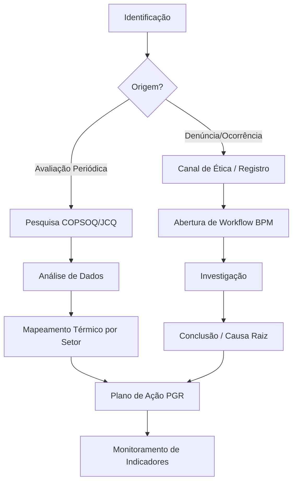

# Modelo de Riscos Psicossociais — NR-01 Intelligence Platform

## Embasamento Legal
A gestão de riscos psicossociais é um requisito fundamental da NR-01 atualizada (Portaria MTE nº 1.419/2024), que exige que as organizações identifiquem, avaliem e controlem os fatores de risco psicossocial no ambiente de trabalho.

## Taxonomia dos Fatores Psicossociais (Base MTE)

| Categoria | Definição | Indicadores e Escalas | Protocolo |
|---|---|---|---|
| Assédio Moral | Condutas abusivas, intencionais e frequentes. | COPSOQ (subescala assédio). Denúncias no canal de ética. | Canal seguro de denúncia, investigação neutra (BPM). |
| Assédio Sexual | Conduta de natureza sexual, não desejada. | Canal de denúncia. Pesquisa de clima. | Afastamento preventivo, comitê de investigação. |
| Violência no Trabalho | Agressões físicas, verbais ou ameaças. | Registros de ocorrência (incidentes). | Ação imediata, apoio psicológico, revisão de segurança. |
| Sobrecarga de Trabalho | Descompasso entre demandas e recursos. | JCQ (Demand-Control), Horas extras frequentes. | Redesenho de processos, contratações, pausa obrigatória. |
| Jornada Excessiva | Jornadas acima do limite legal continuadamente. | Controle de ponto (banco de horas). | Bloqueio de sistema, notificação gerencial. |
| Conflitos Interpessoais | Desavenças crônicas entre membros da equipe. | Turnover departamental, feedback 360. | Mediação, treinamento de comunicação não-violenta. |
| Falta de Autonomia | Baixa margem de decisão sobre as próprias tarefas. | JCQ (Decision Latitude). | Delegação, empowerment, comitês participativos. |
| Liderança Deficiente | Gestão coercitiva, falta de apoio social. | Avaliação 360 do líder, COPSOQ (Liderança). | PDL (Programa de Desenvolvimento de Líderes). |
| Mudanças Organizacionais | Insegurança gerada por reestruturações. | ERI (Effort-Reward Imbalance - Insegurança). | Gestão de mudança (Change Management), comunicação clara. |

## Metodologia de Avaliação

O sistema suportará a aplicação de escalas validadas:
1.  **COPSOQ II / III** (Copenhagen Psychosocial Questionnaire): Visão abrangente de demandas, organização, relações, liderança e valores.
2.  **JCQ** (Job Content Questionnaire): Foco na teoria Demanda-Controle de Karasek.
3.  **ERI** (Effort-Reward Imbalance): Foco no desequilíbrio entre esforço (intrínseco/extrínseco) e recompensa.

## Fluxo de Gestão Psicossocial

## Integração com BPM para Investigação

Denúncias ou desvios graves (ex: assédio, violência) acionam automaticamente um workflow BPM estruturado para investigação:
-   **Gatilho:** Submissão de formulário de denúncia (anônima ou não).
-   **Atores:** Comitê de Ética, RH, Jurídico.
-   **SLA:** 48 horas para primeiro contato/triagem, 30 dias para conclusão.
-   **Confidencialidade:** Dados restritos aos atores do workflow.

## Indicadores Psicossociais (KPIs)

-   Taxa de Denúncias Investigadas (%)
-   Índice de Sobrecarga (baseado no JCQ)
-   Absenteísmo por Transtornos Mentais e Comportamentais (CID-10 F)
-   Taxa de Turnover em Setores Críticos
-   Adesão aos Programas de Apoio Psicológico (EAP)
