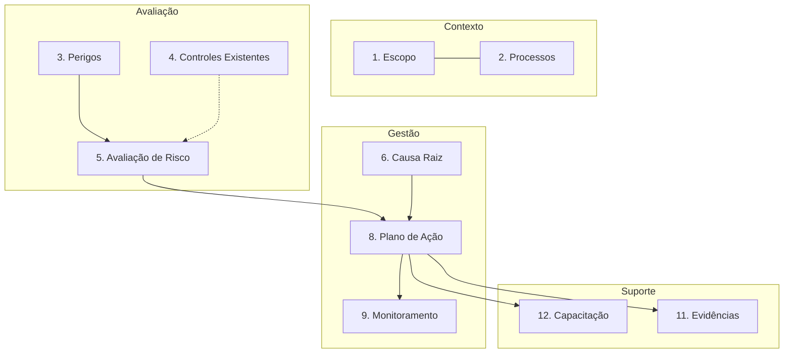

# Risk Canvas — Modelo Canônico NR-01

O Risk Canvas é a representação visual e estruturada de todas as informações inerentes a um Risco Ocupacional, consolidando os requisitos da NR-01 em uma única interface (canônica).

## Os 15 Blocos Obrigatórios

1.  **Escopo:** Delimitação do risco.
    *   *Atributos:* Empresa, Unidade, Setor, Cargo, Período de vigência.
2.  **Processos:** Contexto operacional onde o risco ocorre.
    *   *Atributos:* Nome do processo, Atividades específicas, Frequência de execução.
3.  **Perigos:** Origem do risco.
    *   *Atributos:* Agente (Físico, Químico, Biológico, Ergonômico, Acidente), Descrição da fonte geradora, Meio de propagação.
4.  **Controles Existentes:** Medidas preventivas já em vigor.
    *   *Atributos:* Descrição do controle, Nível na hierarquia (Eliminação, Substituição, Engenharia, Administrativo, EPI), Eficácia comprovada (Sim/Não).
5.  **Avaliação de Risco:** Quantificação do risco residual.
    *   *Atributos:* Nível de Probabilidade (1-5), Nível de Severidade (1-5), Nível de Risco Calculado (Trivial, Tolerável, Moderado, Substancial, Intolerável).
6.  **Causa Raiz:** Motivos profundos de falhas de controle.
    *   *Atributos:* Método RCA utilizado, Lista de causas raiz identificadas, Data da análise.
7.  **Histórico:** Eventos passados relacionados.
    *   *Atributos:* Lista de acidentes, Lista de quase-acidentes (Near Miss), Não conformidades registradas.
8.  **Plano de Ação:** Medidas corretivas e preventivas propostas.
    *   *Atributos:* Descrição da ação, Responsável, Prazo final (SLA), Status (Aberto, Em andamento, Concluído, Atrasado).
9.  **Monitoramento:** Acompanhamento da eficácia.
    *   *Atributos:* Frequência de inspeção, Responsável pela verificação, Critérios de aceitação.
10. **Psicossociais:** Fatores de risco mental/comportamental.
    *   *Atributos:* Fator identificado, Escala de avaliação utilizada, Controles organizacionais.
11. **Evidências:** Documentação comprobatória.
    *   *Atributos:* Anexos (Fotos, Laudos, LTCAT, Checklists, Certificados), Assinaturas digitais.
12. **Capacitação:** Treinamentos obrigatórios para mitigação.
    *   *Atributos:* NRs aplicáveis, Nome do treinamento, Carga horária, Validade.
13. **Responsáveis:** Atores chave.
    *   *Atributos:* Representante SESMT, Gestor da área, Trabalhadores expostos.
14. **Indicadores:** KPIs vinculados.
    *   *Atributos:* Taxa de acidentes associados, Conformidade de EPIs.
15. **Maturidade:** Nível de gestão do risco.
    *   *Atributos:* Nível Atual (0-5), Meta, Gap analysis.

## Modelo de Dados (Schema Simplificado)

```json
{
  "canvasId": "uuid",
  "scope": { "unit": "Fabrica SP", "department": "Solda" },
  "processes": ["Soldagem TIG"],
  "hazards": [{ "type": "FISICO", "source": "Arco Eletrico" }],
  "controls": [{ "type": "EPI", "effectiveness": "HIGH" }],
  "riskAssessment": { "probability": 3, "severity": 4, "level": "MODERADO" },
  "actionPlans": [],
  "evidences": ["link-s3-foto-1"]
}
```

## Diagrama do Canvas



## Regras de Validação e Ciclo de Vida

-   **Preenchimento:** O risco não pode ser publicado (estado "Ativo") se a Avaliação de Risco e o Plano de Ação estiverem incompletos (para riscos não toleráveis).
-   **Ciclo de Vida:** Rascunho $\rightarrow$ Em Revisão $\rightarrow$ Ativo $\rightarrow$ Mitigado $\rightarrow$ Arquivado.
-   **Revisão:** Todo canvas expira anualmente ou quando há mudanças no processo, exigindo revalidação (conforme NR-01).
