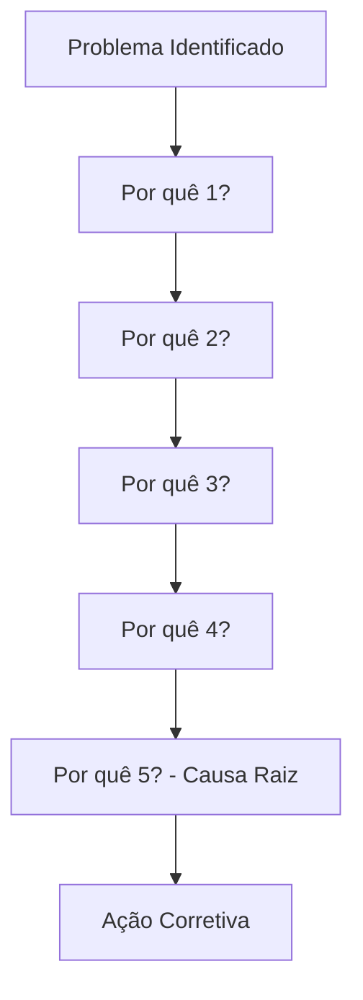
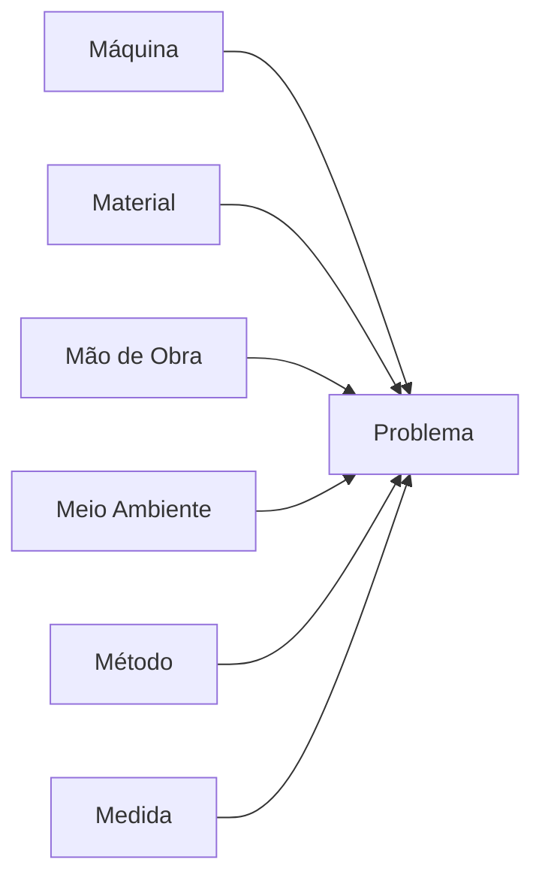
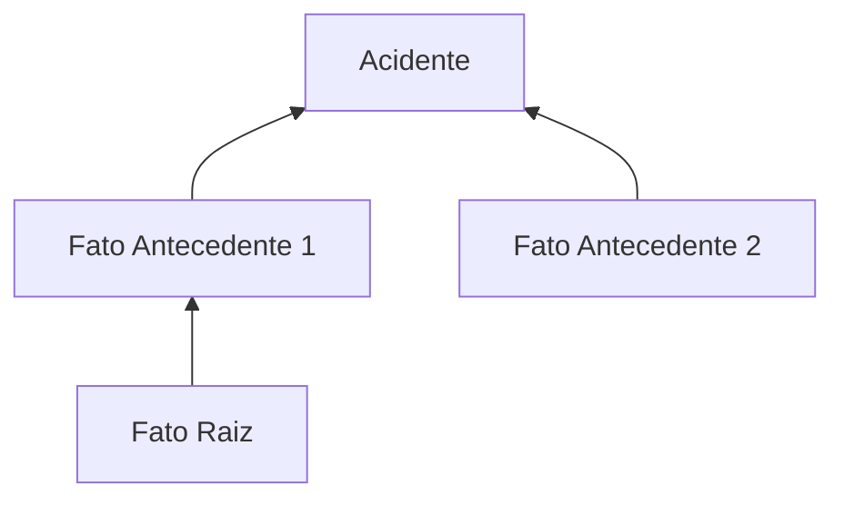

# Root Cause Analysis (RCA) — Modelo Arquitetural NR-01

O módulo RCA do QualitiOS suporta nativamente três metodologias consagradas para investigação de incidentes e não conformidades, integradas de forma unificada ao PGR.

## 1. Os 5 Porquês (5 Whys)

**Algoritmo:** Iteração recursiva perguntando "Por quê?" até encontrar uma causa sistêmica que possa ser controlada.
**Regras:** As respostas devem ser baseadas em fatos e evidências, não em opiniões. O fluxo para quando a causa raiz aponta para um processo ou sistema (não erro humano genérico).
**Armadilhas:** Parar cedo demais (ficar nos sintomas); focar em erro humano sem entender o contexto sistêmico.



## 2. Diagrama de Ishikawa (Espinha de Peixe / 6M)

**Estrutura de Dados:** Classificação das causas contribuintes em 6 categorias.
-   **Máquina:** Equipamentos, ferramentas.
-   **Material:** Matérias-primas, insumos.
-   **Mão de obra:** Treinamento, fadiga, comportamento.
-   **Meio ambiente:** Condições físicas, clima.
-   **Método:** Procedimentos, normas.
-   **Medida:** Instrumentos de medição, calibração.



## 3. Árvore de Causas (ADC)

**Algoritmo:** Construção retrospectiva a partir do evento (acidente). Para cada fato antecedente, pergunta-se: "O que foi necessário para que isso acontecesse?".
**Estrutura de Nó:** Fato (descrição), Tipo (Variação/Estado usual), Ligações (Encadeamento/Conjunção/Disjunção).



## Fluxo Completo de RCA

Problema (Não Conformidade / Incidente) $\rightarrow$ Identificação de Fatores Contribuintes $\rightarrow$ Determinação da Causa Raiz $\rightarrow$ Criação de Ação Corretiva (ActionPlan).

## Modelo de Dados Unificado (Schema RCA)

O banco de dados armazena as análises de forma polimórfica para acomodar os métodos:

```typescript
interface RootCauseAnalysis {
  id: string;
  sourceId: string; // ID do Incidente ou NC
  method: '5_WHYS' | 'ISHIKAWA' | 'ADC';
  problemStatement: string;
  analysisData: any; // JSON dinâmico baseado no método
  rootCauses: RootCause[];
  actionPlans: ActionPlan[];
  status: 'IN_PROGRESS' | 'COMPLETED' | 'VALIDATED';
}

interface RootCause {
  id: string;
  description: string;
  category?: string; // Para Ishikawa (ex: 'Method')
}
```

## Seleção do Método

-   **Problemas Simples / Rotineiros:** 5 Porquês.
-   **Problemas de Processo / Qualidade:** Ishikawa.
-   **Acidentes com Lesão / Complexos:** Árvore de Causas.

## Verificação e Validação

Após a implementação da Ação Corretiva, o sistema exige uma etapa de verificação de eficácia:
A causa raiz foi eliminada ou mitigada a níveis aceitáveis? Se não, a RCA é reaberta.
