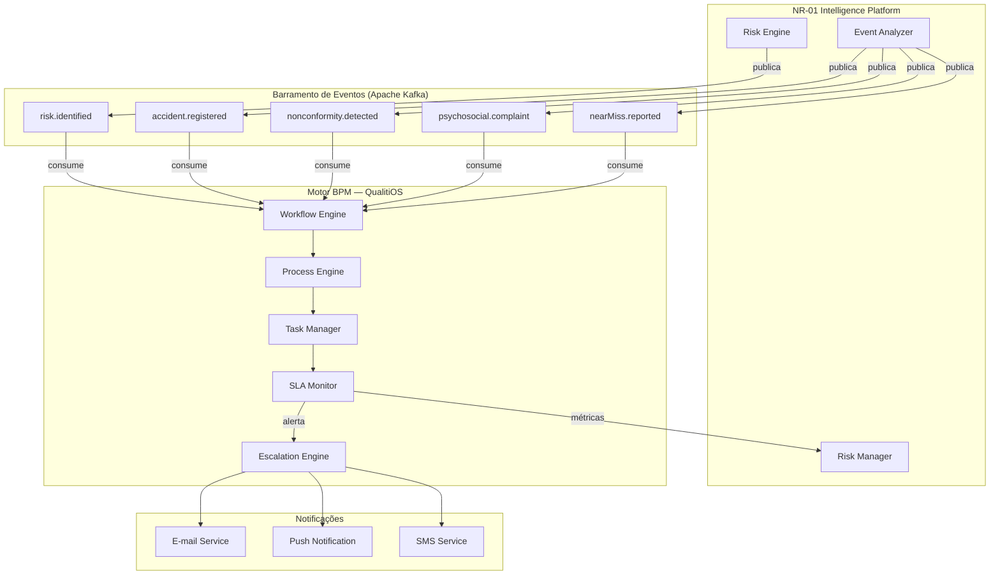
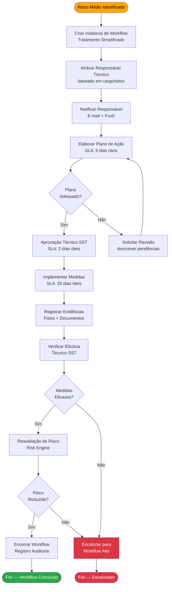
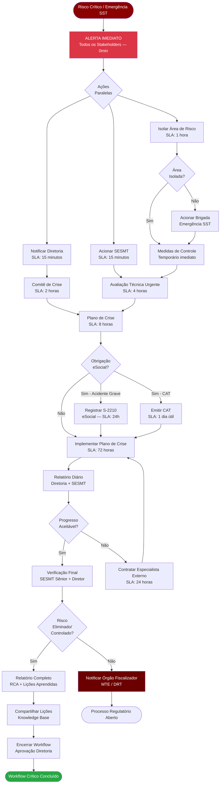
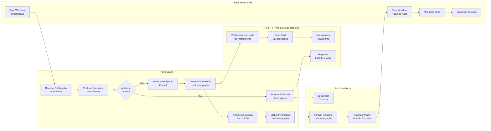
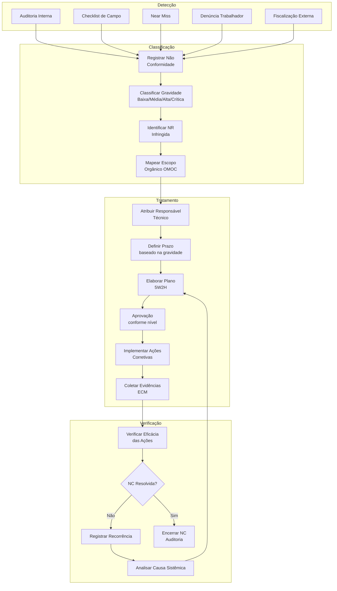
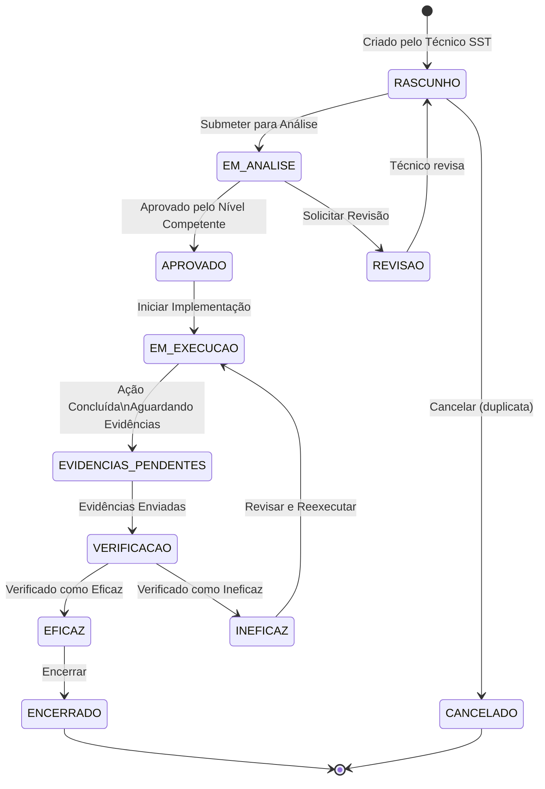
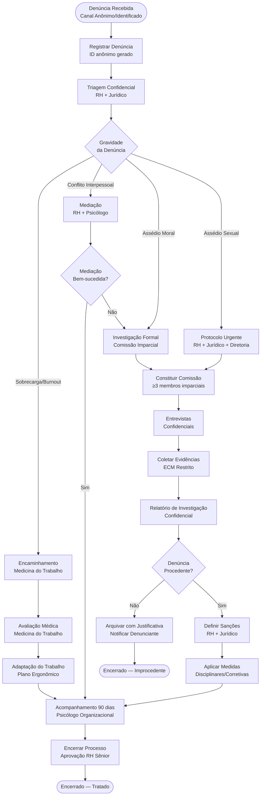
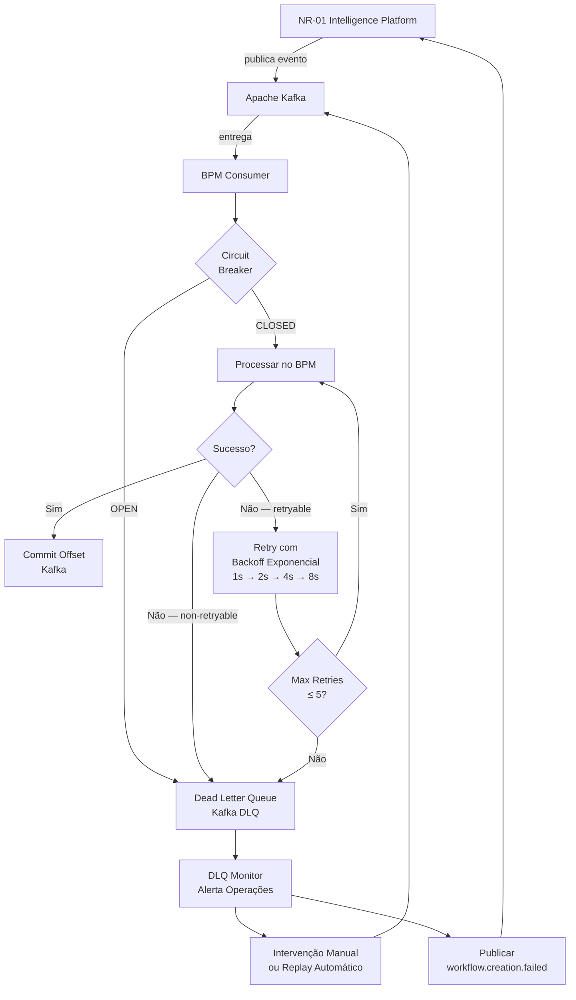
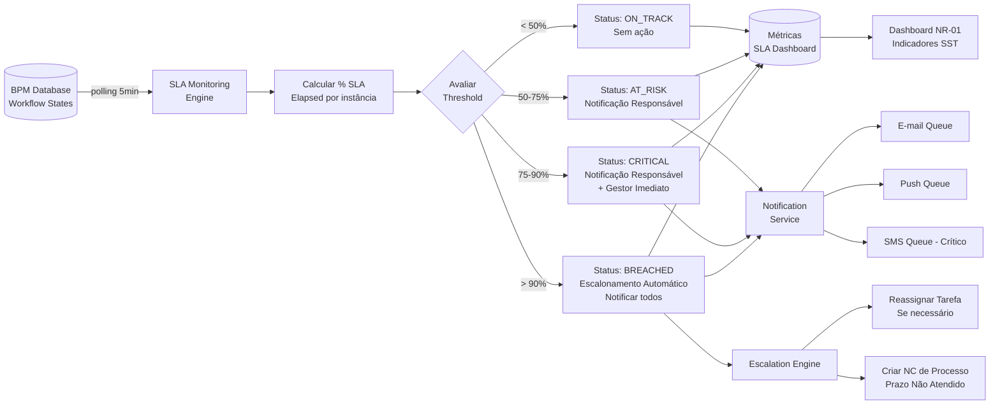

# BPM Integration — NR-01 Intelligence Platform

> **Módulo:** QualitiOS · NR-01 Intelligence Platform  
> **Fase:** 03 — Integrações  
> **Documento:** 09 — Integração com Motor BPM  
> **Versão:** 1.0.0  
> **Data:** 2026-06-08  
> **Status:** Aprovado para Implementação  

---

## Sumário

1. [Visão Geral da Integração BPM](#1-visão-geral-da-integração-bpm)
2. [Triggers de Criação de Workflow por Nível de Risco](#2-triggers-de-criação-de-workflow-por-nível-de-risco)
3. [Workflow Risco Médio — Tratamento Simplificado](#3-workflow-risco-médio--tratamento-simplificado)
4. [Workflow Risco Alto — Aprovação Gerencial](#4-workflow-risco-alto--aprovação-gerencial)
5. [Workflow Risco Crítico — SLA Crítico e Escalonamento Imediato](#5-workflow-risco-crítico--sla-crítico-e-escalonamento-imediato)
6. [Mapeamento de Processos BPM (BPMN 2.0)](#6-mapeamento-de-processos-bpm-bpmn-20)
7. [Contrato de API — NR-01 ↔ BPM](#7-contrato-de-api--nr-01--bpm)
8. [Tratamento de Falhas e Compensações](#8-tratamento-de-falhas-e-compensações)
9. [Monitoramento de SLA e Alertas](#9-monitoramento-de-sla-e-alertas)
10. [Referências](#10-referências)

---

## 1. Visão Geral da Integração BPM

### 1.1 Propósito

A integração entre o módulo **NR-01 Intelligence Platform** e o **Motor BPM (Business Process Management)** do QualitiOS tem como objetivo garantir que cada evento de risco identificado — seja proveniente de avaliações de risco, análises de acidente, near misses, não conformidades ou denúncias psicossociais — gere automaticamente um fluxo de trabalho estruturado, rastreável e auditável, com responsáveis definidos, prazos controlados e escalonamentos automáticos.

A integração segue os princípios da **NR-01 (atualização 2024)**, que exige o gerenciamento sistemático de riscos ocupacionais com controle de eficácia, prazos de implementação de medidas de controle e registro de todas as ações corretivas e preventivas.

### 1.2 Arquitetura de Integração



### 1.3 Princípios de Design

| Princípio | Descrição |
|-----------|-----------|
| **Event-Driven** | Toda criação de workflow é disparada por eventos de domínio via Kafka |
| **Idempotência** | Cada evento possui `eventId` único; reprocessamento não duplica workflows |
| **Resiliência** | Circuit breaker e retry automático com backoff exponencial |
| **Auditabilidade** | Cada transição de estado é registrada com usuário, timestamp e justificativa |
| **Conformidade NR-01** | SLAs mapeados aos prazos mínimos exigidos pela norma |
| **Compensação Transacional** | Falhas no BPM geram eventos de compensação no domínio NR-01 |

---

## 2. Triggers de Criação de Workflow por Nível de Risco

### 2.1 Matriz de Triggers

A tabela abaixo define os gatilhos de criação de workflow baseados na combinação de **tipo de evento** e **nível de risco** calculado pelo Risk Engine:

| Tipo de Evento | Nível de Risco | Workflow Ativado | SLA Total | Aprovação Necessária |
|----------------|----------------|------------------|-----------|----------------------|
| Risco identificado (PGR) | Baixo | Não gera workflow ativo | — | — |
| Risco identificado (PGR) | Médio | Tratamento Simplificado | 30 dias | Responsável Técnico |
| Risco identificado (PGR) | Alto | Aprovação Gerencial | 15 dias | Gerência + SESMT |
| Risco identificado (PGR) | Crítico | Escalonamento Imediato | 72 horas | Direção + SESMT |
| Acidente de Trabalho | Qualquer | Investigação de Acidente | 48h → 30 dias | SESMT + Gerência |
| Near Miss | Médio | Tratamento Simplificado | 15 dias | Responsável Técnico |
| Near Miss | Alto/Crítico | Aprovação Gerencial | 7 dias | Gerência + SESMT |
| Não Conformidade | Baixo/Médio | Tratamento Simplificado | 30 dias | Técnico de SST |
| Não Conformidade | Alto/Crítico | Aprovação Gerencial | 15 dias | SESMT + Gerência |
| Denúncia Psicossocial | Qualquer | Investigação Confidencial | 30 dias | RH + Jurídico |
| Exposição acima do LEO | — | Escalonamento Imediato | 24 horas | SESMT + Direção |

### 2.2 Lógica de Classificação de Nível de Risco

```
riskLevel = f(probabilidade × severidade)

Matriz de Risco:
┌─────────────────┬───────────┬────────────┬──────────┬─────────┐
│                 │ Improvável│  Possível  │ Provável │ Certo   │
├─────────────────┼───────────┼────────────┼──────────┼─────────┤
│ Catastrófico    │   Alto    │  Crítico   │ Crítico  │ Crítico │
│ Grave           │   Médio   │   Alto     │ Crítico  │ Crítico │
│ Moderado        │   Baixo   │   Médio    │  Alto    │ Crítico │
│ Leve            │   Baixo   │   Baixo    │  Médio   │  Alto   │
└─────────────────┴───────────┴────────────┴──────────┴─────────┘
```

### 2.3 Evento de Domínio — Estrutura Base

```json
{
  "eventId": "evt-a3f2c91d-8b4e-4d7a-9c1f-0e5b2d3a4f6c",
  "eventType": "risk.identified",
  "occurredAt": "2026-06-08T10:30:00-03:00",
  "correlationId": "pgr-2026-unidade-01",
  "source": "NR01.RiskEngine",
  "version": "1.0",
  "payload": {
    "riskId": "risk-uuid-here",
    "riskLevel": "ALTO",
    "riskScore": 15,
    "probability": "PROVAVEL",
    "severity": "MODERADO",
    "hazardType": "FISICO",
    "organizationalScope": {
      "empresaId": "emp-001",
      "unidadeId": "und-042",
      "setorId": "set-015",
      "cargoId": "cargo-023"
    },
    "exposedWorkers": 47,
    "currentControls": ["EPC-ventilação", "EPI-protetor-auricular"],
    "requiredActions": [
      "Medir NPS com dosímetro calibrado",
      "Avaliar eficácia dos EPI fornecidos",
      "Implantar barreira acústica no setor"
    ]
  }
}
```

---

## 3. Workflow Risco Médio — Tratamento Simplificado

### 3.1 Diagrama do Workflow



### 3.2 SLA Detalhado — Risco Médio

| Etapa | Prazo | Contador | Alerta Amarelo | Alerta Vermelho |
|-------|-------|----------|----------------|-----------------|
| Elaboração do Plano de Ação | 5 dias úteis | Desde criação | 3 dias | 5 dias |
| Aprovação Técnica do Plano | 2 dias úteis | Após submissão | 1 dia | 2 dias |
| Implementação das Medidas | 20 dias úteis | Após aprovação | 15 dias | 20 dias |
| Verificação de Eficácia | 3 dias úteis | Após implementação | 2 dias | 3 dias |
| **SLA Total** | **30 dias úteis** | Criação → Encerramento | — | — |

### 3.3 Responsáveis — Risco Médio

| Papel | Responsabilidade | Nível de Acesso |
|-------|-----------------|-----------------|
| **Responsável Técnico** | Elaborar plano, coordenar implementação | Leitura + Edição da instância |
| **Técnico de SST** | Aprovar plano, verificar eficácia | Leitura + Aprovação |
| **Supervisor do Setor** | Garantir execução das medidas | Leitura + Atualização de status |
| **Sistema NR-01** | Reavaliação automática de risco | Automático |

### 3.4 Matriz RACI — Risco Médio

| Atividade | Responsável Técnico | Técnico SST | Supervisor | Gerência | Sistema |
|-----------|--------------------:|------------:|------------|----------|---------|
| Elaborar Plano de Ação | **R** | A | C | I | I |
| Aprovar Plano | C | **R/A** | I | I | I |
| Implementar Medidas | **R** | C | A | I | I |
| Registrar Evidências | **R** | I | C | I | I |
| Verificar Eficácia | C | **R/A** | C | I | I |
| Reavaliar Risco | I | I | I | I | **R** |
| Encerrar Workflow | I | **R/A** | I | I | I |

*R = Responsável · A = Aprovador · C = Consultado · I = Informado*

### 3.5 Regras de Escalonamento — Risco Médio

```
SE (SLA_PLANO > 5 dias úteis E plano_não_iniciado):
    → Notificar Supervisor + Técnico SST
    → Registrar SLA_breach no log de auditoria

SE (SLA_TOTAL > 25 dias úteis E workflow_não_concluído):
    → Notificar Gerência
    → Gerar alerta no Dashboard

SE (SLA_TOTAL > 30 dias úteis):
    → Escalonar automaticamente para Workflow Risco Alto
    → Notificar SESMT
    → Registrar não conformidade de prazo

SE (risco_não_reduzido_após_verificação):
    → Escalonar para Workflow Risco Alto
    → Manter evidências do workflow anterior
```

---

## 4. Workflow Risco Alto — Aprovação Gerencial

### 4.1 Diagrama do Workflow

```mermaid
flowchart TD
    START([Risco Alto Identificado]) --> WF_CREATE[Criar Instância\nWorkflow Aprovação Gerencial]
    WF_CREATE --> SESMT_ASSIGN[Designar Técnico SESMT\nResponsável Principal]
    SESMT_ASSIGN --> NOTIFY_ALL[Notificar: SESMT + Gerente\nSupervisor + DDS automático]
    
    NOTIFY_ALL --> IMMEDIATE[Avaliar Medidas Imediatas\nSLA: 24 horas]
    IMMEDIATE --> INTERIM{Medidas\nImediatas\nNecessárias?}
    INTERIM -->|Sim| APPLY_INTERIM[Aplicar Controles Temporários\nDocumentar no Workflow]
    INTERIM -->|Não| PLAN_HIGH
    APPLY_INTERIM --> PLAN_HIGH
    
    PLAN_HIGH[Elaborar Plano de Ação Detalhado\nSESMT - SLA: 3 dias úteis]
    
    PLAN_HIGH --> TECH_REVIEW[Revisão Técnica SESMT\nSLA: 1 dia útil]
    TECH_REVIEW --> MANAGER_APPROVAL[Aprovação Gerencial\nSLA: 2 dias úteis]
    
    MANAGER_APPROVAL --> MGR_DEC{Gerência\nAprova?}
    MGR_DEC -->|Sim| IMPLEMENT_HIGH[Implementar Medidas\nSLA: 10 dias úteis]
    MGR_DEC -->|Não - Ajuste| PLAN_HIGH
    MGR_DEC -->|Não - Recursos| DIRECTOR[Escalonar Diretoria\nSLA: 24 horas]
    DIRECTOR --> RESOURCE_ALLOC[Alocar Recursos\nAutorização Diretoria]
    RESOURCE_ALLOC --> IMPLEMENT_HIGH
    
    IMPLEMENT_HIGH --> PROGRESS[Monitorar Progresso\nReporte Semanal SESMT]
    PROGRESS --> EVIDENCE_HIGH[Coletar Evidências\nFotos + Laudos + Medições]
    EVIDENCE_HIGH --> VERIFY_HIGH[Verificação Técnica\nSESMT - SLA: 2 dias úteis]
    
    VERIFY_HIGH --> EFF_HIGH{Eficácia\nComprovada?}
    EFF_HIGH -->|Sim| REASSESS_HIGH[Reavaliação de Risco\nRisk Engine]
    EFF_HIGH -->|Não| ESCALATE_CRITICAL[Escalonar para\nRisco Crítico]
    
    REASSESS_HIGH --> RISK_DOWN_HIGH{Risco ≤ Médio?}
    RISK_DOWN_HIGH -->|Sim| CLOSE_HIGH[Encerrar + Relatório Final\nAprovação Gerente]
    RISK_DOWN_HIGH -->|Não| CONTINUE_MONITOR[Monitoramento Contínuo\nPlano de Acompanhamento]
    
    CLOSE_HIGH --> END([Workflow Concluído])
    ESCALATE_CRITICAL --> END_ESC([Escalonado — Crítico])
    CONTINUE_MONITOR --> END_MON([Em Monitoramento Contínuo])

    style START fill:#FF6600,color:#fff
    style END fill:#28a745,color:#fff
    style END_ESC fill:#dc3545,color:#fff
```



### 4.2 SLA Detalhado — Risco Alto

| Etapa | Prazo | Responsável | Alerta Amarelo | Alerta Vermelho |
|-------|-------|-------------|----------------|-----------------|
| Avaliação de Medidas Imediatas | 24 horas | SESMT | 12 horas | 20 horas |
| Elaboração do Plano Detalhado | 3 dias úteis | SESMT | 2 dias | 3 dias |
| Revisão Técnica | 1 dia útil | SESMT Sênior | 8 horas | 1 dia |
| Aprovação Gerencial | 2 dias úteis | Gerente | 1 dia | 2 dias |
| Implementação das Medidas | 10 dias úteis | Supervisor/Técnico | 7 dias | 10 dias |
| Verificação de Eficácia | 2 dias úteis | SESMT | 1 dia | 2 dias |
| **SLA Total** | **15 dias úteis** | — | 12 dias | 15 dias |

### 4.3 Matriz RACI — Risco Alto

| Atividade | Técnico SESMT | Gerente | Supervisor | SESMT Sênior | Diretor | Sistema |
|-----------|:-------------:|:-------:|:----------:|:------------:|:-------:|:-------:|
| Medidas Imediatas | **R/A** | I | C | C | I | I |
| Elaborar Plano | **R** | I | C | A | I | I |
| Revisão Técnica | C | I | I | **R/A** | I | I |
| Aprovação Gerencial | C | **R/A** | I | C | I | I |
| Implementar Medidas | C | I | **R** | A | I | I |
| Monitorar Progresso | **R/A** | I | C | I | I | I |
| Coletar Evidências | A | I | **R** | I | I | I |
| Verificação Eficácia | **R/A** | C | I | C | I | I |
| Reavaliação de Risco | I | I | I | I | I | **R** |
| Encerramento | **R** | **A** | I | C | I | I |

### 4.4 Regras de Escalonamento — Risco Alto

```yaml
escalation_rules:
  level_high:
    - trigger: "plano_nao_elaborado"
      condition: "elapsed_hours > 72 AND plan_status = PENDING"
      action: notify_sesmt_senior
      action_secondary: notify_diretor

    - trigger: "aprovacao_gerencial_nao_obtida"
      condition: "elapsed_business_days > 3 AND approval_status = PENDING"
      action: notify_diretor
      action_secondary: create_blocking_incident

    - trigger: "implementacao_atrasada"
      condition: "elapsed_business_days > 12 AND implementation_status != COMPLETED"
      action: notify_gerente + notify_sesmt
      action_secondary: create_risk_alert_dashboard

    - trigger: "sla_breach"
      condition: "elapsed_business_days > 15 AND workflow_status != CLOSED"
      action: escalate_to_critical_workflow
      action_secondary: notify_all_stakeholders
      action_tertiary: register_non_conformity

    - trigger: "eficacia_nao_comprovada"
      condition: "verification_result = NOT_EFFECTIVE"
      action: escalate_to_critical_workflow
      action_secondary: apply_precautionary_measures
```

---

## 5. Workflow Risco Crítico — SLA Crítico e Escalonamento Imediato

### 5.1 Diagrama do Workflow



### 5.2 SLA Detalhado — Risco Crítico

| Etapa | Prazo | Responsável | Penalidade por Atraso |
|-------|-------|-------------|----------------------|
| Alerta a todos os stakeholders | 0 min (automático) | Sistema | Registro de falha sistêmica |
| Notificação Diretoria | 15 minutos | SESMT | Escalona para Board + Acionistas |
| Isolamento da área | 1 hora | Supervisor + Brigada | Interdição compulsória pelo SESMT |
| Avaliação Técnica Inicial | 4 horas | SESMT Sênior | Contratação externa emergencial |
| Comitê de Crise | 2 horas | Diretoria | Acionamento de protocolo de crise |
| Plano de Crise Elaborado | 8 horas | SESMT + Diretoria | Notificação ao MTE |
| Implementação do Plano | 72 horas | Equipe Designada | Autuação + Embargo |
| Registro eSocial (se aplicável) | 24 horas | RH + SESMT | Multa eSocial |
| Emissão de CAT | 1 dia útil | SESMT | Infração trabalhista |
| **SLA Total** | **15 dias corridos** | — | Notificação MTE obrigatória |

### 5.3 Matriz RACI — Risco Crítico

| Atividade | Diretor | Gerente | SESMT Sênior | SESMT | Supervisor | RH | Jurídico | Sistema |
|-----------|:-------:|:-------:|:------------:|:-----:|:----------:|:--:|:--------:|:-------:|
| Alerta Imediato | I | I | I | I | I | I | I | **R** |
| Isolamento de Área | A | C | **R** | C | R | I | I | I |
| Notificação Diretoria | **A** | I | **R** | C | I | I | I | I |
| Avaliação Técnica | C | I | **R/A** | R | C | I | I | I |
| Comitê de Crise | **R/A** | R | C | I | I | C | C | I |
| Plano de Crise | **A** | C | **R** | C | I | I | C | I |
| eSocial/CAT | A | I | C | **R** | I | **R** | C | I |
| Implementação | A | **R** | C | C | **R** | I | I | I |
| Relatório Diário | I | I | **R/A** | R | C | I | I | I |
| Notificação MTE | **A** | I | C | I | I | I | **R** | I |
| Encerramento | **R/A** | C | C | I | I | I | C | I |

### 5.4 Regras de Escalonamento — Risco Crítico

```
T+0min:   Sistema dispara alertas automáticos (E-mail, Push, SMS)
          para TODOS os stakeholders cadastrados

T+15min:  SE confirmação de recebimento não registrada:
          → Ligar para telefone de plantão do SESMT
          → Ligar para telefone de plantão do Gerente

T+1h:     SE isolamento não confirmado:
          → Acionar Brigada de Emergência
          → Notificar CIPA
          → Registrar situação de emergência

T+4h:     SE avaliação técnica não iniciada:
          → Contratar engenheiro de segurança externo
          → Notificar Diretoria

T+24h:    SE plano de crise não aprovado:
          → Notificar Ministério do Trabalho e Emprego (MTE)
          → Suspender atividades na área afetada

T+72h:    SE implementação não concluída:
          → Interdição automática recomendada
          → Relatório para Auditoria Interna e Compliance

A qualquer momento SE:
          → Acidente com vítima: CAT em até 1 dia útil
          → Óbito ou acidente grave: S-2210 eSocial imediato
          → Embargo pela fiscalização: Notificar Jurídico imediatamente
```

---

## 6. Mapeamento de Processos BPM (BPMN 2.0)

### 6.1 Processo de Investigação de Acidente

**ID do Processo:** `PROC-ACC-001`  
**Versão:** 2.0  
**Categoria:** Gestão de Incidentes e Acidentes



**Dados do Processo:**

| Atributo | Valor |
|----------|-------|
| Instâncias esperadas/mês | 1-5 (meta zero acidente) |
| Participantes | SESMT, RH, Gerência, Diretoria |
| Documentos gerados | Relatório RCA, CAT, S-2210, Plano de Ação |
| Integrações ativas | ECM (documentos), eSocial, LMS (treinamento pós-acidente), OMOC |
| SLA crítico | CAT em 1 dia útil; S-2210 imediato se grave |
| Normativas aplicadas | NR-01, CLT Art. 169, Portaria MTE 671/2021 |

---

### 6.2 Processo de Tratamento de Não Conformidade

**ID do Processo:** `PROC-NC-001`  
**Versão:** 2.0  
**Categoria:** Controle de Qualidade SST



---

### 6.3 Processo de Plano de Ação de Risco

**ID do Processo:** `PROC-PAR-001`  
**Versão:** 2.0  
**Categoria:** Gestão de Riscos Ocupacionais

**Estrutura do Plano de Ação (5W2H):**

| Campo | Descrição | Obrigatório |
|-------|-----------|-------------|
| **What** (O quê) | Ação a ser executada | Sim |
| **Why** (Por quê) | Justificativa técnica baseada na NR | Sim |
| **Where** (Onde) | Área/setor/posto de trabalho | Sim |
| **When** (Quando) | Data início + Data conclusão | Sim |
| **Who** (Quem) | Responsável principal + substituto | Sim |
| **How** (Como) | Método de execução e recursos | Sim |
| **How much** (Quanto custa) | Custo estimado e aprovado | Quando > R$ 1.000 |



---

### 6.4 Processo de Denúncia Psicossocial

**ID do Processo:** `PROC-PSI-001`  
**Versão:** 2.0  
**Categoria:** Gestão de Riscos Psicossociais (NR-01/2024)

> **⚠️ CONFIDENCIALIDADE MÁXIMA:** Este processo possui controles de acesso restritos conforme LGPD e NR-01/2024 Seção 5.3. A identidade do denunciante deve ser protegida em todas as etapas.



**Controles de Acesso — Denúncia Psicossocial:**

| Informação | RH Operacional | RH Sênior | Jurídico | Psicólogo | Diretoria | SESMT |
|-----------|:--------------:|:---------:|:--------:|:---------:|:---------:|:-----:|
| ID Anônimo da Denúncia | ✅ | ✅ | ✅ | ✅ | ✅ | ❌ |
| Identidade do Denunciante | ❌ | ✅ | ✅ | ✅ | ❌ | ❌ |
| Conteúdo Detalhado | ❌ | ✅ | ✅ | ✅ | ❌ | ❌ |
| Identidade do Acusado | ❌ | ✅ | ✅ | ✅ | ✅ | ❌ |
| Relatório Final | ❌ | ✅ | ✅ | C | ✅ | ❌ |
| Sanções Aplicadas | ❌ | ✅ | ✅ | ❌ | ✅ | ❌ |
| Indicadores Agregados | ✅ | ✅ | ✅ | ✅ | ✅ | ✅ |

*✅ Acesso Completo · ❌ Sem Acesso · C = Consulta Parcial*

---

## 7. Contrato de API — NR-01 ↔ BPM

### 7.1 Base URL e Autenticação

```
Base URL: https://api.qualitios.com.br/v1/bpm
Autenticação: OAuth 2.0 Client Credentials
Scopes: bpm:workflow:read, bpm:workflow:write, bpm:task:update
Content-Type: application/json
Accept: application/json
```

### 7.2 Endpoints — NR-01 → BPM (Publicação)

#### `POST /workflows` — Criar Instância de Workflow

**Request:**
```json
{
  "processDefinitionKey": "PROC-PAR-001",
  "businessKey": "risk-uuid-here",
  "variables": {
    "riskId": "risk-uuid-here",
    "riskLevel": "ALTO",
    "riskScore": 15,
    "organizationalScope": {
      "empresaId": "emp-001",
      "unidadeId": "und-042",
      "setorId": "set-015"
    },
    "requiredApprovers": [
      {
        "role": "SESMT_SENIOR",
        "userId": "user-sesmt-001"
      },
      {
        "role": "GERENTE",
        "userId": "user-gerente-002"
      }
    ],
    "slaDeadline": "2026-06-23T18:00:00-03:00",
    "escalationContacts": [
      {
        "level": 1,
        "userId": "user-sesmt-001",
        "method": ["email", "push"]
      },
      {
        "level": 2,
        "userId": "user-diretor-001",
        "method": ["email", "push", "sms"]
      }
    ],
    "sourceEventId": "evt-a3f2c91d-8b4e-4d7a-9c1f-0e5b2d3a4f6c",
    "sourceEventType": "risk.identified"
  }
}
```

**Response 201 Created:**
```json
{
  "workflowInstanceId": "wf-inst-b7e3d2a1-4c5f-4e8b-a2d3-1f0c9e8b7a6d",
  "processDefinitionKey": "PROC-PAR-001",
  "businessKey": "risk-uuid-here",
  "status": "ACTIVE",
  "createdAt": "2026-06-08T10:31:00-03:00",
  "slaDeadline": "2026-06-23T18:00:00-03:00",
  "currentTask": {
    "taskId": "task-001",
    "taskName": "Elaborar Plano de Ação Detalhado",
    "assignee": "user-sesmt-001",
    "dueDate": "2026-06-11T18:00:00-03:00"
  },
  "_links": {
    "self": "/v1/bpm/workflows/wf-inst-b7e3d2a1",
    "tasks": "/v1/bpm/workflows/wf-inst-b7e3d2a1/tasks",
    "history": "/v1/bpm/workflows/wf-inst-b7e3d2a1/history"
  }
}
```

---

#### `GET /workflows/{workflowInstanceId}` — Consultar Status

**Response 200 OK:**
```json
{
  "workflowInstanceId": "wf-inst-b7e3d2a1-4c5f-4e8b-a2d3-1f0c9e8b7a6d",
  "processDefinitionKey": "PROC-PAR-001",
  "businessKey": "risk-uuid-here",
  "status": "ACTIVE",
  "slaStatus": "ON_TRACK",
  "slaDeadline": "2026-06-23T18:00:00-03:00",
  "slaPercentageElapsed": 23.5,
  "currentTask": {
    "taskId": "task-002",
    "taskName": "Aprovação Gerencial",
    "assignee": "user-gerente-002",
    "dueDate": "2026-06-13T18:00:00-03:00",
    "status": "PENDING"
  },
  "completedTasks": [
    {
      "taskId": "task-001",
      "taskName": "Elaborar Plano de Ação Detalhado",
      "completedAt": "2026-06-10T15:30:00-03:00",
      "outcome": "SUBMITTED"
    }
  ],
  "escalationHistory": []
}
```

---

#### `POST /workflows/{workflowInstanceId}/tasks/{taskId}/complete` — Concluir Tarefa

**Request:**
```json
{
  "outcome": "APPROVED",
  "comment": "Plano de ação aprovado. Medidas de controle de ruído adequadas à NR-15.",
  "variables": {
    "approvedBy": "user-gerente-002",
    "approvedAt": "2026-06-13T09:15:00-03:00",
    "attachments": [
      {
        "documentId": "ecm-doc-001",
        "documentType": "PLANO_ACAO_APROVADO"
      }
    ]
  }
}
```

**Response 200 OK:**
```json
{
  "taskId": "task-002",
  "status": "COMPLETED",
  "outcome": "APPROVED",
  "nextTask": {
    "taskId": "task-003",
    "taskName": "Implementar Medidas de Controle",
    "assignee": "user-supervisor-001",
    "dueDate": "2026-06-27T18:00:00-03:00"
  }
}
```

---

#### `POST /workflows/{workflowInstanceId}/escalate` — Forçar Escalonamento

**Request:**
```json
{
  "reason": "IMPLEMENTACAO_ATRASADA",
  "escalationLevel": 2,
  "comment": "Implementação não iniciada após 12 dias úteis. Escalonando para gerência.",
  "triggeredBy": "SLA_MONITOR_AUTO"
}
```

---

#### `GET /workflows` — Listar Workflows com Filtros

```
GET /v1/bpm/workflows?
    processDefinitionKey=PROC-PAR-001
    &status=ACTIVE
    &slaStatus=AT_RISK
    &organizationalScope.unidadeId=und-042
    &page=0
    &size=20
    &sort=slaDeadline,asc
```

---

### 7.3 Endpoints — BPM → NR-01 (Callbacks/Webhooks)

#### `POST /nr1/callbacks/workflow-event` — Receber Eventos do BPM

**Payload de evento de conclusão de tarefa:**
```json
{
  "eventType": "TASK_COMPLETED",
  "eventId": "bpm-evt-001",
  "workflowInstanceId": "wf-inst-b7e3d2a1",
  "businessKey": "risk-uuid-here",
  "occurredAt": "2026-06-13T09:15:00-03:00",
  "data": {
    "taskId": "task-002",
    "taskName": "Aprovação Gerencial",
    "outcome": "APPROVED",
    "completedBy": "user-gerente-002"
  }
}
```

**Payload de evento de SLA breach:**
```json
{
  "eventType": "SLA_BREACHED",
  "eventId": "bpm-evt-002",
  "workflowInstanceId": "wf-inst-b7e3d2a1",
  "businessKey": "risk-uuid-here",
  "occurredAt": "2026-06-23T18:00:01-03:00",
  "data": {
    "slaType": "WORKFLOW_TOTAL",
    "slaDeadline": "2026-06-23T18:00:00-03:00",
    "elapsedBusinessDays": 15,
    "currentTask": "Verificação de Eficácia",
    "currentAssignee": "user-sesmt-001"
  }
}
```

**Payload de evento de conclusão de workflow:**
```json
{
  "eventType": "WORKFLOW_COMPLETED",
  "eventId": "bpm-evt-003",
  "workflowInstanceId": "wf-inst-b7e3d2a1",
  "businessKey": "risk-uuid-here",
  "occurredAt": "2026-06-20T14:00:00-03:00",
  "data": {
    "finalOutcome": "RISK_MITIGATED",
    "totalBusinessDays": 12,
    "slaStatus": "MET",
    "evidenceDocumentIds": ["ecm-doc-001", "ecm-doc-002", "ecm-doc-003"],
    "finalRiskScore": 4,
    "finalRiskLevel": "BAIXO"
  }
}
```

### 7.4 Tabela Completa de Eventos Publicados pelo NR-01

| Evento Kafka | Tópico | Descrição | Gera Workflow |
|--------------|--------|-----------|---------------|
| `risk.identified` | `nr1.risks` | Risco identificado no PGR | Sim (se ≥ Médio) |
| `risk.reassessed` | `nr1.risks` | Risco reavaliado após ação | Não (atualiza existente) |
| `accident.registered` | `nr1.accidents` | Acidente de trabalho registrado | Sim (sempre) |
| `nearMiss.reported` | `nr1.incidents` | Near miss relatado | Sim (se ≥ Médio) |
| `nonconformity.detected` | `nr1.audits` | NC identificada em auditoria | Sim (se ≥ Baixo) |
| `psychosocial.complaint` | `nr1.psychosocial` | Denúncia psicossocial recebida | Sim (sempre) |
| `exposure.exceeded` | `nr1.monitoring` | Exposição acima do LEO | Sim (Crítico) |
| `training.overdue` | `nr1.training` | Treinamento vencido identificado | Sim (Médio) |
| `pgr.approved` | `nr1.pgr` | PGR aprovado/revisado | Não |
| `action.completed` | `nr1.actions` | Ação de plano concluída | Não (fecha tarefa) |

---

## 8. Tratamento de Falhas e Compensações

### 8.1 Estratégia de Resiliência



### 8.2 Cenários de Falha e Compensações

| Cenário de Falha | Estratégia | Compensação NR-01 | Prazo Máximo |
|------------------|------------|-------------------|--------------|
| BPM indisponível | Retry 5x + DLQ | Marcar risco como `PENDING_WORKFLOW` | 30 minutos |
| Timeout de workflow creation | Circuit Breaker Open | Notificar operações + alert dashboard | Imediato |
| Assignee não encontrado no OMOC | Fallback para supervisor padrão | Log de warning + notificação RH | Imediato |
| SLA calculado inválido | Usar SLA padrão por nível de risco | Log de erro + alerta arquitetura | Imediato |
| Callback de conclusão perdido | Polling a cada 15min (reconciliação) | Republicar evento de conclusão | 15 minutos |
| Workflow em estado inválido | Alertar SESMT + suspender SLA | Registrar incidente de processo | 1 hora |
| DLQ lotada (> 1000 msgs) | Alerta P1 para operações | Suspender novos workflows até drain | Imediato |

### 8.3 Padrão Saga — Compensação Transacional

```
Saga: CriarWorkflowDeRisco

Passos:
  1. NR-01: Publicar `risk.identified` → Kafka
  2. BPM: Criar instância de workflow
  3. BPM: Atribuir responsáveis (consulta OMOC)
  4. BPM: Calcular e registrar SLAs
  5. BPM: Enviar notificações iniciais
  6. BPM: Publicar `workflow.created` → Kafka
  7. NR-01: Atualizar risk.workflowInstanceId

Compensações (em ordem reversa):
  SE passo 6 falhar: Cancelar notificações pendentes
  SE passo 5 falhar: Deletar SLAs registrados
  SE passo 4 falhar: Deletar atribuições de responsáveis
  SE passo 3 falhar: Usar assignee default (SESMT padrão)
  SE passo 2 falhar: Publicar `workflow.creation.failed`
                     NR-01 mantém risco como PENDING_WORKFLOW
```

### 8.4 Configuração de Circuit Breaker

```yaml
resilience4j:
  circuitbreaker:
    instances:
      bpm-integration:
        slidingWindowSize: 10
        minimumNumberOfCalls: 5
        permittedNumberOfCallsInHalfOpenState: 3
        automaticTransitionFromOpenToHalfOpenEnabled: true
        waitDurationInOpenState: 30s
        failureRateThreshold: 50
        slowCallRateThreshold: 80
        slowCallDurationThreshold: 5s
  retry:
    instances:
      bpm-integration:
        maxAttempts: 5
        waitDuration: 1s
        enableExponentialBackoff: true
        exponentialBackoffMultiplier: 2
        retryExceptions:
          - java.net.ConnectException
          - java.net.SocketTimeoutException
          - org.springframework.web.client.ResourceAccessException
        ignoreExceptions:
          - com.qualitios.exception.ValidationException
          - com.qualitios.exception.BusinessRuleException
```

---

## 9. Monitoramento de SLA e Alertas

### 9.1 Arquitetura de Monitoramento



### 9.2 Thresholds de Alerta por Nível de Risco

| Nível de Risco | SLA Total | Alerta Amarelo | Alerta Laranja | Alerta Vermelho | Escalonamento |
|----------------|-----------|---------------|----------------|-----------------|---------------|
| Médio | 30 dias úteis | 50% (15 dias) | 75% (22 dias) | 90% (27 dias) | 100% (30 dias) |
| Alto | 15 dias úteis | 50% (7 dias) | 75% (11 dias) | 90% (13 dias) | 100% (15 dias) |
| Crítico | 72 horas | 33% (24h) | 66% (48h) | 85% (61h) | 100% (72h) |
| Acidente | 30 dias | 40% (12 dias) | 70% (21 dias) | 90% (27 dias) | 100% (30 dias) |
| NC Alta | 15 dias úteis | 50% (7 dias) | 75% (11 dias) | 90% (13 dias) | 100% (15 dias) |
| Psicossocial | 30 dias corridos | 40% (12 dias) | 70% (21 dias) | 90% (27 dias) | 100% (30 dias) |

### 9.3 Métricas de SLA Expostas

```json
{
  "sla_metrics": {
    "timestamp": "2026-06-08T13:00:00-03:00",
    "period": "CURRENT_MONTH",
    "summary": {
      "total_active_workflows": 47,
      "on_track": 32,
      "at_risk": 8,
      "critical": 4,
      "breached": 3,
      "sla_compliance_rate": 93.6
    },
    "by_risk_level": {
      "MEDIO": {"active": 25, "on_track": 20, "breached": 1},
      "ALTO": {"active": 17, "on_track": 10, "breached": 2},
      "CRITICO": {"active": 5, "on_track": 2, "breached": 0}
    },
    "by_process": {
      "PROC-PAR-001": {"active": 30, "avg_completion_days": 18.5},
      "PROC-ACC-001": {"active": 3, "avg_completion_days": 22.1},
      "PROC-NC-001": {"active": 12, "avg_completion_days": 14.3},
      "PROC-PSI-001": {"active": 2, "avg_completion_days": 25.0}
    }
  }
}
```

### 9.4 Integração com Dashboard de Indicadores

Os dados de SLA do Motor BPM são consumidos pelo módulo de **Indicadores e Dashboard** (Documento 13) via endpoint dedicado, alimentando os seguintes KPIs:

- **% Ações no Prazo:** `(workflows_on_track / total_active_workflows) × 100`
- **Tempo Médio de Resolução por Nível:** média de `completion_days` agrupada por `riskLevel`
- **Taxa de Escalonamento:** `(escalated_workflows / total_workflows_started) × 100`
- **SLA Compliance Rate:** `((total - breached) / total) × 100`
- **Efetividade das Ações:** `(risk_mitigated_workflows / total_completed) × 100`

---

## 10. Referências

| Referência | Descrição |
|-----------|-----------|
| NR-01/2024 | Norma Regulamentadora 01 — Disposições Gerais e Gerenciamento de Riscos Ocupacionais |
| ABNT NBR ISO 45001:2018 | Sistemas de gestão de saúde e segurança ocupacional |
| BPMN 2.0 Specification | Object Management Group (OMG) — Business Process Model and Notation |
| RFC 7231 | HTTP/1.1 Semantics and Content |
| RFC 7807 | Problem Details for HTTP APIs |
| Portaria MTE 671/2021 | Regulamentação de obrigações trabalhistas |
| eSocial Manual | Manual de Orientação do eSocial versão 3.1.2 |
| QualitiOS ADR-008 | Padrão de Integração Event-Driven com Kafka |
| QualitiOS ADR-012 | Padrão de Resiliência: Circuit Breaker e Retry |
| QualitiOS ADR-015 | Padrão de Saga para Transações Distribuídas |

---

*Documento gerado pela equipe de Arquitetura QualitiOS | Fase 03 — Integrações | NR-01 Intelligence Platform*
