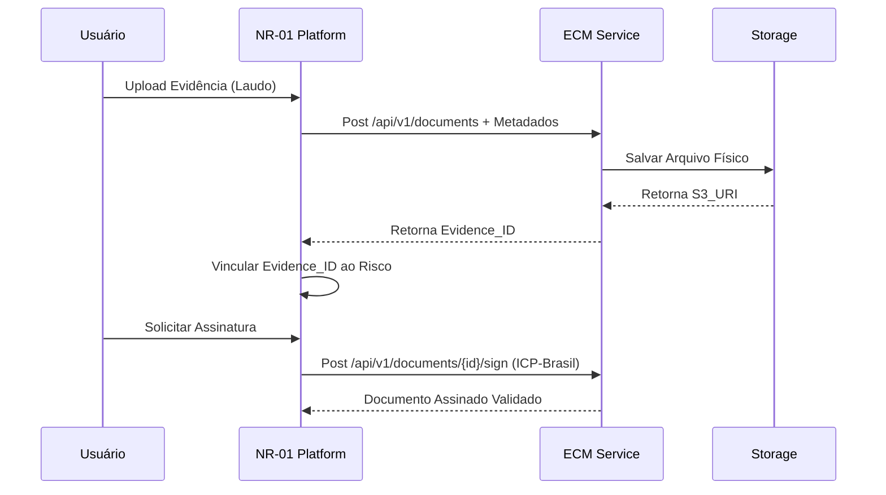

# ECM Integration — NR-01 Intelligence Platform

A integração com o Enterprise Content Management (ECM) garante que todas as evidências comprobatórias necessárias para a conformidade com a NR-01 sejam armazenadas de forma segura, versionada e auditável.

## Taxonomia Completa de Evidências

O sistema categoriza rigorosamente os documentos:

1.  **Fotos:** Evidências visuais de não conformidades ou implementações.
    *   *Metadados:* Geolocalização (Lat/Long), Timestamp confiável, Usuário, Formato (JPG/PNG).
2.  **Laudos Técnicos:** Documentos de especialistas (LTCAT, PCMSO, Laudos de Insalubridade).
    *   *Metadados:* CREA/CRM do profissional, Validade, Assinatura Digital obrigatória.
3.  **Checklists:** Inspeções de rotina preenchidas (ex: verificação de extintores, EPIs).
    *   *Metadados:* Setor, Responsável, Status (Aprovado/Reprovado).
4.  **Certificados:** Comprovantes de capacitação em NRs.
    *   *Metadados:* CPF do trabalhador, NR associada, Carga horária, Data de emissão, Validade.
5.  **Relatórios:** Documentos consolidados (PGR, GRO, RCA, Auditorias).
    *   *Metadados:* Período, Escopo (Unidade), Nível de confidencialidade.
6.  **Atas de Reunião:** Registros de CIPA, SESMT, etc.
    *   *Metadados:* Participantes, Data, Deliberações.

## Modelo de Metadados de Evidence (Schema)

```typescript
interface EvidenceDocument {
  id: string;
  sourceId: string; // ID do Risco, Plano de Ação ou Trabalhador
  type: 'PHOTO' | 'REPORT' | 'CHECKLIST' | 'CERTIFICATE' | 'MINUTES';
  fileName: string;
  mimeType: string;
  sizeBytes: number;
  uploadDate: Date;
  uploadedBy: string; // UserId
  metadata: Record<string, any>; // Metadados específicos do tipo
  retentionUntil?: Date;
  isSigned: boolean;
  confidentialityLevel: 'PUBLIC' | 'INTERNAL' | 'CONFIDENTIAL' | 'RESTRICTED';
}
```

## Política de Retenção (Compliance Legal)

A NR-01 e outras normas exigem guarda de documentos por períodos específicos:
-   **Laudos Ambientais (LTCAT/PGR):** Mínimo 20 anos.
-   **Prontuário Médico (PCMSO):** Mínimo 20 anos.
-   **Certificados de Treinamento:** 5 anos.
O ECM aplica políticas automáticas de deleção ou arquivamento profundo (Cold Storage) baseado no `retentionUntil`.

## Controle de Acesso e Assinatura Digital

-   A integração suporta **ICP-Brasil** para assinatura digital com validade jurídica.
-   Laudos restritos (como avaliações psicossociais) possuem nível `RESTRICTED`, acessíveis apenas por médicos do trabalho (perfis específicos do SESMT).
-   Toda visualização de documento `RESTRICTED` gera um log de auditoria.

## Fluxo de Gestão de Evidências



## API Contract (ECM $\leftrightarrow$ NR-01)

-   `POST /api/ecm/documents`: Faz upload de um novo arquivo.
-   `GET /api/ecm/documents/{id}`: Recupera link assinado para download.
-   `PUT /api/ecm/documents/{id}/metadata`: Atualiza metadados.
-   `POST /api/ecm/documents/search`: Busca complexa por metadados (ex: todos os laudos vencendo em 30 dias).
