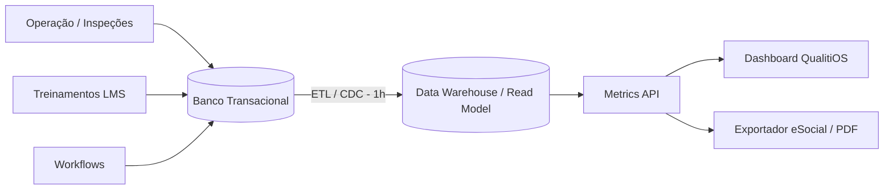

# Indicadores e Dashboard — NR-01 Intelligence Platform

Este documento especifica os Key Performance Indicators (KPIs) essenciais para o monitoramento contínuo da saúde e segurança ocupacional, em conformidade com as diretrizes da NR-01 e boas práticas globais.

## Definição Técnica dos KPIs

1.  **Acidentes com Afastamento (LTI - Lost Time Injury)**
    *   *Fórmula:* (Nº de acidentes com afastamento / Horas-homem trabalhadas) x 1.000.000
    *   *Periodicidade:* Mensal.
    *   *Meta:* 0. Benchmark Nacional Saúde: < 15.
2.  **Taxa de Quase-Acidentes (Near Miss Rate)**
    *   *Fórmula:* (Nº de quase-acidentes relatados / Nº total de trabalhadores) x 100
    *   *Periodicidade:* Mensal.
    *   *Meta:* Tendência de alta é inicialmente positiva (indica maturidade de relato).
3.  **Taxa de Severidade de Afastamentos (LTIS)**
    *   *Fórmula:* (Nº de dias perdidos / Horas-homem trabalhadas) x 1.000.000
    *   *Periodicidade:* Mensal.
    *   *Meta:* Redução contínua.
4.  **Conformidade de Treinamentos NRs**
    *   *Fórmula:* (Nº de treinamentos válidos / Nº total de treinamentos exigidos) x 100
    *   *Periodicidade:* Semanal.
    *   *Meta:* > 95%.
5.  **Resolução de Riscos Críticos**
    *   *Fórmula:* (Nº de riscos críticos mitigados para níveis aceitáveis / Nº de riscos críticos identificados) x 100
    *   *Periodicidade:* Mensal.
    *   *Meta:* 100%.
6.  **Ações Preventivas Vencidas (SLA Violado)**
    *   *Fórmula:* Contagem absoluta de itens de Planos de Ação (PGR) cujo prazo de conclusão expirou.
    *   *Periodicidade:* Diária.
    *   *Meta:* 0.
7.  **Taxa de Efetividade de Planos de Ação**
    *   *Fórmula:* (Nº de ações que não geraram reincidência de não-conformidade / Nº total de ações concluídas) x 100
    *   *Periodicidade:* Trimestral.
    *   *Meta:* > 90%.
8.  **Índice de Incidência Psicossocial**
    *   *Fórmula:* (Nº de denúncias ou queixas formais de assédio/violência/sobrecarga / Nº total de trabalhadores) x 100
    *   *Periodicidade:* Mensal.
    *   *Meta:* < 1%.
9.  **Taxa Geral de Absenteísmo (Saúde)**
    *   *Fórmula:* (Horas perdidas por atestado / Horas totais planejadas) x 100
    *   *Periodicidade:* Mensal.
    *   *Meta:* < 3%.
10. **Turnover Relacionado a Condições de Trabalho**
    *   *Fórmula:* (Nº de demissões onde entrevista de desligamento aponta clima/segurança como causa / Total de demissões) x 100
    *   *Periodicidade:* Semestral.
    *   *Meta:* < 5%.

## Layout do Dashboard Principal

A visualização principal (Executive View) é desenhada para rápida compreensão:

*   **Top Bar (Hero Cards):** Taxa de Frequência (Acidentes), Taxa de Gravidade (Afastamentos), % PGR Concluído, Ações Atrasadas (em vermelho piscante se > 0).
*   **Seção Esquerda (Gráficos de Tendência):**
    *   Line chart: Evolução mensal de Acidentes x Near Misses.
    *   Bar chart empilhado: Inventário de Riscos por Nível (Intolerável, Substancial, Moderado, Tolerável, Trivial).
*   **Seção Direita (Radar e Heatmap):**
    *   Radar chart: Conformidade de Treinamentos (NR-01, NR-06, NR-32, etc.).
    *   Heatmap Organizacional: Mapa de calor mostrando Setores vs Concentração de Riscos Críticos.
*   **Bottom Bar (Data Table):** Tabela "Top 5 Planos de Ação Atrasados" com responsável direto e botão de escalonamento BPM.

## Frequência, Alertas e Thresholds

*   Os dados são materializados no banco de leitura (CQRS) a cada 1 hora.
*   **Threshold Crítico:** Se "Ações Preventivas Vencidas" de um risco Intolerável > 0, dispara notificação Push/Email imediata para a Diretoria.
*   **Threshold de Atenção:** Se Absenteísmo mensal > 3%, aciona alerta amarelo no painel do SESMT para investigação de nexo causal.

## Fluxo de Dados (Data Flow)

