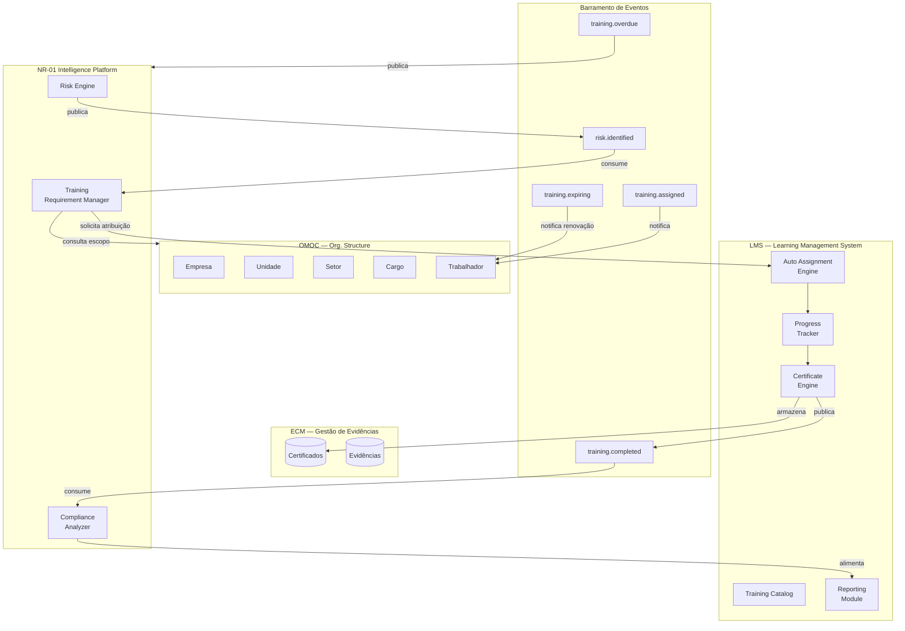
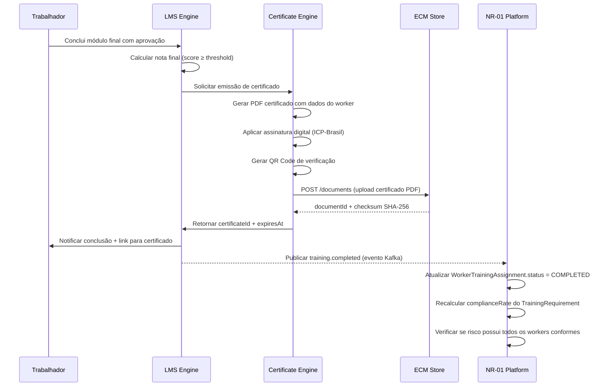
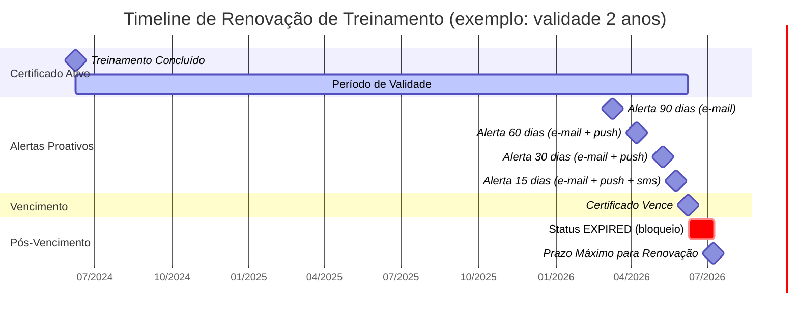
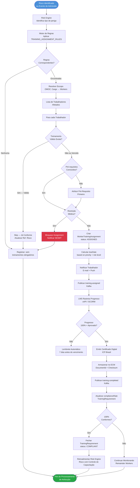

# LMS Integration — NR-01 Intelligence Platform

> **Módulo:** QualitiOS · NR-01 Intelligence Platform  
> **Fase:** 03 — Integrações  
> **Documento:** 10 — Integração com LMS (Learning Management System)  
> **Versão:** 1.0.0  
> **Data:** 2026-06-08  
> **Status:** Aprovado para Implementação  

---

## Sumário

1. [Visão Geral da Integração LMS](#1-visão-geral-da-integração-lms)
2. [Mapeamento de NRs para Trilhas de Treinamento](#2-mapeamento-de-nrs-para-trilhas-de-treinamento)
3. [Modelo de Dados — TrainingRequirement](#3-modelo-de-dados--trainingrequirement)
4. [Lógica de Atribuição Automática de Treinamentos](#4-lógica-de-atribuição-automática-de-treinamentos)
5. [Integração de Certificados e Evidências](#5-integração-de-certificados-e-evidências)
6. [Controle de Validade e Renovação Automática](#6-controle-de-validade-e-renovação-automática)
7. [Contrato de API — LMS ↔ NR-01](#7-contrato-de-api--lms--nr-01)
8. [Diagrama do Fluxo de Atribuição](#8-diagrama-do-fluxo-de-atribuição)
9. [Relatório de Conformidade de Capacitação](#9-relatório-de-conformidade-de-capacitação)
10. [Referências](#10-referências)

---

## 1. Visão Geral da Integração LMS

### 1.1 Propósito

A integração entre o módulo **NR-01 Intelligence Platform** e o **LMS (Learning Management System)** do QualitiOS estabelece o elo obrigatório entre o **gerenciamento de riscos ocupacionais** e a **capacitação dos trabalhadores**, conforme determinado pela NR-01/2024 e demais Normas Regulamentadoras aplicáveis.

Quando o Risk Engine identifica um risco para um conjunto de trabalhadores (via escopo organizacional do OMOC), o sistema automaticamente verifica os treinamentos necessários para os cargos expostos, atribui trilhas de aprendizado, monitora a conclusão, coleta evidências de certificação e retroalimenta os indicadores de conformidade de capacitação.

### 1.2 Arquitetura de Integração



### 1.3 Princípios de Design

| Princípio | Implementação |
|-----------|---------------|
| **Atribuição Automática** | Regras declarativas baseadas em cargo, setor e nível de risco |
| **Rastreabilidade Total** | Cada treinamento vinculado ao risco que o gerou |
| **Conformidade por Design** | Sistema impede workflows sem treinamentos obrigatórios concluídos |
| **Renovação Proativa** | Alertas 90, 60 e 30 dias antes do vencimento |
| **Evidências Auditáveis** | Certificados armazenados no ECM com hash de integridade |
| **xAPI Compliance** | Suporte ao padrão xAPI (Tin Can) para rastreamento granular |

---

## 2. Mapeamento de NRs para Trilhas de Treinamento

### 2.1 NR-01 — Saúde e Segurança no Trabalho: Fundamentos

**Código da Trilha:** `TRAIL-NR01-FUND-001`

| Atributo | Valor |
|----------|-------|
| **Nome Oficial** | Gerenciamento de Riscos Ocupacionais — NR-01/2024 |
| **Carga Horária Total** | 8 horas |
| **Modalidade** | E-learning + Presencial (4h + 4h) |
| **Frequência de Renovação** | Anual |
| **Público-Alvo** | Todos os trabalhadores (CLT, terceiros, estagiários) |
| **Nível** | Básico |
| **Pré-requisitos** | Nenhum |
| **Responsável pela Capacitação** | SESMT ou Técnico de Segurança do Trabalho |
| **Base Legal** | NR-01 itens 1.4, 1.5 e 1.6 (atualização 2024) |

**Módulos da Trilha NR-01 Fundamentos:**

| # | Módulo | Carga Horária | Formato | Avaliação |
|---|--------|---------------|---------|-----------|
| 1 | Introdução à NR-01 e ao PGR | 1h | E-learning | Quiz 70% |
| 2 | Identificação de Perigos e Riscos | 1,5h | E-learning | Quiz 70% |
| 3 | Hierarquia de Controles | 1h | E-learning | Quiz 70% |
| 4 | Direitos e Deveres do Trabalhador | 0,5h | E-learning | Quiz 70% |
| 5 | Práticas de SST no Trabalho Diário | 2h | Presencial | Prova 80% |
| 6 | Comunicação de Riscos e Near Miss | 1h | Presencial | Participação |
| 7 | Avaliação Final | 1h | Presencial | Prova 80% |

---

### 2.2 NR-06 — EPI: Equipamentos de Proteção Individual

**Código da Trilha:** `TRAIL-NR06-EPI-001`

| Atributo | Valor |
|----------|-------|
| **Nome Oficial** | Seleção, Uso e Manutenção de EPIs — NR-06 |
| **Carga Horária Total** | 4 horas |
| **Modalidade** | Presencial (obrigatório demonstração prática) |
| **Frequência de Renovação** | Anual ou a cada troca de função |
| **Público-Alvo** | Trabalhadores com obrigatoriedade de uso de EPI conforme PPRA/PGR |
| **Nível** | Básico-Operacional |
| **Pré-requisitos** | TRAIL-NR01-FUND-001 |
| **Base Legal** | NR-06 itens 6.3, 6.4, 6.5 |

**Módulos da Trilha NR-06:**

| # | Módulo | Carga Horária | Formato | Avaliação |
|---|--------|---------------|---------|-----------|
| 1 | Tipos de EPIs e suas aplicações | 0,5h | E-learning | Quiz 70% |
| 2 | Seleção do EPI correto por risco | 0,5h | E-learning | Quiz 70% |
| 3 | Donning & Doffing — Técnica correta | 1h | Presencial | Demonstração |
| 4 | Higienização e manutenção de EPIs | 0,5h | Presencial | Demonstração |
| 5 | CA (Certificado de Aprovação) — como verificar | 0,5h | E-learning | Quiz 70% |
| 6 | Recusa do uso de EPI — aspectos legais | 0,5h | E-learning | Quiz 70% |
| 7 | Avaliação prática | 0,5h | Presencial | Prova 80% |

**Subclassificações por tipo de EPI:**

| Subcategoria | Carga Adicional | Gatilho de Atribuição |
|-------------|-----------------|----------------------|
| NR-06 + Proteção Respiratória (semimáscara/máscara completa) | +2h | Exposição a agentes químicos/biológicos |
| NR-06 + Proteção para Trabalho em Altura | +1h | Risco de queda (ver NR-35) |
| NR-06 + EPI para Elétrica (luva isolante) | +2h | Atividade com risco elétrico (ver NR-10) |
| NR-06 + Proteção Auditiva Moldada | +1h | NPS > 85 dB(A) |

---

### 2.3 NR-10 — Segurança em Instalações Elétricas

**Código da Trilha:** `TRAIL-NR10-ELET-001`

| Atributo | Valor |
|----------|-------|
| **Nome Oficial** | Segurança em Instalações e Serviços em Eletricidade — NR-10 |
| **Carga Horária Total** | 40 horas (Básico) / 40 horas adicionais para Alta Tensão |
| **Modalidade** | Presencial obrigatório (prática supervisionada) |
| **Frequência de Renovação** | Bienal (a cada 2 anos) |
| **Público-Alvo** | Eletricistas, técnicos eletrotécnicos, engenheiros eletricistas, profissionais que trabalham em proximidade com sistemas elétricos |
| **Nível** | Avançado — certificação obrigatória |
| **Pré-requisitos** | TRAIL-NR01-FUND-001 + TRAIL-NR06-EPI-001 |
| **Instrutor Habilitado** | Exigido profissional habilitado pelo CREA |
| **Base Legal** | NR-10 itens 10.8, 10.9 |

**Módulos da Trilha NR-10 Básico (40h):**

| # | Módulo | Carga Horária | Formato |
|---|--------|---------------|---------|
| 1 | Fundamentos de Eletricidade e Riscos | 4h | Presencial |
| 2 | Normas Técnicas e Legislação | 4h | Presencial |
| 3 | Análise de Risco Elétrico | 4h | Presencial |
| 4 | Medidas de Controle: Distâncias de Segurança | 4h | Presencial |
| 5 | Bloqueio e Etiquetagem (LOTO) | 4h | Presencial + Prática |
| 6 | EPIs para Eletricidade | 4h | Presencial + Prática |
| 7 | Primeiros Socorros — Eletrocussão | 4h | Presencial + Prática |
| 8 | Documentação e Prontuário das Instalações | 4h | Presencial |
| 9 | Procedimentos de Trabalho Seguro | 4h | Presencial + Prática |
| 10 | Avaliação Teórica e Prática | 4h | Presencial |

**Complemento Alta Tensão (AT - adicional 40h):**

| # | Módulo | Carga Horária |
|---|--------|---------------|
| 1 | Riscos Específicos de Alta Tensão | 8h |
| 2 | Equipamentos de Proteção Coletiva para AT | 8h |
| 3 | Procedimentos de Manobra em AT | 8h |
| 4 | Manutenção em AT — Técnicas Avançadas | 8h |
| 5 | Avaliação Final AT | 8h |

---

### 2.4 NR-32 — Segurança em Serviços de Saúde

**Código da Trilha:** `TRAIL-NR32-SAUDE-001`

| Atributo | Valor |
|----------|-------|
| **Nome Oficial** | Segurança e Saúde no Trabalho em Serviços de Saúde — NR-32 |
| **Carga Horária Total** | 8 horas (inicial) + 4 horas (anual de atualização) |
| **Modalidade** | Presencial + E-learning |
| **Frequência de Renovação** | Anual (atualização) / A cada 5 anos (recertificação completa) |
| **Público-Alvo** | Profissionais de saúde (médicos, enfermeiros, técnicos de enfermagem, fisioterapeutas, laboratoristas, farmacêuticos, pessoal de limpeza hospitalar, lavanderia) |
| **Nível** | Específico — Setor de Saúde |
| **Pré-requisitos** | TRAIL-NR01-FUND-001 + TRAIL-NR06-EPI-001 |
| **Base Legal** | NR-32 itens 32.1, 32.2, 32.3 |

**Módulos da Trilha NR-32:**

| # | Módulo | Carga Horária | Público Específico |
|---|--------|---------------|--------------------|
| 1 | Riscos Biológicos em Serviços de Saúde | 1,5h | Todos |
| 2 | Precauções Padrão e Específicas | 1,5h | Todos |
| 3 | Resíduos de Serviços de Saúde (RSS) | 1h | Todos |
| 4 | Acidentes com Material Biológico | 1h | Todos |
| 5 | Vacinação Obrigatória — Comprovação | 0,5h | Todos |
| 6 | Segurança com Agentes Químicos Hospitalares | 1h | Limpeza, Lab, Farm |
| 7 | Segurança com Radiações Ionizantes | 0,5h | Radiologia, Oncologia |
| 8 | Ergonomia em Saúde — Movimentação de Pacientes | 1h | Enfermagem, Fisio |

**Subcategorias por função:**

| Subcategoria | Módulos Adicionais | Carga Adicional |
|-------------|-------------------|-----------------|
| NR-32 + Radiação (Radiologia/Oncologia) | Dosimetria, ALARA | +4h |
| NR-32 + Citotóxicos (Oncologia) | Manipulação segura, descarte | +4h |
| NR-32 + Emergências Biológicas | Protocolo exposição, notificação CVS | +2h |

---

### 2.5 NR-35 — Trabalho em Altura

**Código da Trilha:** `TRAIL-NR35-ALTURA-001`

| Atributo | Valor |
|----------|-------|
| **Nome Oficial** | Trabalho em Altura — NR-35 |
| **Carga Horária Total** | 8 horas |
| **Modalidade** | Presencial obrigatório (prática com equipamentos) |
| **Frequência de Renovação** | Bienal (a cada 2 anos) |
| **Público-Alvo** | Todo trabalhador que execute atividades em altura ≥ 2,0m do piso inferior |
| **Nível** | Operacional — certificação obrigatória |
| **Pré-requisitos** | TRAIL-NR01-FUND-001 + TRAIL-NR06-EPI-001 |
| **Aptidão Médica** | Exame médico admissional/periódico com aptidão para trabalho em altura (obrigatório antes do treinamento) |
| **Base Legal** | NR-35 itens 35.4, 35.5 |

**Módulos da Trilha NR-35:**

| # | Módulo | Carga Horária | Formato |
|---|--------|---------------|---------|
| 1 | Legislação e Normas para Trabalho em Altura | 1h | Teórico |
| 2 | Riscos de Queda e Seus Efeitos | 1h | Teórico |
| 3 | Sistemas de Proteção Coletiva (guarda-corpos, andaimes, redes) | 1h | Teórico + Prática |
| 4 | Sistemas de Proteção Individual (talabartes, conectores, ancoragens) | 2h | Prática Supervisionada |
| 5 | Inspeção de Equipamentos de Proteção | 1h | Prática |
| 6 | Plano de Resgate em Altura | 1h | Prática Simulada |
| 7 | Avaliação Teórica e Prática | 1h | Avaliação |

**Aptidão e Restrições:**

```
Condições que impedem o trabalho em altura (avaliação médica):
  - Epilepsia não controlada
  - Vertigem crônica
  - Distúrbios do equilíbrio
  - Acrofobia severa
  - Hipertensão não controlada grave
  - Uso de medicamentos com efeito sedativo
  - Distúrbios visuais graves não corrigidos
  
Sistema deve:
  → Bloquear atribuição de trabalho em altura para trabalhadores com restrição médica
  → Alertar o SESMT sobre a necessidade de avaliação médica antes do treinamento
  → Registrar a aptidão médica como pré-requisito no LMS
```

---

### 2.6 Treinamentos Psicossociais

**Código da Trilha:** `TRAIL-PSI-PREV-001`

Conforme NR-01/2024, a gestão de riscos psicossociais exige capacitação específica de todos os níveis hierárquicos. O QualitiOS agrupa esses treinamentos em três trilhas distintas.

#### 2.6.1 Prevenção e Combate ao Assédio

| Atributo | Valor |
|----------|-------|
| **Nome Oficial** | Prevenção e Combate ao Assédio Moral e Sexual |
| **Base Legal** | NR-01/2024 + Lei 14.457/2022 + Lei 9.029/1995 |
| **Carga Horária** | 4 horas (operacional) / 8 horas (gestores) |
| **Frequência** | Bienal (a cada 2 anos) |
| **Público** | Todos os trabalhadores |
| **Público Especial** | Líderes, gestores, RH — módulo adicional de 4h |

**Módulos:**

| # | Módulo | Público | Carga |
|---|--------|---------|-------|
| 1 | Conceito e tipos de assédio | Todos | 1h |
| 2 | Impactos na saúde mental e no trabalho | Todos | 0,5h |
| 3 | Canal de denúncia — como e quando usar | Todos | 0,5h |
| 4 | Responsabilidade do trabalhador na prevenção | Todos | 1h |
| 5 | Direitos da vítima e proteção ao denunciante | Todos | 1h |
| 6 | Responsabilidade legal do gestor (adicional) | Gestores | 2h |
| 7 | Como conduzir investigações (adicional) | RH + Jurídico | 2h |

#### 2.6.2 Gestão de Conflitos Interpessoais

| Atributo | Valor |
|----------|-------|
| **Nome Oficial** | Comunicação Não-Violenta e Gestão de Conflitos |
| **Base Legal** | NR-01/2024 — Gestão de Riscos Psicossociais |
| **Carga Horária** | 4 horas |
| **Frequência** | A cada 2 anos |
| **Público** | Todos os trabalhadores |

#### 2.6.3 Saúde Mental e Prevenção do Burnout

| Atributo | Valor |
|----------|-------|
| **Nome Oficial** | Saúde Mental no Trabalho — Reconhecimento e Prevenção |
| **Base Legal** | NR-01/2024 + Classificação Burnout na CID-11 (2022) |
| **Carga Horária** | 4 horas (todos) + 4h adicional para gestores |
| **Frequência** | Anual |
| **Público** | Todos os trabalhadores |

---

### 2.7 Tabela Consolidada de Trilhas de Treinamento

| Código | NR | Nome | CH | Renovação | Modalidade | Criticidade |
|--------|----|----|-----|-----------|------------|-------------|
| TRAIL-NR01-FUND-001 | NR-01 | Fundamentos de GRO | 8h | Anual | Híbrido | **Obrigatório Universal** |
| TRAIL-NR06-EPI-001 | NR-06 | Seleção e Uso de EPI | 4h | Anual | Presencial | **Obrigatório para Expostos** |
| TRAIL-NR10-ELET-001 | NR-10 | Segurança Elétrica (Básico) | 40h | Bienal | Presencial | **Obrigatório para Habilitados** |
| TRAIL-NR10-ELET-002 | NR-10 | Segurança Elétrica (AT) | 40h | Bienal | Presencial | **Obrigatório para AT** |
| TRAIL-NR32-SAUDE-001 | NR-32 | Segurança em Saúde | 8h | Anual | Híbrido | **Obrigatório — Saúde** |
| TRAIL-NR35-ALTURA-001 | NR-35 | Trabalho em Altura | 8h | Bienal | Presencial | **Obrigatório para Altura** |
| TRAIL-PSI-PREV-001 | NR-01 | Prevenção de Assédio | 4-8h | Bienal | Híbrido | **Obrigatório Universal** |
| TRAIL-PSI-CONF-001 | NR-01 | Gestão de Conflitos | 4h | Bienal | E-learning | **Recomendado** |
| TRAIL-PSI-MENT-001 | NR-01 | Saúde Mental | 4-8h | Anual | Híbrido | **Obrigatório Universal** |

---

## 3. Modelo de Dados — TrainingRequirement

### 3.1 Entidade TrainingRequirement

```typescript
/**
 * TrainingRequirement — Entidade de Domínio
 * Representa um requisito de treinamento vinculado a um risco, cargo ou NR.
 */
interface TrainingRequirement {
  // Identificação
  id: string;                          // UUID v4
  code: string;                        // Ex: "TR-2026-001842"
  
  // Vínculo com origem
  sourceType: 'RISK' | 'NR' | 'INCIDENT' | 'AUDIT' | 'MANUAL';
  sourceId: string;                    // ID do risco, incidente, etc.
  sourceDescription: string;           // Descrição do motivo
  
  // Treinamento
  trainingTrailId: string;             // ID da trilha no LMS
  trainingTrailCode: string;           // Ex: "TRAIL-NR35-ALTURA-001"
  trainingTrailName: string;
  workloadHours: number;               // Carga horária total
  modality: TrainingModality;
  
  // Escopo organizacional (via OMOC)
  organizationalScope: {
    empresaId: string;
    unidadeId?: string;                // null = todas as unidades
    setorId?: string;                  // null = todos os setores
    cargoId?: string;                  // null = todos os cargos
    workerId?: string;                 // null = todos da scope
  };
  
  // Obrigatoriedade
  mandatoryLevel: 'MANDATORY' | 'RECOMMENDED' | 'OPTIONAL';
  legalBasis: string[];                // Ex: ["NR-35 item 35.4", "NR-01 item 1.5"]
  
  // Prazos
  assignedAt: Date;
  dueDateInitial: Date;                // Prazo para primeira conclusão
  dueDateRecurrent: Date;              // Próximo vencimento (renovação)
  renewalPeriodMonths: number;         // Periodicidade de renovação
  
  // Status
  status: TrainingRequirementStatus;
  
  // Workers afetados (desnormalizado para performance)
  affectedWorkerCount: number;
  
  // Conformidade
  compliantWorkerCount: number;        // Trabalhadores com treinamento em dia
  complianceRate: number;              // (compliant / affected) × 100
  
  // Metadados
  createdBy: string;                   // userId ou 'SYSTEM'
  createdAt: Date;
  updatedAt: Date;
  version: number;                     // Controle de concorrência otimista
}

type TrainingModality = 
  | 'E_LEARNING'
  | 'PRESENCIAL'
  | 'HIBRIDO'
  | 'EAD_SINCRONO';

type TrainingRequirementStatus =
  | 'DRAFT'                            // Rascunho
  | 'ACTIVE'                           // Ativo — atribuindo aos workers
  | 'IN_PROGRESS'                      // Treinamentos em andamento
  | 'COMPLIANT'                        // 100% dos workers conformes
  | 'PARTIALLY_COMPLIANT'             // > 50% conformes
  | 'NON_COMPLIANT'                    // < 50% conformes
  | 'OVERDUE'                          // Prazo vencido
  | 'CANCELLED'                        // Cancelado
  | 'SUPERSEDED';                      // Substituído por versão mais recente
```

### 3.2 Entidade WorkerTrainingAssignment

```typescript
/**
 * WorkerTrainingAssignment — Entidade de Domínio
 * Registro individual de atribuição de treinamento a um trabalhador.
 */
interface WorkerTrainingAssignment {
  id: string;                          // UUID v4
  requirementId: string;               // FK → TrainingRequirement
  workerId: string;                    // FK → OMOC Worker
  workerName: string;                  // Desnormalizado
  workerCpf: string;                   // Desnormalizado (mascarado)
  cargoId: string;
  setorId: string;
  unidadeId: string;
  
  trainingTrailId: string;
  
  // Status do indivíduo
  status: AssignmentStatus;
  
  // Datas chave
  assignedAt: Date;
  startedAt?: Date;
  completedAt?: Date;
  dueDate: Date;
  expiresAt?: Date;                    // Data de validade do certificado
  
  // Progresso
  progressPercentage: number;          // 0-100
  completedModules: string[];          // IDs dos módulos concluídos
  totalModules: number;
  
  // Resultado
  finalScore?: number;                 // Pontuação final (0-100)
  passed?: boolean;                    // true se ≥ threshold
  attempts: number;                    // Número de tentativas
  maxAttempts: number;
  
  // Certificado
  certificateId?: string;              // FK → ECM Document
  certificateNumber?: string;          // Número do certificado
  
  // xAPI / SCORM tracking
  lrsStatementId?: string;             // ID na Learning Record Store
  
  // Controle
  notificationsSent: NotificationRecord[];
  createdAt: Date;
  updatedAt: Date;
}

type AssignmentStatus =
  | 'ASSIGNED'                         // Atribuído, não iniciado
  | 'NOTIFIED'                         // Notificado ao worker
  | 'IN_PROGRESS'                      // Em andamento
  | 'PENDING_EVALUATION'               // Aguardando avaliação presencial
  | 'COMPLETED'                        // Concluído com êxito
  | 'FAILED'                           // Reprovado (score < threshold)
  | 'EXPIRED'                          // Certificado vencido
  | 'WAIVED'                           // Dispensado com justificativa
  | 'BLOCKED';                         // Bloqueado (restrição médica, etc.)

interface NotificationRecord {
  sentAt: Date;
  channel: 'EMAIL' | 'PUSH' | 'SMS';
  type: 'ASSIGNMENT' | 'REMINDER_30D' | 'REMINDER_7D' | 'OVERDUE' | 'EXPIRING_90D' | 'EXPIRING_30D';
  delivered: boolean;
}
```

---

## 4. Lógica de Atribuição Automática de Treinamentos

### 4.1 Regras de Atribuição por Risco

O sistema aplica um motor de regras baseado em **tipos de perigo** identificados no PGR para determinar quais trilhas de treinamento devem ser atribuídas aos trabalhadores expostos:

```typescript
const TRAINING_ASSIGNMENT_RULES: AssignmentRule[] = [
  {
    ruleId: 'RULE-001',
    name: 'Trabalho em Altura ≥ 2m',
    condition: {
      hazardType: 'FISICO',
      hazardSubtype: 'QUEDA_ALTURA',
      riskLevel: ['MEDIO', 'ALTO', 'CRITICO']
    },
    assignTrails: ['TRAIL-NR35-ALTURA-001', 'TRAIL-NR06-EPI-001'],
    prerequisites: ['TRAIL-NR01-FUND-001'],
    mandatoryLevel: 'MANDATORY',
    dueDays: 30,
    requiresMedicalClearance: true
  },
  {
    ruleId: 'RULE-002',
    name: 'Risco Elétrico — Baixa Tensão',
    condition: {
      hazardType: 'ELETRICO',
      hazardSubtype: 'CONTATO_ELETRICO',
      voltage: '<= 1000V'
    },
    assignTrails: ['TRAIL-NR10-ELET-001', 'TRAIL-NR06-EPI-001'],
    mandatoryLevel: 'MANDATORY',
    dueDays: 15,
    requiresProfessionalCertification: true
  },
  {
    ruleId: 'RULE-003',
    name: 'Risco Elétrico — Alta Tensão',
    condition: {
      hazardType: 'ELETRICO',
      hazardSubtype: 'CONTATO_ELETRICO',
      voltage: '> 1000V'
    },
    assignTrails: ['TRAIL-NR10-ELET-001', 'TRAIL-NR10-ELET-002', 'TRAIL-NR06-EPI-001'],
    mandatoryLevel: 'MANDATORY',
    dueDays: 15
  },
  {
    ruleId: 'RULE-004',
    name: 'Ruído Ocupacional ≥ 80 dB(A)',
    condition: {
      hazardType: 'FISICO',
      hazardSubtype: 'RUIDO',
      exposureLevel: '>= 80'
    },
    assignTrails: ['TRAIL-NR06-EPI-001'],
    mandatoryLevel: 'MANDATORY',
    dueDays: 30
  },
  {
    ruleId: 'RULE-005',
    name: 'Agentes Biológicos — Serviços de Saúde',
    condition: {
      hazardType: 'BIOLOGICO',
      sector: ['SAUDE', 'LABORATORIO', 'LIMPEZA_HOSPITALAR']
    },
    assignTrails: ['TRAIL-NR32-SAUDE-001', 'TRAIL-NR06-EPI-001'],
    mandatoryLevel: 'MANDATORY',
    dueDays: 15
  },
  {
    ruleId: 'RULE-006',
    name: 'Risco Psicossocial — Assédio',
    condition: {
      hazardType: 'PSICOSSOCIAL',
      hazardSubtype: ['ASSEDIO_MORAL', 'ASSEDIO_SEXUAL', 'VIOLENCIA']
    },
    assignTrails: ['TRAIL-PSI-PREV-001', 'TRAIL-PSI-MENT-001'],
    mandatoryLevel: 'MANDATORY',
    dueDays: 30
  },
  {
    ruleId: 'RULE-007',
    name: 'Risco Universal — NR-01 Fundamentos',
    condition: {
      riskLevel: ['BAIXO', 'MEDIO', 'ALTO', 'CRITICO'],
      scope: 'ALL_WORKERS'
    },
    assignTrails: ['TRAIL-NR01-FUND-001'],
    mandatoryLevel: 'MANDATORY',
    dueDays: 60,
    applyOnAdmission: true
  },
  {
    ruleId: 'RULE-008',
    name: 'Acidente de Trabalho — Reciclagem Obrigatória',
    condition: {
      eventType: 'ACCIDENT',
      affectedWorkerOrPeer: true
    },
    assignTrails: ['TRAIL-NR01-FUND-001', 'TRAIL-NR06-EPI-001'],
    mandatoryLevel: 'MANDATORY',
    dueDays: 15,
    priority: 'HIGH'
  }
];
```

### 4.2 Algoritmo de Atribuição

```
FUNCTION atribuirTreinamentos(risco: Risk, trabalhadores: Worker[]):

  1. Para cada trabalhador em trabalhadores:
     a. Obter perfil do cargo (OMOC) → lista de funções e atividades
     b. Cruzar riscos identificados com REGRAS DE ATRIBUIÇÃO
     c. Para cada regra que match:
        i. Verificar se treinamento já atribuído e VÁLIDO → skip
        ii. Verificar pré-requisitos não concluídos → atribuir pré-req antes
        iii. Verificar restrição médica → se existe, bloquear + alertar SESMT
        iv. Criar WorkerTrainingAssignment com status ASSIGNED
        v. Calcular dueDate = hoje + rule.dueDays
     d. Emitir evento training.assigned para cada assignment criado

  2. Atualizar TrainingRequirement.affectedWorkerCount
  3. Publicar training.batch.assigned com totais

  IDEMPOTÊNCIA:
    - Antes de criar, verificar se já existe assignment ATIVO para
      mesmo (workerId × trainingTrailId) com expiresAt > hoje
    - Se existir: atualizar requirementId, não recriar
```

### 4.3 Priorização de Atribuições

| Prioridade | Critério | Prazo Máximo | Notificação |
|------------|----------|-------------|-------------|
| **P0 — Emergencial** | Acidente com vítima no setor | 7 dias | SMS + Push + E-mail |
| **P1 — Crítico** | Risco Crítico identificado | 15 dias | Push + E-mail imediato |
| **P2 — Alto** | Risco Alto identificado | 30 dias | E-mail + Push |
| **P3 — Médio** | Risco Médio / Renovação vencida | 60 dias | E-mail |
| **P4 — Baixo** | Treinamento complementar | 90 dias | E-mail semanal |
| **P5 — Admissional** | Trabalhador recém-admitido | Antes de iniciar atividade | E-mail + Onboarding |

---

## 5. Integração de Certificados e Evidências

### 5.1 Fluxo de Certificação



### 5.2 Estrutura do Certificado Digital

```json
{
  "certificateId": "cert-uuid-here",
  "certificateNumber": "QUALITIOS-2026-00847",
  "version": "1.0",
  "issuedAt": "2026-06-08T14:30:00-03:00",
  "expiresAt": "2027-06-08T23:59:59-03:00",
  "worker": {
    "workerId": "worker-uuid",
    "name": "João Silva Santos",
    "cpf": "***.***.***-45",
    "registration": "MAT-001234",
    "cargo": "Eletricista de Manutenção",
    "unidade": "Unidade São Paulo — Fábrica Norte"
  },
  "training": {
    "trailCode": "TRAIL-NR10-ELET-001",
    "trailName": "Segurança em Instalações e Serviços em Eletricidade — NR-10 Básico",
    "workloadHours": 40,
    "modality": "PRESENCIAL",
    "finalScore": 88.5,
    "passThreshold": 70.0,
    "instructor": {
      "name": "Eng. Carlos Pereira",
      "crea": "SP-123456-D",
      "qualification": "Engenheiro de Segurança do Trabalho"
    },
    "completedAt": "2026-06-08T14:00:00-03:00",
    "trainingLocation": "Centro de Treinamento SST — Unidade SP"
  },
  "legalBasis": ["NR-10 item 10.8", "NR-10 item 10.9"],
  "issuer": {
    "organizationName": "QualitiOS — Gestão Integrada de SST",
    "cnpj": "XX.XXX.XXX/0001-XX",
    "responsibleTechnician": "Eng. Maria Santos — CREA SP-987654-D"
  },
  "digital": {
    "signatureAlgorithm": "RSA-SHA256",
    "certificateChain": "ICP-Brasil → AC Raiz → AC Intermediária → Certificado",
    "qrCodeUrl": "https://verificar.qualitios.com.br/cert/QUALITIOS-2026-00847",
    "sha256Checksum": "a1b2c3d4e5f6789012345678901234567890abcdef1234567890abcdef123456",
    "signedAt": "2026-06-08T14:30:05-03:00"
  },
  "ecm": {
    "documentId": "ecm-cert-uuid",
    "storageClass": "CERTIFICATE",
    "retentionYears": 20,
    "accessLevel": "RESTRICTED"
  }
}
```

### 5.3 Upload de Evidências Externas

Para treinamentos realizados externamente (fora do LMS), o sistema aceita o upload manual de certificados:

```
Tipos de Evidência Aceitos:
  - PDF do certificado (máximo 10MB)
  - Foto do certificado físico (JPEG/PNG, máximo 5MB)
  - Lista de presença assinada digitalizada (PDF, máximo 20MB)
  - Declaração de conclusão em papel timbrado da empresa treinadora

Metadados obrigatórios no upload manual:
  - workerIds[] (lista de trabalhadores contemplados)
  - trainingTrailCode (trilha correspondente)
  - completedAt (data de conclusão)
  - instructor.name + instructor.credential
  - workloadHours
  - externalCertificateNumber
  - trainingInstitution

Validação:
  → SESMT revisa e aprova/rejeita upload manual
  → SLA de aprovação: 3 dias úteis
  → Após aprovação: sistema emite certificado interno (wrapper) com ref. externa
```

---

## 6. Controle de Validade e Renovação Automática

### 6.1 Cronograma de Alertas de Renovação



### 6.2 Matriz de Alertas por Periodicidade

| Periodicidade de Renovação | 90 dias | 60 dias | 30 dias | 15 dias | 7 dias | Vencimento | Pós-Vencimento |
|---------------------------|:-------:|:-------:|:-------:|:-------:|:------:|:----------:|:--------------:|
| Anual | ✅ Email | ✅ Email | ✅ Email+Push | ✅ Email+Push | ✅ SMS | ✅ Todos | Diário |
| Bienal | ✅ Email | ✅ Email | ✅ Email+Push | ✅ Email+Push | ✅ SMS | ✅ Todos | Diário |
| Quinquenal | ❌ | ✅ Email | ✅ Email+Push | ✅ Email+Push | ✅ SMS | ✅ Todos | Semanal |

### 6.3 Regras de Bloqueio por Vencimento

```
QUANDO certificado_expires_at < today:
  
  SE treinamento_tipo IN ['NR-35', 'NR-10', 'NR-32']:
    → status = EXPIRED
    → Bloquear acesso às atividades de risco associadas (via OMOC)
    → Notificar supervisor e SESMT imediatamente
    → Criar TrainingRequirement com prioridade P1
    → Gerar alerta no Dashboard como "TREINAMENTO_CRITICO_VENCIDO"
  
  SE treinamento_tipo IN ['NR-01-FUND', 'NR-06']:
    → status = EXPIRED  
    → Notificar supervisor e SESMT
    → Criar TrainingRequirement com prioridade P2
    → Exibir no Dashboard como "TREINAMENTO_VENCIDO"
  
  SE treinamento_tipo IN ['PSI-PREV', 'PSI-MENT']:
    → status = EXPIRED
    → Notificar RH e SESMT
    → Criar TrainingRequirement com prioridade P3

GRACE PERIOD (Período de Carência):
  - NR-35, NR-10: 0 dias (bloqueio imediato)
  - NR-32: 7 dias corridos
  - NR-01-FUND, NR-06: 30 dias corridos
  - Treinamentos Psicossociais: 30 dias corridos
```

### 6.4 Atribuição Automática de Renovação

```json
{
  "renewalPolicy": {
    "triggerDaysBeforeExpiry": 90,
    "autoAssignTrail": true,
    "preserveInstructor": false,
    "allowSelfScheduling": true,
    "schedulingWindowDays": 60,
    "reminderFrequency": {
      "90days": ["EMAIL"],
      "60days": ["EMAIL"],
      "30days": ["EMAIL", "PUSH"],
      "15days": ["EMAIL", "PUSH"],
      "7days": ["EMAIL", "PUSH", "SMS"],
      "expired": ["EMAIL", "PUSH", "SMS"],
      "postExpiry": ["EMAIL", "PUSH"]
    }
  }
}
```

---

## 7. Contrato de API — LMS ↔ NR-01

### 7.1 Endpoints NR-01 → LMS

#### `POST /lms/training-requirements` — Criar Requisito de Treinamento

**Request:**
```json
{
  "sourceType": "RISK",
  "sourceId": "risk-uuid-here",
  "trainingTrailCode": "TRAIL-NR35-ALTURA-001",
  "organizationalScope": {
    "empresaId": "emp-001",
    "unidadeId": "und-042",
    "setorId": "set-015",
    "cargoId": "cargo-023"
  },
  "mandatoryLevel": "MANDATORY",
  "legalBasis": ["NR-35 item 35.4", "NR-35 item 35.5"],
  "dueDate": "2026-07-08T23:59:59-03:00",
  "priority": "P1",
  "autoAssignWorkers": true
}
```

**Response 201 Created:**
```json
{
  "requirementId": "req-uuid-here",
  "trainingTrailId": "trail-uuid-here",
  "affectedWorkerCount": 12,
  "assignmentsCreated": 12,
  "assignmentsSkipped": 0,
  "skippedReasons": [],
  "status": "ACTIVE",
  "complianceRate": 0.0
}
```

---

#### `GET /lms/training-requirements/{requirementId}/compliance` — Conformidade

**Response 200 OK:**
```json
{
  "requirementId": "req-uuid-here",
  "trainingTrailCode": "TRAIL-NR35-ALTURA-001",
  "complianceRate": 75.0,
  "affectedWorkerCount": 12,
  "compliantCount": 9,
  "inProgressCount": 2,
  "notStartedCount": 1,
  "expiredCount": 0,
  "workers": [
    {
      "workerId": "worker-001",
      "workerName": "João Silva",
      "status": "COMPLETED",
      "completedAt": "2026-06-01T14:00:00-03:00",
      "expiresAt": "2028-06-01T23:59:59-03:00",
      "certificateId": "cert-001"
    },
    {
      "workerId": "worker-002",
      "workerName": "Maria Santos",
      "status": "IN_PROGRESS",
      "progressPercentage": 62,
      "dueDate": "2026-07-08T23:59:59-03:00"
    }
  ]
}
```

---

#### `GET /lms/workers/{workerId}/training-profile` — Perfil de Treinamento do Trabalhador

**Response 200 OK:**
```json
{
  "workerId": "worker-001",
  "workerName": "João Silva Santos",
  "cargoId": "cargo-023",
  "cargoName": "Eletricista de Manutenção",
  "overallComplianceRate": 85.7,
  "trainingProfile": {
    "MANDATORY": {
      "total": 5,
      "compliant": 4,
      "expired": 0,
      "notStarted": 1
    },
    "RECOMMENDED": {
      "total": 3,
      "compliant": 2,
      "notStarted": 1
    }
  },
  "activeAssignments": [
    {
      "assignmentId": "assign-001",
      "trainingTrailCode": "TRAIL-NR10-ELET-001",
      "trailName": "Segurança Elétrica — NR-10 Básico",
      "status": "COMPLETED",
      "completedAt": "2025-03-15T16:00:00-03:00",
      "expiresAt": "2027-03-15T23:59:59-03:00",
      "certificateId": "cert-nr10-001",
      "daysUntilExpiry": 280
    },
    {
      "assignmentId": "assign-002",
      "trainingTrailCode": "TRAIL-NR01-FUND-001",
      "trailName": "Fundamentos de GRO — NR-01",
      "status": "ASSIGNED",
      "dueDate": "2026-07-08T23:59:59-03:00",
      "progressPercentage": 0
    }
  ],
  "expiredTrainings": [],
  "blockedActivities": []
}
```

---

### 7.2 Endpoints LMS → NR-01 (Callbacks via Kafka)

| Evento Kafka | Tópico | Trigger | Ação no NR-01 |
|--------------|--------|---------|---------------|
| `training.assigned` | `lms.assignments` | Assignment criado | Registrar no log de auditoria |
| `training.started` | `lms.progress` | Worker inicia treinamento | Atualizar status para IN_PROGRESS |
| `training.completed` | `lms.completions` | Worker conclui com aprovação | Atualizar status + emitir certificado |
| `training.failed` | `lms.completions` | Worker reprova | Registrar falha + nova tentativa |
| `training.expiring` | `lms.renewals` | 90/60/30/15 dias antes | Alertar + criar renewal assignment |
| `training.expired` | `lms.renewals` | Certificado venceu | Bloquear + criar P1 requirement |
| `training.overdue` | `lms.sla` | Prazo de conclusão vencido | Alertar + escalonar no BPM |
| `certificate.issued` | `lms.certificates` | Certificado emitido | Registrar ID ECM no assignment |

**Payload padrão de training.completed:**
```json
{
  "eventId": "lms-evt-001",
  "eventType": "training.completed",
  "occurredAt": "2026-06-08T14:30:00-03:00",
  "payload": {
    "assignmentId": "assign-001",
    "requirementId": "req-uuid-here",
    "workerId": "worker-001",
    "trainingTrailCode": "TRAIL-NR10-ELET-001",
    "finalScore": 88.5,
    "passed": true,
    "completedAt": "2026-06-08T14:00:00-03:00",
    "certificateId": "cert-nr10-001",
    "certificateNumber": "QUALITIOS-2026-00847",
    "expiresAt": "2028-06-08T23:59:59-03:00",
    "ecmDocumentId": "ecm-cert-uuid"
  }
}
```

---

## 8. Diagrama do Fluxo de Atribuição



---

## 9. Relatório de Conformidade de Capacitação

### 9.1 Estrutura do Relatório

O **Relatório de Conformidade de Capacitação** é o documento central para comprovação perante a fiscalização do MTE e auditorias internas/externas. É gerado automaticamente pelo NR-01 Intelligence Platform em formato PDF (via ECM) e também disponível em Excel e JSON.

### 9.2 Conteúdo do Relatório

**Cabeçalho:**
```
RELATÓRIO DE CONFORMIDADE DE CAPACITAÇÃO — NR-01/2024
Empresa: [Nome da Empresa] | CNPJ: XX.XXX.XXX/0001-XX
Unidade: [Nome da Unidade] | Período: [MM/AAAA]
Responsável Técnico: [Nome] — CREA/CRN [número]
Data de Emissão: [DD/MM/AAAA HH:MM]
```

**Seção 1 — Resumo Executivo:**

| Indicador | Valor | Meta | Status |
|-----------|-------|------|--------|
| Total de Trabalhadores | 234 | — | — |
| Trabalhadores com Todos os Treinamentos em Dia | 198 | 100% | ⚠️ 84,6% |
| Treinamentos Obrigatórios Vencidos | 8 | 0 | ❌ |
| Treinamentos em Andamento | 28 | — | ✅ |
| Certificados Emitidos no Período | 47 | — | — |
| Horas de Treinamento no Período | 1.240h | 4h/worker/mês | ✅ |

**Seção 2 — Conformidade por NR:**

| Norma | Trabalhadores Obrigados | Conformes | Vencidos | % Conformidade |
|-------|------------------------|-----------|----------|----------------|
| NR-01 Fundamentos | 234 | 220 | 5 | 94,0% |
| NR-06 EPI | 156 | 149 | 3 | 95,5% |
| NR-10 Básico | 23 | 23 | 0 | 100% |
| NR-10 Alta Tensão | 8 | 8 | 0 | 100% |
| NR-32 Saúde | 45 | 40 | 0 | 88,9% |
| NR-35 Altura | 34 | 34 | 0 | 100% |
| Prevenção de Assédio | 234 | 195 | 0 | 83,3% |
| Saúde Mental | 234 | 180 | 0 | 76,9% |

**Seção 3 — Trabalhadores com Pendências:**

Lista detalhada de cada trabalhador com treinamentos vencidos ou pendentes, contendo:
- Nome completo e matrícula
- Cargo e setor
- Treinamento pendente
- Data de vencimento / prazo
- Status atual
- Responsável pelo acompanhamento

**Seção 4 — Certificados Emitidos no Período:**

Lista completa com:
- Número do certificado
- Trabalhador
- Treinamento
- Data de emissão
- Data de validade
- Instrutor responsável
- ID do documento ECM

**Seção 5 — Análise de Tendência:**

Gráfico de evolução da conformidade nos últimos 12 meses por NR, com linha de tendência e projeção para os próximos 3 meses.

### 9.3 API do Relatório

```
GET /nr1/reports/training-compliance?
    empresaId=emp-001
    &unidadeId=und-042
    &period=2026-06
    &format=PDF|EXCEL|JSON
    &includeDetails=true
    &signDocument=true
```

**Response para JSON:**
```json
{
  "reportId": "rep-comp-2026-06-und042",
  "generatedAt": "2026-06-08T13:00:00-03:00",
  "period": "2026-06",
  "organizationalScope": {
    "empresaId": "emp-001",
    "unidadeId": "und-042",
    "unidadeName": "Fábrica Norte — São Paulo"
  },
  "summary": {
    "totalWorkers": 234,
    "compliantWorkers": 198,
    "overallComplianceRate": 84.6,
    "criticalPendencies": 8,
    "trainingHoursDelivered": 1240,
    "certificatesIssued": 47
  },
  "byNorm": [...],
  "workerDetails": [...],
  "certificates": [...],
  "ecmDocumentId": "ecm-report-uuid",
  "signatureValid": true
}
```

---

## 10. Referências

| Referência | Descrição |
|-----------|-----------|
| NR-01/2024 | Gerenciamento de Riscos Ocupacionais — Capacitação dos Trabalhadores |
| NR-06 | Equipamentos de Proteção Individual |
| NR-10 | Segurança em Instalações e Serviços em Eletricidade |
| NR-32 | Segurança e Saúde no Trabalho em Serviços de Saúde |
| NR-35 | Trabalho em Altura |
| Lei 14.457/2022 | Programa Emprega + Mulheres — Prevenção e Combate ao Assédio |
| CID-11 | Burnout como fenômeno ocupacional (2022) |
| ICP-Brasil | Infraestrutura de Chaves Públicas Brasileira — Assinaturas Digitais |
| xAPI (Tin Can) | Experience API — ADL Initiative |
| SCORM 2004 | Sharable Content Object Reference Model |
| QualitiOS ADR-009 | Padrão de Integração LMS com NR-01 |
| QualitiOS ADR-014 | Política de Certificação Digital no QualitiOS |

---

*Documento gerado pela equipe de Arquitetura QualitiOS | Fase 03 — Integrações | NR-01 Intelligence Platform*
