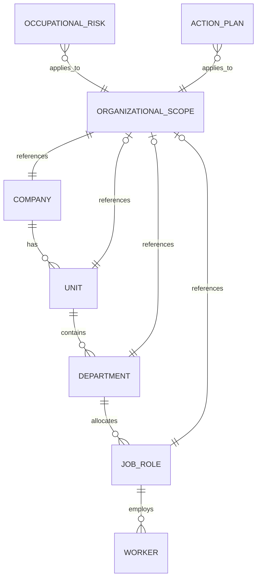

# OMOC Integration — NR-01 Intelligence Platform

OMOC (Organizational Model and Operations Chart) é o módulo core do QualitiOS que gerencia a estrutura hierárquica das instituições de saúde. A plataforma NR-01 deve integrar-se nativamente a ele para garantir que os riscos estejam vinculados aos contextos corretos.

## Hierarquia Organizacional Completa

O mapeamento de riscos segue a topologia organizacional:

`Empresa` $\rightarrow$ `Unidade` (Ex: Hospital Central) $\rightarrow$ `Setor` (Ex: UTI, Centro Cirúrgico) $\rightarrow$ `Cargo` (Ex: Enfermeiro, Médico) $\rightarrow$ `Trabalhador` (Pessoa física).

## Mapeamento e Propagação de Riscos

Um risco pode ser vinculado a qualquer nível dessa hierarquia, com regras de propagação:

1.  **Risco no Nível de Setor:** Todos os cargos e trabalhadores alocados naquele setor herdam automaticamente a exposição àquele risco (ex: Ruído na Sala de Máquinas).
2.  **Risco no Nível de Cargo:** Apenas as pessoas naquele cargo herdam o risco, independente do setor (ex: Risco biológico para Médicos).
3.  **Sobreposição:** A exposição real de um trabalhador é a união (soma) dos riscos de sua Unidade + Setor + Cargo.

## Modelo de Dados do Escopo Organizacional

```typescript
interface OrganizationalScope {
  companyId: string;
  unitId?: string;
  departmentId?: string;
  jobRoleId?: string;
  workerId?: string; // Para riscos específicos de condição individual (ex: PCD, Gestante)
}
```

## Casos de Uso Core

-   **Gerar PGR por Unidade:** A NR-01 exige que cada estabelecimento (Unidade/CNPJ) tenha seu próprio PGR. O sistema agrega todos os riscos cujos `unitId` batem com a unidade alvo (incluindo seus setores e cargos dependentes).
-   **Identificar Trabalhadores Expostos:** Ao avaliar um agente químico no Setor "Laboratório", o sistema consulta o OMOC para listar exatamente quais trabalhadores estão lotados lá e precisam constar no PPP/eSocial.
-   **Consultar Perfil de Cargo:** Ao contratar um novo "Técnico de Radiologia", o RH consulta a integração para saber quais NRs e exames de PCMSO aquele cargo exige.

## Relacionamento e Fluxo OMOC $\leftrightarrow$ NR-01



## API Contract (OMOC $\leftrightarrow$ NR-01)

O OMOC expõe eventos assíncronos e APIs síncronas para o módulo NR-01:

-   **Sync:** `GET /api/omoc/workers/{id}/risk-profile` - Retorna a árvore organizacional completa de um trabalhador.
-   **Sync:** `GET /api/omoc/units/{id}/headcount` - Retorna a população exposta para cálculo estatístico de probabilidade de risco.
-   **Async Event:** `WorkerTransferredEvent` - Trabalhador mudou de setor. Dispara recálculo de necessidade de treinamento e atualização do eSocial.
-   **Async Event:** `DepartmentCreatedEvent` - Novo setor criado. Dispara tarefa no SESMT para elaboração do Inventário de Riscos inicial.
