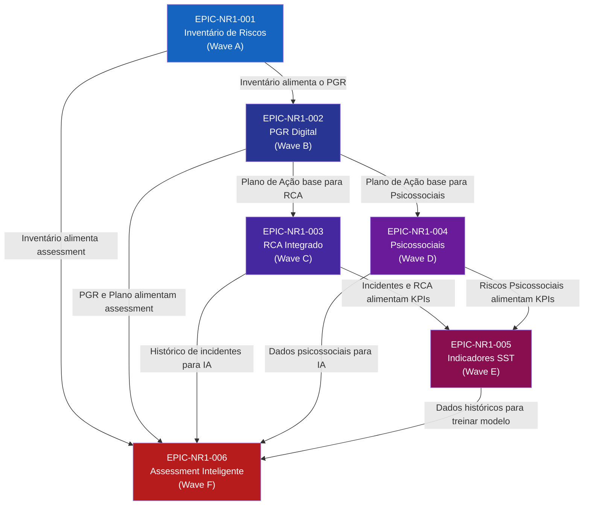

# NR-01 Intelligence Platform — Implementation Package

**Projeto:** QualitiOS  
**Módulo:** NR-01 Intelligence Platform  
**Documento:** Implementation Package — Épicos, Features e User Stories  
**Versão:** 1.0.0  
**Data:** 2026-06-08  
**Status:** APROVADO  
**Autores:** Equipe de Produto QualitiOS  

---

## Sumário

1. [Visão Geral do Implementation Package](#1-visão-geral-do-implementation-package)
2. [Definition of Done Global do Módulo NR-01](#2-definition-of-done-global-do-módulo-nr-01)
3. [EPIC-NR1-001 — Inventário e Avaliação de Riscos](#3-epic-nr1-001--inventário-e-avaliação-de-riscos)
4. [EPIC-NR1-002 — PGR Digital](#4-epic-nr1-002--pgr-digital)
5. [EPIC-NR1-003 — RCA Integrado](#5-epic-nr1-003--rca-integrado)
6. [EPIC-NR1-004 — Gestão de Riscos Psicossociais](#6-epic-nr1-004--gestão-de-riscos-psicossociais)
7. [EPIC-NR1-005 — Painel de Indicadores SST](#7-epic-nr1-005--painel-de-indicadores-sst)
8. [EPIC-NR1-006 — Assessment Inteligente NR-01](#8-epic-nr1-006--assessment-inteligente-nr-01)
9. [Mapa de Dependências entre Épicos](#9-mapa-de-dependências-entre-épicos)
10. [Critérios de Aceite por Épico](#10-critérios-de-aceite-por-épico)
11. [Matriz de Rastreabilidade](#11-matriz-de-rastreabilidade)

---

## 1. Visão Geral do Implementation Package

### 1.1 Estrutura Hierárquica

O Implementation Package organiza o trabalho de desenvolvimento em uma hierarquia clara:

```
Módulo NR-01 Intelligence Platform
└── Épico (Epic) — Capacidade de negócio principal
    └── Feature — Conjunto de funcionalidades relacionadas
        └── User Story — Necessidade específica do usuário
            └── Task — Atividade técnica de implementação
                └── Subtask — Atividade atômica
```

### 1.2 Resumo dos Épicos

| Épico | Título | Wave | Story Points | Prioridade |
|---|---|---|---|---|
| **EPIC-NR1-001** | Inventário e Avaliação de Riscos | A | 310 | P0 — Crítico |
| **EPIC-NR1-002** | PGR Digital | B | 360 | P0 — Crítico |
| **EPIC-NR1-003** | RCA Integrado | C | 260 | P1 — Alto |
| **EPIC-NR1-004** | Gestão de Riscos Psicossociais | D | 325 | P1 — Alto |
| **EPIC-NR1-005** | Painel de Indicadores SST | E | 255 | P1 — Alto |
| **EPIC-NR1-006** | Assessment Inteligente NR-01 | F | 560 | P1 — Alto |
| **TOTAL** | | | **2.070** | |

### 1.3 Convenção de IDs

| Tipo | Formato | Exemplo |
|---|---|---|
| Épico | EPIC-NR1-XXX | EPIC-NR1-001 |
| Feature | FEAT-NR1-XXX-YY | FEAT-NR1-001-01 |
| User Story | US-NR1-XXX-YY-ZZ | US-NR1-001-01-01 |
| Critério de Aceite | AC-NR1-XXX-YY-ZZ-W | AC-NR1-001-01-01-1 |

---

## 2. Definition of Done Global do Módulo NR-01

A **Definition of Done (DoD) Global** se aplica a **todas** as User Stories do módulo NR-01. Critérios específicos por épico ou story são adicionados como complemento, não substitutos.

### 2.1 Critérios de DoD Global

#### Código e Qualidade

- [ ] **Código revisado:** Pull Request aprovado por pelo menos 1 desenvolvedor sênior
- [ ] **Cobertura de testes:** Testes unitários com cobertura ≥ 80% nas classes de domínio e casos de uso
- [ ] **Testes de integração:** Cenários de integração críticos cobertos por testes automatizados
- [ ] **Análise estática:** Zero issues críticos ou high no SonarQube / linter configurado
- [ ] **Sem débito técnico consciente:** Todo débito técnico gerado registrado no backlog como tech debt
- [ ] **Sem secrets no código:** Nenhuma credencial, token ou dado sensível no repositório

#### Funcionalidade e Comportamento

- [ ] **Critérios de aceite:** Todos os critérios de aceite da user story verificados
- [ ] **Testes de regressão:** Suite de regressão executa sem falhas
- [ ] **Comportamento de erro:** Mensagens de erro claras e tratamento adequado de exceptions
- [ ] **Edge cases:** Casos limítrofes documentados e testados

#### Performance e Confiabilidade

- [ ] **SLA de performance:** Operações CRUD respondem em < 500ms (p95); consultas analíticas em < 3s
- [ ] **Disponibilidade:** Módulo contribui para SLA global de 99.9% de disponibilidade
- [ ] **Graceful degradation:** Sistema se degrada graciosamente sob carga ou falha de dependências

#### Segurança e Conformidade

- [ ] **RBAC validado:** Acesso à funcionalidade verificado por papel (Admin, Profissional SST, Gestor, Visualizador)
- [ ] **LGPD compliance:** Dados pessoais e de saúde tratados conforme políticas LGPD aprovadas
- [ ] **Auditoria:** Operações sensíveis registradas no audit log (quem, o que, quando)
- [ ] **Sanitização:** Inputs do usuário sanitizados e validados (proteção XSS, SQL Injection)
- [ ] **HTTPS:** Toda comunicação cliente-servidor via HTTPS/TLS 1.3

#### Documentação e Operação

- [ ] **Documentação de API:** Endpoints documentados no OpenAPI 3.0 atualizado
- [ ] **Logs estruturados:** Logs em formato JSON com correlationId para rastreabilidade
- [ ] **Health check:** Endpoint de health check atualizado se novo serviço criado
- [ ] **Runbook:** Runbook operacional atualizado com a nova funcionalidade
- [ ] **Feature flag:** Feature entregue atrás de feature flag (se aplicável) para release controlado

#### Entrega e Validação

- [ ] **Deploy em staging:** Funcionalidade implantada e funcional no ambiente de staging
- [ ] **Validação pelo PO:** Product Owner validou a funcionalidade no ambiente de staging
- [ ] **Validação pelo especialista SST:** Para funcionalidades com impacto regulatório, validação por especialista SST
- [ ] **Documentação de usuário:** Manual/help atualizado se a funcionalidade é visível ao usuário

---

## 3. EPIC-NR1-001 — Inventário e Avaliação de Riscos

**Objetivo:** Permitir que organizações digitalizem e gerenciem seu inventário de riscos ocupacionais conforme NR-01, item 1.5.1.1, substituindo planilhas e documentos não estruturados por um sistema integrado e rastreável.

**Wave:** A | **Story Points:** 310 | **Prioridade:** P0

---

### FEAT-NR1-001-01 — Gestão de Grupos Homogêneos de Exposição (GHE)

**Objetivo:** Permitir o cadastro e manutenção dos GHEs que são a unidade fundamental de organização do inventário de riscos.

---

#### US-NR1-001-01-01 — Cadastrar GHE com dados completos

**Como** Profissional SST,  
**Quero** cadastrar um Grupo Homogêneo de Exposição com todos os dados necessários (nome, setor, descrição das atividades, número de trabalhadores, funções envolvidas e jornada de trabalho),  
**Para que** eu possa organizar o inventário de riscos por grupos de trabalhadores com exposição similar, conforme exigido pela NR-01, item 1.5.1.1.

```gherkin
Cenário: Cadastro bem-sucedido de GHE completo
  GIVEN que sou um Profissional SST autenticado na organização "Empresa ABC"
  WHEN preencho o formulário de GHE com nome "Setor de Produção - Linha 1",
       setor "Produção", descrição de atividades, 25 trabalhadores
       e as funções "Operador de Máquina" e "Auxiliar de Produção"
  THEN o GHE é salvo com ID único gerado automaticamente
  AND o GHE aparece listado no inventário da organização
  AND um evento de domínio "GHECadastrado" é emitido para o log de auditoria

Cenário: Tentativa de cadastro com dados obrigatórios ausentes
  GIVEN que sou um Profissional SST autenticado
  WHEN submeto o formulário de GHE sem preencher o nome do setor
  THEN o sistema exibe mensagem de erro "Campo 'Setor' é obrigatório"
  AND o GHE não é salvo
  AND o formulário permanece aberto com os dados já preenchidos

Cenário: Prevenção de GHE duplicado
  GIVEN que já existe um GHE "Almoxarifado" na organização
  WHEN tento cadastrar outro GHE com o mesmo nome "Almoxarifado"
  THEN o sistema exibe aviso "Já existe um GHE com este nome. Deseja continuar?"
  AND o usuário pode confirmar ou cancelar o cadastro
```

---

#### US-NR1-001-01-02 — Editar e versionar GHE

**Como** Profissional SST,  
**Quero** editar os dados de um GHE existente e ter o histórico de todas as alterações registrado com data, usuário e motivo da alteração,  
**Para que** eu possa manter o inventário atualizado e garantir a rastreabilidade das mudanças para fins de auditoria e fiscalização.

```gherkin
Cenário: Edição de GHE com registro de versão
  GIVEN que existe o GHE "Manutenção" com 10 trabalhadores
  WHEN altero o número de trabalhadores para 15 e informo o motivo "Contratação de 5 novos técnicos"
  THEN o GHE é atualizado com o novo número de trabalhadores
  AND uma nova versão (v2) é registrada no histórico com data, usuário e motivo
  AND a versão anterior (v1) permanece acessível no histórico
  AND um evento "GHEAtualizado" é emitido com os dados da alteração

Cenário: Consulta ao histórico de versões
  GIVEN que o GHE "Manutenção" tem 3 versões de alteração
  WHEN acesso a aba "Histórico de Versões" do GHE
  THEN vejo todas as 3 versões listadas com data, usuário e resumo da alteração
  AND posso clicar em qualquer versão para ver os dados completos naquela data

Cenário: Restrição de edição para usuário sem permissão
  GIVEN que sou um usuário com papel "Visualizador"
  WHEN acesso um GHE e clico em "Editar"
  THEN o sistema exibe mensagem "Você não tem permissão para editar GHEs"
  AND nenhum dado é alterado
```

---

#### US-NR1-001-01-03 — Importar GHEs via planilha modelo

**Como** Profissional SST,  
**Quero** importar múltiplos GHEs de uma vez usando uma planilha Excel no formato padrão do QualitiOS,  
**Para que** eu possa migrar dados de um inventário existente em planilha sem precisar cadastrar cada GHE manualmente.

```gherkin
Cenário: Importação bem-sucedida de múltiplos GHEs
  GIVEN que tenho uma planilha Excel no formato padrão QualitiOS com 15 GHEs preenchidos
  WHEN faço upload da planilha na tela de importação
  THEN o sistema valida a estrutura da planilha
  AND exibe um preview de todos os 15 GHEs para revisão antes de confirmar
  AND após confirmação, todos os 15 GHEs são importados com sucesso
  AND um relatório de importação é exibido: "15 GHEs importados com sucesso, 0 erros"

Cenário: Importação com erros parciais
  GIVEN que tenho uma planilha com 15 GHEs onde 2 estão com dados inválidos (nome vazio)
  WHEN faço upload e confirmo a importação
  THEN 13 GHEs são importados com sucesso
  AND os 2 GHEs com erro são exibidos em relatório detalhado com a causa do erro
  AND os 13 GHEs importados ficam disponíveis no inventário imediatamente

Cenário: Download do template de importação
  GIVEN que sou um Profissional SST
  WHEN clico em "Baixar Template de Importação"
  THEN faço download de uma planilha Excel com as colunas corretas e exemplos de preenchimento
  AND a planilha contém uma aba "Instruções" explicando cada campo
```

---

### FEAT-NR1-001-02 — Registro e Avaliação de Perigos e Riscos

**Objetivo:** Permitir o registro sistemático de perigos e a avaliação quantitativa/qualitativa dos riscos por GHE, conforme metodologia alinhada à NR-01.

---

#### US-NR1-001-02-01 — Registrar perigo com agente e fonte geradora

**Como** Profissional SST,  
**Quero** registrar um perigo associado a um GHE, especificando o grupo de risco, o agente de risco específico, a fonte geradora e o modo de contato com o trabalhador,  
**Para que** eu possa construir um inventário completo e estruturado de todos os perigos presentes no ambiente de trabalho conforme NR-01.

```gherkin
Cenário: Registro de perigo físico (ruído)
  GIVEN que estou no GHE "Linha de Produção" e quero registrar um perigo
  WHEN seleciono Grupo de Risco "Físico", Agente "Ruído",
       preencho a Fonte Geradora "Prensas hidráulicas modelo XYZ"
       e o Modo de Contato "Aéreo - exposição auditiva contínua"
  THEN o perigo é registrado e vinculado ao GHE
  AND o sistema sugere automaticamente as NRs aplicáveis: NR-15, NR-09, NR-06 (EPI)
  AND o perigo aparece no inventário consolidado do GHE

Cenário: Registro de perigo ergonômico
  GIVEN que estou no GHE "Embalagem"
  WHEN registro um perigo do Grupo "Ergonômico" com agentes "Postura inadequada" e "Repetitividade"
  THEN o sistema vincula automaticamente NR-17 como NR aplicável
  AND sugere a AET (Análise Ergonômica do Trabalho) como avaliação recomendada
  AND registra que este perigo requer avaliação qualitativa e quantitativa

Cenário: Visualização de perigos por GHE
  GIVEN que o GHE "Manutenção" tem 5 perigos registrados de grupos diferentes
  WHEN acesso o GHE e clico em "Perigos e Riscos"
  THEN vejo a lista de todos os 5 perigos com grupo, agente e status de avaliação
  AND posso filtrar por grupo de risco ou status de avaliação
```

---

#### US-NR1-001-02-02 — Avaliar risco com matriz de criticidade

**Como** Profissional SST,  
**Quero** avaliar cada risco utilizando uma matriz de Probabilidade × Severidade × Exposição e obter o nível de risco calculado automaticamente,  
**Para que** eu possa priorizar as medidas de controle de acordo com a criticidade de cada risco conforme metodologia da NR-01.

```gherkin
Cenário: Avaliação de risco com cálculo automático
  GIVEN que tenho o perigo "Ruído" no GHE "Produção" sem avaliação
  WHEN atribuo Probabilidade = 4 (provável), Severidade = 4 (crítico), Exposição = 5 (contínua)
  THEN o sistema calcula automaticamente o Score = Probabilidade × Severidade × Exposição = 80
  AND classifica o risco como "ALTO" (Score > 50)
  AND exibe a cor correspondente (vermelho) no inventário
  AND recomenda prioridade de ação "IMEDIATA - 30 dias"

Cenário: Recalcular risco após implementação de controle
  GIVEN que o risco "Ruído" tem Score 80 (ALTO) e foi implementado um enclausuramento acústico
  WHEN registro o controle de engenharia implementado com eficácia estimada de 70%
  THEN o sistema recalcula o risco residual: Score = 80 × (1 - 0.70) = 24
  AND reclassifica para "BAIXO" (Score < 30)
  AND registra o controle no histórico com data de implementação

Cenário: Comparação de avaliações ao longo do tempo
  GIVEN que o risco "Ruído" foi avaliado em Jan/2025 (Score 80) e Jun/2025 (Score 24)
  WHEN acesso o histórico de avaliações
  THEN vejo as duas avaliações com datas, scores e usuários responsáveis
  AND um gráfico de linha mostra a evolução do score ao longo do tempo
```

---

#### US-NR1-001-02-03 — Registrar medições quantitativas e comparar com LEOs

**Como** Profissional SST,  
**Quero** registrar os valores medidos de agentes ambientais (ruído, temperatura, concentração de químicos) e compará-los automaticamente com os Limites de Exposição Ocupacional (LEOs) vigentes,  
**Para que** eu possa determinar objetivamente se há ultrapassagem de limite legal e priorizar ações corretivas.

```gherkin
Cenário: Registro de medição de ruído com comparação ao LEO
  GIVEN que tenho o perigo "Ruído" no GHE "Produção"
  WHEN registro uma medição de 92 dB(A) com método NHO-01 e responsável "Eng. João Silva"
  THEN o sistema compara com o LEO da NR-15 Anexo 1 (para jornada 8h: 85 dB(A))
  AND exibe "ULTRAPASSAGEM DO LIMITE LEGAL: 92 dB(A) > 85 dB(A) (Nível de Ação: 80 dB(A))"
  AND altera o status do risco para "EM DESACORDO COM A LEGISLAÇÃO"
  AND sugere urgência de ação IMEDIATA com fundamento "NR-15 Anexo 1"

Cenário: Registro de medição dentro do limite
  GIVEN que tenho o perigo "Temperatura" (calor) no GHE "Fundição"
  WHEN registro IBUTG medido = 24.5°C em atividade moderada
  THEN o sistema compara com o IBUTG máximo NR-15 Anexo 3 (25.0°C para atividade moderada)
  AND exibe "DENTRO DO LIMITE LEGAL: 24.5°C ≤ 25.0°C"
  AND status do risco permanece "EM CONFORMIDADE"
  AND sugere monitoramento periódico trimestral

Cenário: Alerta de vencimento da medição
  GIVEN que a medição de ruído do GHE "Produção" foi realizada há 364 dias (validade: 1 ano)
  WHEN acesso o inventário
  THEN o sistema exibe um alerta amarelo: "Medição de Ruído vence em 1 dia para GHE Produção"
  AND envia notificação por e-mail ao Profissional SST responsável
```

---

### FEAT-NR1-001-03 — Integração com eSocial S-2240

**Objetivo:** Automatizar o envio das condições ambientais de trabalho ao eSocial (evento S-2240), mantendo a organização em conformidade com a obrigação de prestação de informações ao governo federal.

---

#### US-NR1-001-03-01 — Enviar evento S-2240 ao eSocial automaticamente

**Como** Profissional SST,  
**Quero** que o sistema gere e envie automaticamente o evento S-2240 ao eSocial sempre que houver alteração nas condições ambientais de trabalho (novo risco, nova medição, novo controle),  
**Para que** eu mantenha a organização em conformidade com a obrigação de envio de informações de SST ao eSocial sem precisar de processos manuais propensos a erro.

```gherkin
Cenário: Envio automático do S-2240 após alteração no inventário
  GIVEN que o inventário de riscos do GHE "Produção" foi atualizado com um novo agente nocivo
  WHEN o Profissional SST salva a alteração e confirma o envio ao eSocial
  THEN o sistema gera o XML do evento S-2240 com os dados atualizados
  AND envia o evento ao ambiente de produção do eSocial (ou staging se em homologação)
  AND registra o protocolo de envio retornado pelo eSocial no histórico do evento
  AND exibe a confirmação de envio com número de protocolo ao usuário

Cenário: Tratamento de rejeição do eSocial
  GIVEN que o sistema tentou enviar o S-2240 e o eSocial retornou erro de validação
  WHEN o eSocial rejeita o evento com código "MSS012" (campo CNPJ inválido)
  THEN o sistema registra o erro no log de eventos eSocial
  AND exibe notificação ao Profissional SST: "S-2240 rejeitado: campo CNPJ inválido (MSS012)"
  AND disponibiliza o XML rejeitado para revisão e correção
  AND agenda nova tentativa automática após correção pelo usuário

Cenário: Consulta ao histórico de eventos eSocial
  GIVEN que a organização enviou 12 eventos S-2240 nos últimos 6 meses
  WHEN acesso a tela "Histórico eSocial SST"
  THEN vejo todos os 12 eventos com status (Enviado/Rejeitado/Processando), data e protocolo
  AND posso filtrar por tipo de evento, status e período
  AND posso baixar o XML de qualquer evento para conferência
```

---

#### US-NR1-001-03-02 — Monitorar status dos eventos eSocial SST

**Como** Profissional SST,  
**Quero** visualizar em um painel centralizado o status de todos os eventos eSocial SST (S-2210, S-2220, S-2240) da minha organização,  
**Para que** eu possa identificar rapidamente eventos com erro, vencidos ou pendentes e tomar ação corretiva antes de sofrer penalidades.

```gherkin
Cenário: Painel de status eSocial SST com alertas
  GIVEN que a organização tem eventos eSocial com diferentes status
  WHEN acesso o painel "eSocial SST"
  THEN vejo um resumo com: X eventos enviados com sucesso, Y com erro, Z pendentes
  AND eventos com erro são destacados em vermelho com o código de erro
  AND eventos pendentes (sem envio por > 30 dias) são destacados em amarelo

Cenário: Alerta de prazo de envio vencendo
  GIVEN que há uma alteração de condição ambiental não enviada ao eSocial há 27 dias
  WHEN o sistema executa a verificação diária de conformidade eSocial
  THEN exibe alerta: "Atenção: S-2240 para GHE Manutenção deve ser enviado em até 3 dias"
  AND envia notificação por e-mail ao Profissional SST responsável
  AND registra o alerta no log de conformidade eSocial
```

---

#### US-NR1-001-03-03 — Exportar relatório de conformidade eSocial

**Como** Gestor de RH,  
**Quero** exportar um relatório consolidado da conformidade eSocial SST da organização,  
**Para que** eu possa apresentar à diretoria e ao DP o status atual de cumprimento das obrigações eSocial de saúde e segurança do trabalho.

```gherkin
Cenário: Exportação do relatório de conformidade eSocial
  GIVEN que sou um Gestor de RH autenticado
  WHEN acesso "Relatórios > Conformidade eSocial SST" e seleciono o período "Último Trimestre"
  THEN o sistema gera um relatório PDF com: total de eventos enviados, taxa de sucesso, 
       eventos rejeitados e suas causas, eventos pendentes com prazo
  AND o relatório é exportado em PDF com logo da organização e data de geração
  AND um resumo executivo é incluído no início do relatório

Cenário: Inclusão de dados de todos os tipos de evento SST
  GIVEN que a organização enviou S-2210, S-2220 e S-2240 no período
  WHEN exporto o relatório de conformidade
  THEN o relatório inclui seções separadas para cada tipo de evento (CAT, ASO, Condições Ambientais)
  AND exibe o percentual de conformidade global: "92% dos eventos enviados no prazo"
```

---

## 4. EPIC-NR1-002 — PGR Digital

**Objetivo:** Permitir a elaboração, gestão, assinatura digital e publicação do Programa de Gerenciamento de Riscos (PGR) completo conforme NR-01, itens 1.5.1 a 1.5.4, com plano de ação estruturado e rastreável.

**Wave:** B | **Story Points:** 360 | **Prioridade:** P0

---

### FEAT-NR1-002-01 — Elaboração Guiada do PGR

**Objetivo:** Guiar o Profissional SST na elaboração do PGR com um wizard estruturado que garante completude de todos os itens obrigatórios da NR-01.

---

#### US-NR1-002-01-01 — Criar PGR com wizard guiado

**Como** Profissional SST,  
**Quero** criar um novo PGR utilizando um wizard passo a passo que me guia por todos os elementos obrigatórios (identificação da empresa, inventário de riscos, plano de ação, revisões),  
**Para que** eu tenha certeza de que o PGR gerado atende a todos os requisitos da NR-01 sem precisar verificar manualmente cada item da norma.

```gherkin
Cenário: Criação de PGR via wizard — fluxo completo
  GIVEN que sou um Profissional SST e já tenho o inventário de riscos preenchido
  WHEN inicio a criação de um novo PGR
  THEN o wizard apresenta 6 etapas: 1-Identificação, 2-Inventário, 3-Controles, 4-Plano de Ação, 5-Revisão, 6-Assinatura
  AND cada etapa é validada antes de avançar para a próxima
  AND o progresso é salvo automaticamente a cada step para evitar perda de dados

Cenário: Pré-preenchimento com dados do inventário
  GIVEN que o inventário de riscos da organização está preenchido com 20 GHEs e 45 riscos
  WHEN inicio o wizard de criação do PGR na etapa 2 (Inventário)
  THEN o wizard importa automaticamente todos os 20 GHEs e 45 riscos do inventário
  AND o Profissional SST pode revisar, complementar ou excluir itens antes de prosseguir
  AND itens sem avaliação de risco são sinalizados como incompletos

Cenário: Validação de completude NR-01
  GIVEN que estou na etapa de revisão final do wizard
  WHEN o sistema verifica a completude do PGR
  THEN exibe um checklist com todos os itens obrigatórios da NR-01 e seu status (✅/❌)
  AND impede a finalização se há itens obrigatórios (conforme NR-01) não preenchidos
  AND para itens opcionais, exibe aviso mas permite prosseguir
```

---

#### US-NR1-002-01-02 — Versionar e controlar revisões do PGR

**Como** Profissional SST,  
**Quero** criar novas versões do PGR quando houver revisão periódica ou alteração significativa no inventário de riscos, mantendo o histórico de todas as versões anteriores acessíveis,  
**Para que** eu possa demonstrar à fiscalização que o PGR é mantido atualizado e que há evidência de revisões periódicas conforme NR-01, item 1.5.3.

```gherkin
Cenário: Criar nova versão do PGR por revisão anual
  GIVEN que o PGR v1.0 foi assinado há 11 meses e está próximo da revisão anual
  WHEN clico em "Iniciar Revisão" no PGR vigente
  THEN o sistema cria o PGR v2.0 como rascunho, copiando todos os dados do v1.0
  AND o PGR v1.0 permanece como versão vigente até a nova versão ser assinada
  AND o wizard de revisão abre com as seções marcadas onde houve alteração no inventário desde a última versão

Cenário: Comparação entre versões do PGR
  GIVEN que existem PGR v1.0 e v2.0 finalizados
  WHEN clico em "Comparar Versões" selecionando v1.0 e v2.0
  THEN o sistema exibe um diff visual destacando: novos riscos adicionados, riscos removidos, controles alterados, ações modificadas
  AND o total de alterações é exibido: "32 mudanças detectadas entre as versões"

Cenário: Alertas de revisão periódica
  GIVEN que a NR-01 exige revisão anual do PGR
  WHEN faltam 30 dias para o aniversário da assinatura do PGR vigente
  THEN o sistema envia e-mail ao Profissional SST: "PGR vence revisão em 30 dias"
  AND exibe banner de alerta no dashboard principal
  AND cria uma tarefa automática no plano de ação: "Realizar revisão anual do PGR"
```

---

#### US-NR1-002-01-03 — Assinar digitalmente o PGR com ICP-Brasil

**Como** Engenheiro de Segurança do Trabalho,  
**Quero** assinar digitalmente o PGR finalizado usando meu certificado digital ICP-Brasil (A1 ou A3),  
**Para que** o PGR tenha validade jurídica e eu possa demonstrar minha responsabilidade técnica pelo documento conforme a legislação brasileira.

```gherkin
Cenário: Assinatura digital via certificado A3 (token)
  GIVEN que o PGR está na etapa "Aguardando Assinatura" e tenho certificado A3 conectado
  WHEN clico em "Assinar PGR" e seleciono meu certificado ICP-Brasil do token A3
  THEN o sistema exibe os dados do certificado para confirmação: nome, CPF, validade
  AND após confirmação, o PDF do PGR é assinado digitalmente com o certificado A3
  AND o sistema valida a assinatura junto à ICP-Brasil e exibe "Assinatura válida ✅"
  AND o PGR muda de status para "VIGENTE" com data e hora da assinatura registradas

Cenário: Verificação de validade da assinatura
  GIVEN que o PGR foi assinado digitalmente
  WHEN qualquer usuário ou fiscal acessa o PGR assinado
  THEN o sistema exibe: Assinante: [Nome], CPF: [CPF], Data: [Data], Status: "ASSINATURA VÁLIDA"
  AND a verificação é feita em tempo real junto à ICP-Brasil

Cenário: Múltiplas assinaturas (Médico do Trabalho + Engenheiro de Segurança)
  GIVEN que o PGR requer assinatura do Engenheiro de Segurança e do Médico do Trabalho
  WHEN o Engenheiro assina primeiro
  THEN o status muda para "Aguardando 2ª Assinatura - Médico do Trabalho"
  AND o Médico recebe notificação por e-mail para assinar
  AND após a 2ª assinatura, o PGR fica "VIGENTE" com ambas as assinaturas registradas
```

---

### FEAT-NR1-002-02 — Plano de Ação e Gestão de Medidas de Prevenção

**Objetivo:** Gerenciar o plano de ação do PGR com atribuição de responsáveis, prazos, evidências e acompanhamento de execução.

---

#### US-NR1-002-02-01 — Criar e priorizar ações do plano

**Como** Profissional SST,  
**Quero** criar ações de prevenção no plano de ação com descrição, responsável, prazo, prioridade e custo estimado, vinculadas aos riscos identificados no inventário,  
**Para que** eu possa gerenciar sistematicamente todas as medidas de controle necessárias e demonstrar à fiscalização que há um plano formal de adequação conforme NR-01, item 1.5.2.

```gherkin
Cenário: Criação de ação vinculada a risco
  GIVEN que estou no Plano de Ação do PGR
  WHEN crio uma nova ação, seleciono o risco "Ruído - GHE Produção",
       preencho descrição "Instalar enclausuramento acústico nas prensas",
       atribuo ao responsável "Eng. Carlos Santos", prazo "2026-07-31" e prioridade "ALTA"
  THEN a ação é criada com status "A Fazer" e vinculada ao risco de ruído
  AND o risco "Ruído" no inventário passa a exibir "1 ação planejada"
  AND o responsável "Eng. Carlos Santos" recebe notificação e-mail sobre a nova responsabilidade

Cenário: Priorização automática por criticidade
  GIVEN que há 20 ações no plano com diferentes riscos e prazos
  WHEN clico em "Priorizar Automaticamente"
  THEN o sistema reordena as ações por score: Criticidade_Risco × Urgência_Legal × Exposição
  AND ações com prazo vencido aparecem no topo em vermelho
  AND posso aceitar ou ajustar a priorização sugerida antes de salvar

Cenário: Agrupamento de ações por responsável
  GIVEN que há 20 ações distribuídas entre 5 responsáveis
  WHEN acesso a visão "Por Responsável" no plano de ação
  THEN vejo cada responsável com suas ações, status e total de ações pendentes
  AND posso exportar a visão por responsável em PDF para enviar às áreas
```

---

#### US-NR1-002-02-02 — Registrar evidências e concluir ações

**Como** Gestor de Área,  
**Quero** registrar evidências de conclusão de uma ação (foto, documento, laudo) e marcar a ação como concluída no sistema,  
**Para que** o Profissional SST possa acompanhar a execução real das medidas preventivas e o PGR reflita o estado atual das melhorias implementadas.

```gherkin
Cenário: Conclusão de ação com evidência fotográfica
  GIVEN que sou Gestor de Área e tenho a ação "Instalar EPI — Protetor Auricular" atribuída a mim
  WHEN acesso a ação, faço upload de foto mostrando os EPIs entregues e assinatura dos colaboradores
       e clico em "Marcar como Concluída"
  THEN a ação muda de status "Em Andamento" para "Concluída"
  AND a evidência (foto) é vinculada à ação com data e usuário de upload
  AND o Profissional SST recebe notificação: "Ação PA-005 concluída por [Gestor]"
  AND o indicador "Ações Concluídas no Prazo" é atualizado no dashboard

Cenário: Solicitação de prorrogação de prazo
  GIVEN que a ação "Enclausuramento Acústico" tem prazo em 3 dias e não será concluída a tempo
  WHEN o responsável solicita prorrogação com justificativa "Peças com prazo de entrega em 20 dias"
  THEN o Profissional SST recebe a solicitação e pode aprovar ou recusar
  AND se aprovado, o novo prazo é registrado e o responsável é notificado
  AND a solicitação e aprovação ficam registradas no histórico da ação
```

---

#### US-NR1-002-02-03 — Acompanhar progresso do plano de ação via dashboard

**Como** Profissional SST,  
**Quero** visualizar em um dashboard o progresso geral do plano de ação com percentual de conclusão, ações vencidas, próximas do vencimento e distribuição por prioridade,  
**Para que** eu possa identificar rapidamente onde preciso intervir e reportar o progresso à direção da empresa.

```gherkin
Cenário: Visualização do dashboard do plano de ação
  GIVEN que o plano de ação tem 24 ações em diferentes status
  WHEN acesso o dashboard do plano de ação
  THEN vejo: 10 concluídas (42%), 8 em andamento (33%), 4 atrasadas (17%), 2 a fazer (8%)
  AND um gráfico de Gantt simplificado mostra a linha do tempo das ações
  AND ações atrasadas são exibidas em vermelho com quantos dias estão atrasadas

Cenário: Filtrar ações por status e responsável
  GIVEN que sou Profissional SST acompanhando múltiplas áreas
  WHEN aplico filtro "Status: Atrasado" e "Responsável: Eng. Carlos Santos"
  THEN vejo apenas as ações atrasadas do Carlos: 2 ações com 5 e 12 dias de atraso respectivamente
  AND posso entrar em contato com o Carlos diretamente pela notificação do sistema

Cenário: Exportar relatório de progresso para a diretoria
  GIVEN que a diretoria solicitou relatório mensal do plano de ação
  WHEN clico em "Exportar Relatório Gerencial" e seleciono "Mês Atual"
  THEN é gerado um PDF executivo com: % conclusão geral, gráfico de progresso, ações críticas pendentes
  AND o PDF é formatado para apresentação em reunião de diretoria (slides-style)
```

---

### FEAT-NR1-002-03 — Publicação e Compartilhamento do PGR

**Objetivo:** Disponibilizar o PGR de forma acessível aos trabalhadores e à fiscalização conforme exigência da NR-01 de comunicação das informações de SST.

---

#### US-NR1-002-03-01 — Publicar PGR com link de acesso controlado

**Como** Profissional SST,  
**Quero** publicar o PGR vigente com um link de acesso público (somente leitura) que pode ser compartilhado com fiscais do MTE, CIPA e trabalhadores,  
**Para que** eu atenda à exigência de disponibilização das informações de SST prevista na NR-01, item 1.8.

```gherkin
Cenário: Publicação do PGR com link público
  GIVEN que o PGR está assinado e com status "VIGENTE"
  WHEN clico em "Publicar PGR" e confirmo a ação
  THEN o sistema gera uma URL única de acesso público ao PGR (ex: qualitios.com/pgr/ABC123)
  AND a URL é exibida para cópia e compartilhamento
  AND o PGR publicado exibe apenas versão PDF não-editável com informações da assinatura

Cenário: Controle de versão pública (nova versão substitui anterior)
  GIVEN que o PGR v1.0 está publicado e uma nova versão v2.0 foi assinada
  WHEN publico o PGR v2.0
  THEN o link anterior agora redireciona automaticamente para o PGR v2.0
  AND a versão v1.0 fica acessível apenas no histórico interno (não via link público)
  AND visitantes do link veem apenas a versão mais recente e vigente

Cenário: Acesso restrito a dados confidenciais
  GIVEN que o PGR publicado contém dados de trabalhadores (ex: número de expostos)
  WHEN um fiscal acessa o link público
  THEN pode ver o inventário de riscos completo e o plano de ação
  AND dados individuais de trabalhadores (nome, CPF) NÃO são exibidos (LGPD)
  AND o documento exibe apenas quantitativos e não identificações pessoais
```

---

#### US-NR1-002-03-02 — Notificar CIPA e trabalhadores sobre o PGR

**Como** Profissional SST,  
**Quero** notificar automaticamente os membros da CIPA e, opcionalmente, todos os trabalhadores quando um novo PGR é publicado,  
**Para que** eu cumpra a obrigação de participação e comunicação dos trabalhadores nas questões de SST prevista na NR-01, item 1.4.3.

```gherkin
Cenário: Notificação automática da CIPA sobre novo PGR
  GIVEN que publiquei o PGR v2.0 e a CIPA está cadastrada no sistema
  WHEN confirmo a publicação
  THEN todos os membros da CIPA cadastrados recebem e-mail: "Novo PGR publicado - [Empresa]"
  AND o e-mail contém o link de acesso ao PGR e um convite para reunião de apresentação
  AND a notificação é registrada no log de comunicações do PGR

Cenário: Registro de ciência do trabalhador
  GIVEN que o PGR foi publicado e compartilhado com trabalhadores via QR Code
  WHEN o trabalhador acessa o link e clica em "Li e compreendi"
  THEN o sistema registra a ciência com nome, data e IP de acesso
  AND o Profissional SST pode ver o relatório de ciência: "47 de 60 trabalhadores leram o PGR"
```

---

#### US-NR1-002-03-03 — Rastrear conformidade de comunicação SST

**Como** Profissional SST,  
**Quero** verificar o histórico de todas as comunicações de SST realizadas (publicação do PGR, notificações, reuniões de CIPA) em um registro consolidado,  
**Para que** eu possa demonstrar à fiscalização que a organização cumpre com as obrigações de comunicação e participação exigidas pela NR-01.

```gherkin
Cenário: Histórico de comunicações SST
  GIVEN que a organização realizou 3 publicações de PGR e 12 reuniões de CIPA no último ano
  WHEN acesso "Histórico de Comunicações SST"
  THEN vejo todas as comunicações com data, tipo, destinatários e status de leitura
  AND posso filtrar por período, tipo de comunicação e grupo destinatário

Cenário: Geração de comprovante de comunicação
  GIVEN que o fiscal solicita evidência de que os trabalhadores foram informados sobre o PGR
  WHEN acesso o PGR publicado e clico em "Gerar Comprovante de Comunicação"
  THEN o sistema gera um PDF assinável com: data de publicação, canal de comunicação, 
       lista de trabalhadores notificados e taxa de confirmação de leitura
  AND o documento serve como evidência formal de cumprimento da NR-01 item 1.8
```

---

## 5. EPIC-NR1-003 — RCA Integrado

**Objetivo:** Prover capacidade de investigação estruturada de acidentes e incidentes de trabalho com metodologias reconhecidas (Árvore de Causas, Ishikawa, 5 Porquês), integração com CAT eSocial e vinculação automática do plano corretivo ao PGR.

**Wave:** C | **Story Points:** 260 | **Prioridade:** P1

---

### FEAT-NR1-003-01 — Registro e Classificação de Incidentes

---

#### US-NR1-003-01-01 — Registrar incidente com dados completos

**Como** Profissional SST,  
**Quero** registrar um incidente de trabalho (acidente, quase-acidente ou doença ocupacional) com todos os dados relevantes: data, hora, GHE, trabalhador(es) envolvido(s), descrição do ocorrido e consequências imediatas,  
**Para que** eu tenha um registro formal e estruturado que sirva de base para a investigação de causa-raiz e para o envio da CAT ao eSocial.

```gherkin
Cenário: Registro de acidente com afastamento
  GIVEN que sou Profissional SST e um acidente ocorreu em 2026-06-08 às 14:30
  WHEN preencho o formulário de incidente com: data/hora, GHE "Manutenção", 
       trabalhador afetado (anonimizado), tipo "Acidente com Afastamento",
       lesão "Fratura - mão direita", causa imediata "Prensa sem proteção"
  THEN o incidente é registrado com ID único "INC-2026-0031"
  AND o sistema alerta: "Acidente com afastamento requer CAT em até 1 dia útil (NR-01)"
  AND sugere iniciar o processo de geração da CAT (S-2210) imediatamente

Cenário: Registro de quase-acidente (near-miss)
  GIVEN que um quase-acidente foi reportado por um trabalhador
  WHEN registro o incidente como "Quase-Acidente - Sem lesão" com descrição do risco identificado
  THEN o incidente é salvo com classificação "Near-Miss"
  AND o sistema exibe: "Near-misses são oportunidades de prevenção — inicie uma investigação!"
  AND sugere a iniciação de RCA mesmo sem lesão

Cenário: Consulta ao histórico de incidentes por GHE
  GIVEN que o GHE "Manutenção" teve 5 incidentes nos últimos 12 meses
  WHEN acesso o histórico de incidentes filtrado pelo GHE "Manutenção"
  THEN vejo os 5 incidentes com tipo, data e status de investigação
  AND o sistema calcula automaticamente a Taxa de Frequência (TF) do GHE no período
```

---

#### US-NR1-003-01-02 — Enviar CAT ao eSocial (S-2210) integrado

**Como** Profissional SST,  
**Quero** gerar e enviar a Comunicação de Acidente de Trabalho (CAT) ao eSocial diretamente do sistema, com os dados pré-preenchidos a partir do registro do incidente,  
**Para que** eu cumpra a obrigação legal de comunicar o acidente em até 1 dia útil sem duplicidade de digitação de dados.

```gherkin
Cenário: Geração e envio da CAT com dados pré-preenchidos
  GIVEN que o acidente "INC-2026-0031" está registrado
  WHEN clico em "Gerar CAT" a partir do incidente
  THEN o sistema pré-preenche todos os campos do formulário S-2210 com os dados disponíveis
  AND exibo os campos que precisam de complementação (ex: CID da lesão, dados do médico)
  AND após validação e confirmação, o XML S-2210 é enviado ao eSocial
  AND o número de protocolo da CAT é vinculado ao registro do incidente

Cenário: Alerta de prazo para CAT
  GIVEN que um acidente com afastamento foi registrado hoje às 16h
  WHEN o sistema verifica o prazo legal (próximo dia útil)
  THEN exibe banner vermelho: "CAT deve ser enviada até amanhã [data] - Prazo: 14h restantes"
  AND envia e-mail de alerta ao Profissional SST e ao setor de RH
```

---

#### US-NR1-003-01-03 — Categorizar incidentes por tipo e causa imediata

**Como** Profissional SST,  
**Quero** categorizar os incidentes registrados por tipo (acidente, doença, quase-acidente), por parte do corpo afetada, por agente causador e por causa imediata,  
**Para que** eu possa identificar padrões e tendências que orientem as prioridades de prevenção da organização.

```gherkin
Cenário: Categorização automática e estatísticas
  GIVEN que 10 incidentes foram registrados no semestre
  WHEN acesso "Análise de Incidentes - Semestre"
  THEN vejo gráficos de distribuição por: tipo (60% acidentes, 30% near-miss, 10% doenças),
       parte do corpo afetada (40% mão, 30% coluna, 20% pé, 10% outros),
       agente causador (40% máquinas, 30% esforço excessivo, 30% outros)
  AND identifico o GHE com maior frequência de incidentes

Cenário: Alerta de padrão de incidentes
  GIVEN que 3 incidentes com lesão na mão ocorreram em 30 dias no GHE "Produção"
  WHEN o sistema detecta o padrão (3+ incidentes do mesmo tipo em 30 dias)
  THEN exibe alerta: "Padrão detectado: 3 lesões de mão no GHE Produção em 30 dias"
  AND sugere investigação aprofundada e revisão dos controles de máquinas
```

---

### FEAT-NR1-003-02 — Metodologias de Análise de Causa-Raiz

---

#### US-NR1-003-02-01 — Conduzir análise de causa com Árvore de Causas

**Como** Profissional SST,  
**Quero** construir interativamente uma Árvore de Causas para um incidente, partindo do evento indesejado e desdobrando as causas necessárias e suficientes até a(s) causa(s)-raiz,  
**Para que** eu possa identificar as causas profundas do acidente de forma sistemática e documentar a investigação em formato visual padronizado.

```gherkin
Cenário: Construção interativa da Árvore de Causas
  GIVEN que o incidente "INC-2026-0031" (fratura na mão) está em investigação
  WHEN inicio a Árvore de Causas
  THEN o evento indesejado "Fratura na mão direita" aparece no nível 0 (topo)
  AND posso adicionar causas diretas no nível 1 (ex: "Contato com borda cortante da prensa")
  AND para cada causa, posso adicionar sub-causas até identificar as causas-raiz (folhas da árvore)
  AND o diagrama é construído visualmente com drag-and-drop

Cenário: Marcação de causa-raiz e exportação
  GIVEN que a árvore foi construída com 4 níveis de causas
  WHEN identifico a causa-raiz "Ausência de proteção na prensa - NR-12 não atendida"
       e a marco como "CAUSA RAIZ"
  THEN a causa-raiz fica destacada na árvore com ícone específico
  AND o sistema sugere: "Causa raiz identificada — deseja criar ação corretiva no Plano de Ação?"
  AND posso exportar a árvore completa em PNG e PDF para o relatório de investigação

Cenário: Vínculo da causa-raiz ao plano de ação
  GIVEN que a causa-raiz foi identificada e confirmada
  WHEN aceito a sugestão de criar ação corretiva
  THEN o sistema cria automaticamente uma ação no PGR: "Instalar proteção na prensa conforme NR-12"
  AND a ação é vinculada ao incidente "INC-2026-0031" e à causa-raiz identificada
```

---

#### US-NR1-003-02-02 — Conduzir análise 5 Porquês

**Como** Profissional SST,  
**Quero** conduzir uma análise dos 5 Porquês de forma guiada, com validação de profundidade e vinculação das respostas ao plano de ação corretivo,  
**Para que** eu possa aplicar uma metodologia ágil de identificação de causa-raiz para incidentes de menor complexidade de forma documentada e rastreável.

```gherkin
Cenário: Análise 5 Porquês completa
  GIVEN que registro o incidente "Queda de ferramenta na cabeça de trabalhador"
  WHEN inicio a análise 5 Porquês
  THEN o sistema apresenta o formulário: Problema → Por que 1? → Por que 2? ... → Por que 5?
  AND após cada resposta, posso adicionar mais "porquês" se necessário (até 7)
  AND o sistema valida se cada resposta é logicamente uma causa da anterior (via análise de texto)

Cenário: Alerta de análise superficial
  GIVEN que respondei apenas 2 "porquês" e quero finalizar
  WHEN clico em "Finalizar Análise" com apenas 2 níveis preenchidos
  THEN o sistema exibe aviso: "Análise com apenas 2 porquês pode não atingir a causa-raiz. Deseja continuar?"
  AND posso prosseguir ou adicionar mais níveis de análise

Cenário: Conversão de 5 Porquês em plano de ação
  GIVEN que a análise 5 Porquês foi concluída com causa-raiz: "Falta de treinamento NR-10"
  WHEN clico em "Criar Ações Corretivas"
  THEN o sistema sugere ações para cada nível de causa identificado
  AND as ações são adicionadas ao Plano de Ação do PGR com prioridade "ALTA"
```

---

#### US-NR1-003-02-03 — Elaborar e assinar Relatório de Investigação

**Como** Profissional SST,  
**Quero** gerar um Relatório de Investigação de Acidente formal compilando todas as informações do incidente (dados, metodologia de RCA, causas identificadas, plano corretivo) em um documento padronizado, assinável digitalmente,  
**Para que** eu tenha documentação formal da investigação para apresentar à direção, à CIPA, à fiscalização e para arquivamento legal.

```gherkin
Cenário: Geração automática do relatório de investigação
  GIVEN que a investigação do incidente "INC-2026-0031" está concluída com Árvore de Causas e 5 Porquês
  WHEN clico em "Gerar Relatório de Investigação"
  THEN o sistema compila automaticamente: dados do incidente, descrição, metodologia utilizada,
       diagrama da Árvore de Causas, causa(s)-raiz identificada(s), plano de ação corretivo
  AND gera um PDF formatado conforme template padrão QualitiOS

Cenário: Assinatura digital do relatório
  GIVEN que o Relatório de Investigação foi gerado
  WHEN o Profissional SST assina digitalmente via ICP-Brasil
  THEN o relatório é assinado e seu status muda para "HOMOLOGADO"
  AND fica disponível no histórico do incidente e também no módulo de documentos do PGR

Cenário: Distribuição do relatório às partes
  GIVEN que o relatório está homologado
  WHEN clico em "Distribuir Relatório" e seleciono: CIPA, Gestor da Área, RH
  THEN cada destinatário recebe e-mail com link para download do relatório assinado
  AND o sistema registra quem recebeu, quando e se abriu o documento
```

---

### FEAT-NR1-003-03 — Lições Aprendidas e Tendências

---

#### US-NR1-003-03-01 — Registrar e compartilhar lições aprendidas

**Como** Profissional SST,  
**Quero** registrar as lições aprendidas de cada investigação de incidente em um repositório consultável,  
**Para que** eu possa aproveitar o conhecimento gerado em uma investigação para prevenir incidentes similares em outros GHEs ou futuras situações.

```gherkin
Cenário: Registro de lição aprendida pós-investigação
  GIVEN que a investigação "INC-2026-0031" foi concluída
  WHEN acesso "Lições Aprendidas" e registro: 
       Título "Risco de fratura em prensas sem proteção NR-12",
       Lição "Verificar proteções de máquinas no início de cada turno antes de operar",
       Categorias ["NR-12", "Máquinas", "Proteções"]
  THEN a lição é salva no repositório e indexada pelas categorias selecionadas
  AND a lição fica consultável pelos Profissionais SST de outras unidades da empresa

Cenário: Busca no repositório de lições aprendidas
  GIVEN que há 45 lições aprendidas no repositório
  WHEN busco por "prensa" e filtro por categoria "NR-12"
  THEN o sistema retorna 5 lições relevantes sobre prensas e NR-12
  AND cada lição exibe o incidente de origem, data, GHE e a recomendação

Cenário: Sugestão de lição aprendida ao registrar novo incidente similar
  GIVEN que existe a lição aprendida sobre prensas sem proteção
  WHEN registro um novo incidente com agente causador "Prensa" em outro GHE
  THEN o sistema exibe: "Existem lições aprendidas similares — consulte antes de iniciar a investigação"
  AND exibe links para as lições aprendidas relevantes
```

---

## 6. EPIC-NR1-004 — Gestão de Riscos Psicossociais

**Objetivo:** Implementar o módulo de identificação, avaliação e controle dos fatores de risco psicossocial conforme exigência explícita da NR-01 (2024), com instrumentos psicométricos validados e garantia de anonimização dos respondentes.

**Wave:** D | **Story Points:** 325 | **Prioridade:** P1

---

### FEAT-NR1-004-01 — Identificação e Avaliação de Fatores Psicossociais

---

#### US-NR1-004-01-01 — Aplicar instrumento psicométrico de avaliação

**Como** Profissional SST,  
**Quero** criar e distribuir questionários de avaliação de fatores de risco psicossocial (baseados em instrumento validado como COPSOQ III ou Job Stress Scale) para os trabalhadores de um GHE,  
**Para que** eu possa avaliar objetivamente os fatores psicossociais de risco presentes no trabalho conforme exigido pela NR-01 (2024) e baseado em instrumento científico reconhecido.

```gherkin
Cenário: Criação e distribuição de pesquisa psicossocial
  GIVEN que sou Profissional SST e quero avaliar o GHE "Call Center" (30 trabalhadores)
  WHEN crio uma pesquisa selecionando o instrumento "COPSOQ III - versão curta",
       defino o período de resposta (15 dias) e seleciono o GHE alvo
  THEN o sistema cria uma pesquisa com link anônimo único para cada trabalhador
  AND envia convite por e-mail (via RH) com link e prazo
  AND o profissional SST vê o painel de acompanhamento: "0/30 respostas recebidas"

Cenário: Garantia de anonimização
  GIVEN que um trabalhador acessou o link individual da pesquisa
  WHEN responde ao questionário e submete
  THEN o sistema armazena as respostas desvinculadas do link individual (anonimização k-anonimato)
  AND o Profissional SST NÃO consegue identificar qual trabalhador deu qual resposta
  AND para grupos com < 5 respondentes, os resultados são suprimidos (proteção adicional)

Cenário: Alerta de baixa adesão
  GIVEN que a pesquisa tem 15 dias e após 10 dias apenas 8 de 30 responderam (27%)
  WHEN o sistema verifica a adesão diariamente
  THEN exibe alerta: "Adesão baixa (27%) - envie lembretes para aumentar a participação"
  AND oferece envio automático de lembrete anônimo para os trabalhadores que ainda não responderam
```

---

#### US-NR1-004-01-02 — Analisar resultados da pesquisa por dimensão

**Como** Profissional SST,  
**Quero** visualizar os resultados da pesquisa psicossocial organizados por dimensão (demandas cognitivas, controle, suporte social, violência, conflito trabalho-família) com comparativo setorial,  
**Para que** eu possa identificar quais fatores de risco psicossocial são mais críticos e priorizar as intervenções necessárias.

```gherkin
Cenário: Dashboard de resultados por dimensão
  GIVEN que a pesquisa do GHE "Call Center" foi concluída com 25 de 30 respostas (83%)
  WHEN acesso os resultados
  THEN vejo um dashboard com radar chart mostrando o score de cada dimensão (0-100)
  AND dimensões com score abaixo de 50 são classificadas como "Risco Alto" em vermelho
  AND o comparativo setorial é exibido: "seu score em 'Demandas Emocionais' está 20% acima da média do setor CNAE 6421"

Cenário: Drill-down por questão
  GIVEN que a dimensão "Assédio e Violência" tem score 35 (alto risco)
  WHEN clico na dimensão para detalhamento
  THEN vejo as questões específicas com distribuição de respostas (% concordo fortemente, concordo, etc.)
  AND identifico que a questão "Você presenciou comportamentos ofensivos no trabalho?" tem 60% de respostas afirmativas

Cenário: Segmentação por cargo (quando grupo ≥ 5)
  GIVEN que o GHE tem supervisores (8) e operadores (22) — ambos os grupos ≥ 5
  WHEN ativo a segmentação por cargo
  THEN vejo scores separados para supervisores e operadores
  AND identifico que supervisores têm score crítico em "Demandas Cognitivas" enquanto operadores em "Controle sobre o Trabalho"
```

---

#### US-NR1-004-01-03 — Elaborar plano de ação para fatores psicossociais

**Como** Profissional SST,  
**Quero** criar ações de controle específicas para os fatores de risco psicossocial identificados e integrá-las ao Plano de Ação do PGR,  
**Para que** os riscos psicossociais sejam formalmente tratados no PGR conforme exigência da NR-01 (2024), com acompanhamento de eficácia via reaplicação periódica.

```gherkin
Cenário: Sugestão de ações para fatores psicossociais
  GIVEN que o fator "Demandas Emocionais" está com score alto no GHE "Call Center"
  WHEN acesso "Plano de Ação Psicossocial"
  THEN o sistema sugere ações baseadas na base de conhecimento:
       1. "Implementar pausas estruturadas de 10 min a cada 2h de atendimento",
       2. "Treinar líderes em gestão do estresse e suporte emocional",
       3. "Criar canal de apoio psicológico com profissional qualificado"
  AND posso aceitar, editar ou adicionar ações próprias

Cenário: Integração da ação psicossocial ao PGR
  GIVEN que criei 3 ações psicossociais
  WHEN clico em "Integrar ao PGR"
  THEN as 3 ações aparecem no Plano de Ação do PGR com categoria "Risco Psicossocial"
  AND ficam vinculadas ao GHE "Call Center" e às dimensões de risco identificadas
  AND têm prazo e responsável atribuídos conforme configuração

Cenário: Monitoramento por reaplicação
  GIVEN que a pesquisa inicial foi realizada em Jan/2026 e a reaplicação está prevista para Jul/2026
  WHEN o prazo de reaplicação se aproxima (30 dias antes)
  THEN o sistema envia alerta ao Profissional SST: "Reaplicação da pesquisa psicossocial - GHE Call Center prevista para Jul/2026"
  AND após a reaplicação, exibe comparativo: scores antes e depois com indicação de melhora ou piora
```

---

### FEAT-NR1-004-02 — Canal de Comunicação Seguro e Anônimo

---

#### US-NR1-004-02-01 — Canal anônimo de relatos de violência e assédio

**Como** Trabalhador,  
**Quero** relatar situações de violência, assédio moral ou sexual de forma completamente anônima pelo sistema,  
**Para que** eu possa comunicar situações de risco psicossocial sem medo de retaliação, contribuindo para a prevenção de danos à saúde mental dos colegas.

```gherkin
Cenário: Envio de relato anônimo
  GIVEN que sou um trabalhador com acesso ao canal anônimo (link sem autenticação)
  WHEN descrevo uma situação de assédio moral e submeto o relato
  THEN o relato é registrado com ID único mas SEM qualquer dado de identificação do remetente
  AND o Profissional SST recebe notificação: "Novo relato anônimo recebido - ID #R-2026-042"
  AND o sistema confirma ao remetente: "Relato enviado com sucesso. Protocolo: R-2026-042"

Cenário: Tratamento do relato pelo Profissional SST
  GIVEN que o relato "#R-2026-042" foi recebido
  WHEN o Profissional SST acessa o relato
  THEN vê apenas a descrição do fato, o GHE informado (se preenchido) e a data
  AND pode registrar as providências tomadas vinculadas ao protocolo
  AND pode responder ao relato anonimamente (a resposta fica disponível para quem tiver o protocolo)

Cenário: Garantia de impossibilidade de rastreamento
  GIVEN que um relato foi enviado
  WHEN o administrador tenta identificar o remetente consultando logs
  THEN o sistema não armazena IP, cookie ou qualquer dado de identificação vinculado ao relato
  AND os logs de acesso não correlacionam sessão de relato com usuário autenticado
```

---

#### US-NR1-004-02-02 — Acompanhar e encerrar relatos recebidos

**Como** Profissional SST,  
**Quero** gerenciar o ciclo de vida dos relatos recebidos (recebido → em investigação → encerrado), documentando as ações tomadas e cumprindo o SLA de resposta,  
**Para que** a organização demonstre que trata adequadamente as denúncias de violência e assédio conforme as boas práticas de gestão psicossocial e requisitos legais.

```gherkin
Cenário: Ciclo completo de gestão de relato
  GIVEN que o relato "#R-2026-042" está com status "Recebido"
  WHEN atualizo o status para "Em Investigação" e registro as primeiras providências
  THEN o status é atualizado com data e ação registrada no histórico
  AND após encerramento, o relatório resume: relato, providências, prazo de resolução, encerramento

Cenário: SLA de resposta
  GIVEN que o SLA configurado é de 15 dias para encerramento de relatos
  WHEN um relato completa 12 dias sem encerramento
  THEN o sistema exibe alerta: "Relato #R-2026-042 com prazo de 3 dias para encerramento"
  AND escalona notificação para o gestor de SST se não encerrado em 15 dias
```

---

#### US-NR1-004-02-03 — Relatório técnico de riscos psicossociais para o PGR

**Como** Psicólogo do Trabalho (consultor),  
**Quero** gerar um relatório técnico completo dos resultados da avaliação psicossocial para ser incorporado ao PGR e assinado pelo profissional responsável,  
**Para que** a avaliação de fatores psicossociais esteja devidamente documentada no PGR conforme NR-01 (2024) com respaldo de profissional habilitado.

```gherkin
Cenário: Geração do relatório técnico psicossocial
  GIVEN que a avaliação psicossocial do GHE "Call Center" foi concluída
  QUANDO o Psicólogo acessa "Gerar Relatório Técnico Psicossocial"
  THEN o sistema gera PDF com: metodologia adotada, resultados por dimensão, 
       grupos de risco identificados, comparativo setorial, recomendações técnicas
  AND o relatório é pré-formatado conforme padrão técnico da área de psicologia do trabalho

Cenário: Assinatura do relatório pelo psicólogo
  GIVEN que o relatório foi gerado
  WHEN o Psicólogo do Trabalho assina digitalmente com seu CFP (certificado profissional)
  THEN o relatório é homologado e incorporado ao PGR como documento complementar
  AND fica disponível para fiscalização no link público do PGR (seção "Avaliação Psicossocial")
```

---

## 7. EPIC-NR1-005 — Painel de Indicadores SST

**Objetivo:** Consolidar dados de todos os módulos em um painel executivo e operacional de KPIs de SST, com alertas proativos, benchmarking setorial e API de integração para BI externo.

**Wave:** E | **Story Points:** 255 | **Prioridade:** P1

---

### FEAT-NR1-005-01 — KPIs de Conformidade e Performance SST

---

#### US-NR1-005-01-01 — Visualizar dashboard executivo de SST

**Como** Diretor de Operações,  
**Quero** visualizar um dashboard executivo com os principais indicadores de SST da organização em formato visual simplificado (semáforo RAG — Red/Amber/Green),  
**Para que** eu possa, em menos de 2 minutos, entender o estado de conformidade e segurança da organização sem precisar de conhecimento técnico em SST.

```gherkin
Cenário: Dashboard executivo com semáforo RAG
  GIVEN que a organização tem dados de todas as Waves (A a D) preenchidos
  WHEN o Diretor acessa o "Dashboard Executivo SST"
  THEN vê 6 KPIs principais em formato de card: Conformidade NR-01 (82% - verde), 
       Incidentes no Mês (2 - amarelo), Ações Vencidas (5 - vermelho),
       Treinamentos em Dia (91% - verde), Score Psicossocial (62 - amarelo), FAP Estimado (1.3 - amarelo)
  AND cada card tem uma seta de tendência (↑↓→) comparando com o mês anterior

Cenário: Drill-down do KPI para detalhes
  GIVEN que o KPI "Ações Vencidas" está em vermelho (5 ações)
  WHEN o Diretor clica no card
  THEN é direcionado ao Plano de Ação filtrado pelas 5 ações vencidas
  AND vê responsável, dias de atraso e a descrição de cada ação

Cenário: Atualização em tempo real
  GIVEN que uma nova ação foi concluída no sistema
  WHEN atualizo o dashboard executivo
  THEN o KPI "Ações Vencidas" é atualizado de 5 para 4 automaticamente
  AND a data de última atualização é exibida: "Atualizado às 14:32"
```

---

#### US-NR1-005-01-02 — Monitorar taxas clássicas de SST (TF, TG, TI)

**Como** Profissional SST,  
**Quero** visualizar automaticamente as taxas clássicas de segurança do trabalho — Taxa de Frequência (TF), Taxa de Gravidade (TG) e Taxa de Incidência (TI) — calculadas com os dados de incidentes e trabalhadores do sistema,  
**Para que** eu possa monitorar a performance de SST da organização com os indicadores padronizados pela ABNT NBR 14280 e comparar com benchmarks do setor.

```gherkin
Cenário: Cálculo automático das taxas clássicas
  GIVEN que o sistema tem dados de incidentes e número de trabalhadores do período
  WHEN acesso "KPIs de Incidentes - Ano Corrente"
  THEN o sistema calcula automaticamente:
       TF = (Nº Acidentes × 1.000.000) / Horas Trabalhadas = 3.2
       TG = (Dias Perdidos × 1.000.000) / Horas Trabalhadas = 87
       TI = (Nº Acidentes / Nº Trabalhadores) × 100 = 1.5%
  AND os valores são exibidos com comparativo do mesmo período do ano anterior

Cenário: Benchmark setorial das taxas
  GIVEN que a TF da organização é 3.2
  WHEN visualizo o benchmark setorial (CNAE 2511-0)
  THEN o sistema exibe: "TF média do setor: 4.8 — sua organização está 33% ABAIXO da média setorial"
  AND um gráfico de dispersão mostra a posição da organização entre pares do setor

Cenário: Série histórica das taxas
  GIVEN que a organização tem dados de incidentes nos últimos 3 anos
  QUANDO acesso o gráfico histórico das taxas
  THEN vejo a evolução mensal da TF, TG e TI nos últimos 36 meses
  AND posso identificar visualmente sazonalidade e tendências de melhora ou piora
```

---

#### US-NR1-005-01-03 — Configurar alertas proativos de KPIs

**Como** Profissional SST,  
**Quero** configurar alertas automáticos que me notificam quando um KPI ultrapassa um limite definido por mim (ex.: TF > 5.0, Ações Vencidas > 10),  
**Para que** eu seja alertado proativamente sobre deteriorações de performance sem precisar monitorar o dashboard manualmente todos os dias.

```gherkin
Cenário: Configuração de alerta de TF
  GIVEN que quero ser alertado se a TF mensal ultrapassar 5.0
  WHEN configuro o alerta: KPI = "Taxa de Frequência", Condição = "maior que", Valor = 5.0, Canal = "E-mail + App"
  THEN o alerta é salvo e ativo
  AND quando a TF do mês atinge 5.1, recebo e-mail e notificação no app em até 5 minutos

Cenário: Alerta de deterioração de tendência
  GIVEN que o alerta de tendência está configurado (3 meses consecutivos de piora no mesmo KPI)
  WHEN a TF sobe pelo 3º mês consecutivo (meses 1→2→3: 3.2→4.1→5.3)
  THEN o sistema envia alerta especial: "Tendência de piora - TF em alta pelo 3º mês consecutivo"
  AND sugere revisão do inventário de riscos e do plano de ação

Cenário: Histórico de alertas disparados
  GIVEN que 7 alertas foram disparados no último trimestre
  QUANDO acesso "Histórico de Alertas"
  THEN vejo todos os 7 alertas com: KPI, valor no momento do alerta, data, status (lido/ação tomada)
  AND posso registrar a ação tomada em resposta a cada alerta
```

---

### FEAT-NR1-005-02 — Benchmarking e Relatórios Gerenciais

---

#### US-NR1-005-02-01 — Comparar indicadores com benchmark setorial

**Como** Profissional SST,  
**Quero** comparar os indicadores de SST da minha organização com a média anônima de organizações do mesmo setor (CNAE) cadastradas no QualitiOS,  
**Para que** eu possa contextualizar a performance de SST da organização e identificar áreas onde estamos abaixo ou acima da média do setor.

```gherkin
Cenário: Benchmark setorial de Score de Conformidade NR-01
  GIVEN que a organização tem Score de Conformidade = 78% e CNAE 2511-0 com 15+ empresas no benchmark
  QUANDO acesso "Benchmark Setorial"
  THEN vejo: "Sua organização: 78% | Média do setor: 71% | Melhor do setor: 94% | Pior: 45%"
  AND um gráfico de distribuição mostra a posição da organização no grupo (percentil 62)
  AND os dados são 100% anonimizados — outros CNPJs não são exibidos

Cenário: Benchmark de KPIs de treinamento
  GIVEN que 85% dos trabalhadores têm treinamentos em dia
  QUANDO comparo com o benchmark
  THEN vejo: "Treinamentos em dia: você 85% | Média setor 67% — você está acima da média"
  AND uma recomendação: "Para atingir o quartil superior (>90%), foque nos treinamentos NR-10 e NR-35 ainda vencidos"
```

---

#### US-NR1-005-02-02 — Exportar relatório gerencial completo de SST

**Como** Profissional SST,  
**Quero** exportar um relatório gerencial completo em PDF com todos os KPIs do período selecionado, incluindo gráficos, análises de tendência e comparativo setorial,  
**Para que** eu possa apresentar formalmente o estado de SST da organização à direção, ao SESMT, à CIPA e à fiscalização.

```gherkin
Cenário: Exportação do relatório gerencial mensal
  GIVEN que seleciono o período "Maio/2026" para exportação
  QUANDO clico em "Gerar Relatório Gerencial"
  THEN o sistema processa e gera um PDF com: capa personalizada com logo da empresa,
       sumário executivo, KPIs com gráficos, análise de incidentes, status do plano de ação,
       benchmark setorial, recomendações para o próximo período
  AND o PDF é exportado em < 30 segundos com qualidade de impressão (300 DPI)

Cenário: Relatório customizável por seção
  GIVEN que quero um relatório apenas com KPIs de incidentes e benchmarking para uma reunião específica
  QUANDO seleciono seções: "KPIs de Incidentes" e "Benchmark Setorial"
  THEN o relatório é gerado apenas com as seções selecionadas (mais compacto)
  AND mantém a formatação e qualidade visual padrão
```

---

#### US-NR1-005-02-03 — Integrar indicadores com BI externo via API

**Como** Analista de BI,  
**Quero** consumir os indicadores de SST do QualitiOS via API REST para integrá-los com o Power BI ou outro sistema de BI da organização,  
**Para que** os dados de SST sejam consolidados com outros dados organizacionais em painéis unificados de gestão corporativa.

```gherkin
Cenário: Autenticação e consulta à API de indicadores
  GIVEN que tenho um token de API gerado no QualitiOS
  QUANDO faço uma requisição GET /api/v1/indicadores/sst?periodo=2026-Q2&formato=json
  ENTÃO recebo JSON com todos os KPIs calculados para o período selecionado
  AND a resposta inclui metadados: data de atualização, versão da API, limites de rate

Cenário: Integração com Power BI via conector
  GIVEN que configurei o conector QualitiOS no Power BI usando o token de API
  QUANDO o Power BI executa o refresh diário
  ENTÃO os indicadores SST são atualizados automaticamente no dashboard do Power BI
  AND os dados são disponibilizados com granularidade diária, semanal e mensal

Cenário: Documentação da API com exemplos
  GIVEN que o desenvolvedor acessa a documentação da API no portal QualitiOS
  QUANDO navega para /api/docs/indicadores
  ENTÃO encontra a documentação OpenAPI 3.0 com todos os endpoints, parâmetros, 
       exemplos de request/response e códigos de erro
  AND há um ambiente Sandbox disponível para testes sem afetar dados reais
```

---

## 8. EPIC-NR1-006 — Assessment Inteligente NR-01

**Objetivo:** Implementar o Assessment Técnico Especializado (ATE) assistido por IA que analisa automaticamente a conformidade NR-01, sugere riscos, controles, treinamentos e plano de ação com explicabilidade e interface obrigatória de revisão humana.

**Wave:** F | **Story Points:** 560 | **Prioridade:** P1

---

### FEAT-NR1-006-01 — Análise Automática de Gaps e Score de Conformidade

---

#### US-NR1-006-01-01 — Executar análise de gaps NR-01 com IA

**Como** Profissional SST,  
**Quero** executar uma análise automática de conformidade com a NR-01 que verifica sistematicamente os 127 critérios regulatórios e identifica todos os gaps com justificativa legal explícita,  
**Para que** eu tenha um diagnóstico completo e rastreável do estado de conformidade da organização sem precisar revisar manualmente cada item da NR-01.

```gherkin
Cenário: Execução do assessment completo de gaps NR-01
  GIVEN que sou Profissional SST e a organização tem inventário, PGR e histórico de incidentes preenchidos
  QUANDO clico em "Iniciar Assessment NR-01"
  ENTÃO o sistema processa os dados por até 3 minutos enquanto exibe progresso
  AND ao concluir, exibe o relatório com: Score Global (ex.: 67%), 12 gaps identificados,
       distribuição por severidade (3 críticos, 5 altos, 4 médios)
  AND cada gap tem justificativa legal com citação exata do artigo NR-01

Cenário: Exibição de gap com justificativa e confiança
  GIVEN que o assessment identificou o gap "Ausência de AET para GHE Embalagem"
  QUANDO visualizo o detalhe do gap
  ENTÃO vejo: Critério violado (NR-01, 1.5.1.1(d)), Evidência (nenhuma AET no inventário para GHE Embalagem),
       Severidade Regulatória (ALTA), Prazo legal (imediato), Score de confiança (94%), 
       Ação sugerida (Contratar profissional para AET), Referências (NR-17, NR-01)
  AND o badge "Gerado por IA — Revisão humana necessária" é exibido em destaque

Cenário: Rejeição de gap pela revisão humana
  GIVEN que a IA identificou um gap incorretamente (falso positivo)
  QUANDO o Profissional SST clica em "Descartar Gap" e informa o motivo "AET realizada externamente - laudo em arquivo físico"
  ENTÃO o gap é removido do relatório com a justificativa registrada
  AND o feedback é enviado ao sistema para melhoria do modelo (loop de aprendizado)
  AND o score global é recalculado desconsiderando o gap descartado
```

---

#### US-NR1-006-01-02 — Visualizar score de conformidade com drill-down por domínio

**Como** Profissional SST,  
**Quero** visualizar o Score de Conformidade NR-01 detalhado por domínio (GRO, Inventário, Plano de Ação, Capacitação, Comunicação, Psicossociais, eSocial) e com evolução histórica,  
**Para que** eu possa identificar os domínios mais críticos e priorizar os esforços de adequação de forma estratégica.

```gherkin
Cenário: Score por domínio em radar chart
  GIVEN que o assessment foi concluído com Score Global 67%
  QUANDO visualizo o "Score por Domínio"
  ENTÃO vejo um radar chart com 7 domínios e seus scores:
       GRO 80%, Inventário 75%, Plano de Ação 55%, Capacitação 40%, 
       Comunicação 70%, Psicossociais 30%, eSocial 85%
  AND os 2 domínios mais críticos são destacados com ícone de alerta

Cenário: Evolução histórica do score
  GIVEN que a organização realizou 3 assessments (Jan, Mar, Jun/2026)
  QUANDO visualizo o "Histórico de Assessments"
  ENTÃO vejo um gráfico de linha com a evolução do Score Global: 52% → 61% → 67%
  AND a tendência de melhora é calculada: "+7.5% em 6 meses"
  AND cada ponto do gráfico é clicável para ver o relatório completo daquele assessment

Cenário: Projeção de score após implementação do plano
  GIVEN que o plano de ação gerado pela IA tem 15 ações
  QUANDO visualizo a "Projeção de Conformidade"
  ENTÃO o sistema exibe: "Se todas as ações forem implementadas, seu score projetado será 84%"
  AND o impacto de cada ação no score é exibido (ex.: "AET Embalagem → +5 pontos no score")
```

---

#### US-NR1-006-01-03 — Comparar assessments ao longo do tempo

**Como** Profissional SST,  
**Quero** comparar dois assessments realizados em datas diferentes para visualizar a evolução de conformidade, quais gaps foram fechados e quais persistem,  
**Para que** eu possa demonstrar à direção e à fiscalização a evolução concreta do programa de SST e a eficácia das ações implementadas.

```gherkin
Cenário: Comparação entre dois assessments
  GIVEN que existem assessments de Jan/2026 (Score 52%) e Jun/2026 (Score 67%)
  QUANDO seleciono ambos e clico em "Comparar"
  ENTÃO o sistema exibe: 8 gaps fechados desde Jan/2026, 4 gaps novos identificados, Score: +15 pontos
  AND para cada gap fechado, mostra qual ação do plano foi responsável pelo fechamento
  AND para cada gap novo, mostra qual mudança no inventário ou na legislação originou o novo gap

Cenário: Relatório de evolução para a CIPA
  DADO que a CIPA solicitou relatório de evolução SST do semestre
  QUANDO exporto o "Relatório de Evolução de Conformidade - 1º Semestre 2026"
  ENTÃO o PDF inclui: comparativo dos assessments, gráfico de evolução, 
       lista de melhorias implementadas, gaps persistentes e próximas prioridades
  AND o relatório é adequado para apresentação em reunião de CIPA sem conhecimento técnico aprofundado
```

---

### FEAT-NR1-006-02 — Sugestões de IA com Explicabilidade

---

#### US-NR1-006-02-01 — Receber sugestões de riscos com justificativa e confiança

**Como** Profissional SST,  
**Quero** receber sugestões de riscos ocupacionais que podem estar ausentes no inventário, acompanhadas de justificativa detalhada (base epidemiológica, NTEP, padrão de co-ocorrência) e score de confiança,  
**Para que** eu possa identificar riscos que talvez não tivesse percebido e decidir com embasamento se devo incluí-los no inventário após avaliação in loco.

```gherkin
Cenário: Sugestão de risco com alta confiança
  DADO que a IA identificou risco de VMB não catalogado no GHE "Manutenção"
  QUANDO visualizo a sugestão
  ENTÃO vejo: Agente "Vibração de Mão-Braço", Confiança 89% (azul), 
       Justificativa "Ferramentas pneumáticas no inventário + NTEP CNAE 2511-0 com nexo a DORT (CID M75)",
       Fontes consultadas: NR-01, ISO 5349-1, NHO-10, dados NTEP
       E ação recomendada: "Realizar medição de VMB conforme NHO-10"
  AND os botões [✅ Confirmar] [✏️ Editar] [❌ Descartar] [💬 Comentar] são exibidos

Cenário: Feedback de confirmação de sugestão de risco
  DADO que o Profissional SST confirmou a sugestão de VMB após avaliação in loco
  QUANDO clica em "✅ Confirmar" e seleciona "Confirmado após avaliação presencial"
  ENTÃO o risco é adicionado automaticamente ao inventário do GHE "Manutenção"
  AND o feedback positivo é registrado no modelo para calibração
  AND a ação "Medir VMB conforme NHO-10" é adicionada ao Plano de Ação

Cenário: Sugestão com baixa confiança — exigência de validação
  DADO que a IA sugeriu um risco com confiança 45% (laranja)
  QUANDO visualizo a sugestão
  ENTÃO o sistema exibe aviso especial: "Evidências limitadas — validação in loco obrigatória antes de incluir no inventário"
  AND o botão "Confirmar" está desabilitado até que o usuário registre evidência de avaliação presencial
```

---

#### US-NR1-006-02-02 — Receber sugestões de controles priorizados por hierarquia

**Como** Profissional SST,  
**Quero** receber sugestões de medidas de controle para cada risco identificado, priorizadas rigorosamente pela hierarquia de controles da NR-01 (eliminação → substituição → engenharia → administrativo → EPI), com estimativa de eficácia e custo,  
**Para que** eu possa construir um plano de controles tecnicamente embasado que priorize sempre as soluções mais eficazes conforme a legislação.

```gherkin
Cenário: Sugestões de controles com hierarquia clara
  DADO que o risco "Ruído - 92 dB(A)" está selecionado
  QUANDO acesso "Sugestões de Controle"
  ENTÃO vejo 4 opções priorizadas pela hierarquia:
       [Nível 3] Enclausuramento acústico — Eficácia 75% — R$ 5.000-15.000 — 60 dias
       [Nível 4] Rodízio de exposição (máx 4h/turno) — Eficácia 40% — R$ 0 — Imediato
       [Nível 5] Protetor auricular tipo concha (CA) — Eficácia 35% — R$ 30/unid — Imediato
  AND o controle de nível mais alto disponível é destacado como "RECOMENDADO"
  AND há aviso: "EPI deve ser última opção — NR-01 1.5.2.1"

Cenário: Adição de controle ao plano de ação
  DADO que o Profissional SST aprovou o controle "Enclausuramento acústico"
  QUANDO clica em "Adicionar ao Plano de Ação"
  ENTÃO uma nova ação é criada no PGR: "Instalar enclausuramento acústico - GHE Produção"
  AND a ação inclui: estimativa de custo, prazo sugerido, fundamento legal (NR-01 1.5.2.1(c))
  AND o risco residual projetado é exibido: "Após controle: Risco residual BAIXO (Score 24)"
```

---

#### US-NR1-006-02-03 — Receber plano de ação SMART gerado pela IA

**Como** Profissional SST,  
**Quero** receber um rascunho de Plano de Ação completo gerado pela IA, com ações SMART priorizadas por criticidade, responsáveis sugeridos, prazos realistas e indicadores de conclusão, que posso revisar, editar e aprovar,  
**Para que** eu ganhe eficiência na elaboração do PGR aproveitando um ponto de partida tecnicamente embasado que normalmente levaria horas para elaborar manualmente.

```gherkin
Cenário: Geração do rascunho de Plano de Ação SMART
  DADO que o assessment identificou 12 gaps e 8 riscos para controle
  QUANDO clico em "Gerar Plano de Ação com IA"
  ENTÃO o sistema gera em < 2 minutos um rascunho com 20 ações priorizadas:
       5 críticas (prazo 30 dias), 8 altas (60 dias), 7 médias (90-180 dias)
  AND cada ação tem: descrição específica (S), indicador de conclusão (M), 
       responsável sugerido (A), justificativa de relevância (R), prazo com justificativa (T)
  AND o rascunho tem status "AGUARDANDO REVISÃO" e NÃO é incorporado ao PGR até aprovação

Cenário: Revisão e edição do plano gerado
  DADO que o rascunho do Plano de Ação está aguardando revisão
  QUANDO reviso cada ação, edito o prazo da ação PA-003 de 30 para 45 dias
       e descarto a ação PA-007 como não aplicável à realidade da empresa
  ENTÃO as alterações são salvas como versão editada do rascunho
  AND o sistema registra: "Plano revisado: 1 ação editada, 1 descartada, 18 aprovadas"

Cenário: Aprovação e incorporação ao PGR
  DADO que a revisão humana foi concluída com 18 ações aprovadas
  QUANDO clico em "Aprovar e Incorporar ao PGR"
  ENTÃO as 18 ações são incorporadas ao Plano de Ação do PGR vigente
  AND o PGR é marcado como "Atualizado com plano de ação - Data: 2026-06-08"
  AND um evento de auditoria é registrado: "Plano gerado por IA, revisado e aprovado por [usuário]"
```

---

### FEAT-NR1-006-03 — Governança e Auditabilidade da IA

---

#### US-NR1-006-03-01 — Registrar e consultar trilha de auditoria de cada assessment

**Como** Auditor de SST,  
**Quero** consultar a trilha de auditoria completa de qualquer assessment realizado, incluindo os dados utilizados, o modelo de IA, a versão da base de conhecimento e todas as ações de revisão humana realizadas,  
**Para que** eu possa verificar a rastreabilidade e confiabilidade do processo de assessment para fins de fiscalização, auditoria interna ou litígio trabalhista.

```gherkin
Cenário: Consulta à trilha de auditoria de um assessment
  DADO que o assessment "ATE-2026-00547" foi realizado e aprovado
  QUANDO acesso a "Trilha de Auditoria" deste assessment
  ENTÃO vejo: modelo IA utilizado (qualitios-nr1-v2.3), versão da base de conhecimento (2026-Q2),
       temperatura do modelo (0.1), fontes RAG consultadas (lista de chunks),
       hash do prompt utilizado, revisor humano (nome + CRF/CREA), data/hora de cada ação
  AND posso exportar a trilha completa em PDF assinável para fins legais

Cenário: Imutabilidade da trilha de auditoria
  DADO que a trilha de auditoria foi registrada
  QUANDO tento editar ou deletar um registro da trilha (mesmo como administrador)
  ENTÃO o sistema rejeita a operação: "Trilha de auditoria é imutável — conforme LGPD Art. 37"
  AND o log de tentativa de modificação é registrado com IP, usuário e timestamp

Cenário: Exportação do relatório de auditoria completo
  DADO que um fiscal do MTE solicita evidência do processo de assessment
  QUANDO exporto o "Relatório de Auditoria do Assessment ATE-2026-00547"
  ENTÃO é gerado um PDF com: dados da organização, dados do assessment, trilha de auditoria,
       sugestões geradas, ações de revisão humana, documento final aprovado
  AND o PDF é assinável pelo Profissional SST para uso como evidência formal
```

---

#### US-NR1-006-03-02 — Enviar feedback qualitativo das sugestões da IA

**Como** Profissional SST,  
**Quero** enviar feedback qualitativo sobre as sugestões da IA (além de confirmar/descartar), incluindo o motivo do descarte e sugestão de melhoria,  
**Para que** o modelo de IA do QualitiOS possa aprender com as correções dos especialistas e melhorar progressivamente a qualidade das sugestões.

```gherkin
Cenário: Feedback de descarte com motivo detalhado
  DADO que descartei uma sugestão de risco incorreta
  QUANDO clico em "❌ Descartar" e o campo de motivo é exibido
  ENTÃO seleciono a categoria: "Risco avaliado e descartado - não aplicável ao processo"
       e preencho: "Ferramenta pneumática identificada no inventário foi substituída por ferramenta elétrica em 2025"
  AND o feedback é enviado com a sugestão original e o contexto
  AND recebo confirmação: "Feedback enviado - obrigado por ajudar a melhorar o QualitiOS!"

Cenário: Painel de feedback acumulado (para o time QualitiOS)
  DADO que o time de IA acessa o painel interno de feedback
  QUANDO filtra por "Tipo: Descarte" nos últimos 30 dias
  ENTÃO vê os 45 descartes com motivos, sugestões originais e contexto organizacional
  AND pode identificar padrões de erro do modelo para ajuste de prompts ou regras

Cenário: Agradecimento e gamificação do feedback
  DADO que o Profissional SST enviou 10 feedbacks no mês
  QUANDO acessa o perfil
  ENTÃO vê badge "Colaborador Expert - 10 feedbacks enviados este mês"
  AND recebe desconto em plano ou acesso a feature premium como incentivo
```

---

#### US-NR1-006-03-03 — Configurar política de uso de IA e disclaimers

**Como** Administrador do QualitiOS,  
**Quero** configurar os disclaimers e políticas de uso de IA que serão exibidos aos usuários da organização antes de utilizarem as funcionalidades de assessment inteligente,  
**Para que** os usuários estejam cientes das limitações e responsabilidades ao utilizar as sugestões geradas por IA, protegendo a organização de uso inadequado.

```gherkin
Cenário: Exibição obrigatória do disclaimer antes do primeiro assessment
  DADO que é a primeira vez que o Profissional SST usará o Assessment Inteligente
  QUANDO clica em "Iniciar Assessment NR-01"
  ENTÃO é exibido o disclaimer completo com: limitações da IA, responsabilidade do profissional,
       necessidade de revisão humana, referência ao profissional habilitado
  AND o usuário deve marcar "Li e compreendo as limitações" antes de prosseguir
  AND o aceite é registrado com data e versão do disclaimer no log de auditoria

Cenário: Disclaimer sempre visível nas telas de sugestão
  DADO que o assessment está exibindo sugestões de risco
  QUANDO o usuário visualiza qualquer sugestão da IA
  ENTÃO um badge persistente "Gerado por IA — Revisão obrigatória por profissional habilitado" é exibido
  AND o badge não pode ser ocultado pelo usuário
  AND o tooltip do badge exibe o disclaimer resumido ao passar o mouse

Cenário: Customização do disclaimer pelo administrador
  DADO que a empresa quer adicionar um disclaimer adicional específico (ex.: mencionar o SESMT responsável)
  QUANDO o administrador acessa "Configurações > IA > Disclaimer"
  ENTÃO pode adicionar texto customizado ao disclaimer padrão (sem remover o texto obrigatório)
  AND a customização é aprovada pelo time jurídico do QualitiOS antes de publicar
```

---

## 9. Mapa de Dependências entre Épicos



### 9.1 Matriz de Dependências

| Épico | Depende de | Tipo de Dependência | Impacto se bloqueada |
|---|---|---|---|
| EPIC-NR1-002 | EPIC-NR1-001 (completo) | Funcional — dados | PGR sem inventário é inválido |
| EPIC-NR1-003 | EPIC-NR1-002 (Sprint B-3) | Funcional — Plano de Ação | RCA sem plano corretivo perde valor |
| EPIC-NR1-004 | EPIC-NR1-002 (Sprint B-3) | Funcional — Plano de Ação | Psicossociais sem plano de ação |
| EPIC-NR1-005 | EPIC-NR1-001, 002, 003, 004 | Dados — todos os módulos | KPIs incompletos sem dados das waves anteriores |
| EPIC-NR1-006 | EPIC-NR1-001, 002, 003, 004, 005 | Dados + histórico para IA | Assessment sem dados é de qualidade muito baixa |

---

## 10. Critérios de Aceite por Épico

### EPIC-NR1-001 — Inventário de Riscos

- [ ] **CA-001:** Um Profissional SST consegue cadastrar um GHE completo em menos de 5 minutos sem assistência
- [ ] **CA-002:** O inventário suporta todos os 5 grupos de risco + psicossocial sem erros de validação
- [ ] **CA-003:** O envio do S-2240 ao eSocial é confirmado com protocolo em menos de 60 segundos
- [ ] **CA-004:** O import de 100 GHEs via planilha é concluído em menos de 2 minutos
- [ ] **CA-005:** O histórico de versões de qualquer GHE é acessível com todos os campos de cada versão
- [ ] **CA-006:** Usuário com papel "Visualizador" não consegue criar, editar ou excluir nenhum GHE

### EPIC-NR1-002 — PGR Digital

- [ ] **CA-007:** Um Profissional SST conclui a criação e assinatura de um PGR completo em menos de 2 horas (empresa ≤ 50 GHEs)
- [ ] **CA-008:** O PGR gerado passa na verificação de completude do checklist NR-01 (todos os itens obrigatórios presentes)
- [ ] **CA-009:** A assinatura ICP-Brasil é verificável como válida na base da ICP-Brasil
- [ ] **CA-010:** O link público do PGR é acessível por qualquer pessoa sem login em qualquer dispositivo
- [ ] **CA-011:** Alterações no PGR são registradas com usuário, data e motivo no histórico imutável
- [ ] **CA-012:** Ações do plano com prazo vencido aparecem destacadas e disparam alertas automáticos

### EPIC-NR1-003 — RCA Integrado

- [ ] **CA-013:** Um incidente com afastamento dispara alerta de CAT (S-2210) em menos de 5 minutos após registro
- [ ] **CA-014:** O envio da CAT ao eSocial é concluído com protocolo em menos de 2 minutos após confirmação
- [ ] **CA-015:** A Árvore de Causas gerada pode ser exportada em PNG e PDF com qualidade de impressão
- [ ] **CA-016:** Ações corretivas do RCA aparecem no Plano de Ação do PGR em tempo real (sem delay > 5 segundos)
- [ ] **CA-017:** O relatório de investigação assinado é verificável como autêntico pela ICP-Brasil

### EPIC-NR1-004 — Psicossociais

- [ ] **CA-018:** A anonimização é certificada — impossível identificar respondente mesmo com acesso admin ao banco de dados
- [ ] **CA-019:** Grupos com menos de 5 respondentes têm resultados suprimidos automaticamente
- [ ] **CA-020:** A pesquisa é acessível via smartphone sem necessidade de instalação de app
- [ ] **CA-021:** O relato anônimo não registra IP, cookie ou qualquer dado de identificação do remetente (verificado por auditoria técnica)
- [ ] **CA-022:** Resultados por dimensão são exibidos com comparativo setorial se houver ≥ 15 empresas no mesmo CNAE

### EPIC-NR1-005 — Indicadores SST

- [ ] **CA-023:** Todos os 12 KPIs são calculados corretamente validados com conjunto de dados de referência curado
- [ ] **CA-024:** O dashboard executivo carrega em menos de 3 segundos para 12 meses de dados
- [ ] **CA-025:** Alertas são disparados em menos de 5 minutos após o evento que os gatilha
- [ ] **CA-026:** A API de indicadores retorna resposta em menos de 2 segundos para qualquer consulta de período ≤ 12 meses
- [ ] **CA-027:** O benchmarking exibe apenas dados quando há ≥ 10 empresas do mesmo CNAE (proteção de confidencialidade)

### EPIC-NR1-006 — Assessment Inteligente

- [ ] **CA-028:** O assessment completo é gerado em menos de 3 minutos para empresa com até 200 GHEs
- [ ] **CA-029:** A precisão do Gap Analysis validada pelo painel de especialistas é ≥ 85%
- [ ] **CA-030:** 100% das sugestões têm justificativa legal com citação de artigo específico da NR
- [ ] **CA-031:** O disclaimer de IA é exibido e aceito antes do primeiro uso — sem exceção
- [ ] **CA-032:** A trilha de auditoria de qualquer assessment é imutável — nenhuma operação de delete ou update é possível
- [ ] **CA-033:** O Score de Confiança é exibido para cada sugestão com indicação de cor visual (verde/azul/amarelo/laranja/vermelho)

---

## 11. Matriz de Rastreabilidade

### 11.1 Rastreabilidade NR-01 × User Stories

| Requisito NR-01 | Item | User Stories Cobrindo |
|---|---|---|
| GRO — Processo documentado | 1.5 | US-NR1-002-01-01, US-NR1-006-01-01 |
| Inventário de Riscos | 1.5.1.1 | US-NR1-001-02-01, US-NR1-001-02-02, US-NR1-006-01-01 |
| Identificação de perigos | 1.5.1.1(a) | US-NR1-001-02-01, US-NR1-006-02-01 |
| Avaliação de riscos | 1.5.1.1(b) | US-NR1-001-02-02, US-NR1-001-02-03 |
| Fatores psicossociais | 1.5.1.1(e) | US-NR1-004-01-01, US-NR1-004-01-02 |
| Plano de Ação | 1.5.2 | US-NR1-002-02-01, US-NR1-006-02-03 |
| Hierarquia de controles | 1.5.2.1 | US-NR1-006-02-02 |
| Revisão periódica | 1.5.3 | US-NR1-002-01-02 |
| Participação dos trabalhadores | 1.4.3 | US-NR1-002-03-02 |
| Capacitação | 1.7 | US-NR1-006-02-01 (treinamentos) |
| Comunicação | 1.8 | US-NR1-002-03-01, US-NR1-002-03-03 |
| eSocial SST | 1.9 | US-NR1-001-03-01, US-NR1-001-03-02, US-NR1-003-01-02 |

### 11.2 Cobertura por Tipo de Usuário

| Persona | Épicos Principais | Features Críticas |
|---|---|---|
| **Profissional SST** | 001, 002, 003, 004, 005, 006 | Todas |
| **Gestor de Área** | 002, 005 | Plano de Ação, Dashboard |
| **Trabalhador** | 004 | Canal Anônimo, Pesquisa Psicossocial |
| **Diretor/C-Level** | 005 | Dashboard Executivo, Relatório Gerencial |
| **Auditor/Fiscal MTE** | 002, 006 | PGR Publicado, Trilha de Auditoria |
| **Administrador TI** | 001, 006 | RBAC, Configurações de IA |
| **Analista de BI** | 005 | API de Indicadores |

---

*Documento gerado pela Equipe de Produto QualitiOS | Versão 1.0.0 | 2026-06-08*  
*Revisão obrigatória: a cada Wave concluída*  
*Próxima revisão programada: Pós-conclusão Wave A (Setembro/2026)*
