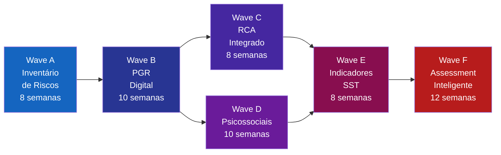
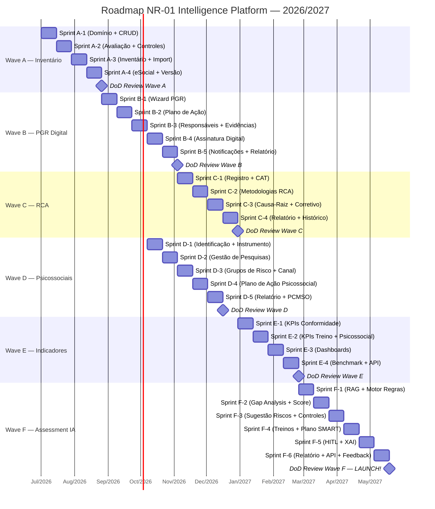
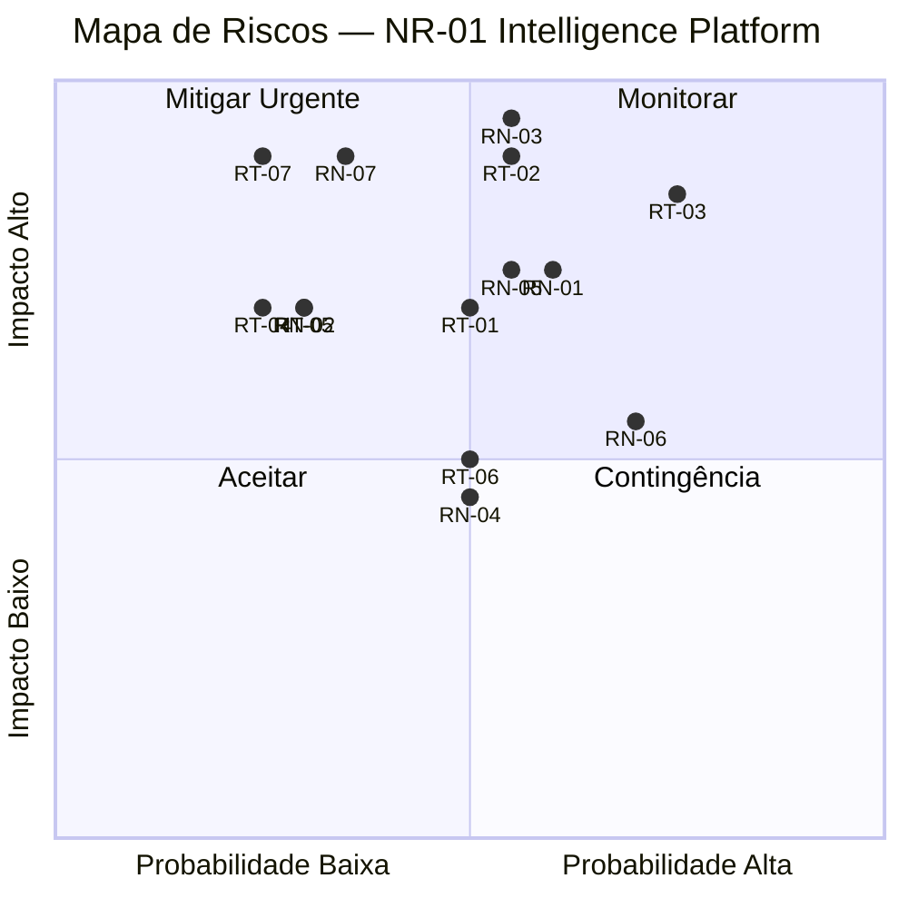
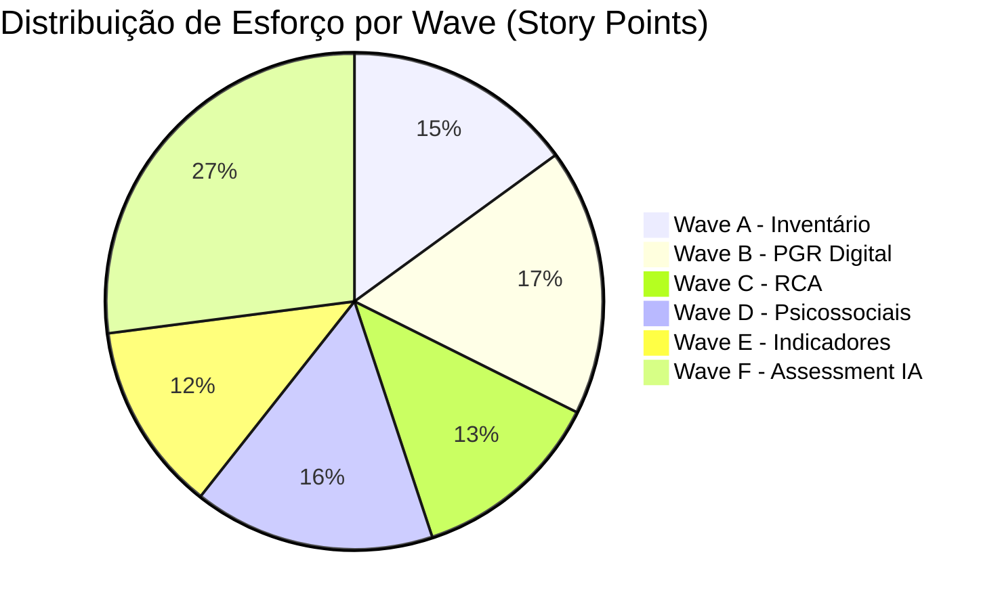

# NR-01 Intelligence Platform — Roadmap Estratégico

**Projeto:** QualitiOS  
**Módulo:** NR-01 Intelligence Platform  
**Documento:** Roadmap Estratégico  
**Versão:** 1.0.0  
**Data:** 2026-06-08  
**Status:** APROVADO  
**Autores:** Equipe de Produto e Arquitetura QualitiOS  

---

## Sumário

1. [Visão Estratégica do Roadmap](#1-visão-estratégica-do-roadmap)
2. [Estrutura de Waves](#2-estrutura-de-waves)
3. [Wave A — Inventário de Riscos](#3-wave-a--inventário-de-riscos)
4. [Wave B — PGR Digital](#4-wave-b--pgr-digital)
5. [Wave C — RCA Integrado](#5-wave-c--rca-integrado)
6. [Wave D — Riscos Psicossociais](#6-wave-d--riscos-psicossociais)
7. [Wave E — Painel de Indicadores SST](#7-wave-e--painel-de-indicadores-sst)
8. [Wave F — Assessment Inteligente](#8-wave-f--assessment-inteligente)
9. [Diagrama Gantt do Roadmap](#9-diagrama-gantt-do-roadmap)
10. [Mapa de Riscos do Projeto](#10-mapa-de-riscos-do-projeto)
11. [Critérios de Go/No-Go entre Waves](#11-critérios-de-gono-go-entre-waves)
12. [Estimativas de Esforço por Wave](#12-estimativas-de-esforço-por-wave)
13. [Equipe Necessária por Wave](#13-equipe-necessária-por-wave)
14. [Estratégia de Release e Versionamento](#14-estratégia-de-release-e-versionamento)

---

## 1. Visão Estratégica do Roadmap

### 1.1 Objetivo

O Roadmap Estratégico da NR-01 Intelligence Platform define a trajetória de entrega de valor do módulo, organizada em **6 Waves** sequenciais e incrementais. Cada Wave entrega capacidades funcionais utilizáveis pelos clientes desde o primeiro dia, evoluindo de um inventário digital básico até um assessment inteligente assistido por IA.

### 1.2 Princípios do Roadmap

| Princípio | Descrição |
|---|---|
| **Valor Incremental** | Cada Wave entrega capacidade utilizável e com valor de negócio isolado |
| **Conformidade Regulatória Primeiro** | As features de conformidade NR-01 têm prioridade sobre features de conveniência |
| **Feedback Loop** | Cada Wave gera feedback de usuários que alimenta o planejamento da próxima |
| **Dependência Mínima** | Waves são desenhadas para ter dependências internas minimizadas |
| **Qualidade sobre Velocidade** | Nenhuma Wave avança sem a DoD da anterior estar completa |

### 1.3 Visão Geral das Waves



### 1.4 Horizonte de Tempo Total

| Período | Waves | Status |
|---|---|---|
| **Q3 2026 (Jul-Set)** | Wave A + início Wave B | Em planejamento |
| **Q4 2026 (Out-Dez)** | Wave B + Wave C + Wave D (paralelo parcial) | Planejado |
| **Q1 2027 (Jan-Mar)** | Wave D (conclusão) + Wave E | Planejado |
| **Q2 2027 (Abr-Jun)** | Wave F — Assessment Inteligente | Planejado |
| **Total** | 56 semanas (~14 meses) | — |

---

## 2. Estrutura de Waves

### 2.1 Template de Wave

Cada Wave é documentada com os seguintes elementos:

| Elemento | Descrição |
|---|---|
| **Objetivo** | O que a wave entrega e por que é importante |
| **Critério de Entrada** | Pré-condições para iniciar a wave |
| **Escopo** | Funcionalidades incluídas e excluídas |
| **Entregáveis** | Artefatos concretos entregues ao final |
| **Duração Estimada** | Calendário em semanas de desenvolvimento |
| **Dependências** | Waves, sistemas e equipes das quais depende |
| **Definition of Done (DoD)** | Critérios objetivos de conclusão |
| **Story Points** | Estimativa de esforço total |
| **Equipe** | Composição do time necessário |

### 2.2 Escala de Story Points

| Fibonacci | Esforço | Complexidade |
|---|---|---|
| 1 | < 2h | Trivial — CRUD simples |
| 2 | 2-4h | Simples — lógica mínima |
| 3 | 4-8h | Pequeno — lógica de negócio básica |
| 5 | 1-2 dias | Médio — integração simples |
| 8 | 2-4 dias | Grande — integração complexa |
| 13 | 4-6 dias | Muito grande — componente novo |
| 21 | 1-2 semanas | Épico — deveria ser quebrado |

### 2.3 Velocidade de Time Estimada

Considerando o time-base definido (ver seção 13):
- **Velocidade por Sprint (2 semanas):** 60-80 story points
- **Velocidade média utilizada no planejamento:** 70 SP/sprint

---

## 3. Wave A — Inventário de Riscos

### 3.1 Objetivo

Entregar a capacidade de **digitalização e gestão do inventário de riscos ocupacionais**, conforme exigido pelo item 1.5.1.1 da NR-01. Esta é a wave fundacional — sem um inventário digital estruturado, as waves subsequentes não têm dados para operar.

**Valor de negócio:** Empresas poderão substituir planilhas Excel e laudos PDF por um sistema estruturado, pesquisável e integrado ao eSocial S-2240.

### 3.2 Critério de Entrada

- [ ] Infraestrutura de cloud provisionada (Kubernetes + banco de dados relacional)
- [ ] Bounded Context NR-01 com domínio modelado (entidades: GHE, Perigo, Risco, Controle)
- [ ] API Gateway configurada
- [ ] Pipeline CI/CD operacional
- [ ] Tenant de desenvolvimento disponível com dados de teste
- [ ] Design System do QualitiOS homologado

### 3.3 Escopo

#### Incluído na Wave A:

| # | Funcionalidade | Descrição |
|---|---|---|
| A-01 | Cadastro de GHEs | CRUD de Grupos Homogêneos de Exposição com funções e trabalhadores |
| A-02 | Cadastro de Perigos | Registro de perigos por grupo de risco (físico, químico, biológico, ergonômico, acidente) |
| A-03 | Avaliação de Riscos | Cálculo de nível de risco (Probabilidade × Severidade × Exposição) |
| A-04 | Registro de Controles | Controles existentes por nível hierárquico |
| A-05 | Inventário Consolidado | Visão tabular e filtrada do inventário completo |
| A-06 | Import/Export | Import de inventário via planilha modelo; export PDF/XLSX |
| A-07 | Integração S-2240 | Envio das condições ambientais ao eSocial |
| A-08 | Versionamento | Controle de versões do inventário com histórico de alterações |
| A-09 | Notificações | Alertas de revisão periódica vencida ou próxima do vencimento |
| A-10 | RBAC Básico | Controle de acesso por papel: Admin, Profissional SST, Gestor, Visualizador |

#### Excluído da Wave A (próximas waves):

- Geração automática do PGR completo (Wave B)
- Análise de causa-raiz de incidentes (Wave C)
- Avaliação de riscos psicossociais (Wave D)
- Indicadores e dashboards avançados (Wave E)
- Sugestões de IA (Wave F)

### 3.4 Entregáveis

| Entregável | Tipo | Responsável |
|---|---|---|
| Módulo de Inventário de Riscos | Software em produção | Dev Team |
| Documentação de usuário (manual) | Documento | Tech Writer |
| Casos de teste automatizados | Suite de testes | QA |
| Integração S-2240 homologada | Integração certificada | Dev + DevOps |
| Template de import (planilha) | Arquivo modelo | Dev + SST |
| Relatório de conformidade básico | Feature de produto | Dev |
| Material de onboarding | Tutorial interativo | UX + Dev |

### 3.5 Duração Estimada

**Total: 8 semanas (4 sprints de 2 semanas)**

| Sprint | Foco | Funcionalidades |
|---|---|---|
| Sprint A-1 | Domínio + CRUD básico | A-01, A-02, A-10 |
| Sprint A-2 | Avaliação + Controles | A-03, A-04 |
| Sprint A-3 | Inventário consolidado + Import/Export | A-05, A-06 |
| Sprint A-4 | eSocial + Versionamento + Notificações | A-07, A-08, A-09 |

### 3.6 Dependências

| Dependência | Tipo | Criticalidade |
|---|---|---|
| Infraestrutura cloud (AWS/Azure) | Técnica | BLOQUEANTE |
| Certificação do conector eSocial S-2240 | Regulatória | ALTA |
| Validação do modelo de domínio pelo Comitê SST | Negócio | ALTA |
| Design System QualitiOS | UX | MÉDIA |
| API de multitenancy | Técnica | ALTA |

### 3.7 Definition of Done — Wave A

- [ ] **Funcional:** Todas as 10 funcionalidades do escopo implementadas e testadas
- [ ] **Qualidade:** Cobertura de testes unitários ≥ 80% nos módulos críticos
- [ ] **Performance:** Listagem de inventário (≤ 500 GHEs) renderiza em < 2 segundos
- [ ] **eSocial:** Integração S-2240 validada com ambiente de homologação do governo federal
- [ ] **Segurança:** Penetration test básico sem vulnerabilidades críticas ou altas abertas
- [ ] **Usabilidade:** Teste com 3 profissionais SST reais — taxa de conclusão de tarefas ≥ 85%
- [ ] **Documentação:** Manual do usuário publicado e tutorial onboarding disponível
- [ ] **LGPD:** DPO validou o tratamento de dados de saúde do módulo
- [ ] **Acessibilidade:** Conformidade WCAG 2.1 nível AA nas telas críticas
- [ ] **Deploy:** Módulo em produção no ambiente de staging com dados de cliente piloto

---

## 4. Wave B — PGR Digital

### 4.1 Objetivo

Transformar o inventário de riscos em um **Programa de Gerenciamento de Riscos (PGR) completo**, conforme NR-01 item 1.5.1 a 1.5.4. A Wave B entrega a capacidade de elaborar, versionar, assinar digitalmente e publicar o PGR em formato legal, além do plano de ação estruturado.

**Valor de negócio:** Clientes eliminam consultores externos para elaboração do PGR básico, reduzindo custo de compliance em até 60%.

### 4.2 Critério de Entrada

- [ ] Wave A — DoD 100% verificada e aprovada pelo Comitê de Produto
- [ ] Pelo menos 3 clientes utilizando ativamente o inventário (validação de mercado)
- [ ] Feedback da Wave A processado e backlog de correções executado
- [ ] Modelo de PGR validado juridicamente por advogado trabalhista parceiro
- [ ] Integração com assinatura digital (ICP-Brasil ou DocuSign) contratada

### 4.3 Escopo

#### Incluído na Wave B:

| # | Funcionalidade | Descrição |
|---|---|---|
| B-01 | Wizard de PGR | Fluxo guiado de criação do PGR com validação em cada etapa |
| B-02 | Plano de Ação | Registro e acompanhamento de ações corretivas e preventivas |
| B-03 | Priorização de Ações | Matriz de priorização baseada em criticidade do risco |
| B-04 | Responsáveis e Prazos | Atribuição de responsáveis, prazos e acompanhamento de status |
| B-05 | Versionamento do PGR | Histórico de versões com log de alterações |
| B-06 | Assinatura Digital | Assinatura do PGR por profissional habilitado (ICP-Brasil) |
| B-07 | Publicação e Compartilhamento | Link público de acesso ao PGR (leitura) para fiscalização e trabalhadores |
| B-08 | Evidências e Anexos | Upload e vinculação de evidências às ações do plano |
| B-09 | Acompanhamento de Execução | Dashboard de status do plano de ação |
| B-10 | Histórico de Revisões | Registro de revisões periódicas do PGR |
| B-11 | Notificações de Prazo | Alertas para ações vencendo e PGR próximo de revisão |
| B-12 | Relatório Gerencial | Relatório executivo do PGR para apresentação à diretoria |

#### Excluído da Wave B:

- Análise automática de gaps (Wave F)
- Sugestões de IA para o plano de ação (Wave F)
- Indicadores de tendência (Wave E)

### 4.4 Entregáveis

| Entregável | Tipo |
|---|---|
| Módulo PGR Digital em produção | Software |
| Template de PGR validado juridicamente | Documento legal |
| Integração de assinatura digital homologada | Integração |
| Dashboard de plano de ação | Feature |
| Documentação de usuário atualizada | Documento |
| Casos de teste E2E do fluxo PGR completo | Suite de testes |
| Vídeo tutorial de criação do PGR | Material de treinamento |

### 4.5 Duração Estimada

**Total: 10 semanas (5 sprints de 2 semanas)**

| Sprint | Foco | Funcionalidades |
|---|---|---|
| Sprint B-1 | Wizard PGR + estrutura | B-01, B-05 |
| Sprint B-2 | Plano de Ação + Priorização | B-02, B-03 |
| Sprint B-3 | Responsáveis + Evidências + Acompanhamento | B-04, B-08, B-09 |
| Sprint B-4 | Assinatura Digital + Publicação | B-06, B-07 |
| Sprint B-5 | Notificações + Relatório + Histórico + Polimento | B-10, B-11, B-12 |

### 4.6 Dependências

| Dependência | Tipo | Criticalidade |
|---|---|---|
| Wave A — DoD completa | Funcional | BLOQUEANTE |
| Validação jurídica do template de PGR | Legal | BLOQUEANTE |
| Provedor de assinatura digital ICP-Brasil | Terceiro | ALTA |
| Validação por Engenheiro de Segurança parceiro | Domínio | ALTA |

### 4.7 Definition of Done — Wave B

- [ ] **Fluxo Completo:** Criar PGR do zero até assinatura digital em menos de 2 horas (para empresa com ≤ 50 GHEs)
- [ ] **Legal:** Template de PGR validado por advogado trabalhista e engenheiro de segurança
- [ ] **Assinatura:** ICP-Brasil integrado e PGR assinado validado pela Receita Federal
- [ ] **Rastreabilidade:** Todas as alterações no PGR registradas com usuário, data e justificativa
- [ ] **Performance:** Geração do documento PDF do PGR em < 30 segundos para PGR de 100 páginas
- [ ] **Testes:** 100% dos fluxos críticos cobertos por testes E2E automatizados
- [ ] **Usabilidade:** Profissional SST conclui criação do PGR sem suporte em sessão de teste
- [ ] **LGPD:** Dados do PGR com criptografia em repouso e em trânsito

---

## 5. Wave C — RCA Integrado

### 5.1 Objetivo

Implementar o módulo de **Análise de Causa-Raiz (RCA — Root Cause Analysis)** integrado ao registro de incidentes e ao PGR. Permite investigação estruturada de acidentes e incidentes, identificação das causas raízes e vinculação automática ao plano de ação corretivo.

**Valor de negócio:** Reduz reincidência de acidentes similares ao sistematizar a investigação e garantir que as causas raízes sejam endereçadas no PGR.

### 5.2 Critério de Entrada

- [ ] Wave B — DoD 100% verificada e aprovada
- [ ] Registro de incidentes básico disponível (pode ser importado externamente)
- [ ] Metodologias de RCA validadas pelo Comitê SST (Bowtie, Árvore de Causas, Ishikawa)
- [ ] Integração com eSocial S-2210 (CAT) disponível

### 5.3 Escopo

| # | Funcionalidade | Descrição |
|---|---|---|
| C-01 | Registro de Incidente | Formulário estruturado de registro (tipo, data, GHE, consequências) |
| C-02 | Classificação de Incidente | Categorização: acidente com/sem afastamento, quase-acidente, doença ocupacional |
| C-03 | Integração CAT (S-2210) | Envio automático da CAT ao eSocial com dados do registro |
| C-04 | Árvore de Causas | Construção interativa da árvore de causas do incidente |
| C-05 | Diagrama de Ishikawa | Diagrama de espinha de peixe com causas por categoria (6M) |
| C-06 | Metodologia 5 Porquês | Formulário guiado de 5 Porquês com validação de profundidade |
| C-07 | Identificação de Causa-Raiz | Confirmação e documentação da(s) causa(s) raiz identificada(s) |
| C-08 | Plano Corretivo Vinculado | Ações corretivas do RCA integradas ao Plano de Ação do PGR |
| C-09 | Relatório de Investigação | Relatório formal de investigação do incidente (assinável) |
| C-10 | Histórico e Tendências | Painel de incidentes por período, tipo, GHE e causa-raiz |
| C-11 | Lições Aprendidas | Repositório de lições aprendidas por tipo de incidente |

### 5.4 Entregáveis

- Módulo RCA em produção
- Integração S-2210 certificada
- Templates de investigação (Árvore de Causas, Ishikawa, 5 Porquês)
- Relatório de investigação com assinatura digital
- Dashboard de incidentes e tendências

### 5.5 Duração Estimada

**Total: 8 semanas (4 sprints de 2 semanas)**

| Sprint | Foco | Funcionalidades |
|---|---|---|
| Sprint C-1 | Registro + Classificação + CAT | C-01, C-02, C-03 |
| Sprint C-2 | Metodologias RCA | C-04, C-05, C-06 |
| Sprint C-3 | Causa-Raiz + Plano Corretivo | C-07, C-08 |
| Sprint C-4 | Relatório + Histórico + Lições | C-09, C-10, C-11 |

### 5.6 Dependências

| Dependência | Tipo | Criticalidade |
|---|---|---|
| Wave B — DoD completa (Plano de Ação) | Funcional | BLOQUEANTE |
| Integração S-2210 eSocial | Regulatória | ALTA |
| Validação metodológica (Comitê SST) | Domínio | ALTA |
| Template de relatório validado juridicamente | Legal | MÉDIA |

### 5.7 Definition of Done — Wave C

- [ ] **Fluxo RCA:** Registro → Investigação → Causa-Raiz → Plano Corretivo em fluxo único
- [ ] **eSocial:** Integração S-2210 validada no ambiente de homologação federal
- [ ] **Metodologias:** Árvore de Causas, Ishikawa e 5 Porquês funcionais e exportáveis
- [ ] **Integração:** Ações corretivas do RCA aparecem no Plano de Ação do PGR em tempo real
- [ ] **Relatório:** Relatório de investigação gerado e assinável digitalmente
- [ ] **Histórico:** Dashboard de incidentes com filtros por período, GHE e tipo funcionais
- [ ] **Testes:** ≥ 80% de cobertura de testes nos serviços de RCA

---

## 6. Wave D — Riscos Psicossociais

### 6.1 Objetivo

Implementar o módulo específico para **identificação, avaliação e gestão dos fatores de risco psicossocial**, conforme exigido pela NR-01 (2024) que passou a incluir explicitamente fatores psicossociais no escopo do GRO. Esta wave é paralela à Wave C, com início possível após a metade da Wave B.

**Valor de negócio:** Compliance com o requisito mais novo e complexo da NR-01 (2024), diferencial competitivo frente a concorrentes que ainda não abordam psicossociais.

### 6.2 Critério de Entrada

- [ ] Wave B — Sprint B-3 concluída (Plano de Ação funcional)
- [ ] Instrumento de avaliação psicossocial selecionado e validado (ex.: COPSOQ III, Job Stress Scale)
- [ ] Parceria com psicólogo do trabalho para validação metodológica
- [ ] Jurídico validou a metodologia de coleta e anonimização dos dados
- [ ] LGPD: DPO aprovou o tratamento de dados psicossociais (dados sensíveis)

### 6.3 Escopo

| # | Funcionalidade | Descrição |
|---|---|---|
| D-01 | Identificação de Fatores Psicossociais | Checklist de fatores: demanda, controle, apoio social, violência, assédio, autonomia |
| D-02 | Instrumentos de Avaliação | Aplicação digital de questionários validados (COPSOQ III ou equivalente) |
| D-03 | Gestão de Pesquisas | Criação, envio e acompanhamento de pesquisas de clima/saúde mental |
| D-04 | Anonimização Garantida | Sistema de anonimização que garante privacidade dos respondentes |
| D-05 | Análise dos Resultados | Dashboard de resultados por dimensão, setor e comparativo setorial |
| D-06 | Identificação de Grupos de Risco | Identificação automática de GHEs com maior prevalência de fatores de risco |
| D-07 | Plano de Ação Psicossocial | Ações específicas para fatores psicossociais no PGR |
| D-08 | Monitoramento Periódico | Reaplicação programada e acompanhamento de tendências |
| D-09 | Relatório Técnico | Relatório assinável por psicólogo do trabalho ou médico do trabalho |
| D-10 | Canal de Comunicação | Canal seguro e anônimo para relatos de violência e assédio |
| D-11 | Integração PCMSO | Dados psicossociais disponíveis para o PCMSO (NR-07) |

### 6.4 Entregáveis

- Módulo de Riscos Psicossociais em produção
- Instrumento de avaliação digital validado (COPSOQ III ou equivalente)
- Sistema de pesquisa com anonimização certificada
- Dashboard de resultados psicossociais
- Canal seguro de relatos
- Documentação de tratamento de dados (LGPD)
- Relatório técnico assinável

### 6.5 Duração Estimada

**Total: 10 semanas (5 sprints de 2 semanas)**

| Sprint | Foco | Funcionalidades |
|---|---|---|
| Sprint D-1 | Identificação + Instrumento + Anonimização | D-01, D-02, D-04 |
| Sprint D-2 | Gestão de Pesquisas + Análise | D-03, D-05 |
| Sprint D-3 | Grupos de Risco + Canal de Comunicação | D-06, D-10 |
| Sprint D-4 | Plano de Ação + Monitoramento | D-07, D-08 |
| Sprint D-5 | Relatório + PCMSO + Polimento LGPD | D-09, D-11 |

### 6.6 Dependências

| Dependência | Tipo | Criticalidade |
|---|---|---|
| Wave B Sprint B-3 (Plano de Ação) | Funcional | BLOQUEANTE |
| Validação do instrumento psicométrico | Científica | BLOQUEANTE |
| LGPD — Aprovação do DPO | Legal | BLOQUEANTE |
| Parceria com psicólogo do trabalho | Domínio | ALTA |
| NR-07 PCMSO API (futura integração) | Técnica | MÉDIA |

### 6.7 Definition of Done — Wave D

- [ ] **LGPD:** Anonimização dos respondentes verificada por auditoria técnica independente
- [ ] **Instrumento:** Questionário COPSOQ III (ou equivalente) validado por psicólogo credenciado
- [ ] **Pesquisa:** Taxa de resposta em teste piloto ≥ 70% dos colaboradores convidados
- [ ] **Análise:** Dashboard apresenta resultados por dimensão com comparativo setorial (NTEP)
- [ ] **Canal:** Canal de relatos com garantia de anonimato e SLA de resposta definido
- [ ] **PGR:** Ações de fatores psicossociais integradas ao Plano de Ação do PGR
- [ ] **Relatório:** Relatório técnico assinável disponível em PDF normatizado
- [ ] **Conformidade NR-01:** Checklist NR-01 marca itens de fatores psicossociais como atendidos

---

## 7. Wave E — Painel de Indicadores SST

### 7.1 Objetivo

Desenvolver o **Painel de Indicadores de SST (KPIs)** que consolida dados de todas as waves anteriores em uma visão executiva e operacional. Permite acompanhamento de tendências, benchmarking setorial e alertas proativos.

**Valor de negócio:** Gestores e diretores têm visibilidade em tempo real do estado de SST da organização, possibilitando tomada de decisão baseada em dados.

### 7.2 Critério de Entrada

- [ ] Waves A, B, C e D — DoDs verificadas (dados disponíveis para os indicadores)
- [ ] Definição dos KPIs validada pelo Comitê SST e pela Diretoria
- [ ] Contrato com cliente(s) piloto para validação dos dashboards
- [ ] Arquitetura de dados analíticos (data warehouse ou OLAP) definida

### 7.3 Escopo

| # | Funcionalidade | Descrição |
|---|---|---|
| E-01 | KPIs de Conformidade | Score de conformidade NR-01, % de gaps abertos, tendência |
| E-02 | KPIs de Incidentes | Taxa de frequência, taxa de gravidade, taxa de incidência |
| E-03 | KPIs de Plano de Ação | % ações concluídas no prazo, tempo médio de resolução |
| E-04 | KPIs de Treinamento | % colaboradores com treinamentos em dia, cobertura por NR |
| E-05 | KPIs Psicossociais | Índice de risco psicossocial por dimensão e GHE |
| E-06 | Dashboard Executivo | Visão C-Level com KPIs consolidados e semáforo RAG |
| E-07 | Dashboard Operacional | Visão SST com drill-down por GHE, risco, tipo |
| E-08 | Alertas Proativos | Alertas automáticos para KPIs fora do limite aceitável |
| E-09 | Benchmarking Setorial | Comparação anônima com organizações do mesmo CNAE |
| E-10 | Exportação de Relatórios | Exportação de relatórios gerenciais em PDF e XLSX |
| E-11 | API de Indicadores | API REST para integração com BI externo (Power BI, Looker) |
| E-12 | Histórico Temporal | Evolução histórica de todos os KPIs com granularidade configurável |

### 7.4 Entregáveis

- Dashboard Executivo em produção
- Dashboard Operacional em produção
- API de indicadores documentada (OpenAPI 3.0)
- Sistema de alertas configurável
- Benchmarking setorial (dados anonimizados de ≥ 30 empresas)
- Documentação de integração com BI externo
- Guia de interpretação dos KPIs (para gestores)

### 7.5 Duração Estimada

**Total: 8 semanas (4 sprints de 2 semanas)**

| Sprint | Foco | Funcionalidades |
|---|---|---|
| Sprint E-1 | KPIs Conformidade + Incidentes + Ação | E-01, E-02, E-03 |
| Sprint E-2 | KPIs Treinamento + Psicossociais + Alertas | E-04, E-05, E-08 |
| Sprint E-3 | Dashboard Executivo + Operacional + Histórico | E-06, E-07, E-12 |
| Sprint E-4 | Benchmarking + Export + API + Polimento | E-09, E-10, E-11 |

### 7.6 Dependências

| Dependência | Tipo | Criticalidade |
|---|---|---|
| Waves A, B, C, D — DoDs completas | Funcional | BLOQUEANTE |
| Dados de benchmark setorial (mínimo 30 empresas) | Dados | ALTA |
| Arquitetura de analytics (OLAP / DW) | Técnica | ALTA |
| Definição formal dos KPIs pelo Comitê | Negócio | ALTA |

### 7.7 Definition of Done — Wave E

- [ ] **KPIs:** Todos os 12 indicadores calculados corretamente validados com dados reais
- [ ] **Dashboard Executivo:** Aprovado por pelo menos 3 diretores/gestores em teste de usabilidade
- [ ] **Alertas:** 100% dos alertas críticos disparados em < 5 minutos após o evento gatilho
- [ ] **Benchmarking:** Dados de ≥ 30 empresas anonimizadas disponíveis para comparação setorial
- [ ] **API:** API de indicadores documentada, versionada e com SLA de disponibilidade 99.9%
- [ ] **Performance:** Dashboards carregam em < 3 segundos para range de 12 meses de dados
- [ ] **Exportação:** Relatório gerencial gerado e exportado corretamente em PDF e XLSX

---

## 8. Wave F — Assessment Inteligente

### 8.1 Objetivo

Implementar o **Assessment Técnico Especializado (ATE) assistido por IA** — o produto premium da NR-01 Intelligence Platform. Utiliza todos os dados coletados nas waves anteriores para gerar análises automáticas de conformidade, sugestões contextualizadas e planos de ação inteligentes.

**Valor de negócio:** Multiplica a capacidade do profissional SST, permite escalar o serviço de compliance para PMEs sem SESMT próprio e cria diferencial competitivo duradouro baseado em IA.

### 8.2 Critério de Entrada

- [ ] Wave E — DoD 100% verificada (dados históricos disponíveis para treinar/validar o modelo)
- [ ] Pelo menos 50 organizações com dados completos (inventário + PGR + incidentes)
- [ ] Pipeline de RAG implementado com base de conhecimento NR carregada
- [ ] Contratos de LLM provider assinados (com cláusula de não-treinamento em dados do cliente)
- [ ] Framework XAI definido e aprovado pelo Comitê de Governança de IA
- [ ] LGPD: DPO aprovou o uso de dados para inferência de IA
- [ ] Painel de especialistas SST recrutado para validação do modelo

### 8.3 Escopo

| # | Funcionalidade | Descrição |
|---|---|---|
| F-01 | Análise Automática de Gaps | Verificação sistemática dos 127 critérios NR-01 |
| F-02 | Score de Conformidade | Cálculo e exibição do score global e por domínio |
| F-03 | Sugestão de Riscos | Riscos prováveis não identificados no inventário |
| F-04 | Sugestão de Controles | Medidas de prevenção priorizadas por hierarquia |
| F-05 | Sugestão de Treinamentos | Trilha de capacitação com gaps identificados |
| F-06 | Plano de Ação SMART Gerado por IA | Rascunho de plano de ação priorizado com IA |
| F-07 | Interface de Revisão Humana | Workflow de confirmação/edição/descarte das sugestões |
| F-08 | Explicabilidade (XAI) | Justificativas legais e evidências para cada sugestão |
| F-09 | Score de Confiança | Score calibrado por sugestão com indicação de incerteza |
| F-10 | Feedback Loop | Mecanismo de feedback do profissional para melhoria do modelo |
| F-11 | Histórico de Assessments | Comparativo entre assessments ao longo do tempo |
| F-12 | Relatório ATE | Relatório completo do assessment exportável e assinável |
| F-13 | Alertas de Conformidade Preditivos | Alertas antes de vencimento de prazo regulatório |
| F-14 | API de Assessment | API para integração de parceiros e white-label |

### 8.4 Entregáveis

- Módulo Assessment Inteligente em produção
- Pipeline RAG com base de conhecimento NR carregada (NR-01 a NR-38)
- Motor de regras NR-01 (127 critérios) implementado
- Interface de revisão humana (HITL workflow)
- Dashboard de governança de IA (para o time QualitiOS)
- Relatório ATE completo e assinável
- Documentação ética da IA (AI Card)
- API de Assessment documentada

### 8.5 Duração Estimada

**Total: 12 semanas (6 sprints de 2 semanas)**

| Sprint | Foco | Funcionalidades |
|---|---|---|
| Sprint F-1 | Pipeline RAG + Motor de Regras | Infraestrutura F-01, F-02 |
| Sprint F-2 | Gap Analysis + Score Conformidade | F-01, F-02 |
| Sprint F-3 | Sugestão de Riscos + Controles | F-03, F-04 |
| Sprint F-4 | Treinamentos + Plano SMART | F-05, F-06 |
| Sprint F-5 | Interface HITL + XAI + Score Confiança | F-07, F-08, F-09 |
| Sprint F-6 | Relatório + API + Feedback + Histórico + Alertas | F-10, F-11, F-12, F-13, F-14 |

### 8.6 Dependências

| Dependência | Tipo | Criticalidade |
|---|---|---|
| Wave E — DoD completa (dados históricos) | Funcional | BLOQUEANTE |
| ≥ 50 organizações com dados completos | Dados | BLOQUEANTE |
| Contrato LLM provider (sem treinamento em dados) | Jurídico | BLOQUEANTE |
| Base de conhecimento NR carregada e validada | Dados | BLOQUEANTE |
| Painel de especialistas SST recrutado | Governança | ALTA |
| Framework XAI aprovado | Governança | ALTA |

### 8.7 Definition of Done — Wave F

- [ ] **Precisão:** Gap Analysis com precisão ≥ 85% validado por painel de especialistas (50 assessments)
- [ ] **Recall:** Taxa de identificação de gaps reais ≥ 90% na avaliação do painel
- [ ] **Confiança Calibrada:** Erro de calibração (ECE) < 5% na avaliação inicial
- [ ] **XAI:** 100% das sugestões têm justificativa legal explícita com citação de artigo
- [ ] **HITL:** Interface de revisão aprovada por ≥ 5 profissionais SST em teste de usabilidade
- [ ] **Performance:** Assessment completo gerado em < 3 minutos para empresa com ≤ 200 GHEs
- [ ] **Feedback:** Loop de feedback operacional — aprovações/edições/descartes capturados
- [ ] **Governança:** Dashboard de governança de IA em operação com métricas de qualidade
- [ ] **API:** API de Assessment com SLA 99.9%, documentada e com sandbox disponível
- [ ] **Ética:** AI Card publicado com limitações, vieses documentados e política de revisão

---

## 9. Diagrama Gantt do Roadmap



---

## 10. Mapa de Riscos do Projeto

### 10.1 Identificação e Avaliação de Riscos

#### Riscos Técnicos

| ID | Risco | Probabilidade | Impacto | Criticidade | Mitigation |
|---|---|---|---|---|---|
| RT-01 | **Latência do LLM inaceitável** para o usuário final (> 3 min/assessment) | MÉDIA | ALTO | 🔴 ALTA | Cache de resultados; RAG com retrieval otimizado; modelo menor para análises simples |
| RT-02 | **Qualidade do RAG** insuficiente — base de conhecimento com informações incorretas | MÉDIA | CRÍTICO | 🔴 CRÍTICA | Curadoria manual da base; validação por especialistas; versioning da KB |
| RT-03 | **Deriva do modelo** de IA após atualização das NRs | ALTA | ALTO | 🔴 CRÍTICA | Monitoramento contínuo; pipeline de atualização da KB em < 30 dias após publicação de NR |
| RT-04 | **Certificação eSocial** atrasada pelo governo federal | BAIXA | ALTO | 🟡 MÉDIA | Ambiente de homologação iniciado no Sprint A-1; fallback manual |
| RT-05 | **Escalabilidade** — sistema degrada com > 500 usuários simultâneos | BAIXA | ALTO | 🟡 MÉDIA | Load testing a partir da Wave B; arquitetura serverless para picos |
| RT-06 | **Integração ICP-Brasil** com complexidade técnica maior que estimada | MÉDIA | MÉDIO | 🟡 MÉDIA | POC no início da Wave B; parceiro certificado contratado |
| RT-07 | **Anonimização dos dados psicossociais** com falhas | BAIXA | CRÍTICO | 🔴 ALTA | Auditoria técnica independente antes do launch da Wave D |

#### Riscos de Negócio

| ID | Risco | Probabilidade | Impacto | Criticidade | Mitigation |
|---|---|---|---|---|---|
| RN-01 | **Resistência do mercado** ao uso de IA para compliance SST | MÉDIA | ALTO | 🔴 ALTA | Marketing educativo; programa piloto com clientes beta; testemunho de especialistas |
| RN-02 | **Atualização da NR-01** durante o desenvolvimento invalida funcionalidades | BAIXA | ALTO | 🟡 MÉDIA | Monitoramento semanal do DOU; arquitetura flexível de regras |
| RN-03 | **Responsabilidade legal** questionada por cliente que usa output da IA sem revisão | MÉDIA | CRÍTICO | 🔴 CRÍTICA | Termos de uso rigorosos; HITL obrigatório; disclaimers em todas as telas de IA |
| RN-04 | **Concorrente lança produto similar** antes da Wave F | MÉDIA | MÉDIO | 🟡 MÉDIA | Acelerar MVP da Wave F; patentear metodologia ATE |
| RN-05 | **Escassez de profissionais SST** para validar o modelo (painel de especialistas) | MÉDIA | ALTO | 🔴 ALTA | Parceria antecipada com ABHO, ANAMT, sindicatos de engenheiros |
| RN-06 | **Custo do LLM provider** superior ao projetado | ALTA | MÉDIO | 🟡 MÉDIA | Fine-tuning de modelo open-source; cache agressivo; modelo híbrido (regras + LLM apenas para casos complexos) |
| RN-07 | **LGPD** — dados de saúde de trabalhadores processados em LLM externo | BAIXA | CRÍTICO | 🔴 ALTA | DPA com provider; pseudonimização antes de envio ao LLM; avaliação de LLM on-premise |

### 10.2 Mapa Visual de Riscos



---

## 11. Critérios de Go/No-Go entre Waves

### 11.1 Processo de Revisão Go/No-Go

Ao final de cada Wave, o **Comitê de Produto** (Product Owner, Tech Lead, Especialista SST, Representante de Clientes) realiza uma revisão de Go/No-Go antes de autorizar o início da Wave seguinte.

**Duração da revisão:** 3 dias úteis após conclusão da última sprint  
**Output:** Decisão documentada com rationale

### 11.2 Critérios por Transição

#### Transição A → B (Inventário → PGR)

| Critério | Threshold | Verificação |
|---|---|---|
| DoD Wave A | 100% itens cumpridos | Checklist auditado |
| Clientes ativos usando inventário | ≥ 3 clientes | Dados de uso do produto |
| Score NPS Wave A | ≥ 50 | Survey com usuários |
| Bugs críticos abertos | = 0 | Issue tracker |
| Integração S-2240 validada | Ambiente de homologação | Certificado eSocial |
| Validação jurídica do template PGR | Advogado trabalhista assinou | Documento assinado |

#### Transição B → C (PGR → RCA)

| Critério | Threshold | Verificação |
|---|---|---|
| DoD Wave B | 100% itens cumpridos | Checklist auditado |
| PGRs gerados e assinados | ≥ 5 | Dados de produção |
| Assinatura digital operacional | Em produção | Logs de assinatura |
| Bugs críticos abertos | = 0 | Issue tracker |
| Integração CAT S-2210 disponível | Ambiente de homologação | Certificado eSocial |

#### Transição B/D → E (PGR+Psicossociais → Indicadores)

| Critério | Threshold | Verificação |
|---|---|---|
| DoD Wave B | 100% cumprida | Checklist |
| DoD Wave C | 100% cumprida | Checklist |
| DoD Wave D | 100% cumprida | Checklist |
| Dados históricos suficientes | ≥ 12 meses, ≥ 10 empresas | Analytics |
| KPIs aprovados pelo Comitê SST | Documento assinado | Ata de reunião |

#### Transição E → F (Indicadores → Assessment IA)

| Critério | Threshold | Verificação |
|---|---|---|
| DoD Wave E | 100% cumprida | Checklist |
| Organizações com dados completos | ≥ 50 | Analytics |
| Contrato LLM provider | Assinado com cláusula DPA | Jurídico |
| Base de conhecimento NR carregada | NR-01 a NR-38 + 5 anos de atualizações | QA da base |
| Painel de especialistas SST | ≥ 5 especialistas recrutados | Contratos assinados |
| Framework XAI aprovado | Comitê de Governança de IA | Ata assinada |
| DPO aprovou uso de IA em dados de saúde | LGPD compliance | Parecer jurídico |

---

## 12. Estimativas de Esforço por Wave

### 12.1 Tabela de Story Points

| Wave | SP Desenvolvimento | SP QA | SP DevOps | SP Documentação | **Total SP** | **Sprints** |
|---|---|---|---|---|---|---|
| **Wave A** | 180 | 60 | 40 | 30 | **310** | 4 |
| **Wave B** | 220 | 70 | 30 | 40 | **360** | 5 |
| **Wave C** | 160 | 55 | 20 | 25 | **260** | 4 |
| **Wave D** | 200 | 65 | 25 | 35 | **325** | 5 |
| **Wave E** | 150 | 50 | 30 | 25 | **255** | 4 |
| **Wave F** | 350 | 100 | 50 | 60 | **560** | 6 |
| **TOTAL** | **1.260** | **400** | **195** | **215** | **2.070** | **28** |

### 12.2 Distribuição por Capacidade



### 12.3 Observações sobre as Estimativas

> **NOTA:** As estimativas de story points foram calibradas com base na experiência da equipe QualitiOS e em projetos similares de plataformas SaaS B2B. A Wave F possui maior incerteza (±30%) devido à natureza experimental dos componentes de IA. As demais waves têm incerteza de ±15%.

**Fatores de risco nas estimativas:**
- Wave D: Complexidade LGPD e anonimização podem aumentar em 20% se surgir exigência legal adicional
- Wave F: Pipeline RAG tem complexidade alta; se optado por fine-tuning de modelo próprio, adicionar +3 sprints
- Todas as waves: Certificação eSocial pode adicionar 1-2 sprints de buffer dependendo da homologação federal

---

## 13. Equipe Necessária por Wave

### 13.1 Time-Base (Disponível em Todas as Waves)

| Papel | Quantidade | Dedicação | Responsabilidade |
|---|---|---|---|
| **Product Owner** | 1 | 100% | Priorização, refinamento, aceitação |
| **Scrum Master / Agile Coach** | 1 | 50% | Cerimônias, impedimentos, métricas |
| **Tech Lead / Arquiteto** | 1 | 100% | Decisões técnicas, code review, ADRs |
| **QA Engineer** | 1 | 100% | Estratégia de testes, automação |
| **DevOps / SRE** | 1 | 50% | CI/CD, infra, monitoramento |
| **UX Designer** | 1 | 50% | Design de interfaces, testes de usabilidade |

### 13.2 Variações por Wave

| Papel Especializado | Wave A | Wave B | Wave C | Wave D | Wave E | Wave F |
|---|---|---|---|---|---|---|
| **Backend Dev Sênior** | 2 | 2 | 2 | 2 | 2 | 2 |
| **Backend Dev Pleno** | 1 | 2 | 1 | 2 | 1 | 2 |
| **Frontend Dev** | 2 | 2 | 1 | 2 | 2 | 2 |
| **Especialista eSocial** | 1 | 0 | 1 | 0 | 0 | 0 |
| **Especialista SST** (consultor) | 1 | 1 | 1 | 1 | 1 | 2 |
| **Especialista em IA / ML** | 0 | 0 | 0 | 0 | 0 | 3 |
| **Data Engineer** | 0 | 0 | 0 | 0 | 1 | 1 |
| **Psicólogo do Trabalho** (consultor) | 0 | 0 | 0 | 1 | 0 | 0 |
| **Advogado Trabalhista** (consultor) | 0.5 | 1 | 0.5 | 1 | 0 | 0.5 |

### 13.3 Tamanho Total da Equipe por Wave

| Wave | Pessoas (Core) | Consultores | **Total** |
|---|---|---|---|
| Wave A | 9 | 2 | **11** |
| Wave B | 10 | 2 | **12** |
| Wave C | 9 | 2 | **11** |
| Wave D | 11 | 3 | **14** |
| Wave E | 10 | 1 | **11** |
| Wave F | 13 | 3 | **16** |

### 13.4 Perfil dos Especialistas SST

Os especialistas SST são consultores externos que participam como **Domain Experts** e atuam em:
- Validação dos critérios NR-01 implementados
- Revisão dos templates de PGR, laudos e relatórios
- Teste de usabilidade como usuários finais reais
- Validação das sugestões da IA na Wave F
- Composição do painel de especialistas para avaliação do modelo

**Perfil mínimo requerido:**
- Engenheiro de Segurança do Trabalho (CREA ativo) ou Técnico de Segurança Sênior
- Mínimo 5 anos de experiência com PGR e NR-01
- Experiência com eSocial SST (diferencial)
- Disponibilidade de ≥ 20h/sprint

---

## 14. Estratégia de Release e Versionamento

### 14.1 Política de Versões

O QualitiOS NR-01 Intelligence Platform adota **Semantic Versioning (SemVer 2.0)**:

```
MAJOR.MINOR.PATCH

MAJOR: Mudança incompatível de API ou quebra de compatibilidade de dados
MINOR: Nova funcionalidade backward-compatible (geralmente = nova Wave ou Feature)
PATCH: Correção de bug, ajuste de segurança, atualização de base de conhecimento
```

### 14.2 Calendário de Releases

| Versão | Wave | Data Prevista | Tipo |
|---|---|---|---|
| **v1.0.0** | Wave A concluída | Setembro/2026 | Release GA |
| **v1.1.0** | Wave A — melhorias pós-feedback | Outubro/2026 | Release minor |
| **v2.0.0** | Wave B concluída (PGR Digital) | Dezembro/2026 | Release GA |
| **v2.1.0** | Wave C concluída (RCA) | Janeiro/2027 | Release minor |
| **v2.2.0** | Wave D concluída (Psicossociais) | Fevereiro/2027 | Release minor |
| **v3.0.0** | Wave E concluída (Indicadores) | Março/2027 | Release GA |
| **v4.0.0** | Wave F concluída (Assessment IA — BETA) | Maio/2027 | Release GA |
| **v4.1.0** | Wave F — saída de BETA | Junho/2027 | Release GA |

### 14.3 Canais de Release

| Canal | Audiência | Critério |
|---|---|---|
| **Alpha** | Equipe interna QualitiOS | Por sprint |
| **Beta Fechado** | 5-10 clientes piloto selecionados | Por wave concluída |
| **Beta Aberto** | Todos os clientes que solicitarem | Wave F apenas |
| **GA (General Availability)** | Todos os clientes | DoD verificada + bugs críticos = 0 |

---

*Documento gerado pela Equipe de Produto e Arquitetura QualitiOS | Versão 1.0.0 | 2026-06-08*  
*Roadmap sujeito a revisão trimestral pelo Comitê de Produto*  
*Próxima revisão programada: 2026-09-08 (pós-conclusão Wave A)*
