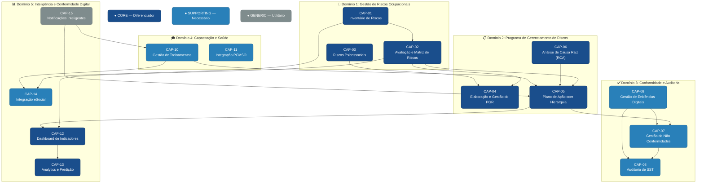
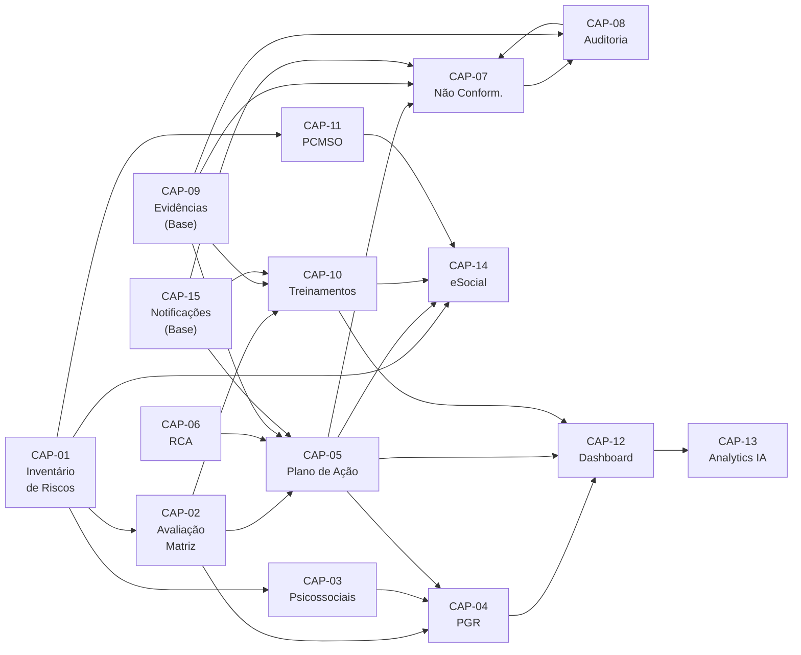
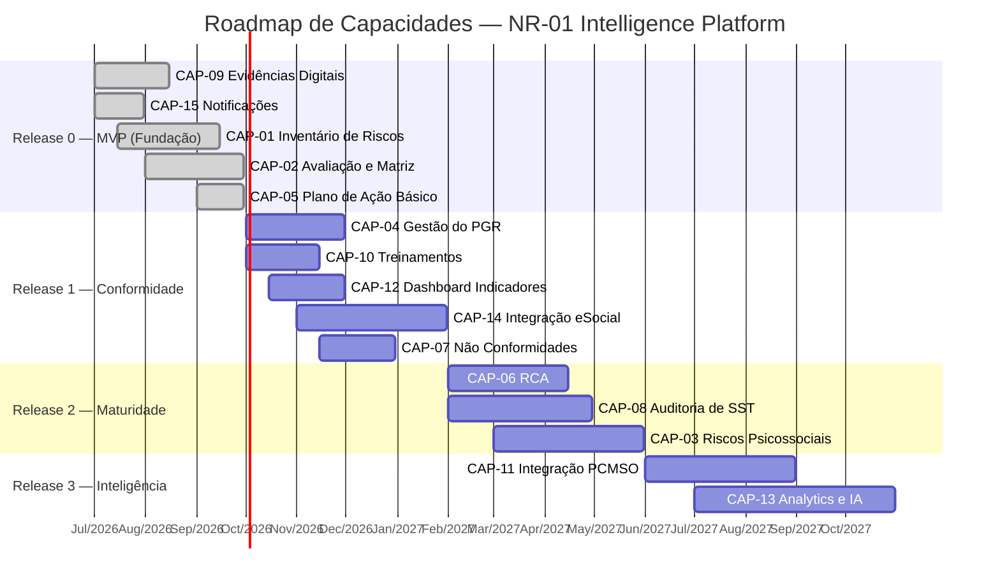

# NR-01 Intelligence Platform — Capability Map

> **Projeto:** QualitiOS  
> **Módulo:** NR-01 Intelligence Platform  
> **Fase:** 01 — Estratégia  
> **Documento:** Capability Map (Mapa de Capacidades)  
> **Versão:** 1.0.0  
> **Data:** 2026-06-08  
> **Status:** Aprovado para Desenvolvimento  

---

## Sumário

1. [Introdução ao Mapa de Capacidades](#1-introdução-ao-mapa-de-capacidades)
2. [Taxonomia de Capacidades](#2-taxonomia-de-capacidades)
3. [Diagrama do Mapa de Capacidades](#3-diagrama-do-mapa-de-capacidades)
4. [Catálogo Detalhado de Capacidades](#4-catálogo-detalhado-de-capacidades)
5. [Heatmap de Valor × Complexidade](#5-heatmap-de-valor--complexidade)
6. [Análise de Dependências entre Capacidades](#6-análise-de-dependências-entre-capacidades)
7. [Plano de Priorização das Capacidades](#7-plano-de-priorização-das-capacidades)
8. [Roadmap de Capacidades por Sprint/Release](#8-roadmap-de-capacidades-por-sprintrelease)

---

## 1. Introdução ao Mapa de Capacidades

### 1.1 O que é um Mapa de Capacidades?

O Mapa de Capacidades (*Capability Map*) é um artefato estratégico de arquitetura de negócio que representa **o que a organização (ou o sistema) é capaz de fazer**, independente de como isso é feito tecnicamente. É uma ferramenta fundamental para:

- **Alinhamento estratégico**: conectar as necessidades de negócio às funcionalidades do sistema
- **Planejamento de investimentos**: priorizar o desenvolvimento baseado em valor e complexidade
- **Comunicação entre stakeholders**: linguagem comum entre negócio e tecnologia
- **Identificação de gaps**: o que ainda precisa ser construído vs. o que já existe
- **Decisões de make-or-buy**: quais capacidades construir vs. adquirir

### 1.2 Estrutura de Classificação

As capacidades do NR-01 Intelligence Platform são classificadas em três níveis:

| Nível | Descrição | Impacto no Negócio |
|---|---|---|
| **Core** | Capacidades que diferenciam o produto no mercado e são a razão de existência do módulo. São o coração do negócio e devem ser desenvolvidas internamente com máxima qualidade. | Diretamente ligadas à proposta de valor única |
| **Supporting** | Capacidades necessárias para que as Core funcionem adequadamente. Importantes, mas não diferenciadoras por si só. | Suportam as capacidades Core |
| **Generic** | Capacidades comuns a qualquer sistema de gestão, sem diferenciação competitiva. Candidatas a uso de bibliotecas, frameworks ou serviços de terceiros. | Infraestrutura e utilidades |

### 1.3 Critérios de Avaliação

| Critério | Escala | Descrição |
|---|---|---|
| **Valor de Negócio** | 1-5 | 1=Irrelevante, 2=Baixo, 3=Médio, 4=Alto, 5=Crítico |
| **Complexidade de Implementação** | 1-5 | 1=Trivial, 2=Simples, 3=Moderada, 4=Complexa, 5=Muito Complexa |
| **Prioridade** | P0/P1/P2/P3 | P0=Imediato, P1=Alta, P2=Média, P3=Baixa |
| **Maturidade Tecnológica** | TRL 1-9 | Nível de prontidão da tecnologia necessária |

---

## 2. Taxonomia de Capacidades

O NR-01 Intelligence Platform possui **15 capacidades primárias** agrupadas em **5 domínios funcionais**:

```
NR-01 Intelligence Platform
├── Domínio 1: Gestão de Riscos Ocupacionais (GRO)
│   ├── CAP-01: Inventário de Riscos (Core)
│   ├── CAP-02: Avaliação e Matriz de Riscos (Core)
│   └── CAP-03: Gerenciamento de Riscos Psicossociais (Core)
│
├── Domínio 2: Programa de Gerenciamento de Riscos (PGR)
│   ├── CAP-04: Elaboração e Gestão do PGR (Core)
│   ├── CAP-05: Plano de Ação com Hierarquia de Controles (Core)
│   └── CAP-06: Análise de Causa Raiz (RCA) (Core)
│
├── Domínio 3: Conformidade e Auditoria
│   ├── CAP-07: Gestão de Não Conformidades (Supporting)
│   ├── CAP-08: Auditoria de SST (Supporting)
│   └── CAP-09: Gestão de Evidências Digitais (Supporting)
│
├── Domínio 4: Capacitação e Saúde
│   ├── CAP-10: Gestão de Treinamentos e Capacitações (Supporting)
│   └── CAP-11: Integração com PCMSO (Supporting)
│
├── Domínio 5: Inteligência e Conformidade Digital
│   ├── CAP-12: Dashboard de Indicadores de SST (Core)
│   ├── CAP-13: Analytics e Predição de Riscos (Core)
│   ├── CAP-14: Integração com eSocial (Supporting)
│   └── CAP-15: Notificações e Alertas Inteligentes (Generic)
```

---

## 3. Diagrama do Mapa de Capacidades



---

## 4. Catálogo Detalhado de Capacidades

### CAP-01 — Inventário de Riscos

| Atributo | Detalhe |
|---|---|
| **ID** | CAP-01 |
| **Nome** | Inventário de Riscos Ocupacionais |
| **Classificação** | Core |
| **Domínio** | Gestão de Riscos Ocupacionais |
| **Valor de Negócio** | ⭐⭐⭐⭐⭐ (5/5) |
| **Complexidade** | ⚙️⚙️⚙️ (3/5) |
| **Prioridade** | P0 — Imediato |
| **Status** | A desenvolver |

**Descrição:**  
Capacidade de identificar, catalogar e manter atualizados todos os perigos presentes nos ambientes de trabalho da organização. O inventário é o ponto de partida do GRO e do PGR, conforme exigido pela NR-01 item 1.5.1 e 1.6.1. Esta capacidade engloba o cadastro estruturado de perigos por tipo (Físico, Químico, Biológico, Ergonômico, Acidente, Psicossocial), a associação com GHEs (Grupos Homogêneos de Exposição), a vinculação de trabalhadores expostos, o registro de agentes com seus respectivos limites de exposição e a geração do documento "Inventário de Riscos" no formato exigido pela NR-01.

**Funcionalidades Principais:**
- Cadastro de perigos com formulário guiado e taxonomia NR-01
- Associação de perigos a GHEs, setores e funções
- Registro de agentes com código CAS, TLV-TWA, NR-15 quando aplicável
- Importação em lote via planilha Excel/CSV
- Versionamento do inventário com histórico de alterações
- Geração automática do documento Inventário de Riscos em PDF/A
- Integração com banco de dados de agentes (biblioteca interna de perigos comuns por setor CNAE)
- Alertas de revisão obrigatória por mudança de processo

**Valor de Negócio Detalhado:**  
O inventário de riscos é o requisito primordial da NR-01. Sem ele, o PGR é inválido e a empresa está sujeita a autuação imediata. A capacidade de manter o inventário atualizado em tempo real (vs. documentos estáticos) é o principal diferencial competitivo do QualitiOS frente a consultores tradicionais.

**Dependências:**
- Nenhuma (capacidade fundante)

**Métricas de Sucesso:**
- Tempo médio para cadastrar um novo perigo < 3 minutos
- Taxa de cobertura: 100% dos GHEs com inventário válido
- 0 perigos sem avaliação de risco associada após 7 dias

---

### CAP-02 — Avaliação e Matriz de Riscos

| Atributo | Detalhe |
|---|---|
| **ID** | CAP-02 |
| **Nome** | Avaliação e Matriz de Riscos |
| **Classificação** | Core |
| **Domínio** | Gestão de Riscos Ocupacionais |
| **Valor de Negócio** | ⭐⭐⭐⭐⭐ (5/5) |
| **Complexidade** | ⚙️⚙️⚙️ (3/5) |
| **Prioridade** | P0 — Imediato |
| **Status** | A desenvolver |

**Descrição:**  
Capacidade de avaliar os riscos identificados no inventário usando metodologias qualitativas e semiquantitativas, gerando a Matriz de Riscos do PGR. A avaliação combina Probabilidade × Severidade para produzir o Nível de Risco (Trivial, Baixo, Médio, Alto, Crítico) e a prioridade de tratamento. Suporta múltiplas metodologias de avaliação (ABNT NBR ISO 31000, MIL-STD-882E simplificada, matriz 4x4, matriz 5x5) configuráveis por organização.

**Funcionalidades Principais:**
- Interface guiada de avaliação com justificativas obrigatórias
- Suporte a múltiplas metodologias de avaliação configuráveis
- Avaliação de risco residual após medidas de controle existentes
- Geração da Matriz de Riscos visual (heatmap interativo)
- Filtros por nível de risco, tipo de perigo, setor e GHE
- Exportação da matriz em PDF, Excel e PNG
- Histórico de reavaliações com comparativo de evolução do risco
- Trigger automático de plano de ação para riscos ALTO e CRÍTICO
- Validação de coerência: risco residual deve ser menor que risco bruto

**Dependências:**
- CAP-01 (Inventário de Riscos)

**Métricas de Sucesso:**
- 100% dos perigos com avaliação de risco em até 7 dias após identificação
- Tempo médio de avaliação por risco < 5 minutos
- 0 riscos ALTO ou CRITICO sem Plano de Ação vinculado há mais de 30 dias

---

### CAP-03 — Gerenciamento de Riscos Psicossociais

| Atributo | Detalhe |
|---|---|
| **ID** | CAP-03 |
| **Nome** | Gerenciamento de Fatores de Risco Psicossocial (FRP) |
| **Classificação** | Core |
| **Domínio** | Gestão de Riscos Ocupacionais |
| **Valor de Negócio** | ⭐⭐⭐⭐⭐ (5/5) |
| **Complexidade** | ⚙️⚙️⚙️⚙️⚙️ (5/5) |
| **Prioridade** | P1 — Alta |
| **Status** | A desenvolver |

**Descrição:**  
Capacidade específica para identificar, avaliar e gerenciar os Fatores de Risco Psicossocial (FRP) exigidos pela NR-01 atualizada 2024 (item 1.5.3). Esta é a capacidade mais inovadora do módulo, pois a gestão de riscos psicossociais é nova obrigação legal e não existe solução consolidada no mercado brasileiro. Inclui instrumentos de avaliação validados internacionalmente (adaptados para o contexto brasileiro), análise de dados agregados com proteção de privacidade individual (anonimização) e geração do Laudo de Avaliação dos FRP.

**Funcionalidades Principais:**
- Questionários de avaliação psicossocial integrados à plataforma:
  - COPSOQ III (Copenhagen Psychosocial Questionnaire) — versão brasileira
  - JCQ (Job Content Questionnaire — Karasek) — validado no Brasil
  - Indicadores de Burnout (Maslach Burnout Inventory simplificado)
- Envio por link/QR Code com resposta anônima pelo trabalhador
- Análise estatística com médias por setor, função e turno (mínimo 5 respondentes para anonimização)
- Mapa de calor de risco psicossocial por área organizacional
- Laudo automático de Avaliação dos FRP com resultados e recomendações
- Plano de ação específico para FRP (com medidas organizacionais, não apenas EPI)
- Integração com indicadores de absenteísmo e rotatividade
- Módulo de canal de denúncia anônima (assédio moral/sexual)
- Dashboard de tendências ao longo do tempo

**Conformidade Legal:**
Esta capacidade atende diretamente à NR-01 item 1.5.3 que exige: identificação, avaliação com instrumento validado, implementação de medidas de controle e revisão periódica dos FRP.

**Dependências:**
- CAP-01 (Inventário de Riscos — integra FRP como tipo de perigo)
- CAP-02 (Avaliação — metodologia específica para FRP)

**Métricas de Sucesso:**
- Taxa de resposta ao questionário psicossocial > 70%
- % de organizações com Laudo FRP emitido anualmente > 90%
- % de planos de ação para FRP com medidas organizacionais (não apenas individuais) > 80%

---

### CAP-04 — Elaboração e Gestão do PGR

| Atributo | Detalhe |
|---|---|
| **ID** | CAP-04 |
| **Nome** | Elaboração e Gestão do Programa de Gerenciamento de Riscos (PGR) |
| **Classificação** | Core |
| **Domínio** | Programa de Gerenciamento de Riscos |
| **Valor de Negócio** | ⭐⭐⭐⭐⭐ (5/5) |
| **Complexidade** | ⚙️⚙️⚙️⚙️ (4/5) |
| **Prioridade** | P0 — Imediato |
| **Status** | A desenvolver |

**Descrição:**  
Capacidade central de compilar, gerar, assinar e manter o Programa de Gerenciamento de Riscos (PGR) conforme NR-01 item 1.6. O PGR é o documento legal obrigatório que consolida o Inventário de Riscos e o Plano de Ação. Esta capacidade garante que o PGR seja um documento vivo, versionado e auditável — não uma planilha estática. Inclui geração automática do documento a partir dos dados da plataforma, assinatura digital ICP-Brasil pelo Responsável Técnico, controle de versões e rastreabilidade de revisões.

**Funcionalidades Principais:**
- Geração automática do PGR consolidado a partir de dados do sistema (Inventário + Plano de Ação)
- Templates configuráveis por porte de empresa (MEI/ME simplificado vs. grande empresa)
- Editor inline para customização do documento mantendo integridade dos dados estruturados
- Assinatura digital ICP-Brasil integrada (BirdSign/Clicksign ou similar)
- Versionamento semântico: MAJOR.MINOR.PATCH
- Controle de prazo de revisão com alertas 60/30/15 dias antes do vencimento
- Publicação do PGR para acesso dos trabalhadores (read-only por GHE)
- Histórico completo de versões com diff de alterações
- Modo de revisão colaborativa com aprovação em fluxo
- Geração de versão simplificada para microempresas (Anexo I NR-01)
- Exportação em PDF/A-2b (archival) para valor legal prolongado

**Dependências:**
- CAP-01 (Inventário de Riscos — conteúdo)
- CAP-02 (Avaliação de Riscos — conteúdo)
- CAP-03 (FRP — conteúdo)
- CAP-05 (Plano de Ação — conteúdo)

**Métricas de Sucesso:**
- Tempo de geração do PGR < 30 segundos
- 100% das empresas com PGR assinado e vigente
- 0 PGRs vencidos (sem revisão anual) na base

---

### CAP-05 — Plano de Ação com Hierarquia de Controles

| Atributo | Detalhe |
|---|---|
| **ID** | CAP-05 |
| **Nome** | Gestão de Planos de Ação com Hierarquia de Controles NR-01 |
| **Classificação** | Core |
| **Domínio** | Programa de Gerenciamento de Riscos |
| **Valor de Negócio** | ⭐⭐⭐⭐⭐ (5/5) |
| **Complexidade** | ⚙️⚙️⚙️ (3/5) |
| **Prioridade** | P0 — Imediato |
| **Status** | A desenvolver |

**Descrição:**  
Capacidade de criar, gerenciar, monitorar e encerrar Planos de Ação de SST, com enforcing da Hierarquia de Controles exigida pela NR-01 item 1.5.4. Cada ação deve ser classificada na hierarquia (Eliminação → Substituição → Engenharia → Administrativo → EPI), com responsável, prazo e evidência de conclusão. O sistema promove automaticamente a Hierarquia de Controles, exigindo justificativa quando medidas de menor eficácia são escolhidas sobre as de maior eficácia.

**Funcionalidades Principais:**
- Criação de planos de ação vinculados a riscos, não conformidades, investigações e auditorias
- Classificação obrigatória na Hierarquia de Controles por item de ação
- Validação: solicita justificativa quando EPI é escolhido sem avaliação de controles superiores
- Atribuição de responsável com aceite eletrônico da responsabilidade
- Workflow de aprovação para ações de alto custo ou impacto
- Monitoramento de progresso com % de conclusão em tempo real
- Sistema de alertas escalonados para itens atrasados:
  - D-5: lembrete ao responsável
  - D+1 (vencido): alerta ao gestor
  - D+3: alerta ao SESMT
  - D+7: alerta à alta direção
- Upload de evidências de conclusão por item
- Relatório de desempenho do plano de ação por período
- Integração com calendário (Google Calendar, Outlook)
- Histórico de renegociações de prazo com justificativa

**Dependências:**
- CAP-02 (Avaliação de Riscos — origem dos riscos que exigem ação)
- CAP-09 (Evidências — para comprovação de conclusão)
- CAP-15 (Notificações — alertas de prazo)

**Métricas de Sucesso:**
- Taxa de conclusão de ações no prazo > 90%
- % de ações classificadas como EPI com justificativa de hierarquia > 95%
- Tempo médio de criação de plano de ação < 10 minutos

---

### CAP-06 — Análise de Causa Raiz (RCA)

| Atributo | Detalhe |
|---|---|
| **ID** | CAP-06 |
| **Nome** | Investigação de Acidentes e Análise de Causa Raiz (RCA) |
| **Classificação** | Core |
| **Domínio** | Programa de Gerenciamento de Riscos |
| **Valor de Negócio** | ⭐⭐⭐⭐ (4/5) |
| **Complexidade** | ⚙️⚙️⚙️⚙️ (4/5) |
| **Prioridade** | P1 — Alta |
| **Status** | A desenvolver |

**Descrição:**  
Capacidade de conduzir investigações estruturadas de acidentes de trabalho, incidentes e quase-acidentes, utilizando metodologias de RCA (Análise de Causa Raiz). Suporta as principais metodologias: Árore de Causas (método francês, indicado pelo MTE), Diagrama de Ishikawa (Espinha de Peixe), 5 Porquês e TAPROOT. O resultado é um laudo de investigação com causas raízes identificadas, plano de ação corretivo e conexão com o inventário de riscos para atualização das avaliações.

**Funcionalidades Principais:**
- Registro de evento (acidente, incidente, quase-acidente) com dados estruturados
- Alerta imediato ao SESMT e gestor com workflow de abertura de investigação
- Emissão de CAT integrada (preenchimento assistido + envio ao INSS via API)
- Editor visual de Árore de Causas (drag-and-drop de nós de causa/condição)
- Editor de Diagrama de Ishikawa com categorias adaptadas para SST
- Ferramenta guiada de 5 Porquês com validação de profundidade analítica
- Identificação e validação de causas raízes com campo de fator organizacional
- Geração automática de plano de ação corretivo a partir das causas raízes
- Conexão com o inventário de riscos: a RCA pode revelar perigos não identificados anteriormente
- Análise de reincidência: busca automática por eventos similares anteriores
- Relatório de investigação com todos os elementos em PDF/A auditável
- Gestão da equipe de investigação com participação registrada
- Linha do tempo do acidente com reconstrução visual dos fatos

**Dependências:**
- CAP-05 (Plano de Ação — origem de ações corretivas)
- CAP-09 (Evidências — fotos, laudos, depoimentos)
- CAP-01 (Inventário — atualização pós-investigação)

**Métricas de Sucesso:**
- Tempo médio de abertura de investigação após evento < 2 horas
- % de acidentes com afastamento com RCA concluída < 30 dias: > 95%
- Taxa de reincidência de eventos com causas raízes tratadas < 5%

---

### CAP-07 — Gestão de Não Conformidades

| Atributo | Detalhe |
|---|---|
| **ID** | CAP-07 |
| **Nome** | Gestão de Não Conformidades de SST |
| **Classificação** | Supporting |
| **Domínio** | Conformidade e Auditoria |
| **Valor de Negócio** | ⭐⭐⭐⭐ (4/5) |
| **Complexidade** | ⚙️⚙️⚙️ (3/5) |
| **Prioridade** | P1 — Alta |
| **Status** | A desenvolver |

**Descrição:**  
Capacidade de registrar, classificar, tratar e encerrar não conformidades identificadas em auditorias, fiscalizações da AFT (Auditor-Fiscal do Trabalho), inspeções internas ou autoavaliações. O ciclo de vida da não conformidade é gerenciado do registro ao encerramento, com rastreabilidade completa, associação com planos de ação corretiva e evidências de eficácia.

**Funcionalidades Principais:**
- Registro estruturado de não conformidades com classificação por tipo e severidade
- Identificação do requisito legal/normativo violado com referência precisa (ex: NR-01 item 1.6.1)
- Workflow de tratamento: abertura → análise de causa → plano de ação → verificação de eficácia → encerramento
- Prazo regulatório automático baseado na severidade da NC
- Controle de recorrência: alerta quando a mesma NC ocorre mais de uma vez
- Dashboard de NC por status, setor, tipo e tempo de resolução
- Integração com relatórios de auditoria (CAP-08)
- Integração com planos de ação (CAP-05)
- Histórico de tratamentos anteriores para NC recorrentes

**Dependências:**
- CAP-05 (Plano de Ação — tratamento)
- CAP-08 (Auditoria — origem de NCs)
- CAP-09 (Evidências — comprovação de encerramento)

**Métricas de Sucesso:**
- % de NCs críticas encerradas dentro do prazo > 95%
- Taxa de recorrência de NCs < 10%
- Tempo médio de resolução de NC MAIOR < 30 dias

---

### CAP-08 — Auditoria de SST

| Atributo | Detalhe |
|---|---|
| **ID** | CAP-08 |
| **Nome** | Gestão de Auditorias de SST |
| **Classificação** | Supporting |
| **Domínio** | Conformidade e Auditoria |
| **Valor de Negócio** | ⭐⭐⭐⭐ (4/5) |
| **Complexidade** | ⚙️⚙️⚙️⚙️ (4/5) |
| **Prioridade** | P1 — Alta |
| **Status** | A desenvolver |

**Descrição:**  
Capacidade de planejar, conduzir, documentar e acompanhar auditorias de SST — internas e externas. Suporta auditorias baseadas em listas de verificação configuráveis (checklists NR-01, ISO 45001, e requisitos customizados da organização). O auditor pode conduzir a auditoria diretamente na plataforma mobile/web, registrando achados, fotografias e não conformidades em tempo real. O relatório de auditoria é gerado automaticamente.

**Funcionalidades Principais:**
- Planejamento de auditoria com escopo, critérios, equipe e cronograma
- Biblioteca de checklists: NR-01 completa, ISO 45001, checklists por NR específica, customizáveis
- Condução da auditoria em interface mobile-first (funcionamento offline com sync)
- Registro de achados em tempo real com foto geotagged
- Classificação de achados: conformidade, não conformidade, observação, oportunidade de melhoria
- Geração automática do Relatório de Auditoria em PDF/A
- Workflow de aprovação do relatório pelo auditor-líder
- Distribuição automática do relatório aos envolvidos
- Plano de ação de auditoria com acompanhamento integrado (CAP-05)
- Histórico de auditorias com evolução do índice de conformidade ao longo do tempo
- Comparativo entre auditorias (primeira vs. segunda vez no mesmo escopo)

**Dependências:**
- CAP-07 (Não Conformidades — criação automática de NCs a partir de achados)
- CAP-09 (Evidências — fotos e documentos da auditoria)
- CAP-05 (Plano de Ação — tratamento de achados)

**Métricas de Sucesso:**
- Tempo de elaboração do relatório de auditoria < 10 minutos (pós-condução)
- % de planos de ação de auditoria com todos os itens concluídos > 90%
- Índice de conformidade médio da base cresce > 10% ao ano

---

### CAP-09 — Gestão de Evidências Digitais

| Atributo | Detalhe |
|---|---|
| **ID** | CAP-09 |
| **Nome** | Gestão de Evidências Digitais com Integridade e Retenção |
| **Classificação** | Supporting |
| **Domínio** | Conformidade e Auditoria |
| **Valor de Negócio** | ⭐⭐⭐⭐⭐ (5/5) |
| **Complexidade** | ⚙️⚙️⚙️ (3/5) |
| **Prioridade** | P0 — Imediato |
| **Status** | A desenvolver |

**Descrição:**  
Capacidade transversal de armazenar, organizar, recuperar e garantir a integridade de evidências digitais de SST. Toda ação do sistema que gera comprovação (conclusão de treinamento, implementação de medida de controle, encerramento de NC, realização de auditoria) deve ter evidência digital vinculada. A integridade é garantida por hash SHA-256 e, para documentos críticos, por carimbo de tempo (timestamp authority) e assinatura digital.

**Funcionalidades Principais:**
- Upload de arquivos multi-tipo: PDF, imagens, vídeos, documentos Office, áudios
- Validação de integridade por hash SHA-256 calculado no upload
- Organização automática por entidade vinculada (risco, ação, treinamento, etc.)
- Motor de busca full-text sobre o conteúdo dos documentos (OCR + indexação)
- Política de retenção automática por tipo de evidência (5, 10, 20 anos, permanente)
- Carimbo de tempo RFC 3161 para documentos juridicamente relevantes
- Integração com assinatura digital ICP-Brasil para documentos formais
- Controle de acesso por entidade vinculada (segmentação por GHE/setor)
- Alerta de expiração de evidências com validade temporal (ex: ASO)
- Exportação em lote organizada por tema (para auditorias e fiscalizações)
- Immutable audit trail: nenhuma evidência pode ser deletada, apenas arquivada

**Dependências:**
- Nenhuma (capacidade utilitária usada por todas as outras)

**Métricas de Sucesso:**
- 100% das evidências com hash de integridade verificável
- Tempo de recuperação de evidência por busca < 5 segundos
- 0 evidências perdidas ou corrompidas

---

### CAP-10 — Gestão de Treinamentos e Capacitações

| Atributo | Detalhe |
|---|---|
| **ID** | CAP-10 |
| **Nome** | Gestão de Treinamentos e Capacitações em SST |
| **Classificação** | Supporting |
| **Domínio** | Capacitação e Saúde |
| **Valor de Negócio** | ⭐⭐⭐⭐⭐ (5/5) |
| **Complexidade** | ⚙️⚙️⚙️ (3/5) |
| **Prioridade** | P0 — Imediato |
| **Status** | A desenvolver |

**Descrição:**  
Capacidade de gerenciar o ciclo completo de capacitações em SST exigidas pela NR-01 e demais NRs: planejamento, execução, registro de participantes, avaliação de aprendizagem, emissão de certificados e envio ao eSocial. Controla a validade dos treinamentos com alertas automáticos e garante que nenhum trabalhador execute atividades sem treinamento obrigatório vigente.

**Funcionalidades Principais:**
- Cadastro de treinamentos com conteúdo programático, carga horária e qualificação do instrutor
- Matriz de treinamentos obrigatórios por função/NR (configurável e com base pré-carregada)
- Controle de validade individual por trabalhador com alertas de vencimento
- Registro digital de participantes com aceite eletrônico (substitui lista de presença em papel)
- Aplicação de avaliação online com banco de questões por treinamento
- Emissão automática de certificado de conclusão com QR Code verificável
- Envio automatizado do evento S-2245 ao eSocial após conclusão do treinamento
- Dashboard: % de trabalhadores com treinamentos em dia por setor/função
- Calendário de treinamentos com planejamento anual
- Integração com plataformas de EAD externas (SCORM 1.2/2004)
- Relatório gerencial de conformidade de treinamentos para auditorias

**Dependências:**
- CAP-02 (Riscos — treinar para riscos específicos do GHE)
- CAP-14 (eSocial — envio do S-2245)
- CAP-09 (Evidências — registro de listas de presença, certificados)

**Métricas de Sucesso:**
- % de trabalhadores com todos os treinamentos obrigatórios em dia > 98%
- % de eventos S-2245 enviados automaticamente > 95%
- Tempo de emissão de certificado < 1 minuto após conclusão

---

### CAP-11 — Integração com PCMSO

| Atributo | Detalhe |
|---|---|
| **ID** | CAP-11 |
| **Nome** | Integração com Programa de Controle Médico de Saúde Ocupacional (PCMSO) |
| **Classificação** | Supporting |
| **Domínio** | Capacitação e Saúde |
| **Valor de Negócio** | ⭐⭐⭐ (3/5) |
| **Complexidade** | ⚙️⚙️⚙️⚙️ (4/5) |
| **Prioridade** | P2 — Média |
| **Status** | A desenvolver |

**Descrição:**  
Capacidade de integrar os dados do PGR (riscos identificados para cada GHE) com o PCMSO, alimentando automaticamente a indicação dos exames médicos ocupacionais necessários para cada função. A integração garante que os ASOs (Atestados de Saúde Ocupacional) reflitam os riscos reais identificados no PGR — eliminando a desconexão histórica entre os dois programas. Também controla a validade dos ASOs e integra com o eSocial.

**Funcionalidades Principais:**
- Integração de dados: riscos do PGR → indicação de exames no PCMSO por função
- Controle de validade de ASO por trabalhador com alertas de vencimento
- Registro de exames realizados com resultados (APTO, APTO COM RESTRIÇÃO, INAPTO)
- Calendário de exames periódicos por trabalhador
- Integração com sistemas de medicina do trabalho via API (WebMed, TOTVS, etc.)
- Relatório de conformidade do PCMSO
- Alerta para gestores quando trabalhador está com ASO vencido

**Dependências:**
- CAP-01 (Inventário de Riscos — base para indicação de exames)
- CAP-02 (Avaliação de Riscos — determina obrigatoriedade de exames)

**Métricas de Sucesso:**
- 100% dos trabalhadores com ASO válido e compatível com os riscos do PGR
- 0 casos de trabalhador com ASO vencido em atividade

---

### CAP-12 — Dashboard de Indicadores de SST

| Atributo | Detalhe |
|---|---|
| **ID** | CAP-12 |
| **Nome** | Dashboard de Indicadores de SST (Reativos e Proativos) |
| **Classificação** | Core |
| **Domínio** | Inteligência e Conformidade Digital |
| **Valor de Negócio** | ⭐⭐⭐⭐⭐ (5/5) |
| **Complexidade** | ⚙️⚙️⚙️ (3/5) |
| **Prioridade** | P1 — Alta |
| **Status** | A desenvolver |

**Descrição:**  
Capacidade de apresentar, em tempo real, os indicadores de desempenho de SST mais relevantes para cada perfil de usuário (trabalhador, gestor, SESMT, diretor). O dashboard é a "central de comando" do sistema, consolidando dados de todas as capacidades em visualizações claras e acionáveis. Suporta indicadores reativos (o que aconteceu) e proativos (o que estamos fazendo para prevenir).

**Indicadores Reativos:**
- TIFA (Taxa de Incidência de Frequência de Acidentes)
- Taxa de Gravidade de Acidentes
- Taxa de Incidência de Doenças Ocupacionais
- Dias perdidos por afastamento
- Taxa de absenteísmo relacionado à SST
- Número de CATs emitidas no período

**Indicadores Proativos:**
- % de ações do Plano de Ação concluídas no prazo
- % de riscos ALTO/CRITICO com plano de ação ativo
- % de trabalhadores com treinamentos em dia
- % de trabalhadores com ASO válido
- Taxa de reporte de quase-acidentes (cultura de segurança)
- Índice de conformidade da última auditoria
- % de NCs críticas encerradas no prazo
- Taxa de participação em DDS/conversas de segurança

**Funcionalidades Principais:**
- Dashboards diferenciados por perfil (Operacional, Gerencial, Executivo)
- Gráficos interativos: linha temporal, pizza, barras, heatmap
- Drill-down de indicador → registros originais
- Exportação de relatórios em PDF e Excel
- Comparativo com períodos anteriores e benchmark setorial (CNAE)
- Configuração de alertas por threshold personalizado
- Atualização em tempo real (max latência 5 minutos)
- Visão consolidada multi-empresa (para grupos econômicos e holdings)

**Dependências:**
- Todas as demais capacidades (CAP-01 a CAP-14) alimentam este dashboard

**Métricas de Sucesso:**
- NPS do dashboard > 65 entre usuários executivos
- Tempo de carregamento do dashboard < 2 segundos
- % de usuários que acessam o dashboard semanalmente > 70%

---

### CAP-13 — Analytics e Predição de Riscos

| Atributo | Detalhe |
|---|---|
| **ID** | CAP-13 |
| **Nome** | Analytics Avançado e Predição de Riscos por IA |
| **Classificação** | Core |
| **Domínio** | Inteligência e Conformidade Digital |
| **Valor de Negócio** | ⭐⭐⭐⭐⭐ (5/5) |
| **Complexidade** | ⚙️⚙️⚙️⚙️⚙️ (5/5) |
| **Prioridade** | P2 — Média (versão 2.0) |
| **Status** | A desenvolver |

**Descrição:**  
Capacidade de inteligência artificial e machine learning que analisa o histórico de dados de SST para identificar padrões, tendências e fatores preditores de acidentes. Esta é a capacidade que transforma o QualitiOS de um sistema de conformidade em uma plataforma de inteligência. Na versão inicial, foca em análise descritiva e prescritiva; na v2.0, inclui modelos preditivos treinados com dados anonimizados da base de clientes.

**Funcionalidades Principais (Fase 1 — Descritiva e Prescritiva):**
- Análise de correlação entre indicadores: ex: aumento de horas extras → aumento de quase-acidentes
- Identificação automática de riscos tendendo para CRÍTICO com base na trajetória
- Recomendações automáticas de ações baseadas em boas práticas (knowledge base NR-01)
- Análise de root cause automática com NLP nas descrições de acidentes
- Benchmark comparativo anônimo: "empresas do seu setor com TIFA 30% menor fazem X"

**Funcionalidades Principais (Fase 2 — Preditiva):**
- Modelo de predição de probabilidade de acidente por setor nos próximos 30/60/90 dias
- Score de risco por trabalhador (considerando função, tempo de empresa, treinamentos, histórico)
- Alertas preditivos: "Setor de Manutenção tem indicadores que antecederam acidente em 87% dos casos analisados"
- Recomendações personalizadas por IA baseadas no contexto específico da organização

**Dependências:**
- CAP-12 (Indicadores — dados históricos necessários para análise)
- Mínimo de 6 meses de dados para análises descritivas confiáveis

**Métricas de Sucesso:**
- Acurácia do modelo preditivo (Precisão + Recall F1-score) > 75%
- % de recomendações de IA consideradas relevantes pelos usuários > 70%
- Tempo de processamento de análise < 30 segundos

---

### CAP-14 — Integração com eSocial

| Atributo | Detalhe |
|---|---|
| **ID** | CAP-14 |
| **Nome** | Integração Nativa com eSocial (S-1060, S-2240, S-2245) |
| **Classificação** | Supporting |
| **Domínio** | Inteligência e Conformidade Digital |
| **Valor de Negócio** | ⭐⭐⭐⭐⭐ (5/5) |
| **Complexidade** | ⚙️⚙️⚙️⚙️ (4/5) |
| **Prioridade** | P1 — Alta |
| **Status** | A desenvolver |

**Descrição:**  
Capacidade de integração bidirecional com o eSocial do Governo Federal para os eventos relacionados a SST. A partir dos dados estruturados na plataforma, gera automaticamente os XMLs dos eventos, valida-os contra o XSD oficial, assina digitalmente e transmite. Monitora retornos e trata erros. Elimina o retrabalho de dupla digitação e garante consistência entre o PGR e o eSocial.

**Eventos Suportados:**
- **S-1060** (Tabela de Ambientes de Trabalho): GHE, ambiente, agentes, EPC, EPI
- **S-2240** (Condições Ambientais do Trabalho — por trabalhador): dados de exposição individual
- **S-2245** (Treinamentos e Capacitações): dados de cada treinamento realizado
- **S-2220** (Monitoramento da Saúde do Trabalhador): integração com ASO do PCMSO (CAP-11)

**Funcionalidades Principais:**
- Mapeamento automático dados da plataforma → campos do eSocial
- Validação prévia contra XSD oficial antes do envio
- Assinatura digital do certificado A1/A3 da empresa
- Transmissão com retentativa automática em caso de falha
- Monitoramento de status dos eventos enviados
- Dashboard de eventos pendentes e prazo de envio
- Alertas de prazo: 15 dias antes do vencimento de cada evento
- Histórico de transmissões com recibos
- Gestão de erros de rejeição com orientação de correção

**Dependências:**
- CAP-01 (Inventário → S-1060, S-2240)
- CAP-10 (Treinamentos → S-2245)
- CAP-11 (PCMSO → S-2220)

**Métricas de Sucesso:**
- % de eventos enviados sem intervenção manual > 95%
- % de eventos aceitos sem rejeição > 99% após validação prévia
- 0 eventos enviados em atraso

---

### CAP-15 — Notificações e Alertas Inteligentes

| Atributo | Detalhe |
|---|---|
| **ID** | CAP-15 |
| **Nome** | Sistema de Notificações e Alertas Inteligentes |
| **Classificação** | Generic |
| **Domínio** | Inteligência e Conformidade Digital |
| **Valor de Negócio** | ⭐⭐⭐⭐ (4/5) |
| **Complexidade** | ⚙️⚙️ (2/5) |
| **Prioridade** | P1 — Alta |
| **Status** | A desenvolver |

**Descrição:**  
Capacidade transversal de notificações multicanal que suporta todas as demais capacidades. Gerencia alertas de prazo, vencimentos, eventos críticos e comunicações de fluxo de trabalho. Suporta canais: in-app (push notification web/mobile), e-mail, WhatsApp Business API e SMS. As notificações são configuráveis por tipo e urgência.

**Funcionalidades Principais:**
- Motor de regras de notificação configurável por evento
- Suporte multicanal: in-app, e-mail, WhatsApp Business, SMS
- Escalation ladder automática para alertas não reconhecidos
- Notificações push para app mobile (PWA/native)
- Digest diário/semanal de pendências por usuário
- Configuração de preferências de notificação por usuário
- Histórico de notificações enviadas e status de entrega
- Templates de mensagem customizáveis com variáveis dinâmicas

**Dependências:**
- Infraestrutura de mensageria (ex: AWS SQS/SNS, RabbitMQ)

---

## 5. Heatmap de Valor × Complexidade

### 5.1 Tabela Heatmap

A tabela abaixo classifica todas as capacidades nos quadrantes estratégicos de Valor de Negócio (1-5) × Complexidade de Implementação (1-5):

| Capacidade | Valor (V) | Complexidade (C) | Quadrante | Ação Estratégica |
|---|:---:|:---:|---|---|
| CAP-01 Inventário de Riscos | 5 | 3 | 🟢 **Quick Win** | Desenvolver primeiro — alto valor, complexidade moderada |
| CAP-02 Avaliação/Matriz de Riscos | 5 | 3 | 🟢 **Quick Win** | Desenvolver junto com CAP-01 |
| CAP-03 Riscos Psicossociais | 5 | 5 | 🔵 **Investimento Estratégico** | Planejar bem — alto valor e alta complexidade |
| CAP-04 Elaboração do PGR | 5 | 4 | 🔵 **Investimento Estratégico** | Crítico para o produto — investir |
| CAP-05 Plano de Ação | 5 | 3 | 🟢 **Quick Win** | Alto retorno, complexidade gerenciável |
| CAP-06 RCA | 4 | 4 | 🔵 **Investimento Estratégico** | Importante, mas pode ser v1.1 |
| CAP-07 Não Conformidades | 4 | 3 | 🟢 **Quick Win** | Aproveitar momentum de CAP-08 |
| CAP-08 Auditoria de SST | 4 | 4 | 🔵 **Investimento Estratégico** | Desenvolver em v1.1 |
| CAP-09 Evidências Digitais | 5 | 3 | 🟢 **Quick Win** | Transversal — desenvolver cedo |
| CAP-10 Treinamentos | 5 | 3 | 🟢 **Quick Win** | Alto impacto legal e prático |
| CAP-11 PCMSO | 3 | 4 | 🟡 **Ponderar** | Valor médio com alta complexidade de integração |
| CAP-12 Dashboard de Indicadores | 5 | 3 | 🟢 **Quick Win** | Demonstra valor rapidamente para executivos |
| CAP-13 Analytics/Predição IA | 5 | 5 | 🔵 **Investimento Estratégico** | Futuro diferenciador — planejar para v2.0 |
| CAP-14 Integração eSocial | 5 | 4 | 🔵 **Investimento Estratégico** | Obrigatório legalmente — priorizar |
| CAP-15 Notificações Inteligentes | 4 | 2 | 🟢 **Quick Win** | Alta alavancagem com baixa complexidade |

### 5.2 Matriz Visual de Posicionamento

```
COMPLEXIDADE
    5 │  CAP-03  │              │  CAP-13
      │          │              │
    4 │  CAP-11  │  CAP-06      │  CAP-04  CAP-08  CAP-14
      │          │              │
    3 │          │  CAP-01  CAP-02  CAP-05  CAP-07  CAP-09  CAP-10  CAP-12
      │          │              │
    2 │          │              │  CAP-15
      │          │              │
    1 │          │              │
      └──────────┴──────────────┴────────────────────
               1-2             3              4-5
                          VALOR DE NEGÓCIO

Legenda:
🟢 Quick Win (V≥4, C≤3): CAP-01, CAP-02, CAP-05, CAP-07, CAP-09, CAP-10, CAP-12, CAP-15
🔵 Investimento Estratégico (V≥4, C≥4): CAP-03, CAP-04, CAP-06, CAP-08, CAP-13, CAP-14
🟡 Ponderar (V<4, C≥4): CAP-11
```

---

## 6. Análise de Dependências entre Capacidades



### 6.1 Tabela de Dependências

| Capacidade | Depende de | Necessária para |
|---|---|---|
| CAP-01 | — (fundante) | CAP-02, CAP-03, CAP-04, CAP-11, CAP-14 |
| CAP-02 | CAP-01 | CAP-04, CAP-05, CAP-10, CAP-12 |
| CAP-03 | CAP-01, CAP-02 | CAP-04 |
| CAP-04 | CAP-01, CAP-02, CAP-03, CAP-05 | CAP-12, CAP-14 |
| CAP-05 | CAP-02, CAP-09, CAP-15 | CAP-04, CAP-07, CAP-12 |
| CAP-06 | CAP-05, CAP-09 | CAP-05 (retroalimentação) |
| CAP-07 | CAP-05, CAP-08, CAP-09 | CAP-08 |
| CAP-08 | CAP-07, CAP-09, CAP-05 | CAP-07 |
| CAP-09 | — (transversal) | CAP-05, CAP-07, CAP-08, CAP-10 |
| CAP-10 | CAP-02, CAP-09, CAP-14, CAP-15 | CAP-12, CAP-14 |
| CAP-11 | CAP-01, CAP-02 | CAP-14 |
| CAP-12 | CAP-02, CAP-05, CAP-10 | CAP-13 |
| CAP-13 | CAP-12 (histórico de dados) | — |
| CAP-14 | CAP-01, CAP-05, CAP-10, CAP-11 | — |
| CAP-15 | Infraestrutura de mensageria | CAP-05, CAP-07, CAP-10 |

---

## 7. Plano de Priorização das Capacidades

### 7.1 Framework de Priorização

A priorização usa o método **WSJF (Weighted Shortest Job First)** do SAFe, combinado com análise de dependências e obrigação legal:

**Fórmula WSJF:**  
`WSJF = (Valor de Negócio + Urgência Regulatória + Redução de Risco) / Tamanho Relativo`

| Capacidade | Valor (V) | Urgência Reg. (U) | Redução Risco (R) | Tamanho (T) | WSJF = (V+U+R)/T | Prioridade |
|---|:---:|:---:|:---:|:---:|:---:|---|
| CAP-01 Inventário de Riscos | 5 | 5 | 5 | 3 | **5,0** | 🔴 P0 |
| CAP-09 Evidências Digitais | 5 | 4 | 5 | 2 | **7,0** | 🔴 P0 |
| CAP-15 Notificações | 4 | 3 | 4 | 1 | **11,0** | 🔴 P0 |
| CAP-02 Avaliação/Matriz | 5 | 5 | 5 | 3 | **5,0** | 🔴 P0 |
| CAP-05 Plano de Ação | 5 | 5 | 5 | 3 | **5,0** | 🔴 P0 |
| CAP-10 Treinamentos | 5 | 5 | 4 | 3 | **4,7** | 🟠 P1 |
| CAP-12 Dashboard | 5 | 3 | 4 | 3 | **4,0** | 🟠 P1 |
| CAP-04 PGR | 5 | 5 | 5 | 4 | **3,75** | 🟠 P1 |
| CAP-14 eSocial | 5 | 5 | 4 | 4 | **3,5** | 🟠 P1 |
| CAP-07 Não Conformidades | 4 | 4 | 4 | 3 | **4,0** | 🟠 P1 |
| CAP-06 RCA | 4 | 4 | 5 | 4 | **3,25** | 🟡 P2 |
| CAP-08 Auditoria | 4 | 3 | 4 | 4 | **2,75** | 🟡 P2 |
| CAP-03 Psicossociais | 5 | 4 | 5 | 5 | **2,8** | 🟡 P2 |
| CAP-11 PCMSO | 3 | 3 | 3 | 4 | **2,25** | 🔵 P3 |
| CAP-13 Analytics IA | 5 | 2 | 4 | 5 | **2,2** | 🔵 P3 |

### 7.2 Agrupamento em Releases

#### Release 0 — Fundação (MVP) — Sprint 1-6 (3 meses)
**Objetivo**: Entregar valor imediato e cumprir obrigação mínima da NR-01

| Capacidade | Entregável Principal |
|---|---|
| CAP-09 Evidências | Armazenamento seguro, hash, vinculação |
| CAP-15 Notificações | E-mail e in-app básicos |
| CAP-01 Inventário de Riscos | Cadastro completo de perigos com todos os tipos NR-01 |
| CAP-02 Avaliação/Matriz | Avaliação qualitativa 4x4, geração da matriz |
| CAP-05 Plano de Ação (básico) | Criação, atribuição, prazo, evidência de conclusão |

**KPIs de Release 0:**
- Empresa consegue criar PGR completo (mesmo sem geração automática)
- 100% dos dados estruturados para integrar eSocial na Release 1

#### Release 1 — Conformidade Completa — Sprint 7-14 (4 meses)
**Objetivo**: Conformidade total com NR-01 e integração eSocial

| Capacidade | Entregável Principal |
|---|---|
| CAP-04 PGR | Geração automática do PGR, assinatura digital, versioning |
| CAP-10 Treinamentos | Registro, controle de validade, certificados |
| CAP-12 Dashboard | Dashboard operacional e executivo |
| CAP-14 eSocial | S-1060, S-2240, S-2245 com transmissão automática |
| CAP-07 Não Conformidades | Ciclo completo de gestão de NCs |

**KPIs de Release 1:**
- 0 eventos eSocial enviados manualmente
- 100% dos PGRs com assinatura digital ICP-Brasil

#### Release 2 — Maturidade e Profundidade — Sprint 15-22 (4 meses)
**Objetivo**: Capacidades avançadas de gestão e aprendizado organizacional

| Capacidade | Entregável Principal |
|---|---|
| CAP-06 RCA | Investigação com Árore de Causas e 5 Porquês |
| CAP-08 Auditoria | Checklist digital, relatório automático |
| CAP-03 Psicossociais | COPSOQ III, laudo FRP, canal de denúncia |

**KPIs de Release 2:**
- % de acidentes com RCA concluída < 30 dias > 90%
- Laudo FRP disponível para 100% das empresas com > 20 funcionários

#### Release 3 — Inteligência Preditiva — Sprint 23-30 (4 meses)
**Objetivo**: Diferenciar com IA e fechar ciclo de integração

| Capacidade | Entregável Principal |
|---|---|
| CAP-11 PCMSO | Integração com ASO e sistemas de medicina ocupacional |
| CAP-13 Analytics IA | Modelos descritivos, prescritivos e início do preditivo |

**KPIs de Release 3:**
- Modelo preditivo com acurácia > 70% em ambiente controlado
- 100% das integrações PCMSO validadas com pelo menos 3 sistemas parceiros

---

## 8. Roadmap de Capacidades por Sprint/Release



---

> **Próximos Passos**: Com o Capability Map definido, os próximos artefatos são:
> 1. **Maturity Model** — como as organizações evoluem em maturidade usando a plataforma
> 2. **Bounded Context Map** — decomposição técnica em contextos de domínio
> 3. **Architecture Decision Records** — decisões de tecnologia e arquitetura

---

*Documento gerado pelo time de arquitetura do QualitiOS | © 2026 QualitiOS — Todos os direitos reservados*
