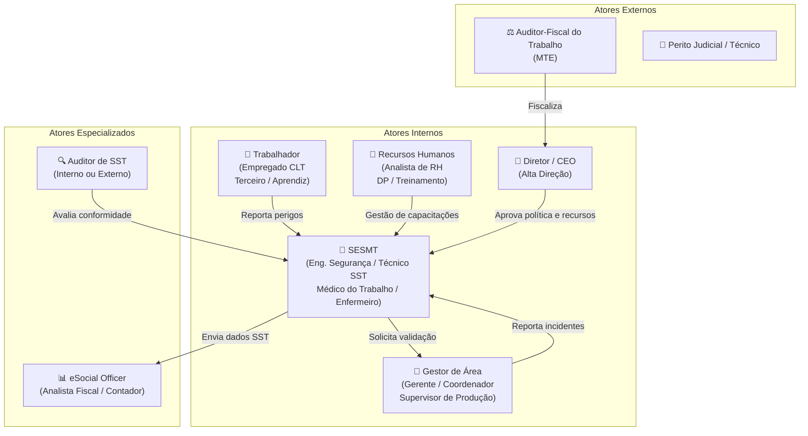
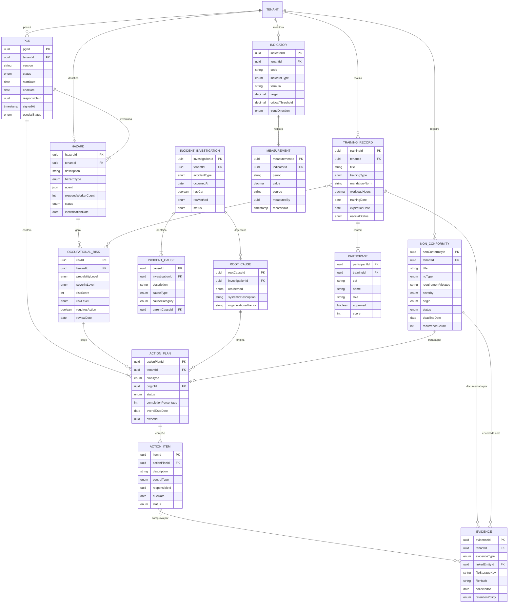

# NR-01 Intelligence Platform — Domain Discovery

> **Projeto:** QualitiOS  
> **Módulo:** NR-01 Intelligence Platform  
> **Fase:** 01 — Estratégia  
> **Documento:** Domain Discovery  
> **Versão:** 1.0.0  
> **Data:** 2026-06-08  
> **Status:** Aprovado para Desenvolvimento  

---

## Sumário

1. [Problema de Negócio](#1-problema-de-negócio)
2. [Contexto Regulatório — NR-01 Atualizada 2024](#2-contexto-regulatório--nr-01-atualizada-2024)
3. [Atores e Personas](#3-atores-e-personas)
4. [Objetivos Estratégicos, Táticos e Operacionais](#4-objetivos-estratégicos-táticos-e-operacionais)
5. [Linguagem Ubíqua — Glossário do Domínio](#5-linguagem-ubíqua--glossário-do-domínio)
6. [Entidades Principais do Domínio](#6-entidades-principais-do-domínio)
7. [Regras de Negócio Críticas da NR-01](#7-regras-de-negócio-críticas-da-nr-01)
8. [Mapa de Entidades](#8-mapa-de-entidades)

---

## 1. Problema de Negócio

### 1.1 Cenário Atual

O Brasil ocupa posição crítica no ranking mundial de acidentes de trabalho. Segundo dados do Observatório de Segurança e Saúde no Trabalho (SmartLab — MPAS/OIT), são registrados anualmente mais de **700.000 acidentes de trabalho** com CAT (Comunicação de Acidente de Trabalho), sendo estimados mais de **3 milhões** de acidentes quando somados os trabalhadores informais e subnotificações. O custo econômico direto e indireto para o Brasil ultrapassa **R$ 100 bilhões anuais**, incluindo:

- Benefícios previdenciários por incapacidade
- Gastos com assistência médica e reabilitação
- Perda de produtividade e substituição de mão de obra
- Multas e passivos trabalhistas
- Custos de defesa jurídica e indenizações civis e penais

A raiz desse problema não é apenas cultural — é estrutural. A maioria das empresas brasileiras, especialmente PMEs (que representam mais de 98% dos estabelecimentos formais), **gerencia riscos ocupacionais de forma reativa, fragmentada e sem evidências estruturadas**. Os documentos de SST (Saúde e Segurança do Trabalho) são produzidos como obrigação burocrática, não como instrumento de gestão real. O PGR (Programa de Gerenciamento de Riscos) é elaborado por consultores externos, arquivado e jamais revisado. O PCMSO (Programa de Controle Médico de Saúde Ocupacional) não dialoga com o PGR. Os treinamentos são registrados em papel, sem rastreabilidade de eficácia.

### 1.2 A Mudança Regulatória — NR-01 Atualizada 2024

A **Portaria MTE nº 1.419/2024**, publicada em 06 de agosto de 2024 e com vigência plena a partir de **26 de maio de 2025**, promoveu a maior revisão da NR-01 desde sua criação em 1978. Esta revisão transformou fundamentalmente o paradigma de gestão de SST no Brasil, impondo:

1. **Obrigatoriedade de Gestão de Riscos baseada em evidências**: O item 1.1.4 da nova NR-01 exige que o empregador identifique perigos, avalie riscos e implemente medidas de controle seguindo a **Hierarquia de Controles** (eliminação → substituição → controles de engenharia → controles administrativos → EPI).

2. **GRO — Gerenciamento de Riscos Ocupacionais**: A NR-01 passou a exigir formalmente um processo contínuo de GRO, não mais um documento estático. O GRO deve ser um **processo vivo, documentado, revisado e auditável**.

3. **Riscos Psicossociais — nova obrigação explícita**: A nova NR-01 inclui explicitamente os **fatores de risco psicossociais** (FRP) no escopo do GRO. Esta é a mudança mais disruptiva: organizações devem identificar, avaliar e controlar estressores psicossociais como carga de trabalho excessiva, violência no trabalho, assédio moral e sexual, e jornadas extenuantes.

4. **PGR — Programa de Gerenciamento de Riscos reformulado**: O PGR deixa de ser um documento de conformidade e passa a ser o **instrumento operacional do GRO**, exigindo: inventário de riscos atualizado, planos de ação com responsáveis e prazos, indicadores de desempenho e revisões periódicas documentadas.

5. **Integração com eSocial**: A NR-01 atualizada se integra ao ambiente S-1060 (Tabela de Ambientes de Trabalho), S-2240 (Condições Ambientais do Trabalho) e S-2245 (Treinamentos) do eSocial, tornando o envio de eventos a obrigação acessória fiscal equivalente à escrituração contábil.

6. **Responsabilidade da Alta Direção**: O item 1.1.7 da nova NR-01 impõe à alta direção responsabilidades explícitas na política de SST, comunicação de riscos e provisão de recursos.

### 1.3 Consequências da Não Conformidade

| Tipo de Consequência | Descrição | Base Legal | Impacto Estimado |
|---|---|---|---|
| **Autuação Fiscal** | Notificação e auto de infração da Auditoria-Fiscal do Trabalho (AFT) | CLT art. 201; NR-01 item 1.8 | R$ 2.000 a R$ 7.000 por irregularidade |
| **Embargo e Interdição** | Paralisação total ou parcial da atividade produtiva | CLT art. 161 | Perda de faturamento + custos fixos |
| **Acidente do Trabalho com Nexo Causal** | Responsabilidade civil objetiva por dano ao trabalhador | CC art. 927 parágrafo único | R$ 50.000 a R$ 2.000.000+ por caso |
| **Ação Penal** | Crime de lesão corporal ou homicídio culposo por negligência em SST | CP art. 129 e 121 | Reclusão de 1 a 8 anos (com agravante) |
| **Ação Trabalhista** | Indenização por dano moral, material e estético | CLT art. 223-A | R$ 10.000 a R$ 100.000+ por trabalhador |
| **FAP Majorado** | Fator Acidentário de Prevenção com alíquota aumentada sobre folha de pagamento | Lei 10.666/2003 | Aumento de até 100% sobre RAT (0,5% a 6%) |
| **Exclusão de Licitações** | Vedação à participação em contratos públicos | Lei 14.133/2021 art. 68 | Perda de mercado público |
| **Não envio ao eSocial** | Multa por omissão de obrigação acessória | IN RFB nº 2.005/2021 | R$ 500 a R$ 3.000 por evento não enviado |
| **Dano Reputacional** | Mídia negativa, perda de clientes e talentos | — | Incalculável a longo prazo |
| **Risco Psicossocial não gerenciado** | Nova exposição legal com a NR-01/2024 | NR-01 item 1.5.3 | Passivo trabalhista emergente e crescente |

### 1.4 Lacuna de Mercado

Não existe hoje no mercado brasileiro uma plataforma integrada que:
- Gerencie o GRO de forma processual e não documental
- Inclua riscos psicossociais de forma nativa
- Integre PGR ↔ PCMSO ↔ Treinamentos ↔ Indicadores ↔ Auditorias ↔ eSocial em um único fluxo
- Ofereça inteligência analítica sobre tendências de risco e predição de acidentes
- Produza evidências auditáveis em formato digital com rastreabilidade completa
- Escale para PMEs sem exigir equipe especializada interna de SST

O **QualitiOS NR-01 Intelligence Platform** é projetado para preencher exatamente essa lacuna.

---

## 2. Contexto Regulatório — NR-01 Atualizada 2024

### 2.1 Estrutura da NR-01 Revisada

```
NR-01 — Disposições Gerais e Gerenciamento de Riscos Ocupacionais
├── Item 1.1 — Objetivo, Campo de Aplicação e Definições
├── Item 1.2 — Responsabilidades
│   ├── 1.2.1 — Obrigações do Empregador
│   └── 1.2.2 — Obrigações do Trabalhador
├── Item 1.3 — Política de SST (nova exigência explícita)
├── Item 1.4 — Comunicação e Consulta
├── Item 1.5 — Gerenciamento de Riscos Ocupacionais (GRO)
│   ├── 1.5.1 — Identificação de Perigos
│   ├── 1.5.2 — Avaliação de Riscos
│   ├── 1.5.3 — Fatores de Risco Psicossociais (NOVO)
│   └── 1.5.4 — Medidas de Prevenção e Controle
├── Item 1.6 — Programa de Gerenciamento de Riscos (PGR)
│   ├── 1.6.1 — Inventário de Riscos
│   ├── 1.6.2 — Plano de Ação
│   └── 1.6.3 — Revisão e Atualização
├── Item 1.7 — Capacitação e Treinamento em SST
├── Item 1.8 — Fiscalização e Autuação
└── Anexos — Classificação de Riscos, Formulários e Orientações
```

### 2.2 Principais Obrigações Legais por Ator

| Obrigação Legal | Responsável Principal | Prazo/Frequência | Documento/Evidência Exigida |
|---|---|---|---|
| Elaborar e manter PGR atualizado | Empregador (SESMT/Responsável Técnico) | Contínuo; revisão anual mínima | PGR vigente assinado |
| Identificar todos os perigos do ambiente | SESMT / Técnico em SST | Antes de qualquer atividade nova | Inventário de Riscos |
| Avaliar probabilidade e severidade dos riscos | SESMT | A cada identificação de perigo | Matriz de Riscos com metodologia declarada |
| Avaliar Fatores de Risco Psicossociais | Empregador / SESMT | Mínimo anual | Laudo FRP com questionário validado |
| Implementar medidas de controle com hierarquia | Empregador | Conforme prazo do plano de ação | Plano de Ação com evidências de implantação |
| Comunicar riscos aos trabalhadores | Empregador / SESMT | Antes da exposição; a cada revisão | Registro de DDS, treinamentos, ordens de serviço |
| Capacitar trabalhadores em SST | Empregador | Admissional + periódico + mudança de função | Registros de treinamento com conteúdo e carga horária |
| Enviar dados ao eSocial | Empregador / Contador/DP | Conforme tabela de eventos | XML dos eventos S-1060, S-2240, S-2245 |
| Registrar e investigar acidentes e incidentes | Empregador / SESMT | Imediato ao evento | CAT, RCA, Plano de Ação corretiva |
| Manter e revisar a Política de SST | Alta Direção | Anual | Política assinada pela direção |

### 2.3 Hierarquia de Controles (NR-01 item 1.5.4)

A NR-01 atualizada exige que as medidas de controle sigam a hierarquia abaixo, priorizando controles mais efetivos:

| Nível | Tipo de Controle | Eficácia | Exemplos |
|---|---|---|---|
| 1 | **Eliminação** | Máxima | Remover o processo ou substância perigosa |
| 2 | **Substituição** | Alta | Substituir por processo ou substância menos perigosa |
| 3 | **Controles de Engenharia** | Alta | Enclausuramento, ventilação, proteção de máquinas |
| 4 | **Controles Administrativos** | Média | Rodízio de função, limitação de jornada, treinamento |
| 5 | **EPI** | Baixa (última opção) | Luvas, capacete, protetor auricular, respirador |

---

## 3. Atores e Personas

### 3.1 Mapa de Atores do Sistema



### 3.2 Tabela Detalhada de Personas

| Persona | Papel | Responsabilidades Principais | Dores Atuais | Objetivos na Plataforma | Métricas de Sucesso |
|---|---|---|---|---|---|
| **SESMT** (Eng. de Segurança / Técnico em SST) | Responsável técnico pela gestão de SST | Elaborar PGR, identificar perigos, conduzir GRO, investigar acidentes, emitir CAT, conduzir treinamentos | Trabalho manual e repetitivo; planilhas desconexas; dificuldade de demonstrar valor; sobrecarga de conformidade | Automatizar inventário de riscos; ter dashboard de indicadores; gerar PGR e relatórios com um clique; gerir evidências digitalmente | Redução de 80% no tempo de elaboração documental; zero autuações; TRIA < 1 hora |
| **Gestor de Área** | Responsável pela operação segura do setor | Garantir uso de EPI; reportar acidentes e incidentes; liberar funcionários para treinamento; implementar medidas de controle | Não sabe quais riscos sua área tem; recebe cobranças sem contexto; desconhece prazos de ação | Visualizar riscos do seu setor; saber o status do plano de ação; ser notificado de vencimentos | Taxa de conclusão de ações > 95%; zero reincidência de não conformidades |
| **Trabalhador** | Executa atividades com exposição a riscos | Usar EPI; participar de treinamentos; reportar condições inseguras; conhecer os riscos da função | Não conhece seus direitos e riscos; treinamentos monótonos; medo de represália ao reportar | Canal seguro e simples para reportar perigos; acesso ao seu PGR; certificados de treinamento | NPS interno > 70; participação em treinamentos > 98% |
| **Auditor de SST** | Avalia conformidade legal e eficácia do sistema | Verificar documentação; checar evidências de implementação; emitir relatório de auditoria; rastrear não conformidades | Falta de evidências organizadas; documentos desatualizados; dificuldade de rastreio histórico | Acesso estruturado a toda documentação auditável; visão temporal de revisões; geração de relatório de auditoria | Tempo de auditoria reduzido em 60%; 100% das evidências rastreáveis |
| **eSocial Officer** | Garante conformidade e envio de eventos ao eSocial | Mapear eventos SST; conferir dados; enviar S-1060, S-2240, S-2245; resolver retornos de erro | Dados SST chegam incompletos e atrasados; sem visibilidade do que precisa ser enviado; erros causam multas | Dashboard de eventos pendentes; alertas de prazo; validação prévia dos dados antes do envio | Zero eventos em atraso; zero rejeições por dados inconsistentes |
| **RH / DP** | Gestão de pessoas e conformidade trabalhista | Controlar treinamentos obrigatórios; gerir ASOs; integrar admissões e demissões com SST | Registros de treinamento em papel; sem controle de validade; falta de integração com SST | Controle centralizado de treinamentos; alertas de vencimento de ASO e certificados; relatórios para DP | 100% dos trabalhadores com treinamentos em dia; zero funcionários com ASO vencido |
| **Diretor / CEO** | Tomada de decisão estratégica e provisão de recursos | Aprovar política de SST; alocar investimentos em segurança; responder legalmente por conformidade | Falta de visibilidade dos riscos reais; relatórios confusos e técnicos demais; medo de passivo jurídico | Dashboard executivo com KPIs de SST; tendências de risco; ROI das ações de prevenção | Redução do FAP; zero embargos; inclusão de SST na governança corporativa |

---

## 4. Objetivos Estratégicos, Táticos e Operacionais

### 4.1 Objetivos Estratégicos

**OE-01 — Transformar conformidade em vantagem competitiva**  
Posicionar a gestão de SST não como custo regulatório, mas como diferencial de mercado, reduzindo FAP, obtendo certificações (ISO 45001) e qualificando-se para contratos que exigem conformidade SST.

**OE-02 — Criar cultura organizacional de segurança baseada em dados**  
Evoluir o modelo mental das organizações de "SST = papelada" para "SST = inteligência operacional", usando dados para antecipar riscos antes que se materializem em acidentes.

**OE-03 — Universalizar a gestão de SST para PMEs**  
Tornar acessível, para empresas sem SESMT próprio, um sistema de gestão de SST de qualidade equivalente ao de grandes corporações, democratizando a segurança no trabalho.

**OE-04 — Eliminar passivos trabalhistas relacionados à NR-01**  
Garantir que toda organização usuária tenha documentação, evidências e processos suficientes para se defender em fiscalizações, auditorias e processos judiciais.

### 4.2 Objetivos Táticos

| Código | Objetivo Tático | Indicador de Resultado | Meta | Horizonte |
|---|---|---|---|---|
| OT-01 | Automatizar a elaboração e manutenção do PGR | % de PGRs gerados sem intervenção manual | > 80% | 12 meses |
| OT-02 | Integrar dados com eSocial sem retrabalho | % de eventos SST enviados diretamente da plataforma | 100% | 18 meses |
| OT-03 | Implementar gestão de riscos psicossociais | % de empresas com FRP avaliado e plano de ação | > 60% | 24 meses |
| OT-04 | Criar rastreabilidade completa de evidências | % de não conformidades com evidência de encerramento | 100% | 9 meses |
| OT-05 | Habilitar auditoria digital sem papel | % de auditorias conduzidas 100% digitalmente | > 90% | 15 meses |
| OT-06 | Prover analytics preditivo de riscos | Acurácia do modelo preditivo de probabilidade de acidente | > 75% | 30 meses |

### 4.3 Objetivos Operacionais

- **OO-01**: O sistema deve permitir o cadastro de um perigo e sua avaliação de risco em menos de 3 minutos
- **OO-02**: O inventário de riscos deve ser atualizado automaticamente quando há mudança de processo, função ou agente
- **OO-03**: Notificações automáticas de vencimento de planos de ação com antecedência de 30, 15 e 5 dias
- **OO-04**: Geração de relatório do PGR em formato PDF/A auditável em menos de 30 segundos
- **OO-05**: Upload e vinculação de evidência (foto, vídeo, documento) diretamente ao risco ou ação em menos de 1 minuto
- **OO-06**: Dashboard de indicadores atualizado em tempo real (latência máxima de 5 minutos)
- **OO-07**: Formulário de reporte de perigo pelo trabalhador via mobile em menos de 2 minutos
- **OO-08**: Geração automática do XML do evento S-2240 a partir dos dados do inventário de riscos

---

## 5. Linguagem Ubíqua — Glossário do Domínio

> **Nota de Arquitetura**: Esta seção define o vocabulário compartilhado entre especialistas de domínio, desenvolvedores, analistas e documentação. Todo código-fonte, documentação técnica, schemas de banco de dados e APIs devem usar exatamente estes termos em seus nomes de classes, variáveis, endpoints e campos.

### 5.1 Glossário Completo

| Termo | Definição Precisa no Domínio | Sinônimos Proibidos | Contexto de Uso |
|---|---|---|---|
| **Perigo** (*Hazard*) | Fonte, situação ou ato com potencial para causar lesão, doença, dano à saúde ou à propriedade. O perigo existe independentemente de haver ou não pessoas expostas. Ex: máquina sem proteção, substância química tóxica. | "problema", "defeito" | Inventário de Riscos, GRO |
| **Risco** (*Risk*) | Combinação da probabilidade de ocorrência de um evento perigoso e da severidade da lesão ou dano decorrente da exposição ao perigo. O risco sempre existe em função de um perigo + exposição. | "perigo" (incorreto usar como sinônimo) | Avaliação de Riscos, Matriz de Riscos |
| **Causa** | Fator imediato ou direto que contribuiu para a ocorrência de um incidente ou acidentes. Pode ser múltipla. Ex: piso escorregadio, falta de EPI. | "motivo" | Investigação de Acidentes |
| **Causa Raiz** (*Root Cause*) | Fator fundamental e sistêmico, cuja correção permanente previne a recorrência do evento. Identificada através de metodologias como Árore de Causas ou 5 Porquês. Uma causa raiz é a causa da causa. Ex: ausência de procedimento de limpeza, falha no sistema de treinamento. | "causa principal" | RCA — Análise de Causa Raiz |
| **GRO** | Gerenciamento de Riscos Ocupacionais. Processo contínuo e sistemático de identificação de perigos, avaliação de riscos, implementação de medidas de controle e monitoramento de resultados. Exigido pela NR-01 atualizada 2024. | "gerenciamento de riscos" (sem o "Ocupacionais") | NR-01 item 1.5 |
| **PGR** | Programa de Gerenciamento de Riscos. Documento formal que materializa o GRO, contendo o Inventário de Riscos e o Plano de Ação. Deve ser revisado sempre que houver mudança relevante e, no mínimo, anualmente. | "programa de segurança", "PPRA" | NR-01 item 1.6 |
| **Inventário de Riscos** | Componente do PGR que lista todos os perigos identificados, os riscos associados, os trabalhadores expostos, a avaliação qualitativa ou quantitativa e as medidas de controle vigentes. | "mapa de riscos" (não é sinônimo exato) | PGR, GRO |
| **Plano de Ação** | Documento componente do PGR que lista as medidas de controle a implementar ou melhorar, com: responsável, prazo, recursos necessários e indicador de conclusão. | "lista de tarefas", "pendências" | PGR, Gestão de Conformidade |
| **Não Conformidade** | Não atendimento a um requisito legal, normativo, procedimental ou organizacional de SST. Pode ser identificada por auditoria, fiscalização ou processo interno. | "irregularidade" (juridicamente impreciso) | Auditoria, Conformidade |
| **Evidência** | Registro documentado que comprova a implementação de uma medida de controle, a realização de um treinamento, ou o encerramento de uma não conformidade. Pode ser um documento, foto, vídeo, assinatura digital ou log de sistema. | "comprovante", "prova" | Auditorias, Plano de Ação |
| **Fator de Risco Psicossocial (FRP)** | Condição organizacional, de trabalho ou interpessoal que pode causar dano à saúde mental ou ao bem-estar psicossocial do trabalhador. Inclui: sobrecarga de trabalho, conflito de papéis, assédio moral/sexual, falta de autonomia, insegurança no emprego. | "risco psicológico" | NR-01 item 1.5.3, GRO |
| **Severidade** | Magnitude das consequências de um evento perigoso, considerando gravidade da lesão, área corporal afetada, possibilidade de reversão e número de pessoas afetadas. Escala: Negligenciável → Marginal → Crítica → Catastrófica. | "gravidade" (aceitável como sinônimo coloquial) | Avaliação de Riscos |
| **Probabilidade** | Estimativa da frequência com que um evento perigoso pode ocorrer, considerando a frequência de exposição, o número de pessoas expostas, a eficácia das medidas de controle vigentes e o histórico de eventos. Escala: Muito Improvável → Improvável → Provável → Muito Provável. | "chance", "likelihood" | Avaliação de Riscos |
| **Nível de Risco** | Classificação resultante da combinação de Probabilidade × Severidade, geralmente expresso como: Trivial, Baixo, Médio, Alto, Crítico. Define a prioridade de ação. | "nível de perigo" | Matriz de Riscos |
| **Medida de Controle** | Ação implementada para eliminar um perigo ou reduzir a probabilidade ou severidade do risco. Deve seguir a Hierarquia de Controles da NR-01. | "medida de segurança" | GRO, PGR, Plano de Ação |
| **Hierarquia de Controles** | Ordem de preferência para seleção de medidas de controle, estabelecida pela NR-01: 1. Eliminação, 2. Substituição, 3. Controles de Engenharia, 4. Controles Administrativos, 5. EPI. | — | NR-01 item 1.5.4 |
| **CAT** | Comunicação de Acidente de Trabalho. Documento emitido pelo empregador em até 24 horas do acidente de trabalho ou doença profissional, registrado no INSS. Também pode ser emitida pelo médico, sindicato ou autoridade pública. | — | Acidentes, eSocial |
| **RCA** | Análise de Causa Raiz (*Root Cause Analysis*). Processo investigativo aplicado após um acidente, incidente ou quase-acidente para identificar as causas fundamentais e prevenir recorrência. Metodologias: Árore de Causas, Diagrama de Ishikawa, 5 Porquês. | "investigação de acidente" (mais amplo) | Investigação de Acidentes |
| **Árore de Causas** | Metodologia de RCA que representa graficamente a cadeia de eventos e condições que levaram ao acidente, partindo do evento final e ramificando causas até as causas raízes. Exigida implicitamente pela NR-01 para investigação de acidentes graves. | — | RCA |
| **Indicador de SST** | Medida quantitativa ou qualitativa que expressa o desempenho do sistema de gestão de SST. Classificados em: Indicadores Reativos (ex: TIFA, taxa de gravidade) e Indicadores Proativos (ex: % de ações concluídas no prazo, taxa de participação em treinamentos). | "KPI" (aceitável em contexto executivo) | Dashboard de SST |
| **TIFA** | Taxa de Incidência de Frequência de Acidentes. Número de acidentes com afastamento por 1.000.000 de horas-homem trabalhadas. Fórmula: TIFA = (Nº de acidentes com afastamento × 1.000.000) / HHT | "taxa de frequência" | Indicadores Reativos |
| **Taxa de Gravidade** | Número total de dias perdidos e debitados por 1.000.000 de horas-homem trabalhadas. Mede o impacto dos acidentes. | — | Indicadores Reativos |
| **Capacitação em SST** | Processo formal de transferência de conhecimento, habilidades e atitudes necessários para o trabalhador desempenhar seu trabalho com segurança. Inclui: treinamento de integração, treinamentos periódicos obrigatórios, capacitações específicas por função e reciclagens. | "treinamento" (aceitável como sinônimo) | NR-01 item 1.7 |
| **Agente** | Fator ambiental ou situacional que, por suas propriedades ou pela forma de uso, pode causar dano à saúde. Classificação: Agente Físico (ruído, calor, vibração), Agente Químico (poeiras, fumos, vapores), Agente Biológico (vírus, bactérias), Agente Ergonômico (postura, repetição), Agente de Acidente (máquinas sem proteção). | "fator de risco" (menos preciso) | Identificação de Perigos |
| **Quase-Acidente** (*Near Miss*) | Evento indesejado que, em circunstâncias ligeiramente diferentes, teria resultado em lesão, dano ou doença. Recurso fundamental de aprendizagem organizacional em segurança. | "incidente sem lesão" | Investigação, GRO |
| **Laudo Técnico** | Documento de caráter pericial elaborado por profissional habilitado (Engenheiro de Segurança, Médico do Trabalho) que atesta condições ambientais de trabalho. Base para PGR e para o eSocial S-2240. | "relatório técnico" (menos formal) | PGR, PCMSO, eSocial |
| **Exposição** | Tempo e frequência em que o trabalhador fica sujeito ao perigo. Parâmetro fundamental para avaliação quantitativa de risco. Ex: exposição a ruído de 85 dB por 8h/dia. | — | Inventário de Riscos |
| **Limite de Exposição** | Valor máximo aceitável de concentração ou intensidade de um agente ao qual o trabalhador pode ser exposto, conforme normativas (ACGIH TLV, NR-15). | "limite de tolerância" | Higiene Ocupacional, PGR |

---

## 6. Entidades Principais do Domínio

> **Nota de Modelagem**: As entidades abaixo são modeladas seguindo princípios de Domain-Driven Design (DDD). Entidades com identidade própria e ciclo de vida são modeladas como `Entity`. Objetos de valor imutáveis são `Value Object`. Agrupamentos consistentes são `Aggregate`.

### 6.1 Entidade: Perigo (`Hazard`)

**Aggregate Root**: `HazardAggregate`  
**Tipo DDD**: Entity (identidade própria por `HazardId`)

| Atributo | Tipo | Obrigatório | Descrição | Validação |
|---|---|---|---|---|
| `hazardId` | UUID | ✅ | Identificador único e imutável do perigo | Gerado na criação |
| `tenantId` | UUID | ✅ | Organização proprietária | Não nulo |
| `description` | String(500) | ✅ | Descrição clara e objetiva do perigo | Mínimo 10 caracteres |
| `hazardType` | Enum | ✅ | Tipo do perigo: FISICO, QUIMICO, BIOLOGICO, ERGONOMICO, ACIDENTE, PSICOSSOCIAL | Valores fixos NR-01 |
| `agent` | AgentVO | ✅ | Agente causador (nome, CAS, TLV, TLV-TWA se aplicável) | — |
| `source` | String(300) | ✅ | Fonte ou situação geradora do perigo | — |
| `workstationIds` | List<UUID> | ✅ | GHE/postos de trabalho onde o perigo existe | Mínimo 1 |
| `exposedWorkerCount` | Integer | ✅ | Número de trabalhadores expostos | >= 0 |
| `exposureFrequency` | ExposureVO | ✅ | Frequência e duração da exposição | — |
| `identificationDate` | LocalDate | ✅ | Data em que o perigo foi identificado | <= hoje |
| `identifiedBy` | UserId | ✅ | Profissional que identificou o perigo | — |
| `status` | Enum | ✅ | ATIVO, CONTROLADO, ELIMINADO | — |
| `eliminationDate` | LocalDate | ❌ | Data de eliminação (se status = ELIMINADO) | Obrigatório se ELIMINADO |
| `legalReferences` | List<String> | ❌ | Referências legais aplicáveis (NR, ACGIH, etc.) | — |
| `version` | Integer | ✅ | Versão para controle de concorrência otimista | Auto-incremento |
| `createdAt` | Timestamp | ✅ | Timestamp de criação com timezone | Imutável após criação |
| `updatedAt` | Timestamp | ✅ | Timestamp da última modificação | — |

**Invariantes de Negócio:**
- Um perigo do tipo QUIMICO deve obrigatoriamente ter o agente com código CAS (quando disponível)
- Um perigo com status ELIMINADO deve ter a data de eliminação preenchida e uma evidência vinculada
- O número de trabalhadores expostos deve ser reavaliado quando houver mudança no quadro de funcionários

---

### 6.2 Entidade: Risco (`OccupationalRisk`)

**Aggregate Root**: `RiskAggregate`  
**Tipo DDD**: Entity (filha do `HazardAggregate`)

| Atributo | Tipo | Obrigatório | Descrição | Validação |
|---|---|---|---|---|
| `riskId` | UUID | ✅ | Identificador único do risco | Gerado na criação |
| `hazardId` | UUID | ✅ | Perigo ao qual este risco está associado | FK → Hazard |
| `tenantId` | UUID | ✅ | Organização | — |
| `riskDescription` | String(500) | ✅ | Descrição do risco (o que pode acontecer) | — |
| `probabilityLevel` | Enum | ✅ | MUITO_IMPROVAVEL(1), IMPROVAVEL(2), PROVAVEL(3), MUITO_PROVAVEL(4) | Escala 1-4 |
| `probabilityJustification` | String(300) | ✅ | Justificativa da probabilidade atribuída | — |
| `severityLevel` | Enum | ✅ | NEGLIGENCIAVEL(1), MARGINAL(2), CRITICA(3), CATASTROFICA(4) | Escala 1-4 |
| `severityJustification` | String(300) | ✅ | Justificativa da severidade atribuída | — |
| `riskScore` | Integer | ✅ | Produto: probabilidade × severidade (1-16) | Calculado automaticamente |
| `riskLevel` | Enum | ✅ | TRIVIAL, BAIXO, MEDIO, ALTO, CRITICO | Derivado do riskScore |
| `evaluationMethod` | Enum | ✅ | QUALITATIVO, SEMIQUANTITATIVO, QUANTITATIVO | — |
| `evaluationDate` | LocalDate | ✅ | Data da avaliação | <= hoje |
| `evaluatedBy` | UserId | ✅ | Responsável pela avaliação | Profissional habilitado |
| `currentControls` | List<ControlMeasureVO> | ✅ | Medidas de controle já implementadas | Mínimo 0 |
| `residualProbability` | Enum | ❌ | Probabilidade residual após controles existentes | — |
| `residualSeverity` | Enum | ❌ | Severidade residual após controles existentes | — |
| `residualRiskScore` | Integer | ❌ | Pontuação de risco residual | Calculado se residual existir |
| `requiresAction` | Boolean | ✅ | Indica se o nível de risco exige plano de ação | True se riskLevel >= MEDIO |
| `reviewDate` | LocalDate | ✅ | Data prevista para reavaliação | — |
| `pgr PeriodId` | UUID | ❌ | Período do PGR ao qual esta avaliação pertence | — |

**Invariantes de Negócio:**
- `riskScore` = `probabilityLevel` × `severityLevel` (produto matricial)
- Riscos ALTO e CRITICO devem ter, obrigatoriamente, um `PlanoDeAcao` vinculado
- `residualRiskScore` deve ser menor que `riskScore` (controles não podem aumentar o risco)
- A avaliação deve ser reavaliada quando o `HazardAggregate` pai sofrer alteração

---

### 6.3 Entidade: Causa (`IncidentCause`)

**Aggregate Root**: `IncidentInvestigationAggregate`  
**Tipo DDD**: Entity

| Atributo | Tipo | Obrigatório | Descrição |
|---|---|---|---|
| `causeId` | UUID | ✅ | Identificador único da causa |
| `investigationId` | UUID | ✅ | Investigação à qual esta causa pertence |
| `causeDescription` | String(500) | ✅ | Descrição objetiva da causa identificada |
| `causeType` | Enum | ✅ | IMEDIATA (ato inseguro, condição insegura), CONTRIBUINTE, BASICA, RAIZ |
| `causeCategory` | Enum | ✅ | FATOR_HUMANO, FATOR_MATERIAL, FATOR_AMBIENTAL, FATOR_ORGANIZACIONAL, FATOR_GERENCIAL |
| `parentCauseId` | UUID | ❌ | Causa pai na árvore de causas (null se causa raiz) |
| `childCauseIds` | List<UUID> | ❌ | Causas filhas (efeitos desta causa) |
| `identifiedBy` | UserId | ✅ | Investigador que identificou a causa |
| `confirmedAt` | Timestamp | ❌ | Momento em que a causa foi validada |
| `evidence` | List<EvidenceId> | ❌ | Evidências que suportam esta causa |

---

### 6.4 Entidade: Causa Raiz (`RootCause`)

**Aggregate Root**: `IncidentInvestigationAggregate`  
**Tipo DDD**: Entity especializada (extends `IncidentCause`)

| Atributo | Tipo | Obrigatório | Descrição |
|---|---|---|---|
| `rootCauseId` | UUID | ✅ | Identificador único da causa raiz |
| `investigationId` | UUID | ✅ | Investigação vinculada |
| `rcaMethod` | Enum | ✅ | ARVORE_DE_CAUSAS, CINCO_PORQUES, ISHIKAWA, TAPROOT, BARRIER_ANALYSIS |
| `systemicDescription` | String(1000) | ✅ | Descrição sistêmica do fator raiz (ex: "Ausência de procedimento formal de bloqueio e etiquetagem — LOTO") |
| `organizationalFactor` | String(500) | ✅ | Fator organizacional que permitiu a existência da causa raiz |
| `recurrencePrevention` | String(500) | ✅ | Como a eliminação desta causa raiz previne recorrência |
| `similarIncidentHistory` | Boolean | ✅ | Se houve eventos similares anteriores indicando que a causa raiz já existia |
| `rootCauseConfirmedBy` | UserId | ✅ | Profissional habilitado que validou a causa raiz |
| `linkedActionPlanItems` | List<ActionItemId> | ✅ | Itens do plano de ação que atacam esta causa raiz | Mínimo 1 |

---

### 6.5 Entidade: Plano de Ação (`ActionPlan`)

**Aggregate Root**: `ActionPlanAggregate`  
**Tipo DDD**: Aggregate Root com seus próprios `ActionItem`

| Atributo | Tipo | Obrigatório | Descrição | Validação |
|---|---|---|---|---|
| `actionPlanId` | UUID | ✅ | Identificador único do plano | — |
| `tenantId` | UUID | ✅ | Organização | — |
| `planTitle` | String(200) | ✅ | Título descritivo do plano | — |
| `planType` | Enum | ✅ | PGR, CORRETIVO, PREVENTIVO, INVESTIGACAO, AUDITORIA | — |
| `originId` | UUID | ✅ | ID da entidade origem (RiskId, InvestigationId, AuditFindingId) | — |
| `originType` | Enum | ✅ | RISCO, INVESTIGACAO, AUDITORIA, NAO_CONFORMIDADE | — |
| `status` | Enum | ✅ | RASCUNHO, ATIVO, CONCLUIDO, CANCELADO, ATRASADO | — |
| `priority` | Enum | ✅ | IMEDIATA(0-7dias), CURTO_PRAZO(8-30dias), MEDIO_PRAZO(31-90dias), LONGO_PRAZO(>90dias) | — |
| `overallDueDate` | LocalDate | ✅ | Prazo geral do plano | >= hoje (na criação) |
| `owner` | UserId | ✅ | Responsável geral pelo plano | — |
| `approvedBy` | UserId | ❌ | Quem aprovou o plano | — |
| `approvedAt` | Timestamp | ❌ | Quando foi aprovado | — |
| `completionPercentage` | Integer | ✅ | Percentual de conclusão (calculado a partir dos itens) | 0-100, calculado |
| `items` | List<ActionItem> | ✅ | Lista de itens/ações do plano | Mínimo 1 |
| `lastReviewDate` | LocalDate | ❌ | Data da última revisão do plano | — |
| `closingEvidences` | List<EvidenceId> | ❌ | Evidências de encerramento do plano completo | Obrigatório para CONCLUIDO |
| `createdAt` | Timestamp | ✅ | Timestamp de criação | — |

**Sub-entidade: `ActionItem`** (dentro do Aggregate)

| Atributo | Tipo | Obrigatório | Descrição |
|---|---|---|---|
| `itemId` | UUID | ✅ | ID do item |
| `actionPlanId` | UUID | ✅ | Plano pai |
| `description` | String(500) | ✅ | Descrição da ação a executar |
| `controlType` | Enum | ✅ | ELIMINACAO, SUBSTITUICAO, ENG_CONTROLE, ADMIN_CONTROLE, EPI (Hierarquia NR-01) |
| `responsible` | UserId | ✅ | Responsável pela execução |
| `dueDate` | LocalDate | ✅ | Prazo de conclusão |
| `status` | Enum | ✅ | PENDENTE, EM_ANDAMENTO, CONCLUIDO, ATRASADO, CANCELADO |
| `completedAt` | Timestamp | ❌ | Timestamp de conclusão |
| `evidences` | List<EvidenceId> | ❌ | Evidências vinculadas ao item |
| `cost` | MoneyVO | ❌ | Custo estimado/realizado da ação |
| `progressNotes` | List<NoteVO> | ❌ | Notas de progresso com data e autor |

---

### 6.6 Entidade: Evidência (`Evidence`)

**Aggregate Root**: `EvidenceAggregate`  
**Tipo DDD**: Entity com suporte a múltiplos tipos de mídia

| Atributo | Tipo | Obrigatório | Descrição | Validação |
|---|---|---|---|---|
| `evidenceId` | UUID | ✅ | Identificador único | — |
| `tenantId` | UUID | ✅ | Organização | — |
| `title` | String(200) | ✅ | Título descritivo da evidência | — |
| `description` | String(500) | ❌ | Descrição detalhada | — |
| `evidenceType` | Enum | ✅ | DOCUMENTO, FOTO, VIDEO, ASSINATURA_DIGITAL, LOG_SISTEMA, CERTIFICADO, LAUDO | — |
| `linkedEntityType` | Enum | ✅ | RISCO, ACAO, NAO_CONFORMIDADE, TREINAMENTO, AUDITORIA, INVESTIGACAO | — |
| `linkedEntityId` | UUID | ✅ | ID da entidade à qual a evidência está vinculada | — |
| `fileStorageKey` | String | ✅ | Chave no storage (S3/MinIO) do arquivo | URL ou chave gerada |
| `fileHash` | String (SHA-256) | ✅ | Hash do arquivo para integridade | Calculado no upload |
| `fileSizeBytes` | Long | ✅ | Tamanho do arquivo em bytes | > 0 |
| `mimeType` | String | ✅ | Tipo MIME do arquivo | Whitelist de tipos |
| `collectedAt` | LocalDate | ✅ | Data em que a evidência foi coletada/gerada | <= hoje |
| `collectedBy` | UserId | ✅ | Quem coletou ou gerou a evidência | — |
| `isLegallyRelevant` | Boolean | ✅ | Indica se tem relevância para defesa jurídica | Default: false |
| `retentionPolicy` | Enum | ✅ | CINCO_ANOS, DEZ_ANOS, VINTE_ANOS, PERMANENTE | Conforme tipo e NR |
| `expiresAt` | LocalDate | ❌ | Data de expiração da evidência (ex: ASO tem validade) | — |
| `digitalSignatureId` | UUID | ❌ | ID da assinatura digital ICP-Brasil se aplicável | — |
| `uploadedAt` | Timestamp | ✅ | Timestamp do upload | — |
| `tags` | List<String> | ❌ | Tags para busca e categorização | — |

---

### 6.7 Entidade: Capacitação (`TrainingRecord`)

**Aggregate Root**: `TrainingAggregate`  
**Tipo DDD**: Entity com relação para `Turma` e `Participante`

| Atributo | Tipo | Obrigatório | Descrição | Validação |
|---|---|---|---|---|
| `trainingId` | UUID | ✅ | Identificador único da capacitação | — |
| `tenantId` | UUID | ✅ | Organização | — |
| `title` | String(200) | ✅ | Título do treinamento | — |
| `trainingType` | Enum | ✅ | INTEGRACAO, PERIODICO, ADMISSIONAL, POR_MUDANCA_FUNCAO, RETORNO_AFASTAMENTO, NR_ESPECIFICA | — |
| `mandatoryNorm` | String(50) | ❌ | NR que exige este treinamento (ex: "NR-01", "NR-35") | — |
| `workloadHours` | Decimal | ✅ | Carga horária total do treinamento | > 0 |
| `content` | String(2000) | ✅ | Conteúdo programático | — |
| `trainingDate` | LocalDate | ✅ | Data de realização | — |
| `expirationDate` | LocalDate | ❌ | Data de vencimento (se renovação periódica) | > trainingDate |
| `instructor` | InstructorVO | ✅ | Instrutor (nome, qualificação, registro profissional) | — |
| `deliveryMethod` | Enum | ✅ | PRESENCIAL, EAD, HIBRIDO | — |
| `participants` | List<ParticipantVO> | ✅ | Lista de participantes com CPF, função, assinatura | Mínimo 1 |
| `assessmentType` | Enum | ❌ | PROVA, PRATICO, OBSERVACAO, SEM_AVALIACAO | — |
| `minimumPassingScore` | Integer | ❌ | Nota mínima para aprovação (0-100) | — |
| `linkedRiskIds` | List<UUID> | ❌ | Riscos para os quais este treinamento é medida de controle | — |
| `evidences` | List<EvidenceId> | ✅ | Evidências: lista de presença, material, avaliações | Mínimo 1 |
| `esocialStatus` | Enum | ✅ | NAO_ENVIADO, ENVIADO, ACEITO, REJEITADO | — |
| `esocialEventId` | String | ❌ | ID do evento S-2245 no eSocial | — |
| `createdAt` | Timestamp | ✅ | Timestamp de criação | — |

---

### 6.8 Entidade: Indicador (`SafetyIndicator`)

**Aggregate Root**: `IndicatorAggregate`  
**Tipo DDD**: Entity com séries temporais de medição

| Atributo | Tipo | Obrigatório | Descrição |
|---|---|---|---|
| `indicatorId` | UUID | ✅ | Identificador único |
| `tenantId` | UUID | ✅ | Organização |
| `name` | String(200) | ✅ | Nome do indicador (ex: "Taxa de Incidência de Frequência de Acidentes") |
| `code` | String(20) | ✅ | Código curto (ex: TIFA, TAXGRAV, PERCACAO, COMPL_TRE) |
| `indicatorType` | Enum | ✅ | REATIVO, PROATIVO |
| `formula` | String(500) | ✅ | Fórmula de cálculo em linguagem natural |
| `unit` | String(50) | ✅ | Unidade de medida (ex: "por 1M HHT", "%", "dias") |
| `frequency` | Enum | ✅ | DIARIO, SEMANAL, MENSAL, TRIMESTRAL, ANUAL |
| `target` | Decimal | ✅ | Meta a ser atingida no período |
| `criticalThreshold` | Decimal | ✅ | Valor crítico que dispara alerta vermelho |
| `warningThreshold` | Decimal | ✅ | Valor de atenção que dispara alerta amarelo |
| `measurements` | List<MeasurementVO> | ✅ | Série histórica de medições [{period, value, source, measuredBy}] |
| `trendDirection` | Enum | ✅ | MELHORANDO, ESTAVEL, PIORANDO (calculado por ML ou heurística) |
| `benchmarkValue` | Decimal | ❌ | Referência de mercado para o setor |
| `applicableScope` | Enum | ✅ | EMPRESA, UNIDADE, SETOR, FUNCAO |

---

### 6.9 Entidade: Não Conformidade (`NonConformity`)

**Aggregate Root**: `NonConformityAggregate`  
**Tipo DDD**: Aggregate Root com ciclo de vida próprio

| Atributo | Tipo | Obrigatório | Descrição | Validação |
|---|---|---|---|---|
| `nonConformityId` | UUID | ✅ | Identificador único | — |
| `tenantId` | UUID | ✅ | Organização | — |
| `title` | String(200) | ✅ | Título descritivo da não conformidade | — |
| `description` | String(1000) | ✅ | Descrição detalhada do que está em desacordo | — |
| `ncType` | Enum | ✅ | LEGAL (descumprimento de NR), NORMATIVA (ISO 45001), PROCEDIMENTAL, SISTÊMICA | — |
| `requirementViolated` | String(200) | ✅ | Requisito legal ou normativo violado (ex: "NR-01 item 1.6.1") | — |
| `severity` | Enum | ✅ | OBSERVACAO, MENOR, MAIOR, CRITICA | — |
| `origin` | Enum | ✅ | AUDITORIA_INTERNA, AUDITORIA_EXTERNA, FISCALIZACAO_AFT, INVESTIGACAO, AUTODETECCAO | — |
| `detectedAt` | LocalDate | ✅ | Data de detecção | — |
| `detectedBy` | UserId | ✅ | Quem detectou | — |
| `status` | Enum | ✅ | ABERTA, EM_TRATAMENTO, AGUARDANDO_VERIFICACAO, ENCERRADA, RECORRENTE | — |
| `immediateAction` | String(500) | ❌ | Ação imediata tomada ao detectar (contenção) | — |
| `linkedActionPlanId` | UUID | ❌ | Plano de ação para tratamento | Obrigatório se severity >= MAIOR |
| `rootCauseAnalysisId` | UUID | ❌ | RCA vinculada | Obrigatório para NC CRITICA |
| `verificationDate` | LocalDate | ❌ | Data prevista para verificação de eficácia | — |
| `verifiedBy` | UserId | ❌ | Quem verificou a eficácia do tratamento | — |
| `closingEvidences` | List<EvidenceId> | ❌ | Evidências que comprovam o encerramento | Obrigatório para ENCERRADA |
| `recurrenceCount` | Integer | ✅ | Número de recorrências desta NC | Default: 0 |
| `deadlineDays` | Integer | ✅ | Prazo regulatório para resolução em dias | Conforme tipo |
| `deadlineDate` | LocalDate | ✅ | Data limite calculada | = detectedAt + deadlineDays |

---

## 7. Regras de Negócio Críticas da NR-01

### 7.1 Regras de Identificação e Avaliação de Riscos

| Código | Regra | Base Legal | Implementação |
|---|---|---|---|
| **RN-001** | Todo perigo identificado deve ter, obrigatoriamente, uma avaliação de risco associada antes de ser incluído no inventário final do PGR | NR-01 item 1.5.1 + 1.5.2 | Validação de domínio no `HazardAggregate` |
| **RN-002** | Riscos ALTO e CRÍTICO devem ter um Plano de Ação criado em até 30 dias após a avaliação | NR-01 item 1.6.2 | Event Handler: `RiskEvaluatedHighEvent` → `CreateActionPlanCommand` |
| **RN-003** | A hierarquia de controles deve ser obedecida: somente após justificar a inviabilidade dos controles superiores é que se pode usar EPI como medida exclusiva | NR-01 item 1.5.4 | Regra de validação no `ActionItem`: rejeitar EPI sem justificativa se controles superiores não foram avaliados |
| **RN-004** | O inventário de riscos deve ser revisado a cada mudança de processo, introdução de nova substância, novo equipamento, nova função ou mudança de layout | NR-01 item 1.6.3 | Eventos de domínio: `ProcessChangeEvent`, `NewEquipmentEvent` → trigger de revisão |
| **RN-005** | Riscos psicossociais devem ser avaliados com instrumento validado cientificamente (ex: COPSOQ, JCQ, Job Demands-Resources) | NR-01 item 1.5.3 | Validação do campo `evaluationMethod` para perigos do tipo PSICOSSOCIAL |
| **RN-006** | O PGR deve ser revisado e re-assinado pelo responsável técnico ao menos uma vez por ano, mesmo na ausência de mudanças | NR-01 item 1.6.3 | Job agendado: alertas de vencimento 60, 30 e 15 dias antes da expiração anual |

### 7.2 Regras do PGR e Documentação

| Código | Regra | Base Legal | Implementação |
|---|---|---|---|
| **RN-007** | O PGR deve ser composto, no mínimo, por: (a) Inventário de Riscos e (b) Plano de Ação | NR-01 item 1.6 | Validação de completude do PGR: não pode ser "publicado" sem ambos |
| **RN-008** | O PGR de microempresa (MEI, ME com até 20 funcionários) pode ser simplificado, mas deve conter os mesmos componentes obrigatórios | NR-01 item 1.6 + Anexo I | Feature flag por porte de empresa com template diferenciado |
| **RN-009** | O PGR deve ser acessível a todos os trabalhadores e seus representantes | NR-01 item 1.4 | Controle de acesso: trabalhadores devem ter acesso de leitura ao PGR de seu GHE |
| **RN-010** | Toda revisão do PGR deve ser versionada com data, responsável pela revisão e motivo da revisão | NR-01 item 1.6.3 | Event Sourcing no `PgrAggregate`; imutabilidade de versões publicadas |

### 7.3 Regras de Planos de Ação

| Código | Regra | Base Legal | Implementação |
|---|---|---|---|
| **RN-011** | O Plano de Ação deve indicar, para cada medida: o que será feito, quem é o responsável, quando será concluído e quais recursos são necessários | NR-01 item 1.6.2 | Campos obrigatórios no `ActionItem`: description, responsible, dueDate |
| **RN-012** | Ações com prazo vencido sem conclusão devem gerar alerta escalado: primeiro ao responsável, depois ao gestor, depois ao SESMT, por fim à alta direção | NR-01 item 1.2.1 | Notification workflow com escalation ladder configurável |
| **RN-013** | Um plano de ação só pode ser marcado como CONCLUIDO se todos os seus itens obrigatórios estiverem CONCLUIDO ou CANCELADO com justificativa | Boas práticas ABNT | Invariante do `ActionPlanAggregate` |
| **RN-014** | Ações de eliminação de risco CRÍTICO com prazo superior a 30 dias requerem aprovação da alta direção | NR-01 item 1.2.1 | Workflow de aprovação: `ActionItem` com prazo > 30d e risco CRITICO dispara `ApprovalRequired` |

### 7.4 Regras de Capacitação

| Código | Regra | Base Legal | Implementação |
|---|---|---|---|
| **RN-015** | Todo trabalhador deve receber capacitação antes de ser exposto a qualquer risco ALTO ou CRITICO identificado no PGR | NR-01 item 1.7.1 | Validação: impossível vincular trabalhador a GHE com risco ALTO/CRITICO sem treinamento completo |
| **RN-016** | A capacitação deve abordar especificamente os riscos identificados para a função/GHE do trabalhador | NR-01 item 1.7 | Associação obrigatória: `TrainingRecord` deve linkar `linkedRiskIds` |
| **RN-017** | Treinamentos com periodicidade definida em NR específica devem seguir o prazo da NR (ex: NR-35: 2 anos; NR-33: 1 ano) | NRs específicas | Tabela de periodicidades por NR com alertas automáticos de vencimento |
| **RN-018** | O treinamento de capacitação para riscos psicossociais é obrigatório para gestores e lideranças | NR-01 item 1.5.3 | Regra de negócio por cargo/função: automaticamente exigido para perfis GESTOR |

### 7.5 Regras de eSocial

| Código | Regra | Base Legal | Implementação |
|---|---|---|---|
| **RN-019** | O evento S-2240 (Condições Ambientais do Trabalho) deve ser enviado até o dia 15 do mês seguinte ao início da exposição ou de qualquer alteração | Portaria MTE + Manual eSocial | Job agendado + validação de completude antes do envio |
| **RN-020** | O evento S-1060 (Tabela de Ambientes de Trabalho) deve ser atualizado sempre que um novo GHE for cadastrado ou alterado | Manual eSocial | Evento de domínio `GHECreatedEvent` → `SendS1060Command` |
| **RN-021** | O evento S-2245 (Treinamentos) deve ser enviado sempre que um treinamento obrigatório de SST for concluído, com carga horária, instrutor e participantes | Manual eSocial | Evento de domínio `TrainingCompletedEvent` → `SendS2245Command` |

### 7.6 Regras de Investigação de Acidentes

| Código | Regra | Base Legal | Implementação |
|---|---|---|---|
| **RN-022** | Todo acidente com afastamento deve ter CAT emitida em até 24 horas | Lei 8.213/91 art. 22 | Alerta imediato + workflow de emissão de CAT integrado |
| **RN-023** | Todo acidente grave ou fatal deve ter RCA obrigatória com Árore de Causas, concluída em até 30 dias | Portaria SIT nº 116 | Trigger automático: `SeriousAccidentRegisteredEvent` → `StartRCACommand` |
| **RN-024** | A investigação de acidente deve ser conduzida por equipe que inclua o trabalhador acidentado ou representante, quando possível | NR-01 item 1.4 | Campo `investigationTeam` com tipo de participante obrigatório |

---

## 8. Mapa de Entidades



---

> **Próximos Passos**: Com o Domain Discovery concluído, os próximos artefatos são:
> 1. **Capability Map** — identificação e priorização de capacidades do sistema
> 2. **Maturity Model** — definição dos níveis de maturidade para avaliação e evolução das organizações
> 3. **Bounded Context Map** — mapeamento dos contextos delimitados e suas interações
> 4. **Architecture Decision Records (ADRs)** — decisões arquiteturais fundamentadas

---

*Documento gerado pelo time de arquitetura do QualitiOS | © 2026 QualitiOS — Todos os direitos reservados*
