# NR-01 Intelligence Platform — Modelo de Maturidade

> **Projeto:** QualitiOS  
> **Módulo:** NR-01 Intelligence Platform  
> **Fase:** 01 — Estratégia  
> **Documento:** Modelo de Maturidade em Gestão de SST — NR-01  
> **Versão:** 1.0.0  
> **Data:** 2026-06-08  
> **Status:** Aprovado para Desenvolvimento  

---

## Sumário

1. [Introdução ao Modelo de Maturidade](#1-introdução-ao-modelo-de-maturidade)
2. [Estrutura do Modelo de Maturidade](#2-estrutura-do-modelo-de-maturidade)
3. [Nível 0 — Inexistente](#3-nível-0--inexistente)
4. [Nível 1 — Informal](#4-nível-1--informal)
5. [Nível 2 — Documentado](#5-nível-2--documentado)
6. [Nível 3 — Gerenciado](#6-nível-3--gerenciado)
7. [Nível 4 — Monitorado](#7-nível-4--monitorado)
8. [Nível 5 — Excelência](#8-nível-5--excelência)
9. [Tabela Comparativa dos 6 Níveis](#9-tabela-comparativa-dos-6-níveis)
10. [Diagrama do Modelo de Maturidade](#10-diagrama-do-modelo-de-maturidade)
11. [Questionário de Auto-Avaliação](#11-questionário-de-auto-avaliação)
12. [Plano de Evolução entre Níveis](#12-plano-de-evolução-entre-níveis)
13. [Métricas de Posicionamento no Modelo](#13-métricas-de-posicionamento-no-modelo)

---

## 1. Introdução ao Modelo de Maturidade

### 1.1 Propósito

O **Modelo de Maturidade em Gestão de SST — NR-01** é um framework de avaliação e evolução que permite às organizações:

1. **Diagnosticar** o estado atual da sua gestão de Saúde e Segurança do Trabalho de forma objetiva e estruturada
2. **Identificar lacunas** entre a situação atual e a conformidade plena com a NR-01 atualizada 2024
3. **Planejar** a evolução progressiva da gestão de SST com ações priorizadas e sequenciadas
4. **Comunicar** o nível de maturidade para stakeholders internos (diretoria, investidores) e externos (clientes, auditores, AFT)
5. **Medir** o retorno do investimento na plataforma QualitiOS ao longo do tempo

### 1.2 Fundamentação Teórica

O modelo é construído sobre três referências:

| Referência | Contribuição ao Modelo |
|---|---|
| **CMM/CMMI** (Capability Maturity Model Integration — SEI) | Estrutura de níveis de maturidade (1-5) e critérios de progressão |
| **ISO 45001:2018** (SGST — Sistema de Gestão de Saúde e Segurança no Trabalho) | Requisitos e práticas de gestão que definem a excelência operacional |
| **NR-01 Portaria MTE 1.419/2024** | Obrigações legais mínimas que determinam os níveis de conformidade regulatória |

### 1.3 Dimensões de Avaliação

Cada nível de maturidade é avaliado em **7 dimensões críticas**:

| Dimensão | Descrição |
|---|---|
| **D1 — Identificação de Perigos** | Processo de identificação de perigos e fatores de risco |
| **D2 — Avaliação de Riscos** | Metodologia e qualidade da avaliação de riscos |
| **D3 — Controle e Prevenção** | Implementação e hierarquia das medidas de controle |
| **D4 — Documentação e PGR** | Qualidade, completude e atualização do PGR e documentos SST |
| **D5 — Capacitação** | Gestão de treinamentos e capacitações em SST |
| **D6 — Monitoramento e Indicadores** | Uso de dados e indicadores para gestão |
| **D7 — Melhoria Contínua e Cultura** | Cultura de segurança, aprendizado organizacional e evolução contínua |

### 1.4 Escala de Maturidade

```
Nível 0          Nível 1          Nível 2          Nível 3          Nível 4          Nível 5
INEXISTENTE  →   INFORMAL    →   DOCUMENTADO  →   GERENCIADO   →   MONITORADO   →   EXCELÊNCIA
    ↑                ↑                ↑                ↑                ↑                ↑
 Nenhuma        Reativo e       Conformidade      Processo         Data-driven      Referência
 gestão         dependente      documental        controlado       e preditivo      de mercado
 de SST         de pessoas      básica            e sistemático
```

---

## 2. Estrutura do Modelo de Maturidade

### 2.1 Critérios por Dimensão e Nível

A tabela abaixo é o mapa completo de maturidade: cada célula define o critério que uma organização deve atender para ser classificada naquele nível para aquela dimensão.

| Dimensão | Nível 0 | Nível 1 | Nível 2 | Nível 3 | Nível 4 | Nível 5 |
|---|---|---|---|---|---|---|
| **D1 Identificação** | Nenhuma identificação formal | Perigos óbvios identificados informalmente | Inventário documentado, mas desatualizado | Inventário completo, revisado, com GHEs | Identificação contínua com sistema digital integrado | Identificação preditiva com IA e participação total |
| **D2 Avaliação** | Nenhuma avaliação | Avaliação subjetiva e intuitiva | Matriz de riscos básica existente | Metodologia formal aplicada a 100% dos riscos | Avaliação quantitativa e residual sistemática | Modelos preditivos e benchmarking setorial |
| **D3 Controle** | Nenhum controle formal | EPIs distribuídos sem critério | Medidas de controle documentadas | Hierarquia de controles implementada e verificada | Controles monitorados com indicadores de eficácia | Inovação em controles, eliminação proativa de perigos |
| **D4 Documentação** | Nenhuma documentação | Registros esparsos e informais | PGR existente, mas desatualizado e estático | PGR vivo, atualizado, assinado e acessível | PGR digital, versionado, auditável com evidências | PGR integrado a todos os processos, real-time |
| **D5 Capacitação** | Nenhum treinamento formal | Integração verbal sem registro | Treinamentos registrados, sem controle de validade | Matriz de treinamentos completa, validade controlada | Treinamentos eficácia mensurada, trilhas personalizadas | Learning contínuo, microlearning, cultura de segurança |
| **D6 Monitoramento** | Nenhum indicador | Número de acidentes registrado ad-hoc | Indicadores reativos calculados mensalmente | Painel de indicadores reativos e proativos | Analytics preditivo e correlações entre indicadores | Inteligência em tempo real com benchmarking externo |
| **D7 Cultura/Melhoria** | SST inexistente na cultura | SST = punição; silêncio sobre riscos | SST = burocracia; conformidade por medo | SST = processo; conformidade consciente | SST = valor; participação ativa dos trabalhadores | SST = identidade; referência de mercado e premiações |

---

## 3. Nível 0 — Inexistente

### 3.1 Definição

O Nível 0 representa a **ausência total de gestão estruturada de Saúde e Segurança do Trabalho**. A organização não tem consciência de suas obrigações legais ou escolhe deliberadamente ignorá-las. Não há documentos, processos, responsáveis designados ou investimento mínimo em SST. A segurança é tratada como irrelevante para o negócio.

> [!CAUTION]
> Organizações no Nível 0 estão em situação de **ilegalidade completa** segundo a NR-01, CLT e legislação previdenciária. A responsabilidade civil, trabalhista e criminal dos gestores e sócios é plena e irrestrita.

### 3.2 Características Detalhadas

**D1 — Identificação de Perigos:**
- Nenhum levantamento de perigos foi realizado
- Não existe inventário de riscos em qualquer forma
- Os trabalhadores não são informados sobre os riscos de suas atividades
- Perigos óbvios (máquinas sem proteção, substâncias sem FISPQ) estão presentes sem qualquer ação

**D2 — Avaliação de Riscos:**
- Conceitos de probabilidade e severidade são desconhecidos
- Não há distinção entre perigo e risco
- Riscos são gerenciados pelo senso comum individual de cada trabalhador

**D3 — Controle e Prevenção:**
- EPIs inexistentes ou não fornecidos
- Máquinas e equipamentos sem manutenção preventiva
- Instalações elétricas, químicas e de trabalho em altura sem nenhuma proteção
- Nenhum Procedimento Operacional Padrão (POP) de segurança existe

**D4 — Documentação e PGR:**
- PGR inexistente
- PCMSO inexistente ou desatualizado há anos
- Sem registros de treinamento, acidentes ou inspeções
- CNPJ pode ter multas e autos de infração não contestados

**D5 — Capacitação:**
- Nenhum treinamento formal de SST é realizado
- Novo funcionário aprende por observação informal dos colegas
- Funções de risco (trabalho em altura, espaço confinado, eletricidade) são exercidas sem habilitação

**D6 — Monitoramento e Indicadores:**
- Número de acidentes não é registrado sistematicamente
- CAT é evitada para não "aumentar o custo"
- Nenhuma métrica de SST existe

**D7 — Cultura:**
- SST não existe como conceito na organização
- Acidentes são vistos como "azar" ou "culpa do funcionário"
- Não há canal de reporte de riscos; trabalhadores que reclamam são silenciados

### 3.3 Indicadores de Diagnóstico do Nível 0

| Indicador | Valor Típico no Nível 0 |
|---|---|
| Existência de PGR | ❌ Não existe |
| Existência de PCMSO | ❌ Não existe ou > 5 anos desatualizado |
| SESMT ou responsável técnico designado | ❌ Não existe |
| Treinamentos documentados | ❌ Nenhum |
| Autos de infração da AFT | ⚠️ Presentes ou em risco iminente |
| Taxa de subnotificação de acidentes | > 80% estimado |
| FAP (Fator Acidentário) | Acima de 1,5 (majorado) |
| Ações trabalhistas relacionadas a SST | Presentes ou em curso |

### 3.4 Riscos do Nível 0

| Tipo de Risco | Impacto | Probabilidade |
|---|---|---|
| Embargo ou interdição imediata pela AFT | Crítico | Alta |
| Acidente fatal com responsabilidade criminal dos sócios | Catastrófico | Média |
| Ação trabalhista coletiva (múltiplos trabalhadores) | Crítico | Alta |
| Passivo previdenciário (FAP majorado retroativo) | Alto | Alta |
| Exclusão de contratos com grandes empresas (requisito de conformidade SST) | Alto | Média |

---

## 4. Nível 1 — Informal

### 4.1 Definição

O Nível 1 representa uma gestão **reativa e dependente de pessoas-chave**, sem processos formalizados. A organização reconhece que SST é uma obrigação legal, mas responde apenas a pressões externas (fiscalizações, acidentes) sem proatividade. Os procedimentos existem na cabeça de uma ou duas pessoas, não em documentos. Quando essas pessoas saem, o conhecimento vai junto.

### 4.2 Características Detalhadas

**D1 — Identificação de Perigos:**
- Perigos mais óbvios são conhecidos informalmente ("aquela máquina é perigosa")
- Sem metodologia de identificação — depende da experiência individual
- Novos perigos introduzidos por mudanças de processo não são avaliados
- Trabalhadores podem apontar riscos verbalmente, mas sem canal formal

**D2 — Avaliação de Riscos:**
- Avaliação é intuitiva e subjetiva ("esse risco é alto porque já tivemos acidente")
- Sem critérios formais de probabilidade ou severidade
- Não há documentação da avaliação

**D3 — Controle e Prevenção:**
- EPIs são fornecidos, mas sem análise de adequação ao risco
- Algumas medidas de engenharia existem (grades, proteções) mas incompletas
- Troca de EPI é reativa (quando quebra ou o fiscal aparece)
- Sem manutenção preventiva formal de EPIs e EPCs

**D4 — Documentação e PGR:**
- PGR pode ter sido elaborado por consultoria externa uma única vez, há anos
- O PGR está desatualizado (> 2 anos sem revisão) e é desconhecido pelos trabalhadores
- Registros de acidentes em papéis soltos ou Excel básico
- ASO dos funcionários pode existir, mas sem vinculação com riscos reais

**D5 — Capacitação:**
- Treinamento de integração existe, mas é verbal e sem registro formal
- Capacitações periódicas são realizadas quando há pressão externa
- Registros em papel que frequentemente se perdem
- Sem controle de validade dos treinamentos

**D6 — Monitoramento e Indicadores:**
- Número de acidentes com afastamento é registrado (para seguro e INSS)
- TIFA e Taxa de Gravidade podem ser calculadas, mas não são usadas para gestão
- Nenhum indicador proativo existe

**D7 — Cultura:**
- SST é visto como "responsabilidade da segurança do trabalho" — não de todos
- Acidentes são investigados para identificar "culpado", não para prevenir
- Trabalhar com segurança é visto como menos eficiente/produtivo
- Reporte de riscos é inibido por medo de consequências

### 4.3 Indicadores de Diagnóstico do Nível 1

| Indicador | Valor Típico no Nível 1 |
|---|---|
| Existência de PGR | ⚠️ Existe, mas desatualizado (> 1 ano sem revisão) |
| Existência de PCMSO | ⚠️ Existe, mas desconectado do PGR |
| SESMT ou responsável técnico | ⚠️ Existe, mas sem recursos e sem processo |
| Treinamentos com registros | ⚠️ Parcialmente (< 60% dos trabalhadores) |
| Autos de infração da AFT | ⚠️ Risco presente; pode ter infrações não regularizadas |
| Taxa de quase-acidente reportado | < 1 por mês por 100 trabalhadores |
| % de riscos ALTO/CRITICO sem plano de ação | > 50% |
| Qualidade do PGR em auditoria | < 40% de conformidade |

### 4.4 Riscos do Nível 1

| Tipo de Risco | Impacto | Probabilidade |
|---|---|---|
| Autuação por PGR desatualizado em fiscalização | Alto | Alta |
| Acidente grave por falta de controle formal de riscos conhecidos | Crítico | Média |
| Perda de conhecimento por saída do "especialista informal" | Alto | Alta |
| Rejeição de eventos eSocial por dados inconsistentes | Médio | Alta |
| Não conformidade em auditoria de cliente/certificação | Médio | Alta |

---

## 5. Nível 2 — Documentado

### 5.1 Definição

O Nível 2 representa a **conformidade documental básica**: a organização possui os documentos exigidos pela NR-01 (PGR, PCMSO, registros de treinamento) em forma razoavelmente atualizada. O foco ainda é em documentação para "passar na fiscalização", não em gestão real. Os documentos existem, mas raramente influenciam as decisões operacionais do dia a dia.

### 5.2 Características Detalhadas

**D1 — Identificação de Perigos:**
- Inventário de riscos documentado e relativamente completo
- Metodologia de identificação existe (inspeções periódicas, check-lists)
- GHEs (Grupos Homogêneos de Exposição) definidos
- Atualização do inventário ainda é reativa (após acidentes ou mudanças percebidas)
- Riscos psicossociais podem não estar incluídos (lacuna da NR-01/2024)

**D2 — Avaliação de Riscos:**
- Matriz de riscos documentada com metodologia declarada (geralmente qualitativa 3x3 ou 4x4)
- Avaliação realizada por profissional habilitado (Eng. de Segurança ou Técnico em SST)
- Avaliação residual (pós-controles) frequentemente omitida
- FRP (Fatores de Risco Psicossocial) não avaliados ou avaliados sem instrumento validado

**D3 — Controle e Prevenção:**
- Medidas de controle documentadas no PGR
- Hierarquia de controles mencionada, mas nem sempre seguida na prática
- EPI com Ficha de EPI assinada pelos trabalhadores
- Laudo de insalubridade e periculosidade atualizado

**D4 — Documentação e PGR:**
- PGR atualizado anualmente (ou após mudanças significativas)
- PGR assinado pelo responsável técnico (manual ou digital)
- Documentação acessível ao SESMT, mas nem sempre aos trabalhadores
- Versão do PGR anterior pode não estar arquivada adequadamente

**D5 — Capacitação:**
- Treinamentos obrigatórios realizados e registrados
- Lista de presença em papel, armazenada fisicamente
- Sem controle digital de validade dos treinamentos
- Avaliação de eficácia do treinamento inexistente ou muito básica
- eSocial S-2245 enviado (pode haver atrasos)

**D6 — Monitoramento e Indicadores:**
- TIFA e Taxa de Gravidade calculados mensalmente
- Relatório de SST mensal/trimestral produzido
- Dados históricos de acidentes disponíveis
- Sem indicadores proativos formalizados
- Dashboard (se existir) é uma planilha Excel

**D7 — Cultura:**
- SST é aceita como necessidade legal ("temos que fazer porque a lei manda")
- Gestores cumprem exigências mínimas mas não lideram em segurança
- DDS (Diálogos Diários de Segurança) podem existir, mas são rotineiros e sem engajamento
- Trabalhadores seguem regras por obrigação, não por convicção

### 5.3 Indicadores de Diagnóstico do Nível 2

| Indicador | Valor Típico no Nível 2 |
|---|---|
| PGR atualizado (< 1 ano) | ✅ Sim |
| PGR inclui FRP (NR-01/2024) | ❌ Geralmente não |
| % de riscos com avaliação documentada | 70-85% |
| Treinamentos com registro digital | ⚠️ Parcial (< 60%) |
| Controle de validade de treinamentos | ❌ Manual ou inexistente |
| Plano de ação com responsáveis e prazos | ⚠️ Existe, mas monitoramento fraco |
| Taxa de conclusão de ações no prazo | 40-60% |
| eSocial S-2240 em dia | ⚠️ Com atrasos frequentes |
| Indicadores proativos utilizados | ❌ Não existem formalmente |
| Laudo FRP emitido | ❌ Ausente na maioria |

### 5.4 Riscos do Nível 2

| Tipo de Risco | Impacto | Probabilidade |
|---|---|---|
| Autuação por ausência de gestão de FRP (nova NR-01) | Médio | Alta |
| Plano de ação com baixa taxa de execução gerando reincidência de riscos | Alto | Alta |
| Treinamentos vencidos por falta de controle | Médio | Média |
| PGR não reflete a realidade atual (mudanças não documentadas) | Alto | Média |
| Ausência de evidências para defesa em processo trabalhista | Crítico | Média |

---

## 6. Nível 3 — Gerenciado

### 6.1 Definição

O Nível 3 representa **gestão de SST como processo controlado e sistemático**. A organização tem processos formais, responsáveis definidos, planos de ação monitorados e uma gestão proativa — não apenas documental. O PGR é um instrumento de gestão real, não um documento de arquivo. Os trabalhadores conhecem seus riscos e participam ativamente. A conformidade com a NR-01 é completa, incluindo FRP.

### 6.2 Características Detalhadas

**D1 — Identificação de Perigos:**
- Inventário de riscos 100% completo, incluindo todos os tipos (incluindo FRP)
- Processo formal de identificação disparado por mudanças de processo, função, equipamento ou layout
- GHEs bem definidos e revisados quando necessário
- Trabalhadores participam ativamente da identificação de perigos (reporte formal)
- Inspeções de segurança regulares com checklist e registro

**D2 — Avaliação de Riscos:**
- Metodologia formal e consistente aplicada a 100% dos riscos
- Avaliação de risco residual sistemática para todos os riscos ALTO e CRITICO
- FRP avaliados com instrumento validado (COPSOQ, JCQ) com periodicidade anual
- Avaliações revisadas dentro do prazo definido
- Reavaliação imediata após incidentes

**D3 — Controle e Prevenção:**
- Hierarquia de controles formalmente aplicada e documentada para cada risco
- EPIs adequados aos riscos (com CA válido, NR-01, NR-6)
- EPCs implementados e mantidos com programa de manutenção
- Plano de ação 100% dos riscos ALTO e CRITICO
- Medidas de controle para FRP implementadas (não apenas individuais, mas organizacionais)

**D4 — Documentação e PGR:**
- PGR digital, versionado, com histórico de revisões
- PGR acessível a todos os trabalhadores em formato digital
- Todas as revisões documentadas com data, responsável e motivo
- Assinatura digital ICP-Brasil do responsável técnico
- Integração total com eSocial (S-1060, S-2240, S-2245 sem atrasos)

**D5 — Capacitação:**
- Matriz de treinamentos completa por função e GHE
- Controle digital de validade de todos os treinamentos com alertas automáticos
- % de conformidade de treinamentos > 95% (monitorado em tempo real)
- Avaliação de eficácia do treinamento realizada
- Treinamentos sobre riscos psicossociais para gestores e lideranças

**D6 — Monitoramento e Indicadores:**
- Painel com indicadores reativos E proativos atualizado regularmente
- Reunião mensal de análise de indicadores com plano de ação
- Benchmarking interno entre setores/unidades
- Investigação de todos os acidentes e quase-acidentes com RCA
- Relatório trimestral para a alta direção

**D7 — Cultura:**
- SST como valor organizacional declarado na Política de SST assinada pela diretoria
- Gestores lideram pelo exemplo (uso de EPI, participação em DDS, inspeções)
- Canal de reporte de riscos ativo com resposta demonstrada
- Taxa de reporte de quase-acidentes crescente (indicador de maturidade cultural)
- Metas de SST integradas às metas de desempenho dos gestores

### 6.3 Indicadores de Diagnóstico do Nível 3

| Indicador | Valor Típico no Nível 3 |
|---|---|
| PGR atualizado com FRP | ✅ Sim |
| % de riscos com avaliação residual | > 90% |
| Laudo FRP anual com instrumento validado | ✅ Sim |
| Taxa de conclusão de ações no prazo | 80-92% |
| % trabalhadores com treinamentos em dia | 95-98% |
| eSocial S-2240 enviado sem atrasos | ✅ Sim |
| Indicadores proativos no dashboard | ✅ 5+ indicadores |
| % acidentes com RCA concluída | > 90% |
| Canal de reporte de quase-acidentes ativo | ✅ > 2 reportes/mês/100 trab. |
| Política de SST assinada pela diretoria | ✅ Vigente |

### 6.4 Riscos do Nível 3

| Tipo de Risco | Impacto | Probabilidade |
|---|---|---|
| Dependência excessiva de ferramentas manuais (planilhas) para monitoramento | Médio | Média |
| Indicadores proativos existem mas não geram ação preventiva efetiva | Médio | Média |
| Cultura de segurança ainda frágil em lideranças intermediárias | Médio | Média |
| Analytics ainda descritivos (olham o passado) sem capacidade preditiva | Baixo | Alta |

---

## 7. Nível 4 — Monitorado

### 7.1 Definição

O Nível 4 representa uma gestão de SST **orientada por dados, preditiva e continuamente melhorada**. A organização usa analytics avançado para identificar tendências e agir antes que os riscos se materializem. O sistema de gestão de SST está integrado à gestão do negócio. Os trabalhadores têm papel ativo e a cultura de segurança está enraizada. A conformidade legal é consequência natural, não objetivo.

### 7.2 Características Detalhadas

**D1 — Identificação de Perigos:**
- Sistema digital integrado de identificação contínua de perigos
- Novos perigos identificados em tempo real via integração com sistemas operacionais (manutenção, RH, produção)
- Trabalhadores reportam perigos via mobile com resposta documentada em < 24 horas
- Machine Learning apoia a identificação de perigos não óbvios (análise de padrões)
- Benchmarking com empresas do setor para identificar perigos não mapeados

**D2 — Avaliação de Riscos:**
- Avaliação quantitativa para riscos críticos (dosimetria, medições ambientais)
- Reavaliação automática disparada por gatilhos de dados (ex: aumento de acidentes em setor)
- Modelos estatísticos de correlação entre condições de trabalho e risco de acidente
- FRP com avaliação semestral e análise de tendências ao longo do tempo

**D3 — Controle e Prevenção:**
- Eficácia das medidas de controle medida por indicadores específicos por medida
- Projetos de eliminação de perigos (controle de maior hierarquia) priorizados e financiados
- Ciclo de melhoria contínua: controle implementado → medição de eficácia → ajuste
- Zero tolerância para EPI como única medida em riscos ALTO e CRITICO

**D4 — Documentação e PGR:**
- PGR como sistema de informação vivo, atualizado em tempo real
- Todas as alterações rastreáveis com audit trail completo
- Evidências digitais de todas as ações com hash de integridade
- PGR integrado com eSocial, PCMSO e gestão de RH em um único fluxo de dados

**D5 — Capacitação:**
- Trilhas de aprendizagem personalizadas por função e perfil de risco
- Microlearning digital com acompanhamento de engajamento
- Avaliação de impacto do treinamento no comportamento (não apenas na nota)
- Necessidades de treinamento identificadas automaticamente pelo sistema (mudança de função, novo risco identificado)

**D6 — Monitoramento e Indicadores:**
- Dashboard em tempo real acessível por todos os níveis da organização
- Correlações automáticas: ex: "aumento de horas extras → aumento de quase-acidentes na semana seguinte"
- Benchmarking externo com médias do setor por CNAE
- Indicadores preditivos: score de risco por área com base em múltiplas variáveis
- Relatório automático para alta direção com análise de tendências

**D7 — Cultura:**
- Liderança vísivel e comprometida: diretores participam de inspeções e DDS
- Metas de SST no balanced scorecard da organização
- Reconhecimento formal de boas práticas de segurança
- Trabalhadores se sentem seguros para reportar qualquer risco sem medo de represália
- SST integrada ao processo de inovação (novos processos passam por análise de risco antes de implementação)

### 7.3 Indicadores de Diagnóstico do Nível 4

| Indicador | Valor Típico no Nível 4 |
|---|---|
| Taxa de reporte de quase-acidentes | > 10/mês/100 trabalhadores |
| Taxa de conclusão de ações no prazo | > 95% |
| % trabalhadores com todos os treinamentos em dia | > 99% |
| Tempo médio de resposta a reporte de perigo | < 24 horas |
| % riscos com avaliação quantitativa (quando aplicável) | > 80% |
| TIFA | Abaixo da média do setor (benchmark CNAE) |
| Taxa de gravidade | Abaixo da média do setor |
| FAP | < 1,0 (fator redutor) |
| Score de conformidade em auditoria ISO 45001 | > 85% |
| Indicadores preditivos em uso | ✅ Modelos com acurácia > 70% |

### 7.4 Riscos do Nível 4

| Tipo de Risco | Impacto | Probabilidade |
|---|---|---|
| Superconfiança nos modelos preditivos ignorando sinais não capturados | Médio | Baixa |
| Fadiga de alertas por excesso de notificações automáticas | Médio | Média |
| Dependência de tecnologia sem redundância de processo manual | Médio | Baixa |
| Dificuldade de manter o engajamento cultural em alta escala (crescimento de empresa) | Médio | Média |

---

## 8. Nível 5 — Excelência

### 8.1 Definição

O Nível 5 representa o **estado de excelência e referência de mercado em gestão de SST**. A organização não apenas cumpre a NR-01 — ela define o padrão para seu setor. A segurança é parte da identidade organizacional e uma fonte de vantagem competitiva real. A prevenção é preditiva e proativa ao ponto de antecipar riscos que ainda não se materializaram. O aprendizado com a experiência interna e externa é sistemático e contínuo.

### 8.2 Características Detalhadas

**D1 — Identificação de Perigos:**
- Identificação proativa de riscos emergentes: novos materiais, tecnologias, modelos de trabalho
- Participação em redes setoriais de compartilhamento de informações de segurança
- IA e IoT integrados: sensores em ambientes críticos alimentam o sistema em tempo real
- Trabalhadores treinados para pensar em termos de riscos — identificação descentralizada

**D2 — Avaliação de Riscos:**
- Modelagem preditiva de acidentes com dados históricos internos e setoriais
- Revisão de metodologia de avaliação com base em evolução científica e normativa
- Contribuição para desenvolvimento de metodologias e normas (ABNT, ISO)
- Avaliação psicossocial com abordagem participativa e intervenções codesenhadas com os trabalhadores

**D3 — Controle e Prevenção:**
- Inovação em medidas de controle: automação, robotização de atividades de risco, ergonomia avançada
- Programas de eliminação de riscos críticos com horizonte de 3-5 anos
- Design de segurança desde a concepção (Safety by Design) em novos produtos, processos e instalações
- Compartilhamento de melhores práticas de controle com o setor (publicações, casos de sucesso)

**D4 — Documentação e PGR:**
- PGR como plataforma de conhecimento organizacional, não apenas documento de conformidade
- Integração total com ERPs, sistemas MES, RH e saúde
- Evidências auditáveis com valor legal irrefutável (timestamp, ICP-Brasil, blockchain de integridade)
- PGR contribui para decisões de investimento e expansão

**D5 — Capacitação:**
- Universidade corporativa de SST com trilhas avançadas
- Certificações externas (ISO 45001 Auditor, Ergonomista, etc.) para equipe interna
- Programas de disseminação de cultura de segurança para comunidade e cadeia de fornecedores
- Medição de impacto de treinamentos no comportamento seguro e no TIFA

**D6 — Monitoramento e Indicadores:**
- Sistema de inteligência em tempo real com alertas preditivos automáticos
- Publicação voluntária de indicadores de SST no relatório de sustentabilidade (GRI/ESG)
- Benchmarking ativo com empresas de excelência internacional (OSHA Voluntary Protection Programs)
- Pesquisa e desenvolvimento em novas métricas de segurança

**D7 — Cultura:**
- Prêmios e reconhecimentos externos de excelência em SST
- Zero Harm como meta declarada e acreditada (não apenas aspiracional)
- Todos os trabalhadores são "embaixadores de segurança"
- A liderança de SST é referência para o setor
- SST integrada à agenda ESG/sustentabilidade da empresa

### 8.3 Indicadores de Diagnóstico do Nível 5

| Indicador | Valor Típico no Nível 5 |
|---|---|
| TIFA | < 25% da média do setor; metas de zero acidentes |
| Taxa de gravidade | Próxima de zero |
| FAP | 0,5 (máximo redutor possível) |
| Taxa de reporte de quase-acidentes | > 30/mês/100 trabalhadores |
| Score ISO 45001 em auditoria de certificação | > 95% |
| % de riscos ALTO/CRITICO com medidas de eliminação ou substituição | > 60% |
| Publicação de indicadores SST no relatório de sustentabilidade | ✅ Sim (GRI, SASB) |
| Certificações externas de SST | ISO 45001, OHSASv, OSHA VPP ou similar |
| Prêmios setoriais de SST | ✅ Reconhecimento externo |
| Participação na elaboração de normas | ✅ ABNT, ISO |

### 8.4 Riscos do Nível 5

| Tipo de Risco | Impacto | Probabilidade |
|---|---|---|
| Complacência após longos períodos sem acidente ("normalização do desvio") | Crítico | Baixa |
| Dificuldade de manter o nível de excelência em períodos de crise econômica | Médio | Média |
| Resistência de novos líderes que não compartilham a cultura de segurança | Médio | Baixa |

---

## 9. Tabela Comparativa dos 6 Níveis

| Critério de Avaliação | Nível 0 — Inexistente | Nível 1 — Informal | Nível 2 — Documentado | Nível 3 — Gerenciado | Nível 4 — Monitorado | Nível 5 — Excelência |
|---|---|---|---|---|---|---|
| **PGR** | Não existe | Desatualizado > 2 anos | Atualizado anualmente | Digital, versionado, acessível | Tempo real, integrado | Plataforma de conhecimento |
| **Inventário de Riscos** | Não existe | Parcial e informal | Documentado, desatualizado | 100% completo, incluindo FRP | Atualização contínua e automática | Preditivo com IA e IoT |
| **Avaliação de Riscos** | Nenhuma | Subjetiva e informal | Qualitativa básica | Metodologia formal 100% | Quantitativa + residual | Modelagem preditiva |
| **FRP (Psicossociais)** | Desconhecido | Ignorado | Não incluído | Avaliado com instrumento validado | Semestral com tendências | Codesign com trabalhadores |
| **Plano de Ação** | Não existe | Verbal | Existe, baixa execução (< 60%) | 80-92% no prazo | > 95% no prazo | 100% + inovação em controles |
| **Hierarquia de Controles** | Ignorada | Desconhecida | Mencionada | Implementada e verificada | Eficácia medida por controle | Safety by Design |
| **Treinamentos** | Nenhum | Verbais sem registro | Registrados sem controle de validade | Matriz completa, validade controlada | Trilhas personalizadas, eficácia medida | Universidade corporativa de SST |
| **eSocial** | Não enviado | Parcial, com atrasos | Com atrasos frequentes | Integrado e em dia | Automatizado com monitoramento | Pipeline totalmente automatizado |
| **Indicadores Reativos** | Não calculados | Número de acidentes ad hoc | TIFA e TG calculados | Painel mensal + reunião de análise | Dashboard em tempo real | Relatório ESG/GRI publicado |
| **Indicadores Proativos** | Não existem | Não existem | Não existem formalmente | 5+ indicadores monitorados | Preditivos com modelos de ML | Métricas inovadoras publicadas |
| **Investigação de Acidentes** | Nenhuma | "Para encontrar culpado" | Registro básico + CAT | RCA com Árore de Causas | RCA + análise preditiva de reincidência | Compartilhamento setorial |
| **Cultura de Segurança** | SST inexistente | Medo e punição | Obrigação burocrática | Processo consciente | Valor organizacional | Identidade e referência |
| **Participação dos trabalhadores** | Nenhuma | Silêncio sobre riscos | Presença em treinamentos | Reporte formal de riscos | Canal ativo com resposta < 24h | Embaixadores de segurança |
| **Conformidade NR-01/2024** | 0% | 15-30% | 50-65% | 85-95% | 96-99% | 100%+ (acima do mínimo) |
| **Risco de Autuação (AFT)** | Crítico | Alto | Médio | Baixo | Mínimo | Nulo (referência de conformidade) |
| **FAP esperado** | > 2,0 (majorado máximo) | 1,5-2,0 | 1,1-1,5 | 0,9-1,1 | 0,6-0,9 | 0,5 (máximo redutor) |
| **Custo relativo de SST** | Alto (acidentes e passivos) | Alto | Médio-Alto | Médio | Médio-Baixo | Baixo (prevenção eficaz) |
| **Tempo estimado para evolução** | — | 3-6 meses | 6-12 meses | 12-18 meses | 18-30 meses | 30-48 meses |

---

## 10. Diagrama do Modelo de Maturidade

```mermaid
graph LR
    classDef nivel0 fill:#c0392b,stroke:#922b21,color:#fff
    classDef nivel1 fill:#e67e22,stroke:#d35400,color:#fff
    classDef nivel2 fill:#f1c40f,stroke:#d4ac0d,color:#333
    classDef nivel3 fill:#27ae60,stroke:#1e8449,color:#fff
    classDef nivel4 fill:#2980b9,stroke:#1a5276,color:#fff
    classDef nivel5 fill:#1abc9c,stroke:#148f77,color:#fff
    classDef dimension fill:#ecf0f1,stroke:#bdc3c7,color:#2c3e50

    N0["🔴 Nível 0\nINEXISTENTE\n0% NR-01\nRisco: Crítico"]:::nivel0
    N1["🟠 Nível 1\nINFORMAL\n15-30% NR-01\nRisco: Alto"]:::nivel1
    N2["🟡 Nível 2\nDOCUMENTADO\n50-65% NR-01\nRisco: Médio"]:::nivel2
    N3["🟢 Nível 3\nGERENCIADO\n85-95% NR-01\nRisco: Baixo"]:::nivel3
    N4["🔵 Nível 4\nMONITORADO\n96-99% NR-01\nRisco: Mínimo"]:::nivel4
    N5["🩵 Nível 5\nEXCELÊNCIA\n100%+ NR-01\nRisco: Nulo"]:::nivel5

    N0 -->|"3-6 meses\nPGR + Resp. Técnico"| N1
    N1 -->|"6-12 meses\nDocumentação completa"| N2
    N2 -->|"12-18 meses\nProcessos gerenciados"| N3
    N3 -->|"18-30 meses\nAnalytics e dados"| N4
    N4 -->|"30-48 meses\nInnovação e cultura"| N5

    subgraph Dimensoes["7 Dimensões Avaliadas em Cada Nível"]
        D1["D1: Identificação de Perigos"]:::dimension
        D2["D2: Avaliação de Riscos"]:::dimension
        D3["D3: Controle e Prevenção"]:::dimension
        D4["D4: Documentação e PGR"]:::dimension
        D5["D5: Capacitação"]:::dimension
        D6["D6: Monitoramento"]:::dimension
        D7["D7: Cultura e Melhoria"]:::dimension
    end

    subgraph Resultado["Resultados por Nível"]
        R0["FAP > 2.0\nRisco criminal"]:::nivel0
        R1["FAP 1.5-2.0\nAutuações frequentes"]:::nivel1
        R2["FAP 1.1-1.5\nConformidade básica"]:::nivel2
        R3["FAP 0.9-1.1\nGestão eficaz"]:::nivel3
        R4["FAP 0.6-0.9\nVantagem competitiva"]:::nivel4
        R5["FAP 0.5\nReferência de mercado"]:::nivel5
    end

    N0 --- R0
    N1 --- R1
    N2 --- R2
    N3 --- R3
    N4 --- R4
    N5 --- R5
```



---

## 11. Questionário de Auto-Avaliação

### 11.1 Instruções

O questionário a seguir permite que uma organização avalie seu nível de maturidade atual em gestão de SST. Para cada pergunta, escolha a resposta que melhor descreve a realidade atual da organização. Ao final, some os pontos e consulte a tabela de resultado.

**Escala de Respostas:**
- **A** = Não existe / Nunca foi feito → **0 pontos**
- **B** = Existe de forma informal, sem documentação → **1 ponto**
- **C** = Existe documentado, mas desatualizado ou incompleto → **2 pontos**
- **D** = Existe, atualizado e sendo praticado sistematicamente → **3 pontos**
- **E** = Existe, integrado a sistema digital com monitoramento contínuo → **4 pontos**
- **F** = Referência de mercado, inovando além do requisito mínimo → **5 pontos**

---

### 11.2 Perguntas por Dimensão

#### Dimensão 1 — Identificação de Perigos (D1)

**Q01.** A organização possui um inventário formal de todos os perigos existentes nos ambientes de trabalho?  
`( ) A  ( ) B  ( ) C  ( ) D  ( ) E  ( ) F`

**Q02.** O inventário de riscos inclui perigos de natureza psicossocial (carga excessiva de trabalho, assédio, burnout)?  
`( ) A  ( ) B  ( ) C  ( ) D  ( ) E  ( ) F`

**Q03.** Existe um processo formal que identifica novos perigos quando há mudança de processo, equipamento, substância ou função?  
`( ) A  ( ) B  ( ) C  ( ) D  ( ) E  ( ) F`

**Q04.** Os trabalhadores têm um canal formal para reportar perigos identificados no dia a dia?  
`( ) A  ( ) B  ( ) C  ( ) D  ( ) E  ( ) F`

#### Dimensão 2 — Avaliação de Riscos (D2)

**Q05.** A organização utiliza uma metodologia formal e documentada para avaliar a probabilidade e a severidade dos riscos?  
`( ) A  ( ) B  ( ) C  ( ) D  ( ) E  ( ) F`

**Q06.** A avaliação de riscos cobre 100% dos perigos identificados no inventário?  
`( ) A  ( ) B  ( ) C  ( ) D  ( ) E  ( ) F`

**Q07.** A organização avalia o risco residual (após as medidas de controle já implementadas) para os riscos mais críticos?  
`( ) A  ( ) B  ( ) C  ( ) D  ( ) E  ( ) F`

**Q08.** Os Fatores de Risco Psicossocial (FRP) são avaliados com instrumento validado cientificamente (ex: COPSOQ, JCQ)?  
`( ) A  ( ) B  ( ) C  ( ) D  ( ) E  ( ) F`

#### Dimensão 3 — Controle e Prevenção (D3)

**Q09.** A organização segue formalmente a Hierarquia de Controles (eliminação → substituição → engenharia → administrativo → EPI) ao definir medidas de controle?  
`( ) A  ( ) B  ( ) C  ( ) D  ( ) E  ( ) F`

**Q10.** Todos os riscos classificados como ALTO ou CRÍTICO possuem plano de ação ativo com responsável e prazo definidos?  
`( ) A  ( ) B  ( ) C  ( ) D  ( ) E  ( ) F`

**Q11.** As medidas de controle implementadas são verificadas periodicamente quanto à sua eficácia?  
`( ) A  ( ) B  ( ) C  ( ) D  ( ) E  ( ) F`

**Q12.** Existem medidas de controle específicas para os riscos psicossociais identificados (não apenas EPI ou treinamento)?  
`( ) A  ( ) B  ( ) C  ( ) D  ( ) E  ( ) F`

#### Dimensão 4 — Documentação e PGR (D4)

**Q13.** O PGR (Programa de Gerenciamento de Riscos) está atualizado (última revisão há menos de 1 ano)?  
`( ) A  ( ) B  ( ) C  ( ) D  ( ) E  ( ) F`

**Q14.** O PGR é assinado pelo responsável técnico habilitado (Engenheiro de Segurança ou Técnico em SST registrado)?  
`( ) A  ( ) B  ( ) C  ( ) D  ( ) E  ( ) F`

**Q15.** O PGR é acessível digitalmente a todos os trabalhadores (não apenas ao SESMT)?  
`( ) A  ( ) B  ( ) C  ( ) D  ( ) E  ( ) F`

**Q16.** Os eventos de SST no eSocial (S-1060, S-2240, S-2245) são enviados sem atrasos e de forma integrada aos dados do PGR?  
`( ) A  ( ) B  ( ) C  ( ) D  ( ) E  ( ) F`

#### Dimensão 5 — Capacitação (D5)

**Q17.** Existe uma matriz de treinamentos obrigatórios por função e GHE, com controle de validade de cada trabalhador?  
`( ) A  ( ) B  ( ) C  ( ) D  ( ) E  ( ) F`

**Q18.** O percentual de trabalhadores com todos os treinamentos obrigatórios em dia é superior a 95%?  
`( ) A  ( ) B  ( ) C  ( ) D  ( ) E  ( ) F`

**Q19.** A eficácia dos treinamentos é avaliada (prova de conhecimento, observação de comportamento) e os resultados são usados para melhoria?  
`( ) A  ( ) B  ( ) C  ( ) D  ( ) E  ( ) F`

**Q20.** Os gestores e lideranças recebem capacitação específica sobre riscos psicossociais e seu papel na prevenção?  
`( ) A  ( ) B  ( ) C  ( ) D  ( ) E  ( ) F`

#### Dimensão 6 — Monitoramento e Indicadores (D6)

**Q21.** A organização calcula e monitora indicadores reativos de SST (TIFA, Taxa de Gravidade) e usa os dados para tomada de decisão?  
`( ) A  ( ) B  ( ) C  ( ) D  ( ) E  ( ) F`

**Q22.** A organização utiliza indicadores proativos de SST (% ações concluídas no prazo, taxa de quase-acidentes reportados, % treinamentos em dia)?  
`( ) A  ( ) B  ( ) C  ( ) D  ( ) E  ( ) F`

**Q23.** Os indicadores de SST são apresentados regularmente à alta direção com análise e proposta de ação?  
`( ) A  ( ) B  ( ) C  ( ) D  ( ) E  ( ) F`

**Q24.** Todos os acidentes e quase-acidentes são investigados com metodologia de Análise de Causa Raiz (5 Porquês, Árore de Causas ou similar)?  
`( ) A  ( ) B  ( ) C  ( ) D  ( ) E  ( ) F`

#### Dimensão 7 — Cultura e Melhoria Contínua (D7)

**Q25.** Existe uma Política de SST formal, atualizada, assinada pela alta direção e comunicada a todos os trabalhadores?  
`( ) A  ( ) B  ( ) C  ( ) D  ( ) E  ( ) F`

**Q26.** Os gestores de linha (gerentes, coordenadores, supervisores) participam ativamente das atividades de SST (inspeções, DDS, investigações)?  
`( ) A  ( ) B  ( ) C  ( ) D  ( ) E  ( ) F`

**Q27.** Os trabalhadores sentem-se seguros para reportar condições inseguras e quase-acidentes sem medo de punição ou represália?  
`( ) A  ( ) B  ( ) C  ( ) D  ( ) E  ( ) F`

**Q28.** As metas de SST fazem parte do sistema de avaliação de desempenho dos gestores?  
`( ) A  ( ) B  ( ) C  ( ) D  ( ) E  ( ) F`

**Q29.** A organização analisa causas raízes de não conformidades recorrentes e implementa melhorias sistêmicas?  
`( ) A  ( ) B  ( ) C  ( ) D  ( ) E  ( ) F`

**Q30.** A organização benchmarka sua gestão de SST com empresas referência do setor e implementa melhores práticas identificadas?  
`( ) A  ( ) B  ( ) C  ( ) D  ( ) E  ( ) F`

---

### 11.3 Tabela de Resultado

| Pontuação Total | Nível de Maturidade | Interpretação | Ação Recomendada |
|---|---|---|---|
| **0 - 29 pontos** | **Nível 0 — Inexistente** | Ausência completa de gestão de SST. Risco legal máximo. | Contratar responsável técnico imediatamente. Iniciar PGR urgente. Engajar QualitiOS na Release 0. |
| **30 - 59 pontos** | **Nível 1 — Informal** | Gestão reativa e dependente de pessoas. Conformidade muito baixa. | Formalizar processos. Atualizar PGR. Implantar sistema digital de gestão (Release 0-1). |
| **60 - 89 pontos** | **Nível 2 — Documentado** | Conformidade documental básica. Gestão ainda estática. | Incluir FRP. Digitalizar evidências. Implantar controle de validade de treinamentos (Release 1). |
| **90 - 119 pontos** | **Nível 3 — Gerenciado** | Gestão sistemática e compliant com NR-01. Bom nível. | Implementar analytics. Fortalecer cultura. Automatizar eSocial (Release 2). |
| **120 - 139 pontos** | **Nível 4 — Monitorado** | Gestão orientada por dados. Vantagem competitiva. | Implantar modelos preditivos. Explorar CAP-13. Publicar indicadores ESG (Release 3). |
| **140 - 150 pontos** | **Nível 5 — Excelência** | Referência de mercado. SST como identidade organizacional. | Compartilhar boas práticas. Contribuir para normas. Explorar inovação em segurança. |

---

## 12. Plano de Evolução entre Níveis

### 12.1 Nível 0 → Nível 1 (Horizon: 3-6 meses)

**Objetivo**: Sair da ilegalidade e criar estrutura mínima de SST

| Ação | Responsável | Prazo | Critério de Conclusão |
|---|---|---|---|
| Designar formalmente o responsável pela SST (Técnico em SST ou Eng. de Segurança, interno ou terceirizado) | Direção | Semana 1 | Contrato ou designação formal |
| Realizar levantamento inicial de perigos com inspeção visual de todas as áreas | Responsável SST | Semana 2-4 | Lista de perigos documentada |
| Elaborar PGR preliminar com Inventário de Riscos e Plano de Ação básico | Responsável SST | Mês 2-3 | PGR assinado e vigente |
| Realizar treinamento de integração para todos os trabalhadores | Responsável SST + RH | Mês 3-4 | 100% dos trabalhadores treinados + registros |
| Enviar eventos eSocial pendentes (S-1060, S-2240) | Contador/DP + SST | Mês 3-5 | Eventos aceitos no eSocial |
| Criar canal de reporte de riscos (caixa de sugestões digital ou física) | Responsável SST | Mês 4 | Canal ativo com registros |

**Critério de Aprovação para Nível 1:**
- PGR vigente e assinado
- Pelo menos 70% dos trabalhadores com treinamento básico registrado
- Responsável técnico designado formalmente
- eSocial sem eventos críticos em atraso

---

### 12.2 Nível 1 → Nível 2 (Horizon: 6-12 meses)

**Objetivo**: Consolidar a conformidade documental completa com a NR-01

| Ação | Responsável | Prazo | Critério de Conclusão |
|---|---|---|---|
| Completar o Inventário de Riscos com todos os GHEs e todos os tipos de perigo | Responsável SST | Mês 1-3 | 100% dos GHEs com inventário |
| Implementar metodologia formal de avaliação de riscos (matriz 4x4) | Responsável SST | Mês 2-4 | 100% dos perigos com avaliação documentada |
| Elaborar Plano de Ação completo com responsáveis e prazos para riscos ALTO e CRITICO | Responsável SST + Gestores | Mês 3-5 | Plano de ação formal e aprovado |
| Implementar controle de validade de treinamentos (mesmo em planilha) | RH + SST | Mês 4-6 | Lista atualizada de todos os trabalhadores |
| Atualizar PGR com todas as informações coletadas; assinar digitalmente | Responsável SST | Mês 5-7 | PGR v2.0 assinado e arquivado |
| Regularizar todos os eventos eSocial | Contador + SST | Mês 6-10 | Zero eventos em atraso |
| Implantar QualitiOS Release 0 (Inventário, Avaliação, Plano de Ação básico) | TI + SST | Mês 6-12 | Sistema operacional com dados migrados |

**Critério de Aprovação para Nível 2:**
- PGR atualizado e compliant com NR-01 (incluindo FRP identificados)
- Matriz de riscos documentada para todos os GHEs
- Plano de ação com pelo menos 50% das ações em andamento ou concluídas
- eSocial em dia

---

### 12.3 Nível 2 → Nível 3 (Horizon: 12-18 meses)

**Objetivo**: Transformar conformidade documental em processo de gestão real

| Ação | Responsável | Prazo | Critério de Conclusão |
|---|---|---|---|
| Implantar QualitiOS Release 1 completo (PGR, Treinamentos, Dashboard, eSocial) | TI + SST | Mês 1-6 | Sistema em produção com todos os módulos |
| Implementar avaliação formal de FRP com instrumento COPSOQ/JCQ | SESMT + RH | Mês 3-6 | Laudo FRP emitido |
| Criar plano de ação para FRP com medidas organizacionais | SESMT + Gestores + RH | Mês 4-8 | Plano aprovado pela diretoria |
| Implementar assinatura digital ICP-Brasil no PGR | TI + SST | Mês 3-5 | PGR com assinatura digital válida |
| Criar e monitorar 5+ indicadores proativos mensalmente | SESMT | Mês 6-10 | Dashboard de indicadores operacional |
| Implementar processo formal de investigação de acidentes com RCA | SESMT | Mês 4-8 | Procedimento escrito + primeiras investigações |
| Lançar programa de DDS estruturado com registro de participação | SESMT + Gestores | Mês 6-12 | DDS mensais com ≥ 80% de participação |
| Incluir metas de SST na avaliação de desempenho dos gestores | RH + Diretoria | Mês 8-15 | Política de RH atualizada |

**Critério de Aprovação para Nível 3:**
- Conformidade NR-01 > 85% em auditoria interna
- FRP avaliados com laudo e plano de ação ativo
- Taxa de conclusão de ações no prazo > 80%
- 100% dos acidentes investigados com RCA
- > 95% dos trabalhadores com treinamentos em dia (controle digital)

---

### 12.4 Nível 3 → Nível 4 (Horizon: 18-30 meses)

**Objetivo**: Implementar gestão orientada por dados e analytics preditivo

| Ação | Responsável | Prazo | Critério de Conclusão |
|---|---|---|---|
| Implantar QualitiOS Release 2 (RCA, Auditoria, FRP digital) | TI + SST | Mês 1-8 | Módulos em produção |
| Implementar avaliações quantitativas para riscos ALTO e CRITICO (dosimetria, medições) | SESMT + Engenharia | Mês 6-18 | Laudos quantitativos para > 80% dos riscos ALTO/CRITICO |
| Criar trilhas de aprendizagem personalizadas por função/GHE na plataforma | RH + SST | Mês 6-14 | Trilhas configuradas para todas as funções |
| Iniciar programa de auditoria interna semestral com checklist digital | Auditoria Interna + SST | Mês 8-16 | 2 ciclos de auditoria completos |
| Criar correlações entre indicadores de SST e variáveis operacionais | TI + SST | Mês 12-24 | 3+ correlações validadas e monitoradas |
| Implantar sensor IoT em ambientes críticos (ruído, temperatura, gases) | Engenharia + TI | Mês 18-30 | Dados em tempo real no dashboard |
| Publicar primeiro relatório de SST integrado ao relatório de sustentabilidade | Comunicação + SST + Diretoria | Mês 24-30 | Publicação no site/relatorio anual |

**Critério de Aprovação para Nível 4:**
- Dashboard de indicadores preditivos operacional
- TIFA abaixo da média setorial do CNAE
- FAP < 1,0 (fator redutor)
- Analytics preditivo com acurácia > 70%
- Score ISO 45001 > 85% em auditoria

---

### 12.5 Nível 4 → Nível 5 (Horizon: 30-48 meses)

**Objetivo**: Tornar-se referência de mercado e inovar em segurança

| Ação | Responsável | Prazo | Critério de Conclusão |
|---|---|---|---|
| Obter certificação ISO 45001 | Alta Direção + SESMT | Mês 6-24 | Certificado ISO 45001 emitido |
| Iniciar programa de candidatura a prêmios setoriais de SST | SST + Comunicação | Mês 12-30 | Submissão a pelo menos 1 prêmio |
| Implementar QualitiOS Release 3 (PCMSO integrado, Analytics IA v2.0) | TI + SST | Mês 1-18 | Módulos preditivos em produção |
| Criar Universidade Corporativa de SST com trilhas avançadas e certificações | RH + SST + Treinamento | Mês 18-36 | Plataforma online ativa com > 90% adesão |
| Expandir programa de SST para cadeia de fornecedores | SST + Compras | Mês 24-36 | 100% dos fornecedores críticos avaliados em SST |
| Participar de comitê de elaboração de normas (ABNT, ISO) | SESMT Sênior | Mês 24-48 | Participação formal em pelo menos 1 comitê |
| Implementar programa Zero Harm com metas de longo prazo | Alta Direção | Mês 12-48 | Meta declarada publicamente no relatório anual |
| Publicar casos de sucesso e melhores práticas em publicações do setor | SST + Comunicação | Mês 30-48 | Pelo menos 1 publicação/apresentação em congresso |

**Critério de Aprovação para Nível 5:**
- Certificação ISO 45001 obtida
- TIFA < 25% da média do setor por 2 anos consecutivos
- FAP = 0,5 (máximo redutor) por 2 anos
- Reconhecimento externo (prêmio ou certificação setorial)
- Programa de SST para fornecedores ativo

---

## 13. Métricas de Posicionamento no Modelo

### 13.1 Fórmula de Cálculo do Score de Maturidade

O score de maturidade é calculado pela seguinte fórmula ponderada:

```
Score Total = Σ (Pontuação da Dimensão × Peso da Dimensão) / Pontuação Máxima Ponderada × 100

Dimensões e Pesos:
  D1 - Identificação de Perigos:      Peso 15%
  D2 - Avaliação de Riscos:           Peso 20%
  D3 - Controle e Prevenção:          Peso 20%
  D4 - Documentação e PGR:            Peso 15%
  D5 - Capacitação:                   Peso 10%
  D6 - Monitoramento e Indicadores:   Peso 10%
  D7 - Cultura e Melhoria Contínua:   Peso 10%
```

### 13.2 Tabela de Conversão Score → Nível

| Score Ponderado | Nível de Maturidade | Status NR-01 |
|---|---|---|
| 0 - 19% | Nível 0 — Inexistente | ❌ Não conformidade grave |
| 20 - 39% | Nível 1 — Informal | ❌ Não conformidade significativa |
| 40 - 59% | Nível 2 — Documentado | ⚠️ Conformidade parcial |
| 60 - 79% | Nível 3 — Gerenciado | ✅ Conformidade substancial |
| 80 - 94% | Nível 4 — Monitorado | ✅ Conformidade completa + melhoria |
| 95 - 100% | Nível 5 — Excelência | ✅✅ Referência de conformidade |

### 13.3 Indicadores de Transição por Nível

A plataforma QualitiOS usa os seguintes gatilhos automáticos para sugerir a evolução de nível:

| Evento Gatilho | Ação na Plataforma |
|---|---|
| PGR criado e assinado pela primeira vez | Evolução automática para Nível 1 diagnosticado |
| Inventário de riscos > 90% completo + Avaliação > 85% | Sugestão de diagnóstico Nível 2 |
| Taxa de conclusão de ações > 80% por 3 meses + Dashboard ativo | Sugestão de diagnóstico Nível 3 |
| Analytics preditivo com acurácia > 70% + TIFA < média do setor | Sugestão de diagnóstico Nível 4 |
| Certificação ISO 45001 registrada + FAP = 0,5 | Diagnóstico automático Nível 5 |

---

> **Próximos Passos**: Com os documentos da Fase 01 — Estratégia concluídos (Domain Discovery, Capability Map e Maturity Model), a próxima fase é:
> 1. **Fase 02 — Modelagem de Domínio**: Bounded Context Map, Domain Model detalhado, Agregados e Value Objects
> 2. **Fase 03 — Arquitetura Técnica**: ADRs, C4 Model (System, Container, Component), Decisões de Infraestrutura

---

*Documento gerado pelo time de arquitetura do QualitiOS | © 2026 QualitiOS — Todos os direitos reservados*
